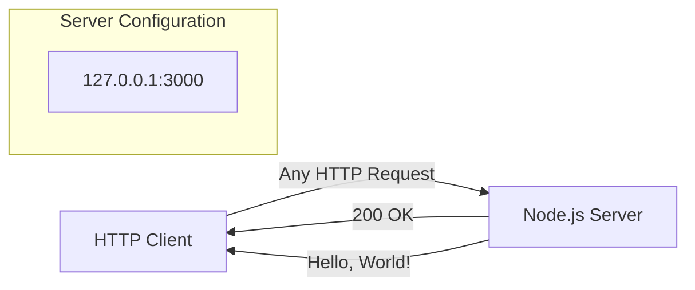
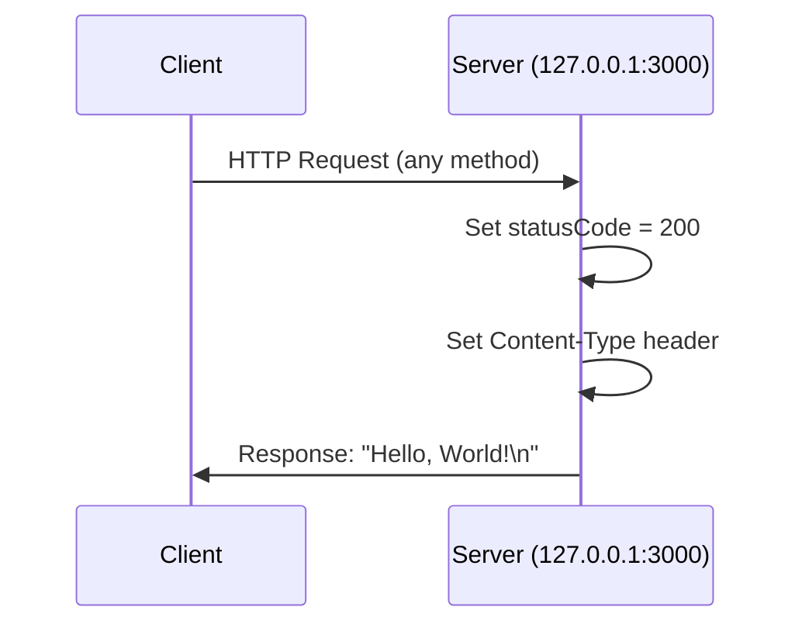

# hao-backprop-test

[](https://www.npmjs.com/)
[](https://opensource.org/licenses/MIT)
[](https://nodejs.org/)

## Description

A minimal HTTP server test harness designed for Backprop integration testing. This lightweight Node.js application provides a simple "Hello, World!" endpoint that serves as a baseline verification tool for backend integration workflows. With zero external dependencies and a compact codebase of approximately 14 lines, it offers a reliable, fast-starting server ideal for automated testing scenarios and development environment validation.

## Table of Contents

- [Features](#features)
- [Prerequisites](#prerequisites)
- [Installation](#installation)
- [Usage](#usage)
- [API Reference](#api-reference)
- [Configuration](#configuration)
- [Deployment](#deployment)
  - [Development Mode](#development-mode)
  - [Production Considerations](#production-considerations)
  - [Docker Deployment](#docker-deployment)
- [Project Structure](#project-structure)
- [Contributing](#contributing)
- [License](#license)

## Features

- **Zero Dependencies** - Uses only Node.js built-in `http` module
- **Minimal Footprint** - Entire server implementation in ~14 lines of code
- **Localhost Binding** - Secure default binding to `127.0.0.1`
- **MIT License** - Open source and freely usable
- **HTTP 200 Response** - Consistent, predictable response for all requests
- **Plain Text Output** - Simple `text/plain` content type for easy parsing
- **Instant Startup** - No compilation or build steps required

## Prerequisites

Before running this server, ensure you have the following installed:

| Requirement | Minimum Version | Recommended Version |
|-------------|-----------------|---------------------|
| Node.js | 12.0.0+ | 20.x LTS or 22.x LTS |
| npm | 7.x+ | 10.x+ |

To verify your Node.js installation:

```bash
node --version
npm --version
```

## Installation

1. **Clone the repository:**

```bash
git clone <repository-url>
```

2. **Navigate to the project directory:**

```bash
cd hao-backprop-test
```

3. **Ready to run!**

> **Note:** This project has **zero dependencies**, so there's no need to run `npm install`. The server uses only Node.js built-in modules.

## Usage

### Starting the Server

Run the following command to start the HTTP server:

```bash
node server.js
```

You should see the following output:

```
Server running at http://127.0.0.1:3000/
```

### Verifying the Server

In a new terminal window, verify the server is running:

```bash
curl http://127.0.0.1:3000
```

**Expected Response:**

```
Hello, World!
```

### Stopping the Server

Press `Ctrl+C` in the terminal where the server is running to stop it.

## API Reference

### HTTP Endpoint

| Property | Value |
|----------|-------|
| **URL** | `http://127.0.0.1:3000/` |
| **Methods** | All methods accepted (GET, POST, PUT, DELETE, etc.) |
| **Response Status** | `200 OK` |
| **Content-Type** | `text/plain` |
| **Response Body** | `Hello, World!\n` |

### Request/Response Flow



### Sequence Diagram



### Example Requests

**Using curl:**

```bash
# GET request
curl http://127.0.0.1:3000

# POST request (same response)
curl -X POST http://127.0.0.1:3000

# With verbose output
curl -v http://127.0.0.1:3000
```

**Example verbose output:**

```
* Connected to 127.0.0.1 port 3000
> GET / HTTP/1.1
> Host: 127.0.0.1:3000
>
< HTTP/1.1 200 OK
< Content-Type: text/plain
<
Hello, World!
```

## Configuration

The server configuration is defined in `server.js`:

| Variable | Default Value | Description |
|----------|---------------|-------------|
| `hostname` | `'127.0.0.1'` | The network interface to bind to. Localhost only by default for security. |
| `port` | `3000` | The TCP port the server listens on. |

### Modifying Configuration

To change the server configuration, edit the constants in `server.js`:

```javascript
// server.js - Lines 3-4
const hostname = '127.0.0.1';  // Change to '0.0.0.0' for external access
const port = 3000;              // Change to desired port number
```

**Security Note:** Binding to `'0.0.0.0'` will expose the server to external network access. Only do this in controlled environments.

## Deployment

### Development Mode

For local development, simply run:

```bash
node server.js
```

The server will start immediately and log its URL to the console.

### Production Considerations

For production deployments, consider the following:

1. **Binding Address:** Change `hostname` from `'127.0.0.1'` to `'0.0.0.0'` to accept external connections.

2. **Process Manager:** Use a process manager like PM2 to ensure uptime:

```bash
# Install PM2 globally
npm install -g pm2

# Start server with PM2
pm2 start server.js --name "hao-backprop-test"

# View status
pm2 status

# View logs
pm2 logs hao-backprop-test
```

3. **Environment Variables:** For flexible configuration, modify the server to use environment variables:

```javascript
const hostname = process.env.HOST || '127.0.0.1';
const port = process.env.PORT || 3000;
```

4. **Reverse Proxy:** Place behind a reverse proxy (nginx, Apache) for TLS termination and load balancing.

### Docker Deployment

Optionally, containerize the application with Docker:

**Dockerfile:**

```dockerfile
FROM node:20-alpine

WORKDIR /app

COPY server.js .

EXPOSE 3000

CMD ["node", "server.js"]
```

**Build and run:**

```bash
# Build the image
docker build -t hao-backprop-test .

# Run the container
docker run -d -p 3000:3000 --name backprop-server hao-backprop-test

# Verify
curl http://localhost:3000
```

**Note:** When using Docker, you may need to modify the `hostname` to `'0.0.0.0'` in `server.js` for the container to accept external connections.

## Project Structure

```
hao-backprop-test/
├── server.js
├── package.json
├── package-lock.json
├── README.md
├── LoginTest.java
├── industry.csv
├── test.py.txt
└── test.txt.txt
```

| File | Description |
|------|-------------|
| `server.js` | Main HTTP server implementation. Contains the minimal Node.js server code. |
| `package.json` | Node.js project manifest. Defines project metadata including name, version, author, and license. |
| `package-lock.json` | npm lockfile. Ensures reproducible installations (minimal for zero-dependency project). |
| `README.md` | Project documentation (this file). |
| `LoginTest.java` | Java test stub file. Placeholder for potential Java-based automation testing. |
| `industry.csv` | CSV data file. Contains a vocabulary list of industry categories. |
| `test.py.txt` | Empty placeholder file. |
| `test.txt.txt` | Empty placeholder file. |

## Contributing

Contributions are welcome! Please follow these steps:

1. **Fork** the repository

2. **Create** a feature branch:
   ```bash
   git checkout -b feature/your-feature-name
   ```

3. **Commit** your changes:
   ```bash
   git commit -m "Add: description of your changes"
   ```

4. **Push** to your fork:
   ```bash
   git push origin feature/your-feature-name
   ```

5. **Open** a Pull Request against the main branch

### Guidelines

- Keep changes minimal and focused
- Maintain the zero-dependency philosophy
- Update documentation for any server changes
- Test your changes before submitting

## License

This project is licensed under the **MIT License**.

```
MIT License

Copyright (c) hxu

Permission is hereby granted, free of charge, to any person obtaining a copy
of this software and associated documentation files (the "Software"), to deal
in the Software without restriction, including without limitation the rights
to use, copy, modify, merge, publish, distribute, sublicense, and/or sell
copies of the Software, and to permit persons to whom the Software is
furnished to do so, subject to the following conditions:

The above copyright notice and this permission notice shall be included in all
copies or substantial portions of the Software.

THE SOFTWARE IS PROVIDED "AS IS", WITHOUT WARRANTY OF ANY KIND, EXPRESS OR
IMPLIED, INCLUDING BUT NOT LIMITED TO THE WARRANTIES OF MERCHANTABILITY,
FITNESS FOR A PARTICULAR PURPOSE AND NONINFRINGEMENT. IN NO EVENT SHALL THE
AUTHORS OR COPYRIGHT HOLDERS BE LIABLE FOR ANY CLAIM, DAMAGES OR OTHER
LIABILITY, WHETHER IN AN ACTION OF CONTRACT, TORT OR OTHERWISE, ARISING FROM,
OUT OF OR IN CONNECTION WITH THE SOFTWARE OR THE USE OR OTHER DEALINGS IN THE
SOFTWARE.
```

---

**Author:** hxu  
**Version:** 1.0.0
