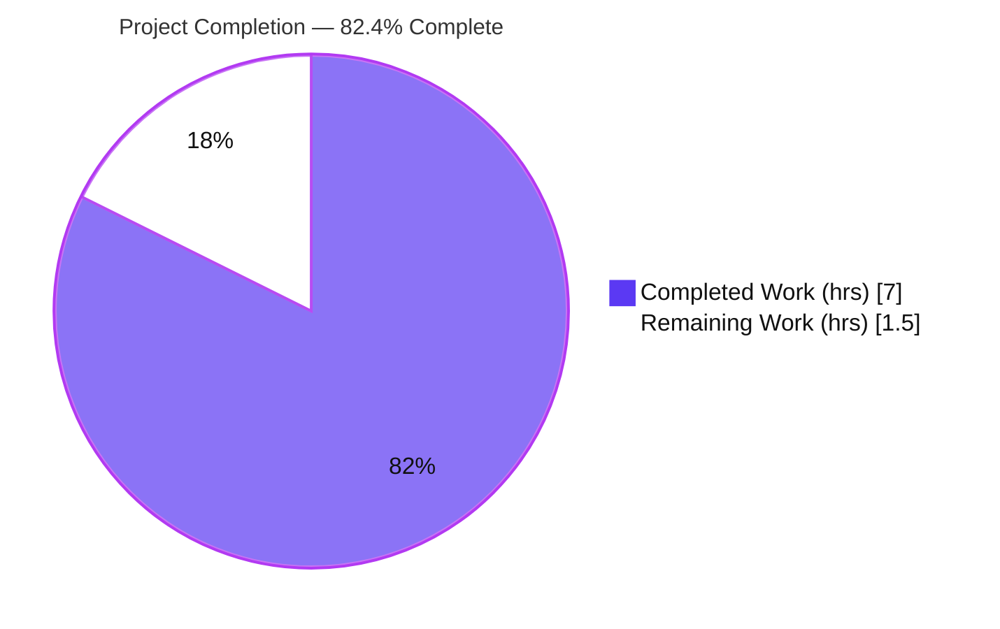
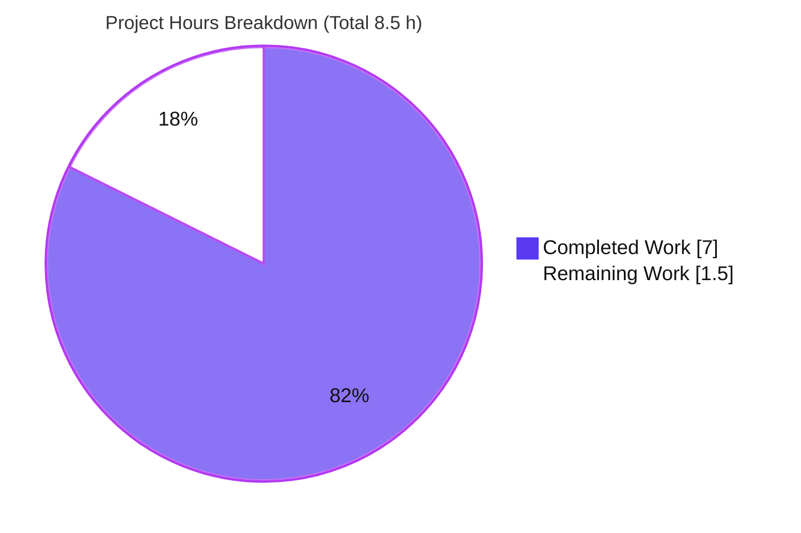
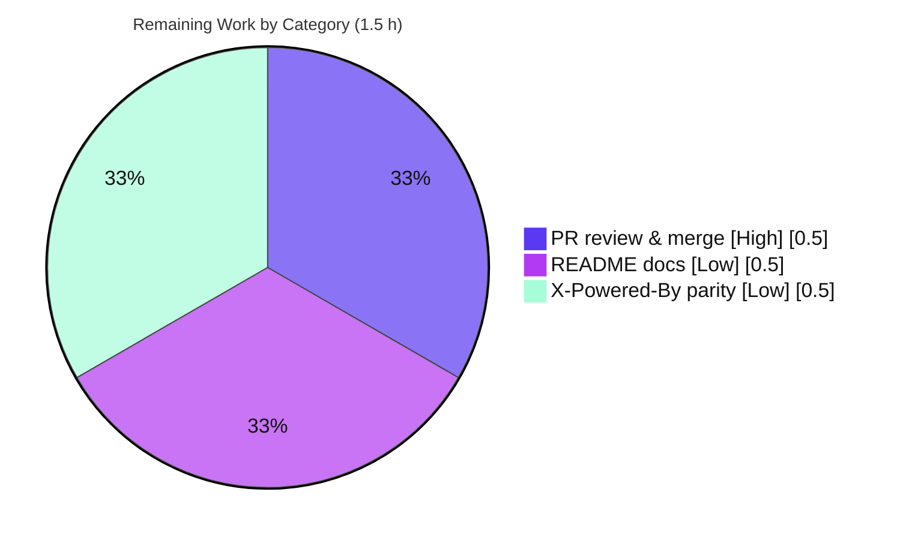

# Blitzy Project Guide — Express.js Migration & Second Endpoint

> **Project:** `hello_world` — Node.js tutorial server
> **Branch:** `blitzy-8f0f0600-ec13-46ef-b28b-ba287a7c9fe7` · **HEAD:** `64ca4b6`
> **Assessment scope:** Agent Action Plan (AAP) deliverables + path-to-production work only

---

## 1. Executive Summary

### 1.1 Project Overview

This project migrates an existing single-file Node.js tutorial server from the built-in `http` module to the **Express.js** web framework, preserving the original greeting endpoint and adding a second HTTP endpoint. The server continues to bind to `127.0.0.1:3000` and remains a **headless, stateless HTTP service** (no GUI, no database). The target users are developers learning Node/Express. Technical scope is intentionally minimal: introduce `express@^5.2.1` (the project's first production dependency), define `GET /` (returns `Hello, World!\n`) and `GET /good-evening` (returns `Good evening`), and regenerate the npm lockfile — all while keeping the original single-file architecture.

### 1.2 Completion Status

**AAP-scoped completion: 82.4%** — calculated as Completed Hours ÷ Total Hours = **7.0 ÷ 8.5 = 82.35% ≈ 82.4%** (PA1 methodology, AAP-scoped + path-to-production work only).



| Metric | Value |
|--------|-------|
| **Total Hours** | **8.5 h** |
| Completed Hours (AI + Manual) | 7.0 h (AI: 7.0 h · Manual: 0.0 h) |
| Remaining Hours | 1.5 h |
| **Percent Complete** | **82.4 %** |

> Color key — **Completed = Dark Blue (#5B39F3)** · Remaining = White (#FFFFFF).

### 1.3 Key Accomplishments

- ✅ **Express.js introduced** — `express@5.2.1` added as the project's first production dependency (range `^5.2.1`) via npm.
- ✅ **Server migrated** — `server.js` fully rewritten from `http.createServer()` to an Express application instance.
- ✅ **Backward compatibility preserved** — `GET /` still returns the exact body `Hello, World!\n` (14 bytes), `text/plain`, HTTP 200.
- ✅ **New endpoint added** — `GET /good-evening` returns the exact body `Good evening` (12 bytes), `text/plain`, HTTP 200.
- ✅ **Network binding retained** — server still binds to `127.0.0.1:3000` and emits the original startup log.
- ✅ **Lockfile regenerated** — `package-lock.json` (lockfileVersion 3) records the full 68-entry `express` tree with **0 vulnerabilities**.
- ✅ **npm-only rule honored** — no yarn/pnpm/bun lockfiles introduced (rule `QA-13-july-rules-01`).
- ✅ **`.gitignore` created** — excludes `node_modules/` and npm logs from version control.
- ✅ **Robustness hardening (beyond AAP minimum)** — strict + case-sensitive routing and `EADDRINUSE` startup-error handling.
- ✅ **Independently re-validated** — dependency install, compilation, and all runtime endpoints re-verified during this assessment.

### 1.4 Critical Unresolved Issues

| Issue | Impact | Owner | ETA |
|-------|--------|-------|-----|
| _None_ — no compilation, test, or runtime defects across any in-scope file | None | — | — |

> No blocking issues were identified. All required AAP deliverables are implemented, committed, and independently verified working.

### 1.5 Access Issues

| System/Resource | Type of Access | Issue Description | Resolution Status | Owner |
|-----------------|----------------|-------------------|-------------------|-------|
| _n/a_ | — | No access issues identified | Resolved / N/A | — |

**No access issues identified.** The repository is local, dependencies install from the public npm registry (verified reachable — `npm ci` succeeded with 0 vulnerabilities), and the server binds only to localhost. No credentials, private registries, or third-party API keys are required.

### 1.6 Recommended Next Steps

1. **[High]** Perform human PR review of the 4 changed files and **merge** branch `blitzy-8f0f0600-...` into the base branch (0.5 h).
2. **[Low]** _(Optional)_ Document the two endpoints in `README.md` — requires a decision on overriding the file's "Do not touch!" note (0.5 h).
3. **[Low]** _(Optional)_ Disable the `X-Powered-By: Express` header (`app.disable('x-powered-by')`) for strict header parity with the original server (0.5 h).
4. **[Low]** _(Advisory, out of AAP scope)_ If the tutorial is ever promoted to a real service, add a test suite, an `engines` field, and productionization (process manager, health check, env-var config).

---

## 2. Project Hours Breakdown

### 2.1 Completed Work Detail

| Component | Hours | Description |
|-----------|-------|-------------|
| Express framework research & version verification | 0.5 | Confirmed latest stable `express@5.2.1`, Express 5 routing/content-type/async-error semantics, and a 0-vulnerability dependency probe (AAP §0.2.2). |
| `server.js` Express migration (core) | 2.0 | Replaced `require('http')` with `require('express')`, instantiated `app`, defined `GET /` (exact `Hello, World!\n`, `text/plain`, 200) and `GET /good-evening` (exact `Good evening`), preserved `127.0.0.1:3000` binding and startup log. |
| `server.js` robustness hardening | 1.5 | Strict routing + case-sensitive routing (keeps the route surface byte-exact) and `EADDRINUSE`/startup-error handling that logs to stderr and exits non-zero (prevents false-success). |
| `package.json` manifest updates | 0.5 | Declared `express@^5.2.1`, added `start: node server.js`, aligned `main` from `index.js` to `server.js`. |
| `package-lock.json` lockfile regeneration | 0.5 | Regenerated via npm to record the full `express` tree — 68 entries, lockfileVersion 3, 0 vulnerabilities. |
| `.gitignore` configuration | 0.5 | Created to ignore `node_modules/`, `npm-debug.log*`, `.npm` (npm-only footprint). |
| Comprehensive 5-gate validation | 1.5 | Dependencies (`npm ci`), compilation (`node --check`), test scan, runtime (11/11 endpoint assertions), and commit/cleanliness verification. |
| **Total Completed** | **7.0** | **Matches Section 1.2 Completed Hours.** |

### 2.2 Remaining Work Detail

| Category | Hours | Priority |
|----------|-------|----------|
| Human PR review & merge approval | 0.5 | High |
| _(Optional)_ README endpoint documentation | 0.5 | Low |
| _(Optional)_ X-Powered-By header parity (disable + re-verify) | 0.5 | Low |
| **Total Remaining** | **1.5** | **Matches Section 1.2 Remaining Hours & Section 7 pie chart.** |

### 2.3 Hours Reconciliation

| Check | Result |
|-------|--------|
| Section 2.1 total (Completed) | 7.0 h |
| Section 2.2 total (Remaining) | 1.5 h |
| Section 2.1 + Section 2.2 | 8.5 h = Total Project Hours (Section 1.2) ✅ |
| Completion % = 7.0 ÷ 8.5 | 82.35 % ≈ **82.4 %** ✅ |

---

## 3. Test Results

All entries below originate from **Blitzy's autonomous validation logs** for this project and were **independently re-executed during this assessment**. The project has **no automated unit/integration test framework** — creating one is explicitly out of scope per AAP §0.6.2 — so functional correctness is proven by autonomous **runtime endpoint assertions**.

| Test Category | Framework | Total Tests | Passed | Failed | Coverage % | Notes |
|---------------|-----------|-------------|--------|--------|------------|-------|
| Runtime Endpoint Assertions | curl / manual harness (Blitzy autonomous) | 11 | 11 | 0 | N/A | Bodies, byte-lengths, status codes, content-type, strict & case-sensitive routing, EADDRINUSE. |
| Consolidated Smoke Re-check | curl (Blitzy autonomous) | 5 | 5 | 0 | N/A | Final consolidated pass of the core contract. |
| Compilation / Static Check | `node --check`, JSON parse | 3 | 3 | 0 | N/A | `server.js` syntax OK; `package.json` & `package-lock.json` valid JSON. |
| Dependency Audit | `npm ci` + `npm audit` | 1 | 1 | 0 | N/A | "added 67 packages, audited 68"; **found 0 vulnerabilities**. |
| Unit / Integration / E2E (automated) | — | 0 | 0 | 0 | 0% | No suite exists; **out of scope** per AAP §0.6.2 (`npm test` placeholder intentional). |

**Pass rate: 20 / 20 executed assertions (100%).** The `npm test` script (`echo "Error: no test specified" && exit 1`) is an intentional placeholder left as-is per the AAP; its non-zero exit is documented expected behavior, **not** a test failure.

---

## 4. Runtime Validation & UI Verification

**Runtime health**
- ✅ **Server startup** — `npm start` / `node server.js` emits exactly `Server running at http://127.0.0.1:3000/`.
- ✅ **Network binding** — listens on `127.0.0.1:3000` (localhost only).
- ✅ **Graceful failure** — a second instance prints `Failed to start server ... EADDRINUSE ...` to stderr and exits code 1 (verified first-hand).

**API / endpoint verification**
- ✅ `GET /` → `200 OK`, `Content-Type: text/plain; charset=utf-8`, `Content-Length: 14`, body `Hello, World!\n`.
- ✅ `GET /good-evening` → `200 OK`, `Content-Type: text/plain; charset=utf-8`, `Content-Length: 12`, body `Good evening`.
- ✅ `GET /good-evening/` → `404` (strict routing).
- ✅ `GET /GOOD-EVENING` → `404` (case-sensitive routing).
- ✅ `GET /<unmatched>` → `404` (Express default; intentional behavior change per AAP §0.1.3).
- ⚠ `X-Powered-By: Express` header present — informational only; disabling it is an AAP-optional item (see Section 6, S1).

**UI verification**
- ➖ **Not applicable** — this is a headless HTTP service with no graphical interface, frontend framework, or template rendering (AAP §0.5.3). The entire "interface" is the two `text/plain` `GET` endpoints verified above.

**External integrations**
- ➖ **Not applicable** — stateless single-file server; no databases, caches, queues, or third-party services.

---

## 5. Compliance & Quality Review

Cross-map of AAP deliverables and constraints to implementation status.

| AAP Requirement / Constraint | Benchmark | Status | Evidence |
|------------------------------|-----------|--------|----------|
| Introduce Express (`express@^5.2.1`) | Declared in `package.json` | ✅ Pass | `package.json` L13 · commit `3830296` |
| Regenerate `package-lock.json` (npm, v3) | 68-entry tree, 0 vulns | ✅ Pass | 68 packages, `npm ls` clean, `npm audit` 0 |
| Migrate `server.js` to Express | `require('express')` + `app` | ✅ Pass | `server.js` L1/L8 · commit `db238ac` |
| Preserve `GET /` greeting (exact body/type/status) | `Hello, World!\n`, `text/plain`, 200 | ✅ Pass | Runtime: 200 / 14 bytes / text-plain |
| Add `GET /good-evening` (exact body/type/status) | `Good evening`, `text/plain`, 200 | ✅ Pass | Runtime: 200 / 12 bytes / text-plain |
| Content-type parity (explicit `text/plain`) | Not Express default `text/html` | ✅ Pass | `res.type('text/plain')` both routes |
| Preserve `127.0.0.1:3000` binding + startup log | Host/port/log unchanged | ✅ Pass | Runtime startup log exact |
| npm-only (rule `QA-13-july-rules-01`) | No yarn/pnpm/bun lockfiles | ✅ Pass | Only `package-lock.json` present |
| `.gitignore` excludes `node_modules/` | Dependency tree not committed | ✅ Pass | `git check-ignore node_modules` ✅ |
| Single-file architecture retained | No unnecessary modularization | ✅ Pass | Routes defined directly on `app` |
| Exact-string fidelity | Verbatim response bodies | ✅ Pass | Byte-for-byte 14 / 12 bytes |
| Working tree clean / committed | No uncommitted changes | ✅ Pass | `git status --porcelain` empty |
| README documentation (optional) | Endpoints documented | ◻ Deferred | AAP-optional; "Do not touch!" note |
| Disable `X-Powered-By` (optional) | Strict header parity | ◻ Deferred | AAP-optional; header still present |

**Fixes applied during autonomous work:** `CQ-1` (commit `2805b0f`, listener startup-error handling to prevent false success) and `P5-1` (commit `64ca4b6`, exact-path routing to close unrequested route aliases). The Final Validator required **zero additional code changes**.

**Overall quality posture: PASS.** All required deliverables meet benchmark; only two AAP-flagged **optional** items remain deferred.

---

## 6. Risk Assessment

| Risk | Category | Severity | Probability | Mitigation | Status |
|------|----------|----------|-------------|------------|--------|
| Unmatched paths now return 404 (original returned greeting for all paths) | Technical | Low | Low | Documented & intended (AAP §0.1.3); add explicit routes if any client relied on catch-all | Accepted |
| No automated regression test suite | Technical | Low | Medium | Optional smoke test; add a suite if the project grows (out of scope §0.6.2) | Accepted |
| No `engines` field pinning Node version | Technical | Low | Low | Add `"engines"` to `package.json` for cross-version reproducibility | Open (minor) |
| `X-Powered-By: Express` header exposed | Security | Low | Low | `app.disable('x-powered-by')` (optional item R15) | Open (optional) |
| Dependency-tree vulnerabilities | Security | Low | Low | `npm audit` in CI; keep `express` current — **0 vulns at analysis** | Mitigated |
| Network exposure surface | Security | Low | Low | Bound to `127.0.0.1` only; no external surface introduced | Mitigated |
| No process manager / auto-restart | Operational | Low | Medium | Use pm2/systemd/container if productionized | Open (beyond tutorial scope) |
| No health-check endpoint / structured logging | Operational | Low | Low | Add `/health` + logger if productionized (EADDRINUSE already handled) | Open (minor) |
| Hardcoded host/port (no env config) | Operational | Low | Low | Introduce env-var config if deploy flexibility needed | Accepted (per AAP §0.4) |
| External service integration failure | Integration | Low | Low | N/A — stateless single-file server, no DB/services/DI | Mitigated by design |

**Overall risk posture: LOW.** No High/Critical risks. Every risk is Low severity and either accepted-by-design, already mitigated, or a minor optional hardening item.

---

## 7. Visual Project Status



**Remaining hours per category (Section 2.2):**



> **Integrity:** "Remaining Work" = **1.5 h**, identical to Section 1.2 Remaining Hours and the sum of the Section 2.2 Hours column. "Completed Work" = **7.0 h**. Color key: Completed = Dark Blue (#5B39F3), Remaining = White (#FFFFFF).

---

## 8. Summary & Recommendations

**Achievements.** The AAP is functionally complete: Express.js was introduced as the first production dependency, `server.js` was cleanly migrated from the core `http` module to an Express application, the original `Hello, World!\n` greeting was preserved byte-for-byte at `GET /`, and the new `GET /good-evening` endpoint returns `Good evening` exactly as specified. Network binding (`127.0.0.1:3000`), the startup log, and the single-file architecture were all preserved, and the npm-only constraint was honored. Agents went beyond the minimum with strict/case-sensitive routing and `EADDRINUSE` startup-error handling.

**Remaining gaps.** Of the total **8.5 hours**, **1.5 hours (17.6%)** remain: a mandatory human PR-review/merge gate (0.5 h) and two AAP-flagged **optional** polish items (README documentation and disabling `X-Powered-By`, 0.5 h each). No required AAP work is outstanding, and there are no compilation, test, or runtime defects.

**Critical path to production.** (1) Human reviews the 4 changed files and confirms endpoints → (2) merge the branch → (3) optionally apply the two low-priority polish items. This is the entire path; there are no blockers.

**Success metrics.** All 11 autonomous runtime endpoint assertions pass; `npm ci` reports 0 vulnerabilities; `git status` is clean.

**Production readiness assessment.** For its stated purpose — a localhost tutorial server — the project is **ready to merge** at **82.4% AAP-scoped completion**, with the remaining 17.6% being human review plus optional cosmetic parity. If the server were ever repurposed as a real internet-facing service, the advisory items in Section 6 (test suite, process manager, health check, env-var config) should be revisited, but these are outside the current AAP scope.

| Metric | Value |
|--------|-------|
| AAP-scoped completion | **82.4 %** |
| Required AAP deliverables complete | 13 / 13 (100%) |
| Optional items deferred | 2 |
| Blocking issues | 0 |
| Known vulnerabilities | 0 |
| Overall risk posture | Low |

---

## 9. Development Guide

### 9.1 System Prerequisites

- **Node.js** ≥ 18 (verified on **v22.23.1**; Express 5 requires a modern Node runtime).
- **npm** (verified on **11.1.0**) — the **only** permitted package manager (rule `QA-13-july-rules-01`).
- **OS:** Linux/macOS/Windows. No database, cache, or message-queue services required (stateless).
- Network access to the public npm registry for the initial install only.

### 9.2 Environment Setup

No environment variables are required — host (`127.0.0.1`) and port (`3000`) are hardcoded in `server.js` and preserved by design. Simply clone/checkout the branch and change into the project root:

```bash
cd /path/to/hello_world      # project root containing server.js & package.json
git checkout blitzy-8f0f0600-ec13-46ef-b28b-ba287a7c9fe7
```

### 9.3 Dependency Installation

Use `npm ci` for a reproducible install from the committed lockfile:

```bash
npm ci
```

**Expected output:**

```
added 67 packages, and audited 68 packages in ~0.4s

found 0 vulnerabilities
```

> `node_modules/` is git-ignored and regenerated by this command; it must **not** be committed. Do not use yarn/pnpm/bun.

### 9.4 Application Startup

```bash
npm start          # runs "node server.js"
# — or, equivalently —
node server.js
```

**Expected output:**

```
> hello_world@1.0.0 start
> node server.js

Server running at http://127.0.0.1:3000/
```

The server runs in the foreground; press **Ctrl-C** to stop, or run it detached (`node server.js &`) and stop it later with `kill <pid>`.

### 9.5 Verification Steps

With the server running, in a second terminal:

```bash
# 1) Greeting endpoint (backward compatible)
curl -i http://127.0.0.1:3000/
#   -> HTTP/1.1 200 OK
#   -> Content-Type: text/plain; charset=utf-8
#   -> Content-Length: 14
#   -> body: "Hello, World!\n"

# 2) New endpoint
curl -i http://127.0.0.1:3000/good-evening
#   -> HTTP/1.1 200 OK
#   -> Content-Length: 12
#   -> body: "Good evening"

# 3) Unmatched path returns Express's default 404
curl -s -o /dev/null -w "%{http_code}\n" http://127.0.0.1:3000/anything   # -> 404
```

### 9.6 Example Usage

```bash
$ curl http://127.0.0.1:3000/
Hello, World!
$ curl http://127.0.0.1:3000/good-evening
Good evening
```

### 9.7 Troubleshooting

| Symptom | Cause | Resolution |
|---------|-------|------------|
| `Failed to start server ... EADDRINUSE ... 127.0.0.1:3000` (exit 1) | Port 3000 already in use by another process | Find it: `lsof -tiTCP:3000 -sTCP:LISTEN` or `ps -eo pid,args \| grep '[n]ode server.js'`; stop it: `kill <pid>`; then restart. |
| `Cannot find module 'express'` | Dependencies not installed | Run `npm ci` in the project root. |
| `npm error` mentioning a different lockfile | Wrong package manager used | Use **npm only**; delete any `yarn.lock`/`pnpm-lock.yaml`; run `npm ci`. |
| `curl: (7) Failed to connect` | Server not running / already stopped | Start with `npm start`; confirm the startup log appears. |
| Response is `text/html` instead of `text/plain` | Edited a route to use `res.send()` without `res.type()` | Restore `res.type('text/plain')` on the route. |

---

## 10. Appendices

### Appendix A — Command Reference

| Command | Purpose |
|---------|---------|
| `npm ci` | Reproducible install from `package-lock.json` |
| `npm audit` | Check dependency vulnerabilities (currently 0) |
| `npm start` | Start the server (`node server.js`) |
| `node server.js` | Start the server directly |
| `node --check server.js` | Syntax-check without executing |
| `npm ls --depth=0` | List top-level dependencies (`express@5.2.1`) |
| `curl -i http://127.0.0.1:3000/` | Test the greeting endpoint |
| `curl -i http://127.0.0.1:3000/good-evening` | Test the new endpoint |
| `lsof -tiTCP:3000 -sTCP:LISTEN` | Find the process bound to port 3000 |

### Appendix B — Port Reference

| Port | Host | Service | Notes |
|------|------|---------|-------|
| 3000 | 127.0.0.1 | Express HTTP server | Hardcoded; localhost only |

### Appendix C — Key File Locations

| File | Role | Status |
|------|------|--------|
| `server.js` | Express app + both routes + listener (54 lines) | Modified |
| `package.json` | Manifest: `express@^5.2.1`, `start`/`test` scripts, `main=server.js` | Modified |
| `package-lock.json` | npm lockfile v3, 68 entries | Modified |
| `.gitignore` | Ignores `node_modules/`, npm logs | Created |
| `README.md` | Two-line readme ("Do not touch!") | Untouched (optional) |
| `node_modules/` | Installed dependency tree | Git-ignored (not committed) |

### Appendix D — Technology Versions

| Component | Version |
|-----------|---------|
| Node.js | v22.23.1 |
| npm | 11.1.0 |
| express | 5.2.1 (range `^5.2.1`) |
| package-lock.json | lockfileVersion 3 |

### Appendix E — Environment Variable Reference

| Variable | Required? | Default | Notes |
|----------|-----------|---------|-------|
| _none_ | No | — | Host `127.0.0.1` and port `3000` are hardcoded in `server.js` by design (AAP §0.4). |

### Appendix F — Developer Tools Guide

- **Static check:** `node --check server.js` (syntax), `python3 -c "import json;json.load(open('package.json'))"` (JSON validity).
- **Dependency inspection:** `npm ls --all`, `npm audit`.
- **Runtime inspection:** `curl -i <url>` for headers + body; `lsof`/`ss -ltnp` to inspect the listening socket.
- **No linter is configured** for this project (adding one is out of scope).

### Appendix G — Glossary

| Term | Definition |
|------|------------|
| **AAP** | Agent Action Plan — the authoritative feature specification driving this project. |
| **Express** | Minimal Node.js web framework providing `app.METHOD(path, handler)` routing. |
| **EADDRINUSE** | OS error when a port is already bound; here handled with a stderr message + exit 1. |
| **Strict routing** | Express setting that treats `/route` and `/route/` as distinct paths. |
| **lockfileVersion 3** | npm's current `package-lock.json` schema version. |
| **Path-to-production** | Standard activities (review, merge, deploy) needed to ship AAP deliverables. |

---

*Completion measured strictly against AAP-scoped and path-to-production work (PA1 methodology). Completed = Dark Blue (#5B39F3); Remaining = White (#FFFFFF).*