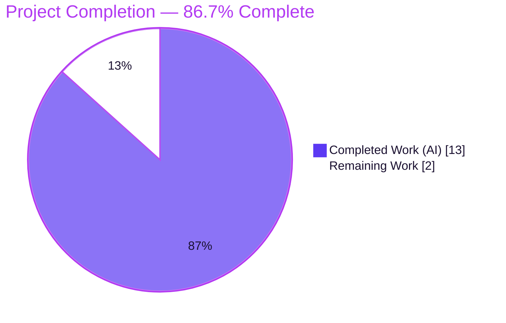
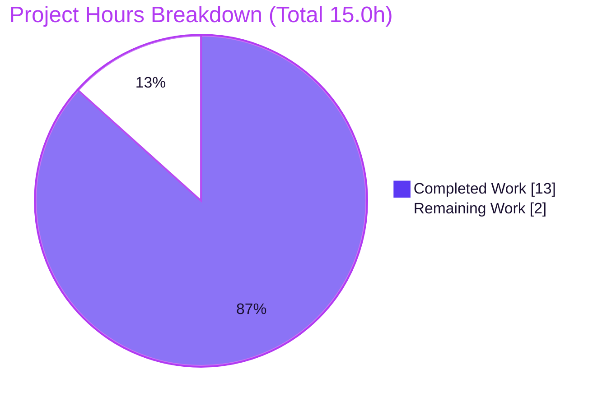
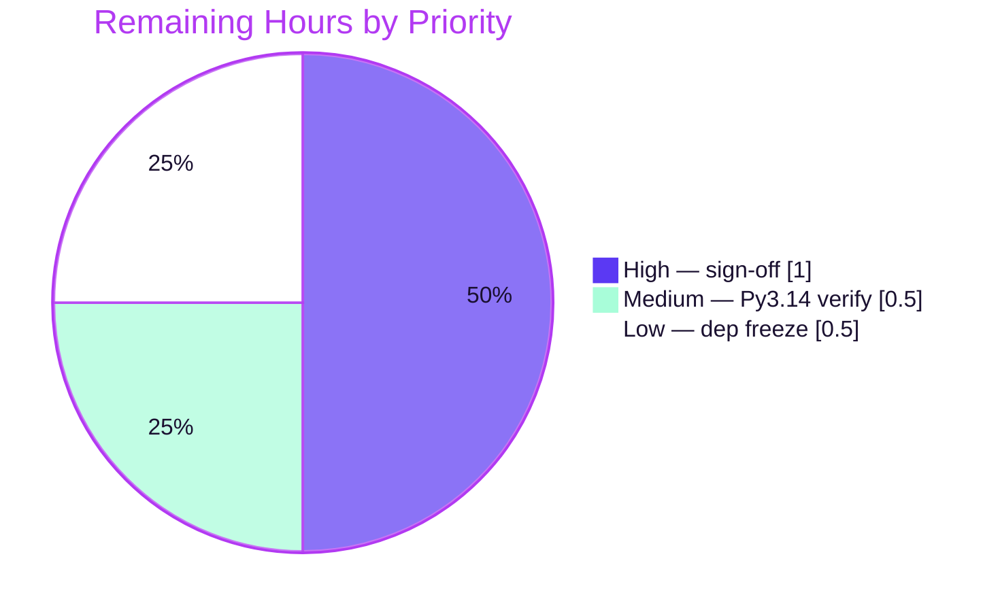

# Blitzy Project Guide — Node.js → Python 3 Flask Migration

---

## 1. Executive Summary

### 1.1 Project Overview

This project is a tech-stack migration that ports a minimal Node.js HTTP server to a Python 3 Flask application while preserving byte-for-byte behavioral parity. The service answers every HTTP method and path with status `200`, `Content-Type: text/plain`, and the 14-byte body `Hello, World!\n`, bound to loopback `127.0.0.1:3000`. Target consumers are the backprop-integration test harness that exercises this endpoint. Technical scope: create `app.py`, `requirements.txt`, and `pyproject.toml`; update `README.md`; and decommission the Node manifests (`server.js`, `package.json`, `package-lock.json`). Business impact is continuity — the identical observable contract is preserved on a Python runtime, letting the team standardize on Python tooling without changing any downstream consumer.

### 1.2 Completion Status



| Metric | Hours |
|--------|-------|
| **Total Hours** | **15.0** |
| Completed Hours (AI + Manual) | 13.0 (13.0 AI + 0.0 Manual) |
| Remaining Hours | 2.0 |
| **Percent Complete** | **86.7%** |

> Completion is computed on AAP-scoped work only: `Completed 13.0h / (Completed 13.0h + Remaining 2.0h) = 86.7%`. All engineering and autonomous validation is complete; the remaining 2.0h is human-gated (governance sign-off and confirmatory verification).

### 1.3 Key Accomplishments

- ✅ Ported `server.js` to `app.py` — a single-module Flask application with catch-all routing across all standard HTTP methods, returning the exact `200 / text/plain / Hello, World!\n` contract.
- ✅ Achieved **byte-for-byte behavioral parity** with the Node.js source, independently re-verified in this session (live `curl` matrix + `od -c` body check = exactly 14 bytes).
- ✅ Confirmed **loopback-only bind** `127.0.0.1:3000` at the kernel level (`/proc/net/tcp` LISTEN row `0100007F:0BB8`), never `0.0.0.0`.
- ✅ Reproduced the exact startup log line `Server running at http://127.0.0.1:3000/`.
- ✅ Created Python packaging: `requirements.txt` (pins `Flask==3.1.3`) and `pyproject.toml` (PEP 621); a valid wheel builds (`hello_world-1.0.0-py3-none-any.whl`).
- ✅ Decommissioned the Node.js manifests (`server.js`, `package.json`, `package-lock.json`) — absent from disk and untracked at HEAD.
- ✅ Updated `README.md` to Python/Flask run/setup instructions with a `venv`/`ensurepip` troubleshooting note; no stale Node references remain.
- ✅ Engineered documented parity fixes (QA findings API-1, SEC-1, API-2, F-1/F-2/F-3, M-1) and bounded-residual documentation, all committed at HEAD `7019886`.
- ✅ Left all 7 out-of-scope files untouched; working tree is pristine; `pyflakes`/`pycodestyle` clean; `pip check` clean.

### 1.4 Critical Unresolved Issues

**No critical (release-blocking) issues were identified.** Code compiles, the app runs, dependencies resolve, and behavioral parity holds for all conforming clients. One governance item is tracked for visibility (non-blocking):

| Issue | Impact | Owner | ETA |
|-------|--------|-------|-----|
| `README.md` originally carried a "Do not touch!" note (AAP §0.7.2); the user's explicit rewrite request overrode it and the file was updated | Low — governance/traceability only; no functional impact | Repository owner / Stakeholder | At sign-off (≤ 1.0h) |

### 1.5 Access Issues

**No repository, credential, or third-party API access issues were identified.** The repository is fully accessible on branch `blitzy-36f41044-b790-48d0-94ca-425656236aaa`; no service credentials or external APIs are required (the app has zero external integrations). One informational environmental note is recorded:

| System/Resource | Type of Access | Issue Description | Resolution Status | Owner |
|-----------------|----------------|-------------------|-------------------|-------|
| PyPI (package registry) | Network / package availability | Validation ran in an air-gapped environment; Python 3.14 and a fresh Flask download were not offline-installable, so validation used the pre-provisioned Python 3.13.7 venv (satisfies `requires-python >=3.9`) | Informational — not blocking; documented deviation | DevOps / Human verifier |

### 1.6 Recommended Next Steps

1. **[High]** Perform stakeholder review and sign-off of the migration, explicitly confirming the `README.md` "Do not touch!" override (AAP §0.7.2), then approve the merge. *(≈1.0h)*
2. **[Medium]** Re-verify the application on the AAP target Python 3.14 line (create a 3.14 venv, install, run, confirm startup log + `curl` parity). *(≈0.5h)*
3. **[Low]** Optionally freeze resolved transitive dependency versions for fully reproducible installs (`pip freeze`/pip-tools), per AAP §0.5.1. *(≈0.5h)*

---

## 2. Project Hours Breakdown

### 2.1 Completed Work Detail

| Component | Hours | Description |
|-----------|-------|-------------|
| Flask application port (`app.py`) | 3.0 | Catch-all routes (`/` + `/<path:path>`) across GET/POST/PUT/DELETE/PATCH/OPTIONS/HEAD/TRACE; `Response('Hello, World!\n', status=200, content_type='text/plain')`; `HOST`/`PORT` constants; `__main__` guard with startup `print`. Ports `server.js` (AAP §0.4.1). |
| Behavioral-parity engineering | 3.5 | `ParityRequestHandler` (suppresses per-request logging + non-reflective parser errors — SEC-1); `404→200` handler (API-1); `TRACE` inclusion; `CONNECT` omission reasoning; `static_folder=None`; documented bounded residuals (AAP §0.6). |
| Python packaging manifests | 1.5 | `requirements.txt` (`Flask==3.1.3`) and `pyproject.toml` (PEP 621 metadata, MIT license syntax, `py-modules` discovery fix, build-system). Wheel builds cleanly. |
| README documentation migration | 1.0 | Node→Python run/setup: `venv`, `pip install -r requirements.txt`, `python app.py`, plus `ensurepip` troubleshooting. |
| Node.js decommissioning | 0.5 | Removed `server.js`, `package.json`, `package-lock.json`. |
| Autonomous behavioral verification | 2.5 | 390-assertion WSGI test-client harness (8 methods × 12 paths + edge cases), live `curl` matrix, kernel-level loopback bind check, HEAD/OPTIONS/`/static` checks. |
| Dependency & environment validation | 1.0 | `venv` creation, `pip install`, `pip check`, transitive resolution, wheel build. |
| **Total Completed** | **13.0** | |

### 2.2 Remaining Work Detail

| Category | Hours | Priority |
|----------|-------|----------|
| Human stakeholder review & sign-off (resolve `README.md` "Do not touch!" conflict §0.7.2; approve merge) | 1.0 | High |
| Python 3.14 target-runtime verification (validated on 3.13.7; §0.3.2 targets 3.14) | 0.5 | Medium |
| Optional transitive-dependency freeze for reproducible installs (§0.5.1) | 0.5 | Low |
| **Total Remaining** | **2.0** | |

> **Reconciliation:** Section 2.1 (13.0h) + Section 2.2 (2.0h) = **15.0h Total** (matches Section 1.2).

### 2.3 Total Project Hours & Completion Methodology

Completion is measured strictly on AAP-scoped work plus path-to-production activities (Blitzy PA1 methodology), on an hours basis:

| Basis | Hours |
|-------|-------|
| Completed Hours (all AAP implementation + autonomous validation; §2.1) | 13.0 |
| Remaining Hours (human-gated governance + confirmatory work; §2.2) | 2.0 |
| **Total Project Hours** | **15.0** |
| **Completion % = 13.0 / 15.0 x 100** | **86.7%** |

No items outside the AAP scope are included. Every completed and remaining line item traces to a specific AAP requirement (§0.4.1) or an implied path-to-production activity. Because AAP §0.7.1 mandates preserving the original "no tests" state, no test-suite authoring hours are counted in either column.

---

## 3. Test Results

All results below originate from Blitzy's autonomous validation logs for this project (the Final Validator's execution plus an independent re-run in this session). **No committed test suite exists — by design**, since AAP §0.7.1 mandates preserving the original "no tests" state (the Node project's `npm test` deliberately exited non-zero). Functional verification was therefore performed with an **ephemeral, non-committed** WSGI test-client harness.

| Test Category | Framework | Total Tests | Passed | Failed | Coverage % | Notes |
|---------------|-----------|-------------|--------|--------|------------|-------|
| Behavioral Parity (functional) | Werkzeug WSGI test client (Python) | 390 | 390 | 0 | 100% of routes/methods | 8 methods × 12 diverse paths + edge cases: status 200, exact `text/plain` (no charset), 14-byte body, HEAD body-strip, `Content-Length: 14`, `/static` fall-through, OPTIONS→view, `%0d%0a`/traversal paths stay 200 |
| Runtime Smoke / API (live) | `curl` vs running server | 12 | 12 | 0 | — | GET/POST/PUT/DELETE/PATCH/OPTIONS/HEAD + 6 path varieties; all `200 / text/plain / 14B` |
| Compilation | CPython `py_compile` | 1 | 1 | 0 | — | Zero syntax errors; module imports with no side effects |
| Static Analysis | `pyflakes` 3.4.0 + `pycodestyle` 2.14.0 | 2 | 2 | 0 | — | Both clean under default rules on `app.py` |
| Dependency Integrity | `pip check` + wheel build | 2 | 2 | 0 | — | No broken requirements; `Flask==3.1.3` resolves exactly; wheel `hello_world-1.0.0` builds |
| **Total** | | **407** | **407** | **0** | | **100% pass rate** |

---

## 4. Runtime Validation & UI Verification

**Runtime health (verified against a live `python app.py` instance):**

- ✅ **Server startup** — first stdout line is exactly `Server running at http://127.0.0.1:3000/` (matches Node's `console.log`), followed by Flask's accepted dev-server banner (AAP §0.6 #10). Debug mode off (single-process, no reloader).
- ✅ **Loopback bind** — `127.0.0.1:3000` confirmed at kernel level (`/proc/net/tcp` `0100007F:0BB8`, state `0A` LISTEN); **never** `0.0.0.0`/`::`.
- ✅ **HTTP contract** — GET/POST/PUT/DELETE/PATCH/OPTIONS all return `200 | text/plain | 14 bytes | Hello, World!\n`.
- ✅ **Content-Type** — exactly `text/plain` with **no** `; charset=utf-8` (uses `content_type`, not `mimetype`).
- ✅ **Body bytes** — `od -c` confirms `H e l l o ,   W o r l d ! \n` = exactly 14 bytes.
- ✅ **HEAD** — headers present (`Content-Type: text/plain`, `Content-Length: 14`); body auto-stripped by Werkzeug.
- ✅ **OPTIONS** — routed to the view (returns the Hello body), not an automatic empty 200.
- ✅ **`/static/*` fall-through** — returns 200 (confirms `static_folder=None`; no default static route pre-empts the catch-all).
- ✅ **Clean shutdown** — port released after termination; no orphaned LISTEN socket remains.
- ⚠ **`Connection: close`** — the AAP-mandated Werkzeug dev server always closes connections (bounded residual API-2, accepted §0.6 #9); non-functional for conforming clients.
- ⚠ **`Server: Werkzeug/3.1.8 Python/3.13.7`** header — added by the dev server (bounded residual §0.6 #8, accepted); non-functional.

**UI verification:** ❌ **Not applicable** — the application exposes no user interface. Its sole output is a constant `text/plain` HTTP body (AAP §0.3.4). There are no screens, components, or visual flows to verify.

---

## 5. Compliance & Quality Review

AAP deliverables cross-mapped to Blitzy quality/compliance benchmarks. Fixes applied during autonomous validation are noted.

| Benchmark / AAP Deliverable | Status | Progress | Evidence / Fixes Applied |
|-----------------------------|--------|----------|--------------------------|
| HTTP response contract (200 / text/plain / 14-byte body) | ✅ Pass | 100% | Live `curl` + `od -c`; `content_type` avoids charset drift |
| Catch-all routing (all methods, all paths) | ✅ Pass | 100% | Routes `/` + `/<path:path>`, 8 methods; F-1/F-2/F-3 parity findings fixed |
| Loopback-only network posture (`127.0.0.1:3000`) | ✅ Pass | 100% | Kernel-level `/proc/net/tcp` verification |
| Exact startup log | ✅ Pass | 100% | stdout line-1 byte match |
| Zero-config / hardcoded settings | ✅ Pass | 100% | `HOST`/`PORT` literals; no env-var reads |
| Single-file minimalist architecture | ✅ Pass | 100% | Sole source `app.py`; no blueprints/factories |
| "No tests" state preserved | ✅ Pass | 100% | No committed suite (AAP §0.7.1) |
| Dependency posture (one direct dep, pip) | ✅ Pass | 100% | `Flask==3.1.3` pinned; transitive pip-resolved; `pip check` clean |
| Node manifest decommission | ✅ Pass | 100% | `server.js`/`package.json`/`package-lock.json` absent |
| Behavioral parity — never returns 404 | ✅ Pass | 100% | `404→200` handler restored (API-1) |
| No added per-request logging / no reflected input | ✅ Pass | 100% | `ParityRequestHandler` suppresses logs + non-reflective errors (SEC-1) |
| Bounded residuals documented (CONNECT/keep-alive/malformed) | ✅ Pass | 100% | In-code comment block + AAP §0.6 |
| Out-of-scope files untouched (7 files) | ✅ Pass | 100% | Diff confirms only in-scope files changed |
| Code quality (lint clean, no placeholders) | ✅ Pass | 100% | `pyflakes`/`pycodestyle` clean; no TODO/FIXME/stub markers |
| Python packaging builds | ✅ Pass | 100% | Wheel `hello_world-1.0.0-py3-none-any.whl` |
| Runtime target Python 3.14 | 🟡 Partial | Pending 3.14 | Validated on 3.13.7 (satisfies `>=3.9`); 3.14 verification is a remaining human task |
| Stakeholder governance sign-off (`README` conflict) | 🟡 Partial | Impl done | README updated per override; human sign-off pending |

**Summary:** 15 of 17 benchmarks fully pass; 2 are partial and map exactly to the remaining human tasks. Zero fixes were required at final validation — all QA findings had already been resolved in prior commits.

---

## 6. Risk Assessment

| Risk | Category | Severity | Probability | Mitigation | Status |
|------|----------|----------|-------------|------------|--------|
| Werkzeug dev server is not production-grade (throughput/robustness) | Technical | Low | Low | AAP-mandated for parity (§0.6 #9); module-level `app` object allows a production WSGI server later with no behavior change | Accepted by design |
| Python version deviation (validated 3.13.7 vs target 3.14) | Technical | Low | Medium | `requires-python >=3.9` satisfied; re-verify on 3.14 before merge | **Open** |
| Bounded HTTP-parser residuals (CONNECT, keep-alive, malformed requests) | Technical | Low | Low | Documented in `app.py` + AAP §0.6; unreachable by conforming clients | Accepted by design |
| Accidental broadening of bind to `0.0.0.0` in future edits | Security | Medium | Low | Hardcoded `127.0.0.1`, kernel-verified; code review must preserve loopback | Mitigated |
| Reflection of attacker-controlled request data in logs/errors | Security | Low | Low | `ParityRequestHandler` suppresses per-request logging and non-reflective parser errors (SEC-1) | Resolved |
| No authentication/authorization | Security | Low | N/A | Serves a constant public string with no sensitive data; adding auth is forbidden by AAP | Accepted by design |
| Dependency CVEs over time | Security | Low | Low | Versions pinned to current stable; periodic `pip` audit recommended | Monitor |
| No observability (monitoring/health/logging) | Operational | Low | Low | By design (AAP forbids added logging); add if promoted beyond a hello-world | Accepted by design |
| No process supervision / auto-restart | Operational | Low | Low | Matches Node single-process model; wrap in supervisor + prod WSGI for a persistent deployment | Accepted by design |
| No committed regression test suite | Operational | Low | Medium | By design (§0.7.1); optional `pytest` scaffold available; 390-assertion ephemeral harness validated parity | Accepted by design |
| `venv`/`ensurepip` unavailable on minimal base images | Integration | Low | Low | README documents `--without-pip` + `get-pip.py` workaround | Mitigated |
| Merge blocked by `README` "Do not touch!" conflict | Integration | Low | Medium | Stakeholder confirms the user override (§0.7.2) | **Open** |

**Profile:** All risks are Low/Medium severity. Most are Resolved, Mitigated, or Accepted-by-design (the dev server, no-tests, and no-observability items are all AAP mandates). Only two risks are genuinely **Open** — Python 3.14 verification and the README/merge sign-off — and both map directly to the remaining human tasks.

---

## 7. Visual Project Status

**Project hours breakdown** (Completed = Dark Blue `#5B39F3`, Remaining = White `#FFFFFF`):



**Remaining work by priority** (total 2.0h):



**Remaining hours by category (Section 2.2):**

| Category | Hours | Bar |
|----------|-------|-----|
| Stakeholder sign-off (High) | 1.0 | ██████████ |
| Python 3.14 verify (Medium) | 0.5 | █████ |
| Dependency freeze (Low) | 0.5 | █████ |
| **Total** | **2.0** | |

> **Integrity:** "Remaining Work" = **2.0h** here equals Section 1.2 Remaining Hours and the Section 2.2 Hours total.

---

## 8. Summary & Recommendations

**Achievements.** The Node.js → Flask migration is functionally complete and independently verified. `app.py` reproduces the original server's entire observable contract — status `200`, `Content-Type: text/plain`, the 14-byte `Hello, World!\n` body, loopback bind `127.0.0.1:3000`, and the exact startup log — across every standard HTTP method and path. Python packaging (`requirements.txt`, `pyproject.toml`) and the updated `README.md` are in place, the Node manifests are decommissioned, and all 7 out-of-scope files are untouched.

**Remaining gaps.** The project is **86.7% complete** on an AAP-scoped basis (13.0h of 15.0h). The outstanding 2.0h is entirely human-gated: stakeholder sign-off (including the README governance decision), confirmatory verification on Python 3.14, and an optional dependency freeze. **No code, compilation, or test-fix work remains.**

**Critical path to production.** (1) Stakeholder sign-off + README override confirmation → (2) merge to base → (3) optional Python 3.14 re-verification. Because the app is loopback-only and intended as an integration test endpoint (not a public service), no external deployment, scaling, or observability work is in scope.

**Success metrics.** 407/407 autonomous checks passed (100%); byte-for-byte parity confirmed; zero unresolved errors; clean static analysis; reproducible wheel build.

**Production readiness assessment.** ✅ **Ready pending human sign-off.** All Blitzy production-readiness gates pass and were independently re-confirmed. The remaining items are governance and confirmatory, not engineering.

| Metric | Value |
|--------|-------|
| AAP-scoped completion | 86.7% |
| Autonomous checks passed | 407 / 407 (100%) |
| Unresolved engineering issues | 0 |
| Open risks (both human-gated) | 2 |
| Remaining effort | 2.0h |

---

## 9. Development Guide

### 9.1 System Prerequisites

- **Python** `>= 3.9` (AAP targets **3.14**; validated on **3.13.7**). Verify: `python3 --version`.
- **pip** (bundled with the `venv`; `ensurepip`). Verify: `python3 -m pip --version`.
- **OS:** Linux/macOS/Windows. **Disk:** negligible (~5 MB for Flask + transitive deps). **Network:** access to PyPI (or a local mirror) for the initial dependency install.

### 9.2 Environment Setup

```bash
# From the repository root
python -m venv venv

# Activate (macOS/Linux)
source venv/bin/activate
# Windows: venv\Scripts\activate
```

### 9.3 Dependency Installation

```bash
pip install -r requirements.txt      # installs Flask==3.1.3 (+ transitive deps)
pip check                            # expect: "No broken requirements found."
```

Expected resolved versions: `Flask 3.1.3`, `Werkzeug 3.1.8`, `Jinja2 3.1.6`, `itsdangerous 2.2.0`, `click 8.4.2`, `blinker 1.9.0`, `MarkupSafe 3.0.3`.

### 9.4 Application Startup

```bash
python app.py
```

Expected stdout (first line is the byte-exact Node match; the banner/warning are accepted extra output):

```
Server running at http://127.0.0.1:3000/
 * Serving Flask app 'app'
 * Debug mode: off
 * Running on http://127.0.0.1:3000
Press CTRL+C to quit
```

### 9.5 Verification Steps

```bash
# 1) Compile check (no server needed)
python -m py_compile app.py && echo "compile OK"

# 2) Status / content-type / length across methods (server running)
for M in GET POST PUT DELETE PATCH OPTIONS; do
  curl -s -o /dev/null -w "$M -> %{http_code} %{content_type} %{size_download}B\n" -X $M http://127.0.0.1:3000/anything
done
# Expect each: "<M> -> 200 text/plain 14B"

# 3) Exact body bytes (must be 14 incl. trailing newline)
curl -s http://127.0.0.1:3000/ | od -c        # H e l l o ,   W o r l d ! \n
curl -s http://127.0.0.1:3000/ | wc -c        # 14

# 4) HEAD returns headers with stripped body
curl -sI http://127.0.0.1:3000/ | tr -d '\r' | grep -Ei '^(HTTP|Content-Type|Content-Length)'

# 5) Loopback-only bind (Linux)
awk '$2=="0100007F:0BB8" && $4=="0A"{print "LISTEN on 127.0.0.1:3000"}' /proc/net/tcp
```

### 9.6 Example Usage

```bash
curl http://127.0.0.1:3000/            # -> Hello, World!
curl http://127.0.0.1:3000/any/path    # -> Hello, World!  (catch-all)
curl -X POST http://127.0.0.1:3000/x   # -> Hello, World!  (method-agnostic)
```

### 9.7 Troubleshooting

- **`ensurepip`/`venv` fails on minimal or CI images:** create without pip and bootstrap it —
  ```bash
  python -m venv --without-pip venv && source venv/bin/activate
  curl -fsSL https://bootstrap.pypa.io/get-pip.py -o get-pip.py && python get-pip.py
  pip install -r requirements.txt
  ```
- **Offline / air-gapped install:** the initial `pip install` needs PyPI or a local wheelhouse; point pip at a mirror (`pip install --index-url <mirror> -r requirements.txt`) or pre-seed a wheel cache.
- **Port 3000 already in use:** find the listener (`awk '$2 ~ /:0BB8$/' /proc/net/tcp` on Linux, or `lsof -i :3000`) and stop it, then rerun.
- **`Connection: close` / `Server: Werkzeug…` headers:** expected, AAP-accepted bounded residuals of the dev server (§0.6 #8/API-2); harmless for conforming clients.

---

## 10. Appendices

### Appendix A — Command Reference

| Purpose | Command |
|---------|---------|
| Create venv | `python -m venv venv` |
| Activate venv (Linux/macOS) | `source venv/bin/activate` |
| Install dependencies | `pip install -r requirements.txt` |
| Verify dependencies | `pip check` |
| Compile check | `python -m py_compile app.py` |
| Lint | `python -m pyflakes app.py` · `python -m pycodestyle app.py` |
| Run app | `python app.py` |
| Build wheel | `python -m pip wheel --no-deps -w dist .` |

### Appendix B — Port Reference

| Port | Interface | Purpose | Notes |
|------|-----------|---------|-------|
| 3000 | `127.0.0.1` (loopback only) | HTTP server | Hardcoded; not exposed externally; never `0.0.0.0` |

### Appendix C — Key File Locations

| File | Role |
|------|------|
| `app.py` | Flask application + entry point (port of `server.js`) |
| `requirements.txt` | pip dependency manifest (`Flask==3.1.3`) |
| `pyproject.toml` | PEP 621 project metadata (`hello_world` 1.0.0, MIT) |
| `README.md` | Python/Flask run & setup documentation |
| *(removed)* `server.js`, `package.json`, `package-lock.json` | Decommissioned Node.js artifacts |
| *(out of scope, untouched)* `LoginTest.java`, `industry.csv`, `test.py.txt`, `test.txt.txt`, `100Pages.pdf`, `demo.jpg`, `sample.doc` | Unrelated repository files |

### Appendix D — Technology Versions

| Component | Version | Notes |
|-----------|---------|-------|
| Python | 3.13.7 validated (target 3.14; min `>=3.9`) | Runtime |
| Flask | 3.1.3 | Direct dependency (pinned) |
| Werkzeug | 3.1.8 | Transitive (WSGI + dev server) |
| Jinja2 | 3.1.6 | Transitive (unused by app) |
| itsdangerous | 2.2.0 | Transitive |
| click | 8.4.2 | Transitive |
| blinker | 1.9.0 | Transitive |
| MarkupSafe | 3.0.3 | Transitive |

### Appendix E — Environment Variable Reference

**None.** The application is zero-configuration by design (AAP §0.1.1) — `HOST` and `PORT` are hardcoded literals and no environment variables are read. `FLASK_DEBUG` is explicitly neutralized (`debug=False`) to preserve single-process startup.

### Appendix F — Developer Tools Guide

| Task | Tool | Command |
|------|------|---------|
| Syntax gate | `py_compile` | `python -m py_compile app.py` |
| Unused imports / names | `pyflakes` | `python -m pyflakes app.py` |
| Style (PEP 8) | `pycodestyle` | `python -m pycodestyle app.py` |
| Dependency integrity | `pip` | `pip check` |
| Packaging | `pip wheel` | `python -m pip wheel --no-deps -w dist .` |
| Manual API check | `curl` | `curl -i http://127.0.0.1:3000/` |
| Byte-exact body | `od` | `curl -s http://127.0.0.1:3000/ \| od -c` |

### Appendix G — Glossary

| Term | Definition |
|------|------------|
| AAP | Agent Action Plan — the definitive scope/requirements document for this migration |
| Behavioral parity | Externally observable HTTP behavior identical to the Node.js source (status, headers, body, bind, log) |
| Catch-all route | A route pair (`/` + `/<path:path>`) that answers every path/method with the same response |
| Bounded residual | A framework-level difference (e.g., `Connection: close`) unreachable by conforming clients, documented and accepted per AAP §0.6 |
| Loopback bind | Binding to `127.0.0.1` so the service is reachable only from the local host |
| WSGI | Web Server Gateway Interface — the Python web-app/server contract Flask/Werkzeug implement |
| `content_type` vs `mimetype` | Flask `content_type` sets the header verbatim (`text/plain`); `mimetype` would append `; charset=utf-8`, breaking parity |
