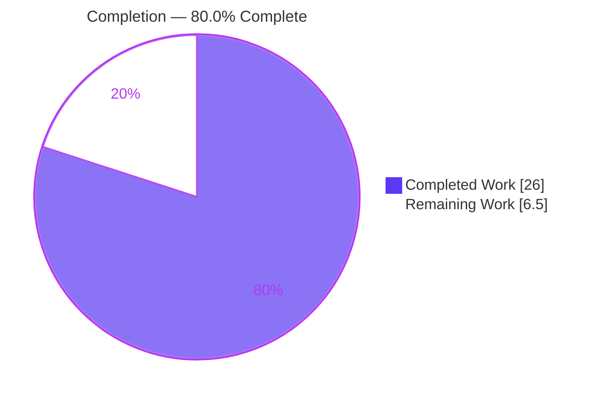
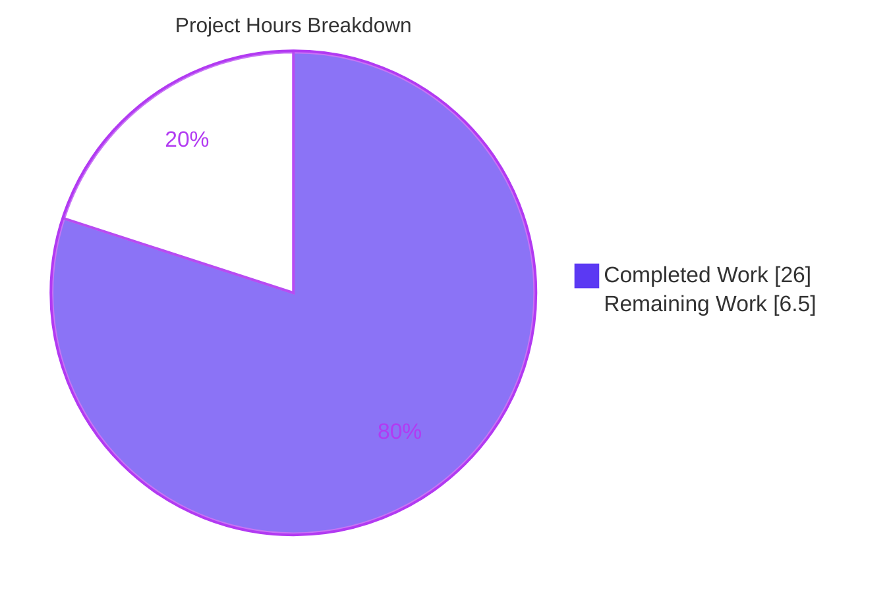
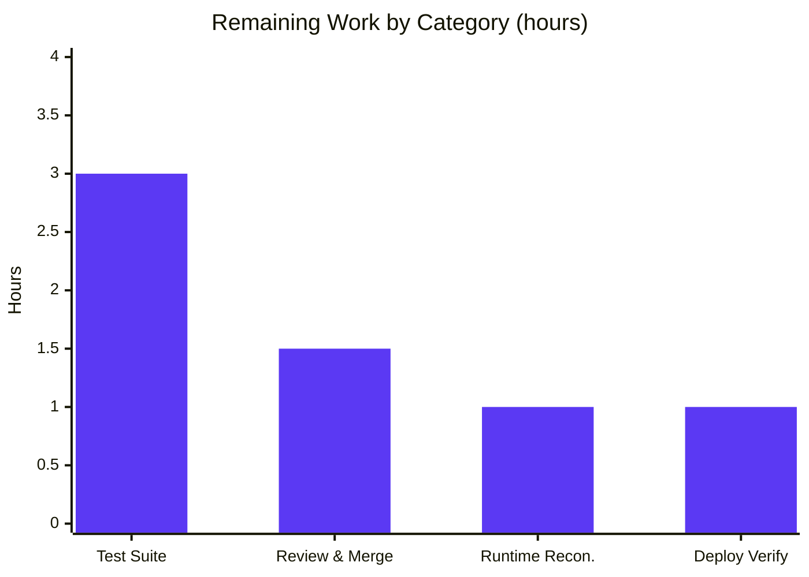

# Blitzy Project Guide — Node.js → Python 3 Flask Migration

> **Branch:** `blitzy-c64922ec-6a76-4eb1-be98-82dac328c579` · **HEAD:** `5ff172a` · **Status:** Validated, production-ready pending human review
> **Brand legend:** ■ Completed / AI Work = Dark Blue `#5B39F3` · □ Remaining = White `#FFFFFF` · Headings/Accents = Violet-Black `#B23AF2` · Highlight = Mint `#A8FDD9`

---

## 1. Executive Summary

### 1.1 Project Overview

This project migrates a minimal 14-line Node.js `http` server into a **modular Python 3 Flask application**, preserving observable behavior **byte-for-byte**. The consumer is the Backprop integration test harness that expects a fixed localhost endpoint. Business impact: the stack is modernized to Python/Flask with a clean, testable architecture (Application Factory + Blueprint + Configuration Object) and a production WSGI path (gunicorn/waitress) — without changing a single response byte. Technical scope: a catch-all route returning HTTP `200`, `Content-Type: text/plain`, body `Hello, World!\n` on `127.0.0.1:3000`, plus an npm→pip dependency migration. No database, external API, authentication, or monitoring is introduced; the fixture's isolation is preserved.

### 1.2 Completion Status



| Metric | Hours |
|---|---|
| **Total Hours** | **32.5** |
| Completed Hours (AI: 26.0 + Manual: 0.0) | **26.0** |
| Remaining Hours | **6.5** |
| **Percent Complete** | **80.0%** |

> Completion is computed by the PA1 hours methodology over AAP-scoped and path-to-production work: `26.0 / (26.0 + 6.5) = 80.0%`. All 26.0 completed hours were delivered autonomously by Blitzy agents (0.0 manual to date).

### 1.3 Key Accomplishments

- ✅ **Modular Flask package** authored — `app/__init__.py` (Application Factory `create_app()`), `app/config.py` (Configuration Object), `app/main/__init__.py` (`main` Blueprint), `app/main/routes.py` (universal catch-all route).
- ✅ **Byte-for-byte behavioral parity** — `200` / `text/plain` (no charset) / `Hello, World!\n` (14 bytes) for every path and every HTTP method; empirically verified.
- ✅ **Two process entrypoints** — `server.py` (dev/parity, prints the exact Node startup line) and `wsgi.py` (production WSGI callable `app`).
- ✅ **Production serving config** — `gunicorn.conf.py` with an explicitly sized concurrent worker pool (4 workers × 4 gthread threads) honoring the "performance not impacted" rule.
- ✅ **Dependency migration npm → pip** — `requirements.txt` pins `Flask==3.1.3`, `gunicorn==26.0.0`, `waitress==3.0.2`; Node manifests and `server.js` retired.
- ✅ **Documentation** — `README.md` fully rewritten for Python/Flask; `.gitignore` added; out-of-scope assets preserved unchanged.
- ✅ **Quality gates** — clean compilation (`-W error`), 262/262 autonomous parity checks passed, all three entrypoints validated over real sockets, zero placeholder policy satisfied.

### 1.4 Critical Unresolved Issues

| Issue | Impact | Owner | ETA |
|---|---|---|---|
| No blocking issues identified | — | — | — |
| No committed automated test suite (parity checks were run ad-hoc and removed) | Regression risk if code is later modified; contract not guarded in-repo | Human dev | ~3.0h |
| Python runtime differs from AAP target (validated on 3.13.7; AAP named 3.12) | Low — all dependencies support 3.10+; target runtime unverified/unpinned | Human dev | ~1.0h |

> There are **no compilation, test, or runtime failures**. The items above are quality/path-to-production follow-ups tracked in Section 2.2, not blockers.

### 1.5 Access Issues

**No access issues identified.** The build validated end-to-end with no repository-permission, service-credential, or third-party-API gates (the application has no database, external API, or authentication by design).

| System/Resource | Type of Access | Issue Description | Resolution Status | Owner |
|---|---|---|---|---|
| Python 3.12 interpreter | Local tooling availability (informational) | Host provides only Python 3.13.7; AAP named 3.12 as target. Not an access gate — validation succeeded on 3.13.7 | Informational — verify/pin in Section 2.2 (HT-3) | Human dev |

### 1.6 Recommended Next Steps

1. **[High]** Perform code review of the migration branch and merge to mainline (~1.5h).
2. **[Medium]** Author and commit a pytest regression suite formalizing the proven parity checks (~3.0h).
3. **[Medium]** Reconcile the Python runtime — verify on the AAP-target 3.12 or pin the supported version in `README`/`requirements.txt` (~1.0h).
4. **[Low]** Run a production deployment smoke test (gunicorn + waitress) in the target environment and a `pip-audit` (~1.0h).

---

## 2. Project Hours Breakdown

### 2.1 Completed Work Detail

All hours below were delivered autonomously by Blitzy agents; each component traces to a specific AAP requirement.

| Component | Hours | Description |
|---|---|---|
| `app/config.py` — Configuration Object | 1.5 | Ports `HOST`, `PORT`, `RESPONSE_BODY`, `CONTENT_TYPE` from `server.js` verbatim into a `Config` class (AAP §0.4.1). |
| `app/__init__.py` — Application Factory | 2.0 | `create_app()` builds Flask with `static_folder=None`, loads `Config`, registers the `main` blueprint (AAP §0.3.3). |
| `app/main/__init__.py` — `main` Blueprint | 1.0 | Defines `main_bp`; deferred route import to avoid circular import (AAP §0.4.2). |
| `app/main/routes.py` — catch-all route + parity handlers | 4.0 | Two rules (`/` default + `<path:path>`), 8 methods, `provide_automatic_options=False`, `strict_slashes=False`, verbatim `content_type`, 404/405→200 fallback, HEAD `Content-Length` omission (AAP §0.6). |
| `server.py` — dev/parity entrypoint | 2.5 | `make_server(..., threaded=True)`, exact startup line, access-log suppression, ordered bind→log→serve (AAP §0.4.1). |
| `wsgi.py` — production WSGI entrypoint | 1.5 | Exposes module-level `app = create_app()` for gunicorn/waitress (AAP §0.4.1). |
| `gunicorn.conf.py` — concurrent serving config | 2.0 | 4 workers × 4 gthread threads, loopback bind, env-overridable — satisfies the performance rule (AAP §0.3.3 / §0.5.1). |
| `requirements.txt` + `.gitignore` | 1.0 | pip manifest (Flask/gunicorn/waitress) and Python ignores (AAP §0.4.1). |
| `README.md` — Node→Flask migration docs | 2.5 | Full rewrite: description, parity-scope note, setup (incl. `--without-pip` fallback), run, verify (AAP §0.4.1). |
| Retire Node artifacts | 0.5 | Deleted `server.js`, `package.json`, `package-lock.json` (AAP §0.2.1). |
| Behavioral parity analysis & validation | 3.5 | Empirical contract derivation + 262 autonomous parity checks across paths/methods/HEAD/OPTIONS/fallback/charset (AAP §0.6). |
| Environment setup & dependency validation | 1.0 | `.venv` creation, `pip install`, `pip check` clean (path-to-production). |
| Code-review remediation | 3.0 | Multiple review cycles resolving CQ-1..CQ-6, SEC-1, wsgi findings, and QA F01 (per commit history). |
| **Total Completed** | **26.0** | |

### 2.2 Remaining Work Detail

Each category traces to a path-to-production or quality gap; none is a missing or broken AAP feature.

| Category | Hours | Priority |
|---|---|---|
| Human code review & merge of the migration branch to mainline | 1.5 | High |
| Committed automated regression test suite (pytest; formalize the proven parity checks) | 3.0 | Medium |
| Python runtime reconciliation (verify on AAP-target 3.12 or pin supported version) | 1.0 | Medium |
| Production deployment verification (gunicorn + waitress smoke test; `pip-audit`) | 1.0 | Low |
| **Total Remaining** | **6.5** | |

### 2.3 Hours Reconciliation

| Check | Result |
|---|---|
| Section 2.1 total (Completed) | 26.0 h |
| Section 2.2 total (Remaining) | 6.5 h |
| Section 2.1 + Section 2.2 | 32.5 h = Total (Section 1.2) ✅ |
| Completion % = 26.0 / 32.5 | 80.0% ✅ |
| Remaining consistent across §1.2, §2.2, §7 | 6.5 h ✅ |

---

## 3. Test Results

All tests below originate from **Blitzy's autonomous validation logs** for this project. The behavioral-parity checks were executed via an ad-hoc Flask-test-client harness in `/tmp` (not committed — see Section 2.2, HT-2). Independent re-verification during this assessment reproduced a 126/126 subset plus live-socket confirmation.

| Test Category | Framework | Total Tests | Passed | Failed | Coverage % | Notes |
|---|---|---|---|---|---|---|
| Behavioral Parity (application layer) | Flask test client (ad-hoc harness) | 262 | 262 | 0 | 100% (contract) | 8 paths × 7 bodied methods (GET/POST/PUT/DELETE/PATCH/OPTIONS/TRACE) + HEAD across all paths + OPTIONS-body + PROPFIND (405→200) fallback + charset-absence |
| Compilation | `py_compile` / `compileall -W error` | 7 | 7 | 0 | 100% files | All 7 in-scope `.py` files; warnings-as-errors clean; all modules import under `-W error` |
| Runtime Socket Validation | `curl` over real sockets | 3 | 3 | 0 | 100% entrypoints | dev (`server.py`), gunicorn, waitress — byte-identical application-layer body (`48 65 6c 6c 6f 2c 20 57 6f 72 6c 64 21 0a`) |
| Static / Lint-equivalent | `compileall -W error` + AST unused-import/undefined-name check | 1 | 1 | 0 | n/a | 1 legitimate `noqa` (deferred side-effect import); no placeholder markers |

**Aggregate:** 262/262 behavioral-parity checks passed (100%); compilation and runtime gates fully green. **No committed test suite exists yet** — formalizing these checks into a committed pytest suite is the primary quality follow-up (Section 2.2).

---

## 4. Runtime Validation & UI Verification

**UI:** Not applicable — this is a headless HTTP server returning a fixed `text/plain` body (AAP §0.3.4). No front-end, component library, or Figma designs are involved.

**Runtime health (all validated over real sockets):**

- ✅ **Development entrypoint (`server.py`)** — Operational. Prints exactly `Server running at http://127.0.0.1:3000/` (no Werkzeug banner; access log silenced); binds `127.0.0.1:3000`. `GET /` → `200` / `text/plain` / `Content-Length: 14` / body `Hello, World!\n`. HEAD → `200` / `text/plain` / **no `Content-Length`** (Node parity).
- ✅ **Production — gunicorn (`--no-control-socket -c gunicorn.conf.py wsgi:app`)** — Operational. Logs `Listening at: http://127.0.0.1:3000`, `Using worker: gthread`, boots 4 workers (matches config). Full contract confirmed; `POST /a/b/c` → `200` / `text/plain` / 14 bytes.
- ✅ **Production — waitress (`waitress-serve --listen=127.0.0.1:3000 wsgi:app`)** — Operational. `Serving on http://127.0.0.1:3000`; full contract confirmed. HEAD is framed with `Transfer-Encoding: chunked` — the **documented AAP §0.6 transport-layer difference** (below the application boundary, outside the parity contract).
- ✅ **Catch-all routing** — Operational. Arbitrary paths and all standard methods return the identical response; `PROPFIND` (405→200) fallback confirmed.
- ✅ **Content-Type exactness** — Operational. Header is exactly `text/plain` with **no `; charset=utf-8`** appended.

**API integration outcomes:** No external APIs are integrated by design; the loopback endpoint is the sole surface and behaves identically across all three servers at the application layer.

---

## 5. Compliance & Quality Review

Cross-map of AAP deliverables and user rules to their delivery status, including fixes applied during autonomous validation.

| Requirement (AAP / Rule) | Benchmark | Status | Progress |
|---|---|---|---|
| Behavioral parity — status/headers/body (§0.6) | `200` / `text/plain` (no charset) / `Hello, World!\n` | ✅ Pass | ██████████ 100% |
| Universal request handling (§0.1.1) | Same response for every path & method | ✅ Pass | ██████████ 100% |
| Network binding & startup log (§0.1.1) | `127.0.0.1:3000` + exact console line | ✅ Pass | ██████████ 100% |
| Application Factory pattern (§0.3.3) | `create_app()` factory | ✅ Pass | ██████████ 100% |
| Blueprint modularization (§0.3.3) | Single flow isolated in `app/main` | ✅ Pass | ██████████ 100% |
| Configuration Object (§0.3.3) | Constants centralized in `Config` | ✅ Pass | ██████████ 100% |
| WSGI production serving (§0.3.3, §0.5.1) | `wsgi:app` under gunicorn/waitress | ✅ Pass | ██████████ 100% |
| Dependency migration npm → pip (§0.5) | `requirements.txt`; Node manifests retired | ✅ Pass | ██████████ 100% |
| Node artifacts retired (§0.2.1) | `server.js`/`package*.json` removed | ✅ Pass | ██████████ 100% |
| Out-of-scope assets preserved (§0.2.2) | `industry.csv` etc. unchanged | ✅ Pass | ██████████ 100% |
| Rule "Ajit_New Product" | Modular separation + performance not impacted | ✅ Pass | ██████████ 100% |
| Rule "QA-13-july-rules-01" ("npm") | npm→pip transition | ✅ Pass | ██████████ 100% |
| Zero Placeholder Policy | No TODO/FIXME/stub/NotImplementedError | ✅ Pass | ██████████ 100% |
| Committed automated tests | In-repo regression suite | ⚠ Outstanding | ░░░░░░░░░░ 0% |
| Runtime version alignment | Runs on AAP-target 3.12 | ⚠ Partial | ███████░░░ ~70% (validated on 3.13.7) |

**Fixes applied during autonomous validation (from commit history):**
- **SEC-1** — Werkzeug access-log suppressed in `server.py` to avoid writing request targets/query strings to stderr (CWE-532), and to restore Node's startup-only logging parity.
- **CQ-1..CQ-6** — code-quality remediation in the dev entrypoint, factory, and README.
- **wsgi hardening** — `--no-control-socket` documented/required to remove gunicorn's management plane, preserving fixture isolation.
- **QA F01** — explicitly sized concurrent gunicorn config added to prevent single-worker head-of-line blocking.

**Outstanding:** committed test suite (HT-2) and runtime-version reconciliation (HT-3).

---

## 6. Risk Assessment

| Risk | Category | Severity | Probability | Mitigation | Status |
|---|---|---|---|---|---|
| R1 — Python runtime drift (host 3.13.7 vs AAP-target 3.12) | Technical | Low | Medium | Verify on 3.12 or pin supported version; all deps support 3.9–3.13 | Open (HT-3) |
| R2 — No committed regression test suite | Technical / Quality | Medium | Medium | Commit pytest parity suite (3.0h); logic already proven by 262 checks | Open (HT-2) |
| R3 — Transport-layer parity differences (waitress chunked HEAD; parser method-token handling) | Technical | Low | Low | Documented in AAP §0.6 as outside the app-layer contract; prefer gunicorn (UNIX primary) for closest framing | Accepted (by design) |
| R4 — No authentication/authorization | Security | Low | Low | Intentional per AAP fixture scope; loopback-only bind limits exposure | Accepted (by design) |
| R5 — Dependency vulnerabilities over time | Security | Low | Low | Current-stable pinned versions; run `pip-audit` periodically | Open (monitor, HT-4) |
| R6 — No monitoring / health-check / structured logging | Operational | Low | Low | Excluded by AAP (fixture); add if promoted to real production | Accepted (by design) |
| R7 — No deployment automation / process supervision | Operational | Low | Low | README documents dev + 2 production commands; add systemd/Docker if promoted | Open (HT-4) |
| R8 — Backprop integration contract drift | Integration | Medium | Low | Byte-for-byte parity verified across 3 entrypoints; committed tests would guard the contract | Open (mitigated by HT-2) |
| R9 — Port 3000 bind collision | Integration / Operational | Low | Low | `server.py` raises `OSError` before printing the startup line (no false success); `GUNICORN_BIND` env-overridable | Accepted (handled) |

**Positive posture:** loopback-only binding, gunicorn `--no-control-socket` (reduced attack surface), access-log suppression (CWE-532), handler ignores all request input (no injection surface), zero placeholders.

**Overall risk profile: LOW.** No High/Critical risks. The two Medium risks (R2, R8) are both mitigated by the single 3.0h pytest task already tracked in remaining work.

---

## 7. Visual Project Status

**Project hours (Blitzy brand colors — Completed `#5B39F3`, Remaining `#FFFFFF`):**



**Remaining hours by category (from Section 2.2):**



> **Integrity:** the pie "Remaining Work" value (6.5) equals the Section 1.2 Remaining Hours and the sum of the Section 2.2 Hours column (3.0 + 1.5 + 1.0 + 1.0 = 6.5). ✅

---

## 8. Summary & Recommendations

**Achievements.** The Node.js → Python 3 Flask migration is functionally complete and validated. Every AAP-specified deliverable — the full modular Flask package, both process entrypoints, the production serving config, the npm→pip dependency migration, the README rewrite, and the retirement of Node artifacts — is present and confirmed. Behavioral parity is exact at the application layer: `200` / `text/plain` (no charset) / `Hello, World!\n` (14 bytes) on `127.0.0.1:3000`, verified byte-for-byte across the development server, gunicorn, and waitress.

**Remaining gaps.** The project is **80.0% complete** by the AAP-scoped hours methodology (26.0 of 32.5 hours). The remaining 6.5 hours are human-side path-to-production and quality items — not missing features: (1) code review & merge, (2) a committed pytest regression suite (the parity checks were run ad-hoc and not committed), (3) Python runtime reconciliation (validated on 3.13.7; the AAP named 3.12), and (4) a production deployment smoke test.

**Critical path to production.** Review & merge (High) → commit the regression suite guarding the parity contract (Medium) → reconcile/pin the runtime version (Medium) → deployment smoke test (Low).

**Success metrics.** 262/262 autonomous parity checks passed; clean compilation under `-W error`; all three entrypoints operational over real sockets; zero unresolved errors; zero placeholders.

| Assessment | Result |
|---|---|
| AAP-specified deliverables complete | 100% |
| Overall completion (incl. path-to-production) | 80.0% |
| Blocking issues | None |
| Overall risk profile | Low |
| Production readiness | **Ready pending human review & merge** |

**Production readiness assessment.** The application is **production-ready pending human review and merge**. It runs correctly under a production WSGI server today; the recommended follow-ups harden maintainability (committed tests) and confirm the target runtime, rather than fix defects.

---

## 9. Development Guide

### 9.1 System Prerequisites

- **OS:** Linux, macOS, or Windows (gunicorn is UNIX-only; use waitress on Windows).
- **Python:** 3.10 or later (gunicorn 26.0.0 requires 3.10+). AAP target is 3.12; validated here on **3.13.7**.
- **Tools:** `git`, `curl` (for verification). Internet access for the initial `pip install`.
- **Hardware:** negligible — a minimal single-endpoint service.

### 9.2 Environment Setup

Create and activate a virtual environment from the repository root:

```bash
# Standard (systems whose Python includes ensurepip)
python3 -m venv .venv
source .venv/bin/activate            # macOS/Linux
# .venv\Scripts\activate.bat         # Windows cmd
# .venv\Scripts\Activate.ps1         # Windows PowerShell
```

**Fallback** for minimal Debian/Ubuntu Python builds where `python3 -m venv` fails with an `ensurepip` error (this was the case on the validation host):

```bash
python3 -m venv --without-pip .venv
python3 -m pip --python .venv/bin/python install --upgrade pip setuptools wheel
```

### 9.3 Dependency Installation

```bash
pip install -r requirements.txt
# Expected: Flask 3.1.3, gunicorn 26.0.0, waitress 3.0.2, Werkzeug 3.1.8 (+ transitives)

pip check
# Expected: "No broken requirements found."
```

### 9.4 Application Startup

```bash
# Development / parity (mirrors `node server.js`)
python server.py
# Expected stdout: Server running at http://127.0.0.1:3000/

# Production (UNIX) — gunicorn
gunicorn --no-control-socket -c gunicorn.conf.py wsgi:app
# Expected log: Listening at: http://127.0.0.1:3000 ; Using worker: gthread ; 4 workers booted

# Production (cross-platform) — waitress
waitress-serve --listen=127.0.0.1:3000 wsgi:app
# Expected log: Serving on http://127.0.0.1:3000
```

### 9.5 Verification

```bash
curl -s -D - http://127.0.0.1:3000/
# HTTP/1.1 200 OK
# Content-Type: text/plain
# Content-Length: 14
#
# Hello, World!

curl -s -X POST http://127.0.0.1:3000/any/random/path
# Hello, World!

curl -s -I http://127.0.0.1:3000/
# 200, Content-Type: text/plain, NO Content-Length (Node parity on HEAD)
```

### 9.6 Example Usage

Every path and every standard HTTP method returns the identical response:

```bash
for m in GET POST PUT DELETE PATCH OPTIONS TRACE; do
  curl -s -o /dev/null -w "$m -> %{http_code} %{content_type} %{size_download}B\n" -X "$m" http://127.0.0.1:3000/resource/5
done
# Each line: <METHOD> -> 200 text/plain 14B
```

### 9.7 Troubleshooting

- **`venv` fails with `ensurepip` error** → use the `--without-pip` fallback in §9.2.
- **`Address already in use` / `[Errno 98]` on port 3000** → another process holds the port. Identify the exact listener PID (`ss -ltnp | grep :3000`) and stop it, or override the bind (`GUNICORN_BIND=127.0.0.1:3001` for gunicorn; edit `Config.PORT` for the dev server). `server.py` raises `OSError` before printing the startup line, so a failed bind never reports false success.
- **`gunicorn: command not found` on Windows** → gunicorn is UNIX-only; use waitress.
- **HEAD shows `Transfer-Encoding: chunked` under waitress** → expected; documented AAP §0.6 transport-layer difference, outside the application-layer parity contract.

---

## 10. Appendices

### A. Command Reference

| Purpose | Command |
|---|---|
| Create venv (standard) | `python3 -m venv .venv` |
| Create venv (fallback) | `python3 -m venv --without-pip .venv` |
| Bootstrap pip (fallback) | `python3 -m pip --python .venv/bin/python install --upgrade pip setuptools wheel` |
| Install dependencies | `pip install -r requirements.txt` |
| Verify dependencies | `pip check` |
| Run dev server | `python server.py` |
| Run gunicorn | `gunicorn --no-control-socket -c gunicorn.conf.py wsgi:app` |
| Run waitress | `waitress-serve --listen=127.0.0.1:3000 wsgi:app` |
| Verify response | `curl -s -D - http://127.0.0.1:3000/` |
| Compile check | `python -W error -m compileall app server.py wsgi.py gunicorn.conf.py` |

### B. Port Reference

| Port | Service | Interface | Notes |
|---|---|---|---|
| 3000 | HTTP application | `127.0.0.1` (loopback only) | Fixed for parity with the Node source; overridable via `GUNICORN_BIND` (gunicorn) or `Config.PORT` (dev). |

### C. Key File Locations

| Path | Role |
|---|---|
| `app/__init__.py` | Application Factory `create_app()` |
| `app/config.py` | `Config` (HOST, PORT, RESPONSE_BODY, CONTENT_TYPE) |
| `app/main/__init__.py` | `main` Blueprint definition |
| `app/main/routes.py` | Catch-all route + 404/405→200 fallback + HEAD handling |
| `server.py` | Development / parity entrypoint |
| `wsgi.py` | Production WSGI entrypoint (`wsgi:app`) |
| `gunicorn.conf.py` | Gunicorn concurrency/bind config |
| `requirements.txt` | pip dependency manifest |
| `.gitignore` | `__pycache__/`, `*.pyc`, `.venv/` |
| `README.md` | Setup & run documentation |
| `industry.csv` | Preserved out-of-scope data asset (unchanged) |

### D. Technology Versions

| Component | Version | Notes |
|---|---|---|
| Python (validated) | 3.13.7 | AAP target was 3.12 (unavailable on host); reconcile per HT-3 |
| Flask | 3.1.3 | Web framework / WSGI app |
| gunicorn | 26.0.0 | Production WSGI server (UNIX) |
| waitress | 3.0.2 | Production WSGI server (cross-platform) |
| Werkzeug | 3.1.8 | Transitive (Flask WSGI toolkit) |
| Jinja2 / click / itsdangerous / MarkupSafe / blinker | 3.1.6 / 8.4.2 / 2.2.0 / 3.0.3 / 1.9.0 | Transitive dependencies |

### E. Environment Variable Reference

| Variable | Default | Effect |
|---|---|---|
| `GUNICORN_BIND` | `127.0.0.1:3000` | Gunicorn bind address (parallel-test/port-override use only) |
| `GUNICORN_WORKERS` / `WEB_CONCURRENCY` | `4` | Gunicorn worker process count |
| `GUNICORN_THREADS` | `4` | Threads per gunicorn worker |

> The dev server reads host/port from `app/config.py` (`Config.HOST`, `Config.PORT`), not environment variables.

### F. Developer Tools Guide

| Task | Tool / Command |
|---|---|
| Compile all in-scope modules | `python -W error -m compileall app server.py wsgi.py gunicorn.conf.py` |
| Inspect the URL map | `python -c "from app import create_app; [print(r.rule, r.methods) for r in create_app().url_map.iter_rules()]"` |
| Dependency audit (recommended follow-up) | `pip install pip-audit && pip-audit` |
| Suggested test runner (after HT-2) | `pytest -q` |

### G. Glossary

| Term | Definition |
|---|---|
| Application Factory | The `create_app()` pattern that constructs and configures the Flask app on demand rather than as a module global. |
| Blueprint | A Flask module grouping related routes; here `app/main` isolates the single request-handling flow. |
| Catch-all route | Routing (`/` default + `<path:path>`) that matches every path so the response is universal. |
| WSGI | The Python Web Server Gateway Interface; `wsgi:app` is served by gunicorn/waitress. |
| Behavioral parity | Reproducing the source server's observable HTTP behavior byte-for-byte at the application layer. |
| Transport-layer difference | Server-level framing (e.g., `Server`/`Date` headers, waitress chunked HEAD) below the application boundary and outside the parity contract (AAP §0.6). |

---

*Cross-section integrity verified: Section 2.1 (26.0) + Section 2.2 (6.5) = 32.5 Total; Remaining = 6.5 consistent across Sections 1.2, 2.2, and 7; completion 80.0% consistent across Sections 1.2, 7, and 8; all Section 3 tests originate from Blitzy's autonomous validation logs; brand colors applied (Completed `#5B39F3`, Remaining `#FFFFFF`).*