# Technical Specification

# 1. Introduction

This Technical Specification documents **hao-backprop-test**, a minimal Node.js HTTP server designed as a controlled test environment for validating integration with Backprop—a tool used for code analysis, refactoring, or AI-assisted development. This document provides stakeholders with a comprehensive understanding of the system's purpose, technical architecture, and boundaries.

## 1.1 Executive Summary

### 1.1.1 Project Overview

The hao-backprop-test project is a deliberately minimal "Hello World" Node.js application created specifically to serve as a test harness for Backprop integration validation. The project prioritizes simplicity and isolation, featuring zero external dependencies and a straightforward HTTP server implementation.

| Attribute | Value |
|-----------|-------|
| Project Name | hao-backprop-test |
| Package Name | hello_world |
| Version | 1.0.0 |
| License | MIT |

> **Important Notice:** This project is explicitly marked with a "Do not touch!" directive in the README.md, indicating its protected status as a dedicated test environment.

### 1.1.2 Core Business Problem

This project addresses the need for a **controlled, minimal test environment** to validate Backprop tooling capabilities. By providing an isolated codebase with:

- Zero external dependencies
- Predictable, deterministic behavior
- Minimal complexity

The project enables reliable integration testing without the variables and complications introduced by production-grade applications.

### 1.1.3 Key Stakeholders and Users

| Stakeholder | Role | Interest |
|-------------|------|----------|
| Author (hxu) | Project Owner | Maintaining test integrity |
| Development Team | Primary Users | Executing Backprop integration tests |
| CI/CD Systems | Automated Consumers | Running automated validation jobs |
| Backprop Integration Team | Technical Evaluators | Validating tooling capabilities |

### 1.1.4 Value Proposition

The project delivers value through its intentional minimalism:

- **Isolation:** Zero dependencies eliminate external variables during testing
- **Predictability:** Deterministic "Hello, World!" response enables reliable assertions
- **Simplicity:** Flat file structure and minimal codebase reduce debugging complexity
- **Flexibility:** MIT licensing permits unrestricted testing and modification

## 1.2 System Overview

### 1.2.1 Project Context

#### Business Context and Positioning

This project operates within the **development tooling validation domain**, serving as infrastructure for testing Backprop integration rather than as end-user software. It is not intended for production deployment or external consumption.

| Context Dimension | Description |
|-------------------|-------------|
| Domain | Development Tooling / Integration Testing |
| Environment | Local development, CI/CD pipelines |
| Deployment Target | Localhost only (127.0.0.1) |
| Production Status | Explicitly non-production |

#### Current System Characteristics

The system represents a **greenfield implementation** designed from the ground up as a test fixture. It does not replace or upgrade any existing system—rather, it serves as a purpose-built validation environment.

#### Integration with Enterprise Landscape

The project maintains deliberate isolation from enterprise systems:

- **No database connections** — Stateless operation
- **No external API integrations** — Self-contained responses
- **No authentication services** — Unrestricted local access
- **No monitoring/observability hooks** — Minimal footprint

This isolation is by design, ensuring that test results reflect Backprop behavior rather than environmental factors.

### 1.2.2 High-Level Description

#### Primary System Capabilities

The system provides a single, focused capability: serving HTTP requests with a consistent "Hello, World!" response.

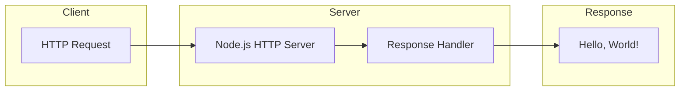

| Capability | Implementation | Behavior |
|------------|----------------|----------|
| HTTP Request Handling | Node.js `http` module | Accepts all incoming requests |
| Response Generation | Inline callback function | Returns "Hello, World!\n" |
| Server Binding | Hardcoded configuration | Binds to 127.0.0.1:3000 |
| Startup Logging | Console output | Logs server URL on initialization |

#### Major System Components

The system consists of the following components:

| Component | File | Purpose | Status |
|-----------|------|---------|--------|
| HTTP Server | `server.js` | Core application logic | Functional |
| Package Manifest | `package.json` | Project metadata and npm scripts | Complete |
| Lock File | `package-lock.json` | Dependency version locking | Present (empty deps) |
| Project Documentation | `README.md` | Project overview and policy | Minimal |
| Java Test Stub | `LoginTest.java` | Login automation placeholder | Incomplete |
| Industry Vocabulary | `industry.csv` | 43 industry categories | Complete |
| Sample Assets | `100Pages.pdf`, `demo.jpg`, `sample.doc` | Test documents | Present |
| Placeholder Files | `test.py.txt`, `test.txt.txt` | Empty test stubs | Inert |

#### Core Technical Approach

The implementation follows a **minimalist design philosophy**:

1. **Built-in Modules Only:** Uses Node.js native `http` module with zero external packages
2. **Synchronous Callback Pattern:** Simple request-response model without async complexity
3. **Hardcoded Configuration:** All settings embedded in source (no environment variables)
4. **Single-File Architecture:** Complete server logic contained in `server.js` (14 lines)

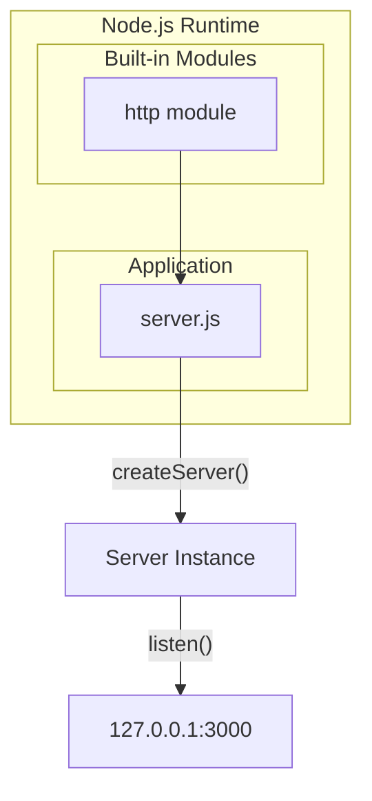

### 1.2.3 Success Criteria

Given the project's nature as a test fixture, success criteria focus on reliability and consistency rather than traditional business metrics.

#### Measurable Objectives

| Objective | Measurement | Target |
|-----------|-------------|--------|
| Server Availability | Successful startup | 100% on `node server.js` |
| Response Consistency | Response body match | "Hello, World!\n" |
| Response Code | HTTP status | 200 OK |
| Content Type | Header value | text/plain |

#### Critical Success Factors

1. **Deterministic Behavior:** Every request must produce identical responses
2. **Zero External Dependencies:** No npm packages beyond Node.js built-ins
3. **Isolation Integrity:** No side effects or state persistence between requests
4. **Backprop Compatibility:** Successful integration with Backprop tooling

#### Key Performance Indicators

| KPI | Description | Rationale |
|-----|-------------|-----------|
| Startup Time | Time to server ready state | Validates minimal overhead |
| Response Latency | Request-to-response duration | Confirms no blocking operations |
| Memory Footprint | Runtime memory consumption | Ensures lightweight operation |

> **Note:** Formal KPI tracking is not implemented, consistent with the project's test/demo purpose.

## 1.3 Scope

### 1.3.1 In-Scope

#### Core Features and Functionalities

The following capabilities are included within the project scope:

| Feature | Description | Implementation Reference |
|---------|-------------|--------------------------|
| HTTP Server | Minimal web server accepting connections | `server.js` lines 6-10 |
| Universal Request Handling | Responds to all HTTP methods and paths | `server.js` callback function |
| Plain Text Response | Returns "Hello, World!" message | `server.js` line 8 |
| Console Logging | Outputs server URL on startup | `server.js` line 13 |
| Industry Vocabulary | 43 standardized industry categories | `industry.csv` |

#### Primary User Workflows

**Workflow 1: Server Startup and Access**

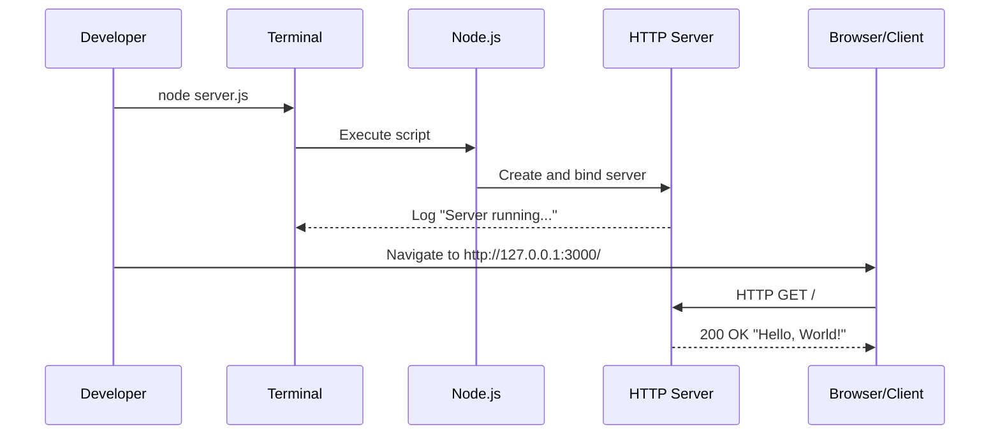

| Step | Action | Expected Result |
|------|--------|-----------------|
| 1 | Execute `node server.js` | Server starts, logs URL to console |
| 2 | Access `http://127.0.0.1:3000/` | Browser displays "Hello, World!" |
| 3 | Terminate with Ctrl+C | Server process ends |

#### Essential Integrations

| Integration | Purpose | Status |
|-------------|---------|--------|
| Backprop | Code analysis/refactoring testing | Primary objective |
| npm/yarn/pnpm | Package management | Supported |
| CI/CD Pipelines | Automated testing | Compatible |

#### Key Technical Requirements

| Requirement | Specification |
|-------------|---------------|
| Runtime Environment | Node.js (any modern version) |
| Network Port | 3000 (hardcoded) |
| Network Interface | Localhost only (127.0.0.1) |
| Operating System | Any Node.js-compatible OS |
| External Network | Not required |

#### Implementation Boundaries

| Boundary | Definition |
|----------|------------|
| System Boundaries | Single HTTP endpoint, localhost-only binding |
| User Groups | Local developers, CI/CD automation |
| Geographic Coverage | N/A (localhost access only) |
| Data Domains | Industry vocabulary (43 categories) |

### 1.3.2 Out-of-Scope

#### Explicitly Excluded Features

The following capabilities are **intentionally excluded** from this project:

| Excluded Feature | Rationale | Evidence |
|------------------|-----------|----------|
| Production Deployment | Test project only | README.md "Do not touch!" directive |
| External Network Access | Security/isolation by design | Server bound to 127.0.0.1 |
| Environment Configuration | Minimalist approach | Hardcoded values in `server.js` |
| Error Handling | Not required for test fixture | No try/catch or error middleware |
| Graceful Shutdown | Simplified lifecycle | No SIGINT/SIGTERM handlers |
| Test Suite Execution | Placeholder only | `npm test` returns "no test specified" |
| Multiple Routes | Single-purpose server | All requests return same response |
| Request Routing | Not implemented | No path-based logic |
| Dynamic Content | Static response only | Hardcoded "Hello, World!" |
| Session Management | Stateless design | No session storage |

#### Future Phase Considerations

Should this project evolve beyond its current test fixture purpose, the following enhancements could be considered:

| Enhancement | Description | Priority |
|-------------|-------------|----------|
| Complete LoginTest.java | Add Selenium WebDriver imports and implementation | Low |
| Implement Test Suite | Replace placeholder with actual tests | Medium |
| Externalize Configuration | Use environment variables for port/host | Low |
| Add Error Handling | Implement try/catch and error responses | Low |
| Graceful Shutdown | Handle SIGINT/SIGTERM signals | Low |
| Fix package.json Main | Align `main` field with actual entry point | Low |

> **Note:** The `package.json` declares `index.js` as the main entry point, but this file does not exist. The actual entry point is `server.js`.

#### Integration Points Not Covered

| Integration Type | Status |
|------------------|--------|
| Database Connections | Not implemented |
| External REST APIs | Not implemented |
| Authentication Services | Not implemented |
| Logging Services | Not implemented |
| Monitoring/APM | Not implemented |
| Message Queues | Not implemented |

#### Unsupported Use Cases

| Use Case | Reason for Exclusion |
|----------|---------------------|
| Production web serving | Project explicitly marked as test-only |
| External client access | Localhost binding prevents remote connections |
| Multi-tenant operation | No user isolation or authentication |
| Data persistence | Stateless, in-memory only |
| Load balancing | Single-instance design |
| HTTPS/TLS | No SSL certificate configuration |

---

#### References

The following files and resources were examined in the preparation of this section:

- `README.md` — Project name, purpose statement, and policy directive ("Do not touch!")
- `package.json` — Package metadata including name, version, author, license, and scripts
- `package-lock.json` — Dependency lock file confirming zero external dependencies
- `server.js` — Complete HTTP server implementation (14 lines)
- `LoginTest.java` — Java test stub structure and package declaration (com.blitzyTest)
- `industry.csv` — Industry vocabulary containing 43 categories
- `test.py.txt` — Empty placeholder file (0 bytes)
- `test.txt.txt` — Empty placeholder file (0 bytes)
- Root directory listing — Confirmed flat structure with no subdirectories

# 2. Product Requirements

## 2.1 Feature Catalog

This section provides a comprehensive catalog of all implemented features in the hao-backprop-test project. Each feature is documented with metadata, business context, and technical dependencies. Given the project's nature as a minimal test fixture for Backprop integration validation, the feature set is intentionally constrained.

### 2.1.1 Feature Overview Matrix

The following matrix summarizes all implemented features with their classification and status:

| Feature ID | Feature Name | Category | Priority |
|------------|--------------|----------|----------|
| F-001 | HTTP Server | Core Infrastructure | Critical |
| F-002 | Universal Request Handling | Request Processing | Critical |
| F-003 | Plain Text Response | Response Generation | Critical |
| F-004 | Startup Console Logging | Observability | Medium |
| F-005 | Industry Vocabulary Data | Data Asset | Low |

### 2.1.2 Feature Definitions

#### F-001: HTTP Server

**Feature Metadata**

| Attribute | Value |
|-----------|-------|
| Unique ID | F-001 |
| Feature Name | HTTP Server |
| Feature Category | Core Infrastructure |
| Priority Level | Critical |
| Status | Completed |

**Description**

| Aspect | Details |
|--------|---------|
| Overview | Minimal HTTP server using Node.js built-in `http` module that binds to localhost and listens for incoming requests |
| Business Value | Provides the foundational test endpoint for Backprop integration validation |
| User Benefits | Enables reliable, deterministic testing without external dependencies |
| Technical Context | Implemented in `server.js` lines 1-14 using `http.createServer()` |

**Dependencies**

| Dependency Type | Requirement |
|-----------------|-------------|
| Prerequisite Features | None (root feature) |
| System Dependencies | Node.js runtime (any modern version) |
| External Dependencies | None |
| Integration Requirements | Port 3000 availability, localhost network access |

---

#### F-002: Universal Request Handling

**Feature Metadata**

| Attribute | Value |
|-----------|-------|
| Unique ID | F-002 |
| Feature Name | Universal Request Handling |
| Feature Category | Request Processing |
| Priority Level | Critical |
| Status | Completed |

**Description**

| Aspect | Details |
|--------|---------|
| Overview | Request handler callback that accepts all HTTP methods and URL paths without discrimination |
| Business Value | Simplifies testing by eliminating routing complexity |
| User Benefits | Any HTTP request produces a valid response, enabling flexible test scenarios |
| Technical Context | Implemented as anonymous callback function in `server.js` lines 6-10 |

**Dependencies**

| Dependency Type | Requirement |
|-----------------|-------------|
| Prerequisite Features | F-001 (HTTP Server) |
| System Dependencies | Node.js `http` module request/response objects |
| External Dependencies | None |
| Integration Requirements | Active server instance |

---

#### F-003: Plain Text Response Generation

**Feature Metadata**

| Attribute | Value |
|-----------|-------|
| Unique ID | F-003 |
| Feature Name | Plain Text Response Generation |
| Feature Category | Response Generation |
| Priority Level | Critical |
| Status | Completed |

**Description**

| Aspect | Details |
|--------|---------|
| Overview | Generates deterministic "Hello, World!\n" response with HTTP 200 status and text/plain content type |
| Business Value | Provides predictable output for reliable test assertions |
| User Benefits | Consistent response body enables automated verification |
| Technical Context | Implemented in `server.js` lines 7-9 using `res.statusCode`, `res.setHeader`, and `res.end` |

**Dependencies**

| Dependency Type | Requirement |
|-----------------|-------------|
| Prerequisite Features | F-002 (Universal Request Handling) |
| System Dependencies | Node.js `http` module response object |
| External Dependencies | None |
| Integration Requirements | Active request handler context |

---

#### F-004: Startup Console Logging

**Feature Metadata**

| Attribute | Value |
|-----------|-------|
| Unique ID | F-004 |
| Feature Name | Startup Console Logging |
| Feature Category | Observability |
| Priority Level | Medium |
| Status | Completed |

**Description**

| Aspect | Details |
|--------|---------|
| Overview | Outputs server URL to console upon successful port binding |
| Business Value | Provides immediate feedback confirming successful server initialization |
| User Benefits | Developers can quickly verify server is running and identify access URL |
| Technical Context | Implemented in `server.js` lines 12-14 via `console.log()` template literal |

**Dependencies**

| Dependency Type | Requirement |
|-----------------|-------------|
| Prerequisite Features | F-001 (HTTP Server) successful binding |
| System Dependencies | Node.js `console` global object |
| External Dependencies | None |
| Integration Requirements | Successful `server.listen()` callback execution |

---

#### F-005: Industry Vocabulary Data

**Feature Metadata**

| Attribute | Value |
|-----------|-------|
| Unique ID | F-005 |
| Feature Name | Industry Vocabulary Data |
| Feature Category | Data Asset |
| Priority Level | Low |
| Status | Completed |

**Description**

| Aspect | Details |
|--------|---------|
| Overview | Standalone CSV file containing 43 standardized industry category names |
| Business Value | Provides reference data for potential future test scenarios |
| User Benefits | Structured vocabulary for industry classification |
| Technical Context | Implemented as single-column CSV in `industry.csv` with header row |

**Dependencies**

| Dependency Type | Requirement |
|-----------------|-------------|
| Prerequisite Features | None (standalone) |
| System Dependencies | CSV-compatible file reader |
| External Dependencies | None |
| Integration Requirements | None (not integrated with HTTP server) |

---

## 2.2 Functional Requirements

This section defines testable functional requirements for each feature, including acceptance criteria, technical specifications, and validation rules.

### 2.2.1 F-001: HTTP Server Requirements

#### Core Requirements Table

| Requirement ID | Description | Priority |
|----------------|-------------|----------|
| F-001-RQ-001 | Server Initialization | Must-Have |
| F-001-RQ-002 | Server Binding Configuration | Must-Have |
| F-001-RQ-003 | Connection Listening | Must-Have |

---

**F-001-RQ-001: Server Initialization**

| Attribute | Specification |
|-----------|---------------|
| Requirement ID | F-001-RQ-001 |
| Description | Server must initialize using Node.js native `http` module without external dependencies |
| Priority | Must-Have |
| Complexity | Low |

| Acceptance Criteria |
|---------------------|
| AC-1: Server process starts without errors when executing `node server.js` |
| AC-2: No npm packages required beyond Node.js built-ins |
| AC-3: Server instance created via `http.createServer()` |

**Technical Specifications**

| Parameter | Value |
|-----------|-------|
| Input Parameters | None (no command-line arguments) |
| Output/Response | Running server process |
| Performance Criteria | Immediate startup (<100ms) |
| Data Requirements | None |

**Validation Rules**

| Rule Type | Specification |
|-----------|---------------|
| Business Rules | Zero external dependencies policy |
| Data Validation | N/A |
| Security Requirements | None (localhost-only access) |
| Compliance Requirements | MIT license compliance |

---

**F-001-RQ-002: Server Binding Configuration**

| Attribute | Specification |
|-----------|---------------|
| Requirement ID | F-001-RQ-002 |
| Description | Server must bind exclusively to localhost interface on port 3000 |
| Priority | Must-Have |
| Complexity | Low |

| Acceptance Criteria |
|---------------------|
| AC-1: Server binds to IP address 127.0.0.1 |
| AC-2: Server listens on TCP port 3000 |
| AC-3: Server is accessible at http://127.0.0.1:3000/ |
| AC-4: Server is NOT accessible from external networks |

**Technical Specifications**

| Parameter | Value |
|-----------|-------|
| Input Parameters | Hardcoded hostname (`127.0.0.1`) and port (`3000`) |
| Output/Response | Bound server socket |
| Performance Criteria | Binding completes within server initialization |
| Data Requirements | None |

**Validation Rules**

| Rule Type | Specification |
|-----------|---------------|
| Business Rules | Localhost-only binding for isolation |
| Data Validation | Valid IP address and port number |
| Security Requirements | Network isolation enforced by design |
| Compliance Requirements | None |

---

**F-001-RQ-003: Connection Listening**

| Attribute | Specification |
|-----------|---------------|
| Requirement ID | F-001-RQ-003 |
| Description | Server must continuously listen for incoming HTTP connections after successful binding |
| Priority | Must-Have |
| Complexity | Low |

| Acceptance Criteria |
|---------------------|
| AC-1: Server remains running after initialization |
| AC-2: Server accepts multiple sequential requests |
| AC-3: Server handles concurrent requests (limited by Node.js event loop) |

**Technical Specifications**

| Parameter | Value |
|-----------|-------|
| Input Parameters | Incoming TCP connections |
| Output/Response | Dispatched request events |
| Performance Criteria | Continuous operation until terminated |
| Data Requirements | None |

---

### 2.2.2 F-002: Universal Request Handling Requirements

#### Core Requirements Table

| Requirement ID | Description | Priority |
|----------------|-------------|----------|
| F-002-RQ-001 | Universal Method Acceptance | Must-Have |
| F-002-RQ-002 | Universal Path Acceptance | Must-Have |
| F-002-RQ-003 | Stateless Processing | Must-Have |

---

**F-002-RQ-001: Universal Method Acceptance**

| Attribute | Specification |
|-----------|---------------|
| Requirement ID | F-002-RQ-001 |
| Description | Server must accept and process all standard HTTP methods identically |
| Priority | Must-Have |
| Complexity | Low |

| Acceptance Criteria |
|---------------------|
| AC-1: GET requests return valid response |
| AC-2: POST requests return valid response |
| AC-3: PUT requests return valid response |
| AC-4: DELETE requests return valid response |
| AC-5: All methods produce identical response |

**Technical Specifications**

| Parameter | Value |
|-----------|-------|
| Input Parameters | HTTP method (GET, POST, PUT, DELETE, etc.) |
| Output/Response | Standard "Hello, World!" response |
| Performance Criteria | No method-specific processing overhead |
| Data Requirements | None (request body ignored) |

**Validation Rules**

| Rule Type | Specification |
|-----------|---------------|
| Business Rules | Method-agnostic processing |
| Data Validation | None (no request parsing) |
| Security Requirements | None |
| Compliance Requirements | None |

---

**F-002-RQ-002: Universal Path Acceptance**

| Attribute | Specification |
|-----------|---------------|
| Requirement ID | F-002-RQ-002 |
| Description | Server must accept all URL paths without routing or path-based logic |
| Priority | Must-Have |
| Complexity | Low |

| Acceptance Criteria |
|---------------------|
| AC-1: Root path "/" returns valid response |
| AC-2: Any arbitrary path (e.g., "/test", "/api/v1") returns valid response |
| AC-3: No 404 Not Found responses generated |
| AC-4: No path-based conditional logic executed |

**Technical Specifications**

| Parameter | Value |
|-----------|-------|
| Input Parameters | URL path (any string) |
| Output/Response | Standard "Hello, World!" response |
| Performance Criteria | No routing overhead |
| Data Requirements | None (path ignored) |

---

**F-002-RQ-003: Stateless Processing**

| Attribute | Specification |
|-----------|---------------|
| Requirement ID | F-002-RQ-003 |
| Description | Each request must be processed independently without session or state persistence |
| Priority | Must-Have |
| Complexity | Low |

| Acceptance Criteria |
|---------------------|
| AC-1: No session identifiers generated or stored |
| AC-2: Request N produces same response as request 1 |
| AC-3: No side effects between requests |
| AC-4: No cookies set or read |

---

### 2.2.3 F-003: Plain Text Response Requirements

#### Core Requirements Table

| Requirement ID | Description | Priority |
|----------------|-------------|----------|
| F-003-RQ-001 | HTTP Status Code | Must-Have |
| F-003-RQ-002 | Content-Type Header | Must-Have |
| F-003-RQ-003 | Response Body Content | Must-Have |
| F-003-RQ-004 | Response Determinism | Must-Have |

---

**F-003-RQ-001: HTTP Status Code**

| Attribute | Specification |
|-----------|---------------|
| Requirement ID | F-003-RQ-001 |
| Description | All responses must return HTTP status code 200 OK |
| Priority | Must-Have |
| Complexity | Low |

| Acceptance Criteria |
|---------------------|
| AC-1: Response status code equals 200 |
| AC-2: No error status codes (4xx, 5xx) generated |
| AC-3: Status code consistent across all requests |

**Technical Specifications**

| Parameter | Value |
|-----------|-------|
| Input Parameters | None |
| Output/Response | HTTP Status 200 |
| Performance Criteria | N/A |
| Data Requirements | None |

---

**F-003-RQ-002: Content-Type Header**

| Attribute | Specification |
|-----------|---------------|
| Requirement ID | F-003-RQ-002 |
| Description | All responses must include Content-Type header set to text/plain |
| Priority | Must-Have |
| Complexity | Low |

| Acceptance Criteria |
|---------------------|
| AC-1: Content-Type header present in response |
| AC-2: Content-Type value equals "text/plain" |
| AC-3: Header consistent across all requests |

**Technical Specifications**

| Parameter | Value |
|-----------|-------|
| Input Parameters | None |
| Output/Response | Header: `Content-Type: text/plain` |
| Performance Criteria | N/A |
| Data Requirements | None |

---

**F-003-RQ-003: Response Body Content**

| Attribute | Specification |
|-----------|---------------|
| Requirement ID | F-003-RQ-003 |
| Description | Response body must contain exactly "Hello, World!\n" |
| Priority | Must-Have |
| Complexity | Low |

| Acceptance Criteria |
|---------------------|
| AC-1: Response body exactly matches "Hello, World!\n" |
| AC-2: Includes trailing newline character |
| AC-3: No additional content or whitespace |
| AC-4: UTF-8 encoding |

**Technical Specifications**

| Parameter | Value |
|-----------|-------|
| Input Parameters | None |
| Output/Response | String: "Hello, World!\n" (14 characters) |
| Performance Criteria | N/A |
| Data Requirements | Hardcoded string literal |

---

**F-003-RQ-004: Response Determinism**

| Attribute | Specification |
|-----------|---------------|
| Requirement ID | F-003-RQ-004 |
| Description | Every response must be identical regardless of request content or timing |
| Priority | Must-Have |
| Complexity | Low |

| Acceptance Criteria |
|---------------------|
| AC-1: Response N equals Response 1 |
| AC-2: No timestamps or dynamic content |
| AC-3: No request-dependent variations |

---

### 2.2.4 F-004: Startup Logging Requirements

#### Core Requirements Table

| Requirement ID | Description | Priority |
|----------------|-------------|----------|
| F-004-RQ-001 | Console Output | Should-Have |
| F-004-RQ-002 | Message Content | Should-Have |

---

**F-004-RQ-001: Console Output**

| Attribute | Specification |
|-----------|---------------|
| Requirement ID | F-004-RQ-001 |
| Description | Server must output status message to console upon successful binding |
| Priority | Should-Have |
| Complexity | Low |

| Acceptance Criteria |
|---------------------|
| AC-1: Message appears in stdout after server starts |
| AC-2: Message only appears once per startup |
| AC-3: Message appears within `listen()` callback |

---

**F-004-RQ-002: Message Content**

| Attribute | Specification |
|-----------|---------------|
| Requirement ID | F-004-RQ-002 |
| Description | Log message must include server URL with hostname and port |
| Priority | Should-Have |
| Complexity | Low |

| Acceptance Criteria |
|---------------------|
| AC-1: Message contains "http://127.0.0.1:3000/" |
| AC-2: Message clearly indicates server running state |

**Technical Specifications**

| Parameter | Value |
|-----------|-------|
| Input Parameters | hostname, port variables |
| Output/Response | Console log: "Server running at http://127.0.0.1:3000/" |
| Performance Criteria | N/A |
| Data Requirements | None |

---

### 2.2.5 F-005: Industry Vocabulary Requirements

#### Core Requirements Table

| Requirement ID | Description | Priority |
|----------------|-------------|----------|
| F-005-RQ-001 | CSV Format | Could-Have |
| F-005-RQ-002 | Vocabulary Content | Could-Have |

---

**F-005-RQ-001: CSV Format**

| Attribute | Specification |
|-----------|---------------|
| Requirement ID | F-005-RQ-001 |
| Description | Industry data must be stored in standard CSV format with header row |
| Priority | Could-Have |
| Complexity | Low |

| Acceptance Criteria |
|---------------------|
| AC-1: File uses .csv extension |
| AC-2: First row contains column header "Industry" |
| AC-3: Single column format |

---

**F-005-RQ-002: Vocabulary Content**

| Attribute | Specification |
|-----------|---------------|
| Requirement ID | F-005-RQ-002 |
| Description | File must contain 43 distinct industry categories |
| Priority | Could-Have |
| Complexity | Low |

| Acceptance Criteria |
|---------------------|
| AC-1: 44 total lines (1 header + 43 data rows) |
| AC-2: No duplicate entries |
| AC-3: Covers standard industry classifications |

**Sample Categories (from `industry.csv`):**

| Category Examples |
|-------------------|
| Accounting/Finance |
| Technology |
| Healthcare |
| Education |
| Government |

---

## 2.3 Feature Relationships

This section documents the interdependencies, integration points, and shared components across all implemented features.

### 2.3.1 Feature Dependency Map

The following diagram illustrates the hierarchical dependency relationships between features:

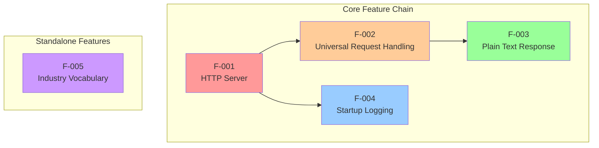

### 2.3.2 Dependency Matrix

| Feature | Depends On | Required By |
|---------|------------|-------------|
| F-001 | None (root) | F-002, F-004 |
| F-002 | F-001 | F-003 |
| F-003 | F-002 | None (terminal) |
| F-004 | F-001 | None (terminal) |
| F-005 | None | None (isolated) |

### 2.3.3 Integration Points

#### Internal Integration Points

| Integration Point | Features Involved | Mechanism |
|-------------------|-------------------|-----------|
| Server-Handler Binding | F-001 → F-002 | `createServer()` callback parameter |
| Handler-Response Chain | F-002 → F-003 | Request callback execution |
| Server-Logger Callback | F-001 → F-004 | `listen()` callback parameter |

#### External Integration Points

| Integration Point | Target System | Purpose |
|-------------------|---------------|---------|
| Backprop Integration | Backprop tooling | Primary project objective - code analysis/testing |
| Node.js Runtime | Node.js | Execution environment |
| npm Ecosystem | Package managers | Project initialization and scripts |

### 2.3.4 Shared Components

| Component | Used By Features | Source |
|-----------|------------------|--------|
| `http` module | F-001, F-002, F-003 | Node.js built-in |
| `console` object | F-004 | Node.js global |
| `hostname` constant | F-001, F-004 | `server.js` line 3 |
| `port` constant | F-001, F-004 | `server.js` line 4 |

### 2.3.5 Common Services

Given the minimal nature of this project, no formal shared services exist. All functionality is contained within the single `server.js` file.

| Service Type | Status | Notes |
|--------------|--------|-------|
| Configuration Service | Not Implemented | Values hardcoded in source |
| Logging Service | Minimal | Single `console.log()` call |
| Error Handling Service | Not Implemented | No error handling logic |
| Routing Service | Not Implemented | Universal handler by design |

---

## 2.4 Implementation Considerations

This section documents technical constraints, performance requirements, and operational considerations for each feature.

### 2.4.1 Technical Constraints

#### Global Constraints

| Constraint | Description | Rationale |
|------------|-------------|-----------|
| Zero External Dependencies | No npm packages beyond Node.js built-ins | Test isolation policy |
| Localhost-Only Binding | Server bound to 127.0.0.1 | Security isolation |
| Hardcoded Configuration | No environment variables | Minimalist design |
| Single-File Architecture | All logic in 14-line `server.js` | Simplicity focus |
| No Error Handling | No try/catch blocks | Test fixture scope |

#### Per-Feature Constraints

| Feature ID | Constraint | Impact |
|------------|------------|--------|
| F-001 | Port 3000 not configurable | Requires port availability |
| F-001 | No graceful shutdown handlers | Process termination is abrupt |
| F-002 | No request body parsing | Cannot process POST data |
| F-003 | Static response only | No dynamic content capability |
| F-004 | No log levels or formatting | Basic diagnostic output only |
| F-005 | No runtime integration | Data file is standalone |

### 2.4.2 Performance Requirements

| Requirement | Target | Measurement Method |
|-------------|--------|-------------------|
| Startup Time | < 100ms | Time from `node server.js` to logged message |
| Response Latency | < 10ms | Request-to-response duration |
| Memory Footprint | < 50MB | Runtime heap consumption |
| Throughput | > 1000 req/sec | Concurrent request handling |

#### Performance Considerations by Feature

| Feature ID | Consideration |
|------------|---------------|
| F-001 | No connection pooling or keepalive optimization |
| F-002 | No request parsing overhead (positive) |
| F-003 | Hardcoded string eliminates template rendering |
| F-004 | Single synchronous log call, minimal impact |
| F-005 | Static file, no runtime loading |

### 2.4.3 Scalability Considerations

| Dimension | Current State | Limitation |
|-----------|---------------|------------|
| Horizontal Scaling | Not supported | Single-instance design |
| Vertical Scaling | Limited | Localhost binding constraint |
| Load Balancing | Not applicable | Single endpoint |
| Clustering | Not implemented | No cluster module usage |

> **Note:** Scalability is intentionally not a design goal for this test fixture project.

### 2.4.4 Security Implications

| Security Aspect | Implementation | Risk Level |
|-----------------|----------------|------------|
| Network Exposure | Localhost-only (mitigated by design) | Low |
| Authentication | None (not required for localhost) | Low |
| Authorization | None (universal access) | Low |
| Input Validation | None (no input processing) | Low |
| Data Protection | N/A (no sensitive data) | N/A |
| HTTPS/TLS | Not implemented | N/A (localhost) |

#### Security Design Rationale

The security posture is intentionally minimal because:
1. The server is bound exclusively to localhost (127.0.0.1)
2. No external network access is possible
3. No sensitive data is processed or stored
4. The project serves as a test fixture, not production software

### 2.4.5 Maintenance Requirements

| Maintenance Area | Requirement | Frequency |
|------------------|-------------|-----------|
| Dependency Updates | None required | N/A |
| Security Patches | Node.js runtime only | As released |
| Code Reviews | Minimal (14 lines) | Per change |
| Documentation | This specification | Per change |

#### Protected Status

As indicated in `README.md` with the "Do not touch!" directive, this project has a protected status as a dedicated test environment. Changes should be minimized to preserve test integrity.

---

## 2.5 Requirements Traceability Matrix

This matrix maps features to requirements, enabling full traceability from business needs to implementation details.

### 2.5.1 Feature-to-Requirement Mapping

| Feature ID | Requirements | Count |
|------------|--------------|-------|
| F-001 | F-001-RQ-001, F-001-RQ-002, F-001-RQ-003 | 3 |
| F-002 | F-002-RQ-001, F-002-RQ-002, F-002-RQ-003 | 3 |
| F-003 | F-003-RQ-001, F-003-RQ-002, F-003-RQ-003, F-003-RQ-004 | 4 |
| F-004 | F-004-RQ-001, F-004-RQ-002 | 2 |
| F-005 | F-005-RQ-001, F-005-RQ-002 | 2 |
| **Total** | | **14** |

### 2.5.2 Priority Distribution

| Priority Level | Requirements | Percentage |
|----------------|--------------|------------|
| Must-Have | 10 | 71% |
| Should-Have | 2 | 14% |
| Could-Have | 2 | 14% |
| **Total** | **14** | **100%** |

### 2.5.3 Implementation Status

| Status | Features | Requirements |
|--------|----------|--------------|
| Completed | 5 | 14 |
| In Development | 0 | 0 |
| Proposed | 0 | 0 |
| **Total** | **5** | **14** |

---

## 2.6 Assumptions and Constraints

### 2.6.1 Documented Assumptions

| ID | Assumption | Impact if Invalid |
|----|------------|-------------------|
| A-001 | Node.js is installed on target system | Server cannot start |
| A-002 | Port 3000 is available | Server fails to bind |
| A-003 | Localhost network interface exists | Connection failures |
| A-004 | Test environment has console access | Startup log not visible |
| A-005 | Backprop integration uses HTTP protocol | Integration incompatibility |

### 2.6.2 Documented Constraints

| ID | Constraint | Source |
|----|------------|--------|
| C-001 | Zero external dependencies | Project design policy |
| C-002 | Localhost-only binding | `server.js` line 3 |
| C-003 | Hardcoded port 3000 | `server.js` line 4 |
| C-004 | Single-file implementation | Project structure |
| C-005 | Protected test status | `README.md` directive |
| C-006 | No configuration mechanism | Implementation choice |

---

## 2.7 References

### 2.7.1 Source Files Examined

| File Path | Relevance |
|-----------|-----------|
| `server.js` | Core HTTP server implementation (14 lines) - all features F-001 through F-004 |
| `package.json` | Project metadata, scripts configuration, dependency verification |
| `package-lock.json` | Confirmation of zero external dependencies |
| `README.md` | Project purpose, protected status directive |
| `industry.csv` | Industry vocabulary data (43 categories) for feature F-005 |
| `LoginTest.java` | Java test stub (incomplete, syntactically invalid) |
| `test.py.txt` | Empty placeholder file (0 bytes) |
| `test.txt.txt` | Empty placeholder file (0 bytes) |

### 2.7.2 Folders Explored

| Folder Path | Contents |
|-------------|----------|
| `/` (root) | 8 files, 0 subdirectories - flat project structure |

### 2.7.3 Related Specification Sections

| Section | Relationship |
|---------|--------------|
| 1.1 Executive Summary | Project overview and business context |
| 1.2 System Overview | High-level architecture and success criteria |
| 1.3 Scope | In-scope/out-of-scope feature boundaries |

# 3. Technology Stack

This section documents the complete technology stack employed by the hao-backprop-test project, a deliberately minimal "Hello World" Node.js application designed as a test harness for Backprop integration validation.

## 3.1 Programming Languages

### 3.1.1 Primary Language: JavaScript (Node.js)

The project is implemented exclusively in JavaScript, leveraging the Node.js server-side runtime environment.

| Attribute | Value | Evidence |
|-----------|-------|----------|
| Language | JavaScript (ECMAScript) | `server.js` |
| Runtime | Node.js | Built-in `http` module usage |
| Syntax Level | ES6+ | Template literals in startup logging |
| Module System | CommonJS | `require('http')` syntax |

#### Language Selection Criteria

| Criterion | Justification |
|-----------|---------------|
| Simplicity | Native HTTP server capabilities without external dependencies |
| Ubiquity | Widespread Node.js adoption in development environments |
| Backprop Compatibility | Primary target for integration testing |
| Single-file Implementation | 14-line complete server without transpilation |

#### Language Features Utilized

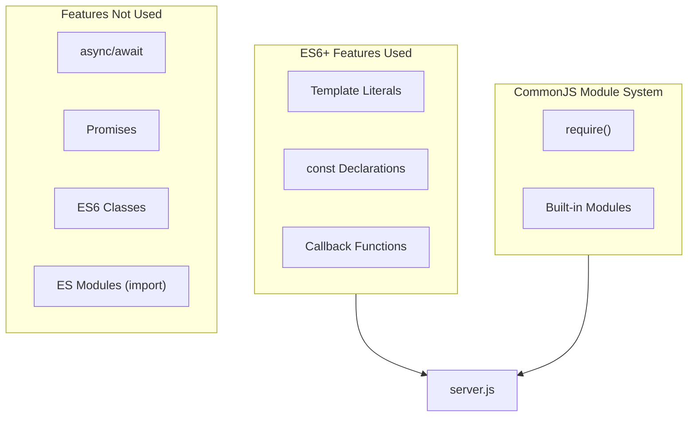

#### Code Evidence

| Feature | Line | Implementation |
|---------|------|----------------|
| `const` declarations | Lines 1-4 | Variable declarations for http, hostname, port |
| Template literals | Line 13 | `` `Server running at http://${hostname}:${port}/` `` |
| Callback functions | Lines 6-10 | Request handler in `createServer()` |
| CommonJS require | Line 1 | `const http = require('http');` |

### 3.1.2 Secondary Language: Java (Non-Functional Stub)

A Java test file exists in the repository but is incomplete and non-functional.

| Attribute | Value | Evidence |
|-----------|-------|----------|
| File | `LoginTest.java` | Repository root |
| Package | `com.blitzyTest` | Package declaration |
| Status | **Incomplete** | Syntactically invalid (orphan "Web" token) |
| Integration | None | Not connected to main application |

> **Note:** The Java stub does not contribute to the functional system and is not required for operation.

### 3.1.3 Version Compatibility

| Runtime | Minimum Version | Recommended | Notes |
|---------|-----------------|-------------|-------|
| Node.js | Any modern version | 22.x LTS (Jod) or 24.x LTS (Krypton) | No version-specific APIs used |
| npm | 7.x+ | 10.x+ | Based on `lockfileVersion: 3` |

## 3.2 Frameworks & Libraries

### 3.2.1 Framework Strategy: Zero External Frameworks

The project adopts a **deliberate zero-framework architecture** as a core design principle. This decision supports the project's primary purpose as an isolated test fixture for Backprop integration.

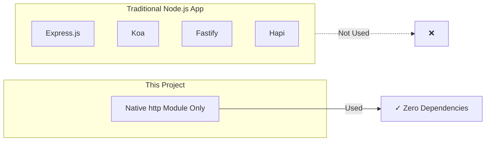

#### Framework Exclusion Rationale

| Consideration | Decision | Justification |
|---------------|----------|---------------|
| Express.js | **Excluded** | Adds unnecessary complexity for single endpoint |
| Koa | **Excluded** | Async middleware not required |
| Fastify | **Excluded** | Performance optimization unnecessary for test fixture |
| Routing libraries | **Excluded** | No path-based routing required |

### 3.2.2 Built-in Modules

The project relies exclusively on Node.js built-in modules:

| Module | Type | Purpose | Usage Location |
|--------|------|---------|----------------|
| `http` | Built-in | HTTP server creation and request handling | `server.js` line 1 |
| `console` | Global | Startup logging | `server.js` line 13 |

#### http Module Implementation

The `http` module provides all necessary functionality:

| API | Method | Purpose | Evidence |
|-----|--------|---------|----------|
| `http.createServer()` | Factory | Creates HTTP server instance | `server.js` line 6 |
| `server.listen()` | Binding | Binds server to port and interface | `server.js` line 12 |
| `res.statusCode` | Property | Sets HTTP response status | `server.js` line 7 |
| `res.setHeader()` | Method | Sets response content type | `server.js` line 8 |
| `res.end()` | Method | Sends response body | `server.js` line 9 |

### 3.2.3 Compatibility Requirements

| Requirement | Specification | Rationale |
|-------------|---------------|-----------|
| Node.js Runtime | Any version with `http` module | Core module available in all versions |
| Operating System | Any Node.js-compatible OS | No OS-specific dependencies |
| Network Stack | IPv4 localhost support | Hardcoded 127.0.0.1 binding |

## 3.3 Open Source Dependencies

### 3.3.1 Dependency Policy: Zero External Dependencies

The project enforces a strict **zero external dependency** policy as documented in the project constraints (C-001).

| Dependency Type | Count | Evidence |
|-----------------|-------|----------|
| Production dependencies | 0 | `package.json` lines 1-11 |
| Development dependencies | 0 | `package.json` lines 1-11 |
| Peer dependencies | 0 | Not specified |
| Optional dependencies | 0 | Not specified |

## Package.json Verification

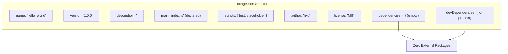

### 3.3.2 Package Metadata

| Property | Value | Source |
|----------|-------|--------|
| Package Name | `hello_world` | `package.json` line 2 |
| Version | `1.0.0` | `package.json` line 3 |
| Entry Point (declared) | `index.js` | `package.json` line 5 |
| Entry Point (actual) | `server.js` | Implementation file |
| Author | `hxu` | `package.json` line 9 |
| License | `MIT` | `package.json` line 10 |

> **Note:** The `main` field in `package.json` references `index.js`, but this file does not exist. The actual entry point is `server.js`. This discrepancy is documented but does not affect functionality for the project's test fixture purpose.

### 3.3.3 Package Lock File Analysis

The `package-lock.json` file confirms the zero-dependency architecture:

| Property | Value | Significance |
|----------|-------|--------------|
| lockfileVersion | 3 | Indicates npm v7+ was used for initialization |
| Dependency Count | 0 | Confirms no external packages |
| packages | Root entry only | No transitive dependencies |

### 3.3.4 Package Registry

| Registry | URL | Usage |
|----------|-----|-------|
| npm (Node Package Manager) | https://registry.npmjs.org | Package management (no packages fetched) |

#### Dependency Security Implications

| Security Aspect | Status | Impact |
|-----------------|--------|--------|
| Supply Chain Risk | **None** | Zero external dependencies eliminates supply chain vulnerabilities |
| Vulnerability Scanning | **Not Required** | No third-party code to audit |
| License Compliance | **MIT Only** | Single license, maximum permissibility |
| Dependency Updates | **Not Required** | No packages to maintain |

## 3.4 Third-Party Services

### 3.4.1 External Service Policy: Complete Isolation

The project maintains **deliberate isolation from all external services** as a core architectural decision. This isolation ensures that Backprop integration testing reflects tooling behavior rather than environmental factors.

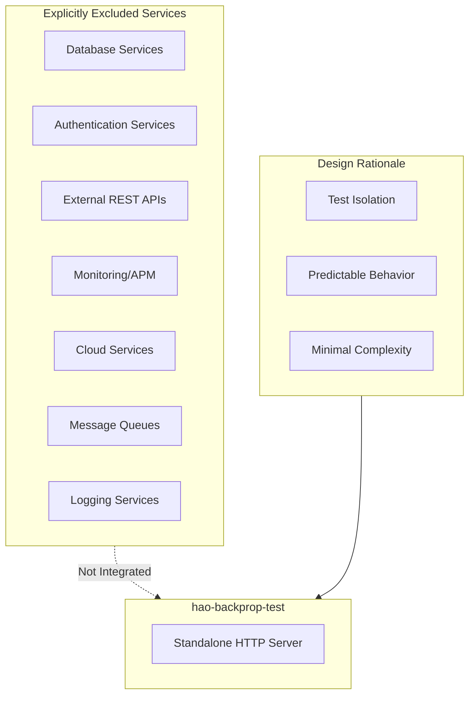

### 3.4.2 Service Exclusion Matrix

| Service Category | Status | Rationale |
|-----------------|--------|-----------|
| Database Connections | **Not Implemented** | Stateless operation by design |
| External REST APIs | **Not Implemented** | Self-contained responses required |
| Authentication Services | **Not Implemented** | Localhost access only, no users |
| Monitoring/Observability | **Not Implemented** | Minimal footprint goal |
| Cloud Services | **Not Implemented** | Local development scope |
| CDN Services | **Not Implemented** | No static assets served |
| Email Services | **Not Implemented** | No notification requirements |
| Payment Services | **Not Implemented** | Not a commercial application |

### 3.4.3 Primary Integration: Backprop

The sole external integration is with Backprop, the code analysis/refactoring tool that this project is designed to test.

| Integration | Type | Purpose | Status |
|-------------|------|---------|--------|
| Backprop | Development Tool | Code analysis and refactoring testing | Primary objective |

## 3.5 Databases & Storage

### 3.5.1 Database Policy: Stateless Architecture

The project implements a **fully stateless architecture** with no database requirements.

| Database Type | Status | Justification |
|---------------|--------|---------------|
| Relational (SQL) | Not Implemented | No persistent data requirements |
| Document (NoSQL) | Not Implemented | No data modeling needs |
| Key-Value Store | Not Implemented | No session/cache requirements |
| Graph Database | Not Implemented | No relationship modeling |
| Time-Series | Not Implemented | No metrics storage |

### 3.5.2 Data Persistence Strategy

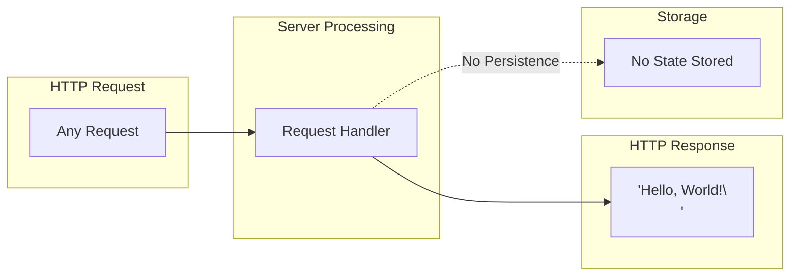

| Persistence Aspect | Implementation |
|-------------------|----------------|
| Request State | Not stored |
| Session Data | Not implemented |
| User Data | Not applicable |
| Application State | In-memory only (reset on restart) |

### 3.5.3 Static Data Assets

The repository contains one static data file that is not integrated with the runtime:

| Asset | Format | Contents | Runtime Integration |
|-------|--------|----------|---------------------|
| `industry.csv` | Single-column CSV | 43 industry category labels | **None** (standalone reference) |

#### Industry Vocabulary Sample Categories

The `industry.csv` file contains standardized industry labels for potential future use:

- Accounting
- Airlines/Aviation
- Computer Software
- Financial Services
- Information Technology and Services
- *(43 categories total)*

### 3.5.4 Caching Strategy

| Caching Layer | Status | Rationale |
|---------------|--------|-----------|
| Application Cache | Not Implemented | Static response, no computation to cache |
| HTTP Caching | Not Configured | Test fixture, caching not beneficial |
| CDN Caching | Not Applicable | Localhost-only deployment |

## 3.6 Development & Deployment

### 3.6.1 Development Tools

#### Package Management

| Tool | Version | Purpose | Evidence |
|------|---------|---------|----------|
| npm | 7.x+ | Package management, script execution | `package-lock.json` lockfileVersion: 3 |

#### Runtime Environment

| Component | Requirement | Recommendation |
|-----------|-------------|----------------|
| Node.js | Any modern version | LTS versions (22.x "Jod" or 24.x "Krypton") |
| Operating System | Any Node.js-compatible | macOS, Linux, Windows |

#### npm Scripts

| Script | Command | Status |
|--------|---------|--------|
| `test` | `echo "Error: no test specified" && exit 1` | Placeholder only |
| `start` | Not defined | Server started manually |

### 3.6.2 Build System

The project requires **no build system** due to its vanilla JavaScript implementation.

| Build Aspect | Status | Justification |
|--------------|--------|---------------|
| Transpilation | Not Required | Native ES6+ supported in Node.js |
| Bundling | Not Required | Single-file architecture |
| Minification | Not Required | Development/test environment only |
| TypeScript | Not Used | Plain JavaScript implementation |
| Babel | Not Used | No transpilation needed |

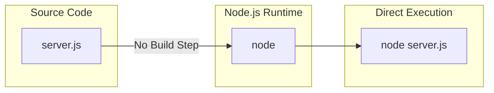

### 3.6.3 Containerization

| Container Technology | Status | Notes |
|---------------------|--------|-------|
| Docker | Not Implemented | No Dockerfile present |
| Docker Compose | Not Implemented | No orchestration required |
| Kubernetes | Not Applicable | Localhost-only deployment |

#### Containerization Rationale

Containerization is intentionally excluded:

1. **Localhost-only binding** (127.0.0.1) makes container networking unnecessary
2. **Zero dependencies** eliminates environment consistency concerns
3. **Test fixture scope** does not require deployment portability

### 3.6.4 CI/CD Requirements

| CI/CD Component | Status | Notes |
|-----------------|--------|-------|
| GitHub Actions | Not Configured | No workflow files present |
| Jenkins | Not Configured | No Jenkinsfile |
| CircleCI | Not Configured | No configuration |
| Travis CI | Not Configured | No `.travis.yml` |

#### CI/CD Compatibility

While not configured, the project is compatible with standard CI/CD pipelines:

| Pipeline Capability | Compatibility |
|--------------------|---------------|
| Automated Testing | Requires test implementation |
| Startup Verification | `node server.js` returns immediately |
| Health Checks | HTTP GET to localhost:3000 |
| Container Build | Dockerfile can be added if needed |

### 3.6.5 Deployment Model

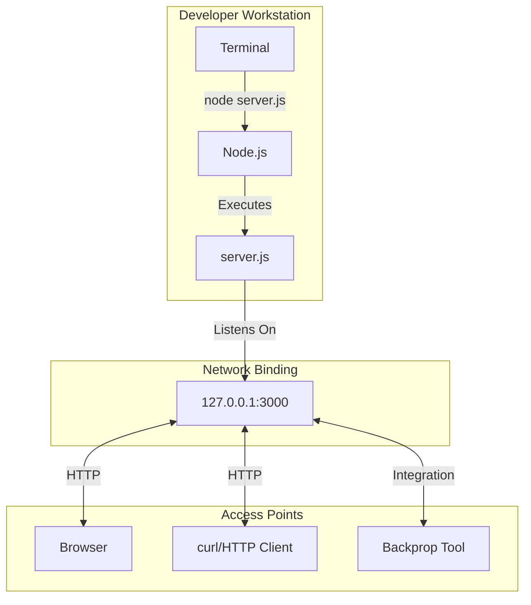

| Deployment Attribute | Value |
|---------------------|-------|
| Deployment Target | Local development machine |
| Network Interface | Localhost only (127.0.0.1) |
| Port | 3000 (hardcoded) |
| Startup Command | `node server.js` |
| Shutdown Method | Ctrl+C (SIGINT) |

## 3.7 Technology Stack Summary

### 3.7.1 Complete Stack Overview

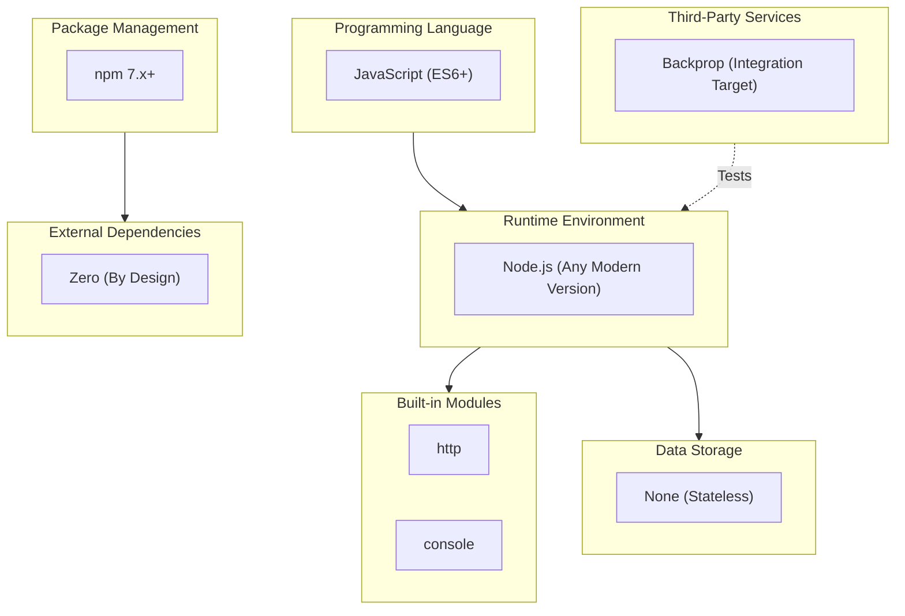

### 3.7.2 Technology Decision Matrix

| Category | Choice | Alternative Considered | Rationale |
|----------|--------|----------------------|-----------|
| Language | JavaScript | Python, Go, Java | Backprop test target, simplicity |
| Runtime | Node.js | Deno, Bun | Ecosystem maturity, widespread adoption |
| HTTP Framework | None (native `http`) | Express, Koa, Fastify | Zero-dependency requirement |
| Database | None | SQLite, MongoDB | Stateless design requirement |
| Build System | None | Webpack, esbuild | No transpilation needed |
| Containerization | None | Docker | Localhost-only deployment |

### 3.7.3 Default Stack Comparison

The following table compares the default technology stack guidelines against the actual implementation:

| Default Technology | Actual Implementation | Reason for Deviation |
|-------------------|----------------------|---------------------|
| **Cloud Platform: AWS** | Not used | Localhost-only deployment model |
| **Containerization: Docker** | Not used | No deployment portability required |
| **Infrastructure as Code: Terraform** | Not used | No infrastructure provisioning needed |
| **CI/CD: GitHub Actions** | Not configured | Test fixture scope |
| **Backend: Python/Flask** | Node.js/native http | Project is Node.js test fixture |
| **Authentication: Auth0** | Not implemented | No user authentication required |
| **Database: MongoDB** | Not implemented | Stateless architecture |
| **AI Framework: LangChain** | Not used | Not an AI application |
| **Frontend: React/TypeScript** | Not implemented | No user interface |
| **CSS: TailwindCSS** | Not used | No frontend styling |
| **Mobile: React-Native** | Not applicable | Not a mobile application |

### 3.7.4 Security Implications

| Technology Choice | Security Implication | Risk Level |
|------------------|---------------------|------------|
| Zero external dependencies | Eliminates supply chain attacks | **Low** |
| Localhost-only binding | No external network exposure | **Low** |
| No authentication | Universal local access | **Low** (localhost) |
| No database | No data breach risk | **N/A** |
| No HTTPS | Unencrypted traffic | **N/A** (localhost) |

### 3.7.5 Maintenance Requirements

| Component | Maintenance Need | Frequency |
|-----------|-----------------|-----------|
| Node.js Runtime | Security updates | As released |
| npm | Security updates | As released |
| Application Code | Minimal (14 lines) | Per change |
| Dependencies | **None** | N/A |

#### References

The following files and resources were examined in the preparation of this section:

#### Source Files

- `server.js` - Core HTTP server implementation (14 lines), runtime configuration, built-in module usage
- `package.json` - Package metadata, npm scripts, dependency declarations (empty), license information
- `package-lock.json` - Lockfile version (npm 7+), confirmation of zero dependencies
- `README.md` - Project purpose and protected status directive
- `industry.csv` - Static data asset (43 industry categories)
- `LoginTest.java` - Java test stub (incomplete, syntactically invalid)

#### Technical Specification Sections

- 1.1 Executive Summary - Project overview, stakeholders, value proposition
- 1.2 System Overview - Architecture, technical approach, success criteria
- 1.3 Scope - In-scope features, exclusions, integration points
- 2.4 Implementation Considerations - Technical constraints, performance requirements
- 2.6 Assumptions and Constraints - Documented assumptions and constraints matrix

#### External References

- Node.js Release Schedule (https://github.com/nodejs/Release) - LTS version information
- Node.js Official Releases (https://nodejs.org/en/about/previous-releases) - Version lifecycle documentation

# 4. Process Flowchart

This section provides comprehensive process flowcharts documenting all system workflows, integration patterns, state transitions, and error handling mechanisms within the hao-backprop-test project. Given the project's nature as a minimal test fixture for Backprop integration validation, the process flows are intentionally streamlined to ensure deterministic behavior and maximum testability.

## 4.1 System Workflows

### 4.1.1 High-Level System Workflow

The hao-backprop-test project implements a single, focused workflow centered around serving HTTP requests with consistent responses. This design philosophy prioritizes simplicity and predictability over feature complexity.

#### System Interaction Overview

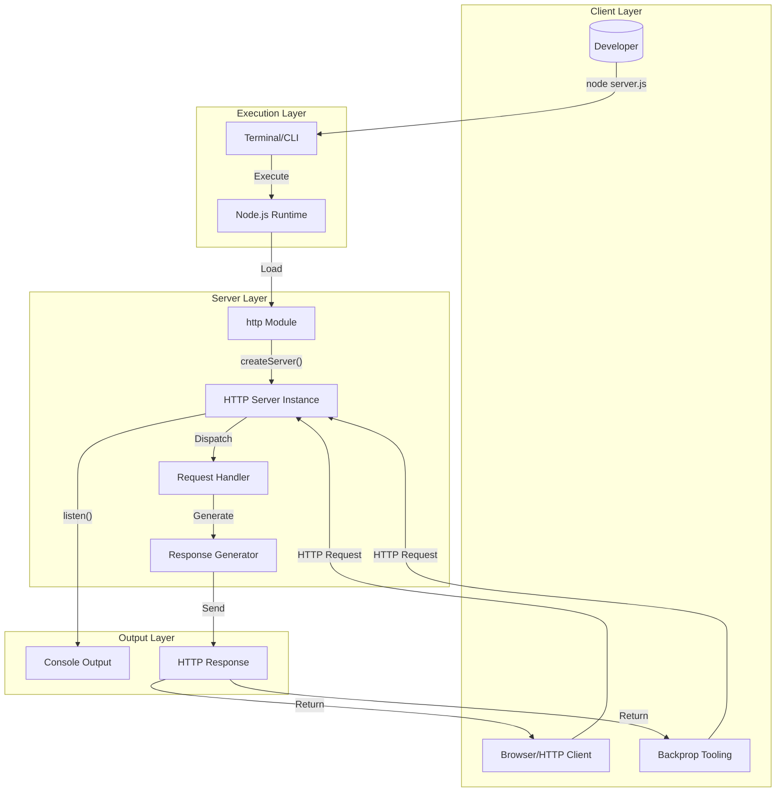

#### Workflow Stages Summary

| Stage | Description | Duration | Components Involved |
|-------|-------------|----------|---------------------|
| Initialization | Server startup and port binding | < 100ms | Node.js, `http` module, `server.js` |
| Ready State | Server listening for connections | Continuous | Server instance |
| Request Processing | Handling incoming HTTP requests | < 10ms | Handler callback, Response generator |
| Termination | Process shutdown | Immediate | Node.js runtime |

### 4.1.2 Core Business Process: Server Lifecycle

The server lifecycle represents the primary business process, encompassing startup, operation, and termination phases.

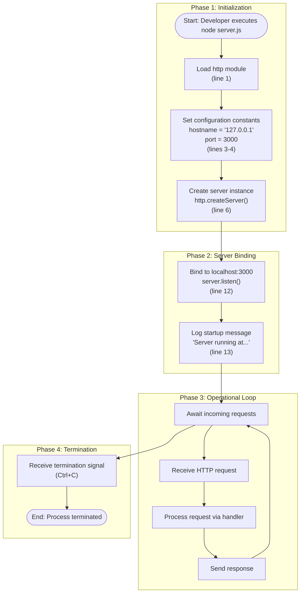

#### Process Steps Detail

| Step | Action | Implementation Reference | Timing |
|------|--------|-------------------------|--------|
| 1 | Load HTTP module | `server.js` line 1 | Immediate |
| 2 | Define hostname constant | `server.js` line 3 | Immediate |
| 3 | Define port constant | `server.js` line 4 | Immediate |
| 4 | Create server with handler | `server.js` lines 6-10 | Immediate |
| 5 | Bind to localhost:3000 | `server.js` line 12 | < 10ms |
| 6 | Log startup message | `server.js` line 13 | Immediate |
| 7 | Enter listening state | Event loop | Continuous |
| 8 | Process requests | Handler callback | < 10ms each |

### 4.1.3 End-to-End User Journey

This flowchart documents the complete user journey from server startup through request execution.

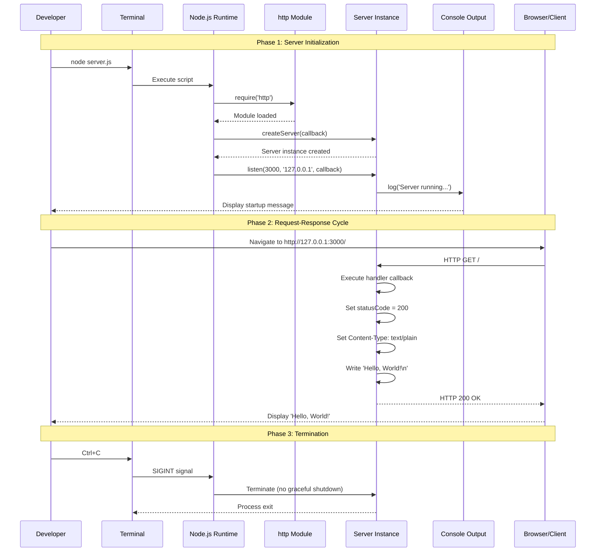

#### User Journey Decision Points

| Decision Point | Condition | Path A | Path B |
|----------------|-----------|--------|--------|
| Port Availability | Port 3000 available? | Proceed to binding | Server fails (unhandled) |
| Request Received | Any HTTP request | Process identically | N/A - all paths accepted |
| Termination | Ctrl+C pressed? | Terminate process | Continue listening |

### 4.1.4 Request Processing Workflow

This detailed flowchart documents the request handling process at the handler level.

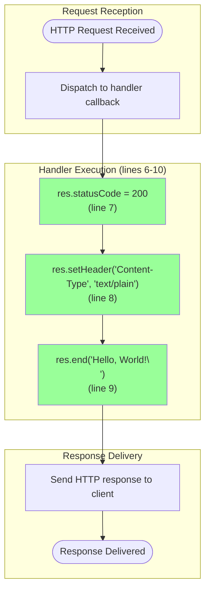

#### Request Processing Characteristics

| Characteristic | Specification | Rationale |
|----------------|---------------|-----------|
| Method Handling | All methods accepted | Universal handler by design |
| Path Routing | All paths accepted | No routing implemented |
| Body Processing | Request body ignored | Stateless, input-agnostic |
| Response Time | < 10ms | No processing overhead |
| Concurrent Handling | Limited by event loop | Node.js single-threaded model |

## 4.2 Integration Workflows

### 4.2.1 Backprop Integration Flow

The primary integration point is with Backprop tooling for code analysis and testing validation.

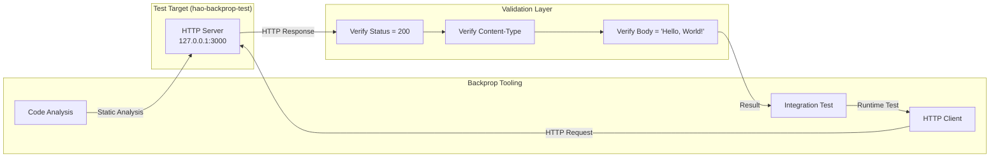

#### Integration Points Summary

| Integration Point | Source | Target | Protocol | Purpose |
|-------------------|--------|--------|----------|---------|
| Code Analysis | Backprop | `server.js` | File I/O | Static analysis target |
| HTTP Testing | Backprop | localhost:3000 | HTTP | Integration validation |
| Assertion Validation | Test Framework | Response | Comparison | Verify deterministic output |

### 4.2.2 Package Manager Integration

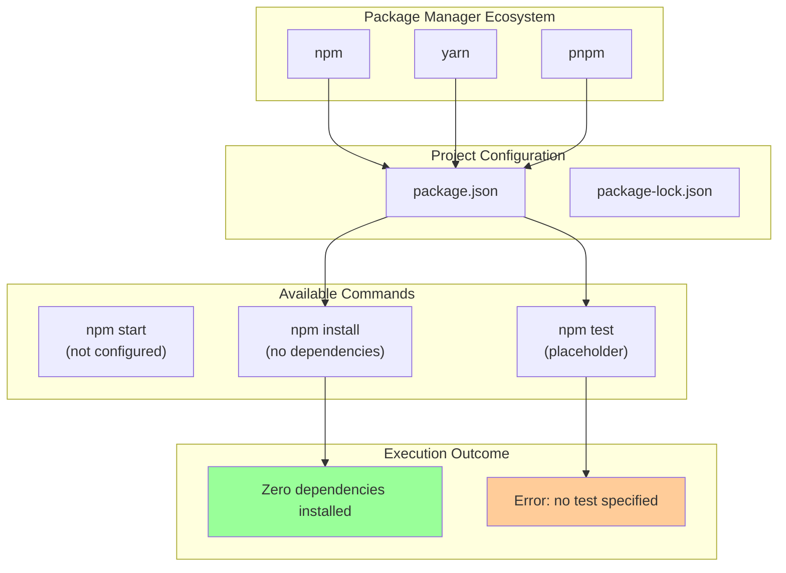

### 4.2.3 System Boundary Definition

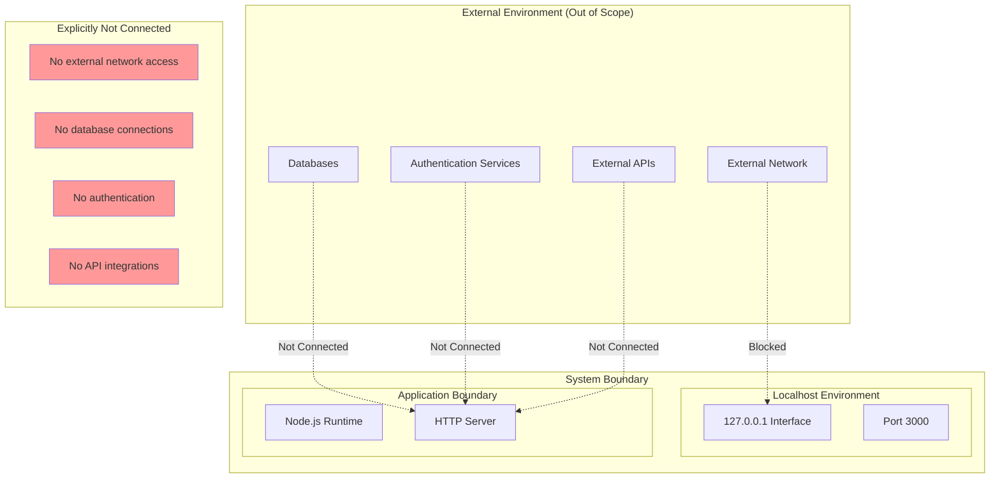

## 4.3 State Management

### 4.3.1 Server State Transition Diagram

The server operates through discrete states during its lifecycle.

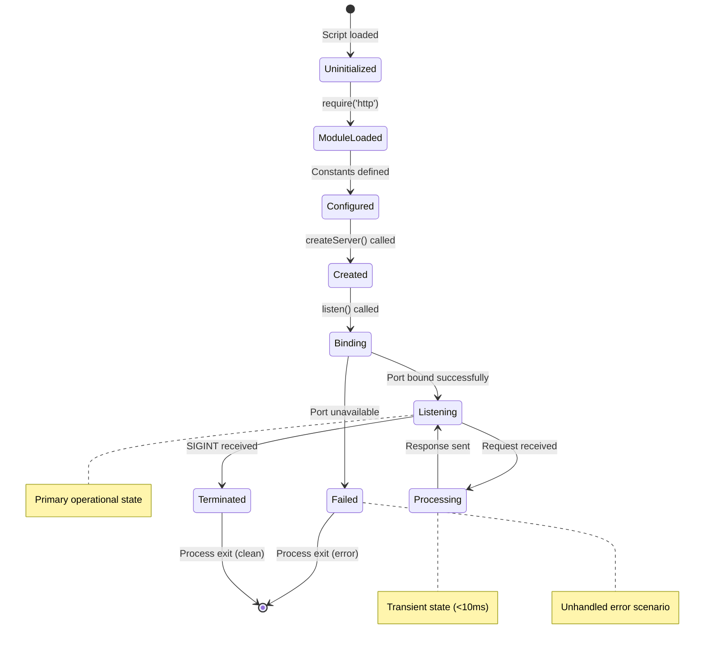

#### State Definitions

| State | Description | Duration | Exit Conditions |
|-------|-------------|----------|-----------------|
| Uninitialized | Script execution begins | < 1ms | Module loading |
| ModuleLoaded | `http` module available | < 1ms | Configuration definition |
| Configured | Constants set (hostname, port) | < 1ms | Server creation |
| Created | Server instance exists | < 1ms | Listen initiation |
| Binding | Port binding in progress | < 10ms | Binding success/failure |
| Listening | Server accepting connections | Continuous | Request arrival or termination |
| Processing | Handling active request | < 10ms | Response completion |
| Terminated | Shutdown initiated | Immediate | Process exit |
| Failed | Error state (port in use) | N/A | Process exit |

### 4.3.2 Request State Flow

```mermaid
stateDiagram-v2
    [*] --> Pending: HTTP request initiated
    
    Pending --> Received: Request reaches server
    Received --> Dispatched: Handler callback invoked
    Dispatched --> HeadersSet: Status and headers configured
    HeadersSet --> BodyWritten: Response body written
    BodyWritten --> Completed: res.end() called
    Completed --> [*]: Response delivered
    
    note right of Dispatched: No routing decisions
    note right of HeadersSet: Always 200 + text/plain
    note right of BodyWritten: Always 'Hello, World!\n'
```

### 4.3.3 Data Persistence Architecture

```mermaid
flowchart TD
    subgraph MemoryModel["Memory Model"]
        HEAP["Node.js Heap"]
        VARS["Runtime Variables"]
        CONST["Constants (hostname, port)"]
    end
    
    subgraph Persistence["Persistence Layer"]
        NO_SESSION["No Session Storage"]
        NO_CACHE["No Cache Layer"]
        NO_DB["No Database"]
        NO_FILE["No File I/O"]
    end
    
    subgraph Characteristics["Stateless Characteristics"]
        ISOLATED["Each request isolated"]
        NO_SIDE["No side effects"]
        DETERMINISTIC["Deterministic output"]
    end
    
    HEAP --> VARS
    VARS --> CONST
    
    NO_SESSION -.->|"Not Implemented"| HEAP
    NO_CACHE -.->|"Not Implemented"| HEAP
    NO_DB -.->|"Not Implemented"| HEAP
    NO_FILE -.->|"Not Implemented"| HEAP
    
    CONST --> ISOLATED
    ISOLATED --> NO_SIDE
    NO_SIDE --> DETERMINISTIC
    
    style NO_SESSION fill:#ffcc99
    style NO_CACHE fill:#ffcc99
    style NO_DB fill:#ffcc99
    style NO_FILE fill:#ffcc99
    style DETERMINISTIC fill:#99ff99
```

#### Stateless Design Validation

| Validation Criterion | Specification | Evidence |
|---------------------|---------------|----------|
| Session Isolation | No session identifiers | No cookie handling in handler |
| Request Independence | Request N equals Request 1 | Static response in `server.js` line 9 |
| No Side Effects | No state modification | No variables modified in handler |
| No Data Persistence | Memory-only operation | No file or database operations |

## 4.4 Error Handling Flowcharts

### 4.4.1 Potential Error Scenarios

The project intentionally omits error handling as part of its minimalist test fixture design. This section documents potential error scenarios and their (unhandled) outcomes.

```mermaid
flowchart TD
    subgraph ErrorScenarios["Potential Error Scenarios"]
        E1["Port 3000 In Use"]
        E2["Node.js Not Installed"]
        E3["Network Interface Unavailable"]
        E4["Invalid Request"]
    end
    
    subgraph SystemBehavior["System Behavior (Unhandled)"]
        E1_OUT["EADDRINUSE error<br/>Process crash"]
        E2_OUT["Command not found<br/>Shell error"]
        E3_OUT["EADDRNOTAVAIL error<br/>Process crash"]
        E4_OUT["No error - universal acceptance"]
    end
    
    subgraph Mitigation["Mitigation Responsibility"]
        USER["User/Operator<br/>Ensure prerequisites"]
        DESIGN["By Design<br/>Accept all requests"]
    end
    
    E1 --> E1_OUT
    E2 --> E2_OUT
    E3 --> E3_OUT
    E4 --> E4_OUT
    
    E1_OUT --> USER
    E2_OUT --> USER
    E3_OUT --> USER
    E4_OUT --> DESIGN
    
    style E1_OUT fill:#ff9999
    style E2_OUT fill:#ff9999
    style E3_OUT fill:#ff9999
    style E4_OUT fill:#99ff99
```

### 4.4.2 Error Scenario Analysis

| Error Scenario | Trigger Condition | Expected Behavior | Handling Status |
|----------------|-------------------|-------------------|-----------------|
| Port In Use | Another process on port 3000 | `EADDRINUSE` error, process crash | Not Handled |
| Node.js Missing | Node.js not installed | Shell `command not found` error | Not Handled |
| Network Unavailable | Localhost interface missing | `EADDRNOTAVAIL` error | Not Handled |
| Malformed Request | Any HTTP request format | Universal acceptance, normal response | By Design |
| Timeout | Connection held open | No timeout configured | Not Implemented |

### 4.4.3 Recovery Path Diagram

```mermaid
flowchart TD
    subgraph ErrorDetection["Error Detection"]
        ERROR([Error Occurs])
        IDENTIFY["Identify Error Type"]
    end
    
    subgraph ManualRecovery["Manual Recovery (No Automation)"]
        R1["Port Conflict:<br/>Kill conflicting process<br/>or change port manually"]
        R2["Missing Node.js:<br/>Install Node.js runtime"]
        R3["Network Issue:<br/>Verify localhost interface"]
    end
    
    subgraph Restart["Restart Procedure"]
        STOP["Stop existing process<br/>(if running)"]
        FIX["Apply fix"]
        RETRY["node server.js"]
        VERIFY["Verify server running"]
    end
    
    ERROR --> IDENTIFY
    IDENTIFY -->|"EADDRINUSE"| R1
    IDENTIFY -->|"Command not found"| R2
    IDENTIFY -->|"EADDRNOTAVAIL"| R3
    
    R1 --> STOP
    R2 --> FIX
    R3 --> FIX
    STOP --> FIX
    FIX --> RETRY
    RETRY --> VERIFY
```

### 4.4.4 Error Handling Design Rationale

```mermaid
flowchart LR
    subgraph DesignDecision["Design Decision: No Error Handling"]
        REASON1["Test Fixture Purpose"]
        REASON2["Minimalist Philosophy"]
        REASON3["Isolation by Design"]
        REASON4["Deterministic Behavior"]
    end
    
    subgraph Outcome["Outcome"]
        SIMPLE["14-line implementation"]
        PREDICT["Predictable behavior"]
        TEST["Ideal for Backprop testing"]
    end
    
    REASON1 --> SIMPLE
    REASON2 --> SIMPLE
    REASON3 --> PREDICT
    REASON4 --> PREDICT
    SIMPLE --> TEST
    PREDICT --> TEST
```

## 4.5 Feature Dependency Flow

### 4.5.1 Feature Execution Chain

```mermaid
flowchart TB
    subgraph FeatureChain["Core Feature Execution Chain"]
        F001["F-001: HTTP Server<br/>(Root Feature)"]
        F002["F-002: Universal Request Handling<br/>(Request Processing)"]
        F003["F-003: Plain Text Response<br/>(Response Generation)"]
        F004["F-004: Startup Logging<br/>(Observability)"]
    end
    
    subgraph Isolated["Isolated Feature"]
        F005["F-005: Industry Vocabulary<br/>(Standalone Data Asset)"]
    end
    
    subgraph ExecutionPath["Execution Path"]
        INIT["Server Initialization"]
        READY["Ready State"]
        PROCESS["Request Processing"]
        RESPOND["Response Delivery"]
    end
    
    F001 -->|"Creates handler context"| F002
    F002 -->|"Invokes response"| F003
    F001 -->|"Triggers on bind"| F004
    
    INIT -->|"F-001"| READY
    READY -->|"F-002"| PROCESS
    PROCESS -->|"F-003"| RESPOND
    READY -.->|"F-004"| READY
    
    style F001 fill:#ff9999
    style F002 fill:#ffcc99
    style F003 fill:#99ff99
    style F004 fill:#99ccff
    style F005 fill:#cc99ff
```

### 4.5.2 Feature Integration Points

```mermaid
flowchart TD
    subgraph IntegrationPoints["Internal Integration Points"]
        IP1["Server-Handler Binding<br/>createServer(callback)"]
        IP2["Handler-Response Chain<br/>Callback execution"]
        IP3["Server-Logger Callback<br/>listen() callback"]
    end
    
    subgraph SharedComponents["Shared Components"]
        HTTP_MOD["http module<br/>(F-001, F-002, F-003)"]
        CONSOLE["console object<br/>(F-004)"]
        HOSTNAME["hostname constant<br/>(F-001, F-004)"]
        PORT["port constant<br/>(F-001, F-004)"]
    end
    
    IP1 --> HTTP_MOD
    IP2 --> HTTP_MOD
    IP3 --> CONSOLE
    IP3 --> HOSTNAME
    IP3 --> PORT
```

## 4.6 Timing and SLA Considerations

### 4.6.1 Performance Flow Diagram

```mermaid
flowchart LR
    subgraph TimingTargets["Performance Targets"]
        T1["Startup Time<br/>Target: < 100ms"]
        T2["Response Latency<br/>Target: < 10ms"]
        T3["Memory Footprint<br/>Target: < 50MB"]
        T4["Throughput<br/>Target: > 1000 req/sec"]
    end
    
    subgraph Rationale["Design Rationale"]
        R1["No external deps<br/>= Fast startup"]
        R2["No processing<br/>= Fast response"]
        R3["Minimal code<br/>= Low memory"]
        R4["Event loop<br/>= High throughput"]
    end
    
    T1 --- R1
    T2 --- R2
    T3 --- R3
    T4 --- R4
```

### 4.6.2 Request Processing Timeline

```mermaid
gantt
    dateFormat  ss.SSS
    axisFormat %L ms
    title Request Processing Timeline
    
    section Request Phase
    Request Received          :r1, 00.000, 1ms
    Handler Dispatch          :r2, after r1, 1ms
    
    section Response Phase
    Set Status Code           :s1, after r2, 1ms
    Set Content-Type Header   :s2, after s1, 1ms
    Write Response Body       :s3, after s2, 2ms
    Send Response             :s4, after s3, 2ms
    
    section Total
    Complete Request-Response :crit, 00.000, 8ms
```

### 4.6.3 Performance Validation Rules

| Metric | Target | Measurement Method | Validation |
|--------|--------|-------------------|------------|
| Startup Time | < 100ms | Time from `node server.js` to log message | Manual timing |
| Response Latency | < 10ms | Request-to-response duration | HTTP client metrics |
| Memory Footprint | < 50MB | Runtime heap consumption | `process.memoryUsage()` |
| Throughput | > 1000 req/sec | Concurrent request handling | Load testing tools |

## 4.7 Validation Rules and Checkpoints

### 4.7.1 Business Rules Flow

```mermaid
flowchart TD
    subgraph BusinessRules["Business Rules"]
        BR1["Zero External Dependencies"]
        BR2["Localhost-Only Binding"]
        BR3["Deterministic Responses"]
        BR4["Stateless Processing"]
    end
    
    subgraph Validation["Validation Checkpoints"]
        V1["package.json: dependencies = {}"]
        V2["server.js: hostname = '127.0.0.1'"]
        V3["server.js: response = 'Hello, World!'"]
        V4["No session/cookie handling"]
    end
    
    subgraph Evidence["Implementation Evidence"]
        E1["package-lock.json confirms"]
        E2["Line 3 confirms"]
        E3["Line 9 confirms"]
        E4["Handler code confirms"]
    end
    
    BR1 --> V1
    BR2 --> V2
    BR3 --> V3
    BR4 --> V4
    
    V1 --> E1
    V2 --> E2
    V3 --> E3
    V4 --> E4
```

### 4.7.2 Acceptance Criteria Validation

| Checkpoint | Criterion | Expected Result | Validation Method |
|------------|-----------|-----------------|-------------------|
| Server Startup | Server starts without errors | Process running | Execute `node server.js` |
| Port Binding | Server binds to 127.0.0.1:3000 | Log message displayed | Console output verification |
| Response Status | HTTP status code 200 | 200 OK | HTTP client response |
| Response Content-Type | text/plain header | Header present | HTTP client headers |
| Response Body | "Hello, World!\n" | Exact match | Body content comparison |

### 4.7.3 Authorization and Compliance

```mermaid
flowchart TD
    subgraph SecurityModel["Security Model"]
        NO_AUTH["No Authentication Required"]
        NO_AUTHZ["No Authorization Required"]
        LOCAL_ONLY["Localhost Isolation"]
    end
    
    subgraph ComplianceItems["Compliance Items"]
        MIT["MIT License Compliance"]
        NO_PII["No PII Processing"]
        NO_SENSITIVE["No Sensitive Data"]
    end
    
    subgraph Rationale["Design Rationale"]
        TEST_ONLY["Test Fixture Only"]
        ISOLATED["Network Isolated"]
        SAFE["Minimal Risk Profile"]
    end
    
    NO_AUTH --> TEST_ONLY
    NO_AUTHZ --> TEST_ONLY
    LOCAL_ONLY --> ISOLATED
    
    MIT --> SAFE
    NO_PII --> SAFE
    NO_SENSITIVE --> SAFE
```

## 4.8 Process Flow Summary

### 4.8.1 Consolidated Workflow Overview

```mermaid
flowchart TB
    subgraph Phase1["Phase 1: Initialization"]
        P1A["Load http module"]
        P1B["Set configuration"]
        P1C["Create server instance"]
        P1D["Bind to localhost:3000"]
        P1E["Log startup message"]
    end
    
    subgraph Phase2["Phase 2: Operation"]
        P2A["Listen for connections"]
        P2B["Receive HTTP request"]
        P2C["Execute handler"]
        P2D["Send response"]
    end
    
    subgraph Phase3["Phase 3: Termination"]
        P3A["Receive SIGINT"]
        P3B["Process exit"]
    end
    
    P1A --> P1B --> P1C --> P1D --> P1E
    P1E --> P2A
    P2A --> P2B --> P2C --> P2D --> P2A
    P2A --> P3A --> P3B
    
    style P1A fill:#99ccff
    style P1E fill:#99ccff
    style P2A fill:#99ff99
    style P2D fill:#99ff99
    style P3B fill:#ff9999
```

### 4.8.2 Key Process Characteristics

| Characteristic | Description | Implementation |
|----------------|-------------|----------------|
| Linear Initialization | Sequential startup with no branching | Lines 1-12 execute in order |
| Cyclic Operation | Continuous request-response loop | Event loop model |
| Abrupt Termination | No graceful shutdown | No signal handlers |
| Stateless Processing | Each request independent | No session management |
| Universal Acceptance | All requests handled identically | No routing or validation |

---

#### References

The following files and technical specification sections were examined in the preparation of this section:

#### Source Files

- `server.js` — Complete HTTP server implementation (14 lines), primary process flow source
- `package.json` — Project metadata, scripts configuration, dependency specification
- `package-lock.json` — Dependency lock file confirming zero external dependencies
- `README.md` — Project purpose and protected status directive

#### Technical Specification Sections

- `1.2 System Overview` — High-level system workflow and architecture diagrams
- `1.3 Scope` — User journey sequence diagram and workflow definitions
- `2.1 Feature Catalog` — Feature definitions and dependency information
- `2.2 Functional Requirements` — Acceptance criteria and validation rules
- `2.3 Feature Relationships` — Feature dependency map and integration points
- `2.4 Implementation Considerations` — Performance requirements and constraints
- `2.6 Assumptions and Constraints` — Documented assumptions and system constraints

# 5. System Architecture

This section provides a comprehensive architectural documentation of the hao-backprop-test project, a minimal "Hello World" HTTP server designed as a test fixture for Backprop integration validation. The architecture is intentionally simplistic—a single-file, 14-line Node.js server with zero external dependencies, localhost-only binding, and stateless operation.

## 5.1 HIGH-LEVEL ARCHITECTURE

### 5.1.1 System Overview

#### Architecture Style and Rationale

The system employs a **monolithic single-file architecture** following a minimalist design philosophy. This architectural decision prioritizes isolation, predictability, and simplicity over scalability or feature richness—characteristics that align with its purpose as a test fixture for Backprop integration validation.

| Characteristic | Implementation | Rationale |
|----------------|----------------|-----------|
| Architecture Style | Single-file Monolithic | Maximizes simplicity and testability |
| Design Philosophy | Zero-dependency Minimalism | Ensures test isolation policy compliance |
| Runtime Model | Stateless Request-Response | Guarantees deterministic behavior |
| Network Binding | Localhost-only (127.0.0.1) | Security isolation without authentication overhead |

#### Key Architectural Principles

The architecture adheres to the following core principles:

- **Zero External Dependencies:** Uses only Node.js built-in `http` module, eliminating supply chain risk and environmental variability
- **Deterministic Behavior:** Every request produces an identical "Hello, World!\n" response, enabling reliable test assertions
- **Isolation by Design:** No database connections, external API integrations, or authentication services
- **Hardcoded Configuration:** All settings (hostname, port) embedded directly in source code for predictable operation
- **Single Responsibility:** The server has one purpose—respond to HTTP requests with a consistent message

#### System Boundaries and Major Interfaces

```mermaid
flowchart TB
    subgraph ExternalBoundary["External Boundary"]
        BACKPROP[("Backprop Tooling<br/>(Integration Target)")]
        DEV[("Developer/Tester")]
    end
    
    subgraph SystemBoundary["System Boundary (127.0.0.1:3000)"]
        subgraph RuntimeLayer["Node.js Runtime"]
            HTTP_MOD["http Module<br/>(Built-in)"]
            CONSOLE["console<br/>(Global)"]
        end
        
        subgraph ApplicationLayer["Application Layer"]
            SERVER["HTTP Server Instance<br/>(server.js)"]
            HANDLER["Request Handler<br/>(Callback)"]
        end
    end
    
    DEV -->|"node server.js"| RuntimeLayer
    DEV -->|"HTTP Request"| SERVER
    BACKPROP -->|"HTTP Request"| SERVER
    HTTP_MOD --> SERVER
    SERVER --> HANDLER
    HANDLER -->|"Response"| DEV
    HANDLER -->|"Response"| BACKPROP
    SERVER -->|"Startup Log"| CONSOLE
    CONSOLE -->|"Output"| DEV
```

| Boundary Type | Specification | Evidence |
|---------------|---------------|----------|
| Network Boundary | Localhost (127.0.0.1) only | `server.js` line 3: `hostname = '127.0.0.1'` |
| Port Binding | Port 3000 (hardcoded) | `server.js` line 4: `port = 3000` |
| Deployment Target | Local development, CI/CD pipelines | Project purpose as test fixture |
| Production Status | Explicitly non-production | `README.md` "Do not touch!" directive |

### 5.1.2 Core Components

The system consists of four logical components, all contained within a single source file:

| Component Name | Primary Responsibility | Key Dependencies | Integration Points |
|----------------|----------------------|------------------|-------------------|
| HTTP Module | Provides server creation API | Node.js built-in | `http.createServer()` |
| Server Instance | Listens for incoming connections | http module | Port 3000 binding |
| Request Handler | Generates HTTP responses | Server instance | Callback function |
| Console Logger | Outputs startup notification | Node.js global | `console.log()` |

#### Component Architecture Diagram

```mermaid
flowchart LR
    subgraph NodeRuntime["Node.js Runtime Environment"]
        subgraph BuiltIn["Built-in Modules"]
            HTTP["http"]
            CON["console"]
        end
        
        subgraph ServerJS["server.js (14 lines)"]
            CONFIG["Configuration<br/>hostname: 127.0.0.1<br/>port: 3000"]
            CREATE["createServer()"]
            HANDLER["Handler Callback<br/>res.statusCode = 200<br/>res.setHeader()<br/>res.end()"]
            LISTEN["listen()"]
            LOG["Startup Log"]
        end
    end
    
    HTTP --> CREATE
    CREATE --> HANDLER
    CREATE --> LISTEN
    LISTEN --> LOG
    LOG --> CON
```

### 5.1.3 Data Flow Description

#### Primary Data Flows

The system implements a simple unidirectional request-response data flow with no persistence, transformation, or caching:

1. **Inbound Flow:** HTTP requests arrive at the server instance on port 3000
2. **Processing:** The request handler callback executes synchronously
3. **Outbound Flow:** A static response is generated and transmitted to the client

```mermaid
sequenceDiagram
    participant Client as HTTP Client
    participant Server as Server Instance
    participant Handler as Request Handler
    participant Response as Response Object
    
    Client->>Server: HTTP Request (any method/path)
    activate Server
    Server->>Handler: Dispatch to callback(req, res)
    activate Handler
    Handler->>Response: res.statusCode = 200
    Handler->>Response: res.setHeader('Content-Type', 'text/plain')
    Handler->>Response: res.end('Hello, World!\n')
    deactivate Handler
    Response-->>Client: HTTP 200 OK + Response Body
    deactivate Server
```

#### Data Flow Characteristics

| Characteristic | Implementation | Impact |
|----------------|----------------|--------|
| Direction | Unidirectional (request → response) | No bidirectional communication |
| Persistence | None | Complete statelessness |
| Transformation | None | Input ignored, static output |
| Caching | None | Every request processed fresh |
| Buffering | None | Immediate response delivery |

### 5.1.4 External Integration Points

The system maintains deliberate isolation from external systems, with only passive integration points:

| System Name | Integration Type | Data Exchange | Protocol/Format |
|-------------|-----------------|---------------|-----------------|
| Backprop | Test target (passive) | HTTP responses observed | HTTP/1.1, text/plain |
| npm/yarn/pnpm | Package management | Lockfile synchronization | JSON |
| CI/CD Pipelines | Execution environment | Process invocation | Shell commands |

**Note:** The system has no active external integrations—it operates in complete isolation by design.

## 5.2 COMPONENT DETAILS

### 5.2.1 HTTP Server Component

The HTTP Server is the primary and sole runtime component of the system, implemented entirely in `server.js`.

#### Purpose and Responsibilities

| Responsibility | Implementation | Code Reference |
|----------------|----------------|----------------|
| Module Import | Load Node.js http module | Line 1 |
| Configuration | Define hostname and port constants | Lines 3-4 |
| Server Creation | Instantiate HTTP server with handler | Lines 6-10 |
| Port Binding | Bind to localhost:3000 | Line 12 |
| Startup Notification | Log server URL to console | Line 13 |

#### Technologies and Frameworks

| Technology | Version | Purpose |
|------------|---------|---------|
| Node.js | Any modern version | Runtime environment |
| http module | Built-in | HTTP server functionality |
| console | Global | Logging output |

**Framework Selection:** Zero external frameworks are used. This is an intentional design decision to maximize test isolation and eliminate dependency-related variability.

#### Key Interfaces and APIs

| API | Method Type | Purpose | Signature |
|-----|------------|---------|-----------|
| `http.createServer()` | Factory | Creates server instance | `createServer(requestListener)` |
| `server.listen()` | Binding | Binds to port/host | `listen(port, hostname, callback)` |
| `res.statusCode` | Property | Sets HTTP status code | Number assignment |
| `res.setHeader()` | Method | Sets response header | `setHeader(name, value)` |
| `res.end()` | Method | Sends response body | `end(data)` |

#### Component Interaction Diagram

```mermaid
flowchart TD
    subgraph Initialization["Initialization Phase"]
        START([Start]) --> REQUIRE["require('http')"]
        REQUIRE --> CONST_HOST["const hostname = '127.0.0.1'"]
        CONST_HOST --> CONST_PORT["const port = 3000"]
    end
    
    subgraph ServerCreation["Server Creation Phase"]
        CONST_PORT --> CREATE["http.createServer(callback)"]
        CREATE --> DEFINE["Define request handler"]
    end
    
    subgraph Binding["Binding Phase"]
        DEFINE --> LISTEN["server.listen(port, hostname)"]
        LISTEN --> LOG["console.log('Server running...')"]
        LOG --> READY([Ready State])
    end
    
    subgraph RequestLoop["Request Processing Loop"]
        READY --> WAIT["Await Request"]
        WAIT --> RECEIVE["Receive HTTP Request"]
        RECEIVE --> PROCESS["Execute Handler"]
        PROCESS --> RESPOND["Send Response"]
        RESPOND --> WAIT
    end
```

#### Data Persistence Requirements

**None.** The component is completely stateless:
- No database connections
- No file system writes
- No in-memory state between requests
- No session storage

#### Scaling Considerations

| Scaling Dimension | Current Capability | Limitation |
|-------------------|-------------------|------------|
| Horizontal Scaling | Not supported | Single-instance design |
| Vertical Scaling | Limited | Localhost binding constraint |
| Clustering | Not implemented | No cluster module usage |
| Load Balancing | Not applicable | Single endpoint |

### 5.2.2 Package Configuration Component

The `package.json` file provides project metadata and npm script definitions.

#### Purpose and Responsibilities

- Define project identity (name, version, description)
- Declare npm scripts for project operations
- Specify license and authorship
- Define module entry point (note: incorrectly points to `index.js`)

#### Configuration Contents

| Property | Value | Status |
|----------|-------|--------|
| name | hello_world | Active |
| version | 1.0.0 | Active |
| description | Hello world in Node.js | Active |
| main | index.js | **Incorrect** (actual: server.js) |
| scripts.test | `echo "Error: no test specified"` | Placeholder |
| author | hxu | Active |
| license | MIT | Active |

#### Known Issues

| Issue | Description | Impact |
|-------|-------------|--------|
| Entry Point Mismatch | `main` references non-existent `index.js` | Package imports would fail |
| Missing Start Script | No `npm start` script defined | Manual `node server.js` required |
| Placeholder Test | Test script exits with error | No automated testing |

### 5.2.3 Dependency Lock Component

The `package-lock.json` confirms zero external dependencies and locks the project state.

#### Contents Analysis

| Property | Value | Significance |
|----------|-------|--------------|
| lockfileVersion | 3 | npm 7.x+ compatibility |
| requires | true | Standard npm behavior |
| packages | Root entry only | Confirms zero dependencies |

### 5.2.4 Request Processing Sequence

```mermaid
sequenceDiagram
    participant Term as Terminal
    participant Node as Node.js Runtime
    participant HTTP as http Module
    participant Server as Server Instance
    participant Handler as Handler Callback
    participant Console as Console Output
    participant Client as HTTP Client
    
    Note over Term,Client: Phase 1: Server Initialization
    Term->>Node: node server.js
    Node->>HTTP: require('http')
    HTTP-->>Node: Module loaded
    Node->>Server: http.createServer(callback)
    Server-->>Node: Instance created
    Node->>Server: server.listen(3000, '127.0.0.1')
    Server->>Console: log('Server running at...')
    
    Note over Term,Client: Phase 2: Request-Response Cycle
    Client->>Server: HTTP Request
    Server->>Handler: Execute callback(req, res)
    Handler->>Handler: res.statusCode = 200
    Handler->>Handler: res.setHeader('Content-Type', 'text/plain')
    Handler->>Handler: res.end('Hello, World!\n')
    Handler-->>Client: HTTP 200 OK
    
    Note over Term,Client: Phase 3: Termination
    Term->>Node: Ctrl+C (SIGINT)
    Node->>Server: Terminate (abrupt)
```

### 5.2.5 Server State Transitions

```mermaid
stateDiagram-v2
    [*] --> Uninitialized: node server.js
    Uninitialized --> ModuleLoaded: require('http')
    ModuleLoaded --> Configured: Set constants
    Configured --> Created: createServer()
    Created --> Binding: listen()
    Binding --> Ready: Port bound successfully
    Binding --> Failed: EADDRINUSE
    Ready --> Processing: Request received
    Processing --> Ready: Response sent
    Ready --> Terminated: Ctrl+C / SIGINT
    Failed --> [*]
    Terminated --> [*]
```

## 5.3 TECHNICAL DECISIONS

### 5.3.1 Architecture Style Decision

| Decision Element | Selection |
|------------------|-----------|
| **Decision** | Zero-Framework Native HTTP |
| **Alternatives Evaluated** | Express.js, Koa, Fastify, Hapi |
| **Selection Rationale** | Maximizes isolation for test integrity |
| **Trade-offs** | No routing, middleware, or error handling |

#### Decision Rationale

The decision to use Node.js native `http` module without any framework was driven by:

1. **Test Isolation Policy:** External dependencies introduce variability that could affect Backprop test results
2. **Minimalism:** A 14-line implementation is easier to understand and verify
3. **Zero Attack Surface:** No third-party code means no supply chain vulnerabilities
4. **Deterministic Behavior:** Built-in modules have predictable, well-documented behavior

#### Trade-off Analysis

| Capability | Native http | With Framework |
|------------|-------------|----------------|
| Routing | ❌ Not available | ✅ Built-in |
| Middleware | ❌ Not available | ✅ Rich ecosystem |
| Error Handling | ❌ Manual | ✅ Standardized |
| Code Complexity | ✅ 14 lines | ⚠️ Higher |
| Dependencies | ✅ Zero | ⚠️ Multiple |
| Test Isolation | ✅ Complete | ⚠️ Variable |

### 5.3.2 Communication Pattern Decision

| Decision Element | Selection |
|------------------|-----------|
| **Decision** | Synchronous Request-Response |
| **Alternatives Evaluated** | async/await, Promises, Streams |
| **Selection Rationale** | Minimal complexity for test fixture |
| **Trade-offs** | No async operation support |

The synchronous callback pattern (`(req, res) => { ... }`) was selected because:
- Response generation requires no async operations
- Static response eliminates need for Promises
- Simplifies debugging and verification
- Aligns with test fixture purpose

### 5.3.3 Data Storage Decision

| Decision Element | Selection |
|------------------|-----------|
| **Decision** | No Data Storage |
| **Alternatives Evaluated** | SQLite, JSON file, in-memory store |
| **Selection Rationale** | Stateless design requirement |
| **Trade-offs** | Cannot persist any data |

#### Rationale

Statelessness ensures:
- Every request is independent
- Test results are reproducible
- No side effects accumulate
- No cleanup required between tests

### 5.3.4 Configuration Management Decision

| Decision Element | Selection |
|------------------|-----------|
| **Decision** | Hardcoded Configuration Values |
| **Alternatives Evaluated** | Environment variables, config files, CLI arguments |
| **Selection Rationale** | Predictable behavior, minimalist approach |
| **Trade-offs** | Cannot modify without code changes |

```mermaid
flowchart LR
    subgraph HardcodedApproach["Current: Hardcoded Values"]
        CODE["server.js"]
        HOST["hostname = '127.0.0.1'"]
        PORT["port = 3000"]
        CODE --> HOST
        CODE --> PORT
    end
    
    subgraph Rationale["Decision Rationale"]
        R1["Predictable Behavior"]
        R2["No Environment Setup"]
        R3["Simplified Testing"]
    end
    
    HardcodedApproach --> Rationale
```

### 5.3.5 Architecture Decision Record Summary

```mermaid
flowchart TD
    subgraph DecisionDrivers["Decision Drivers"]
        D1["Test Fixture Purpose"]
        D2["Isolation Requirement"]
        D3["Minimalist Philosophy"]
        D4["Determinism Requirement"]
    end
    
    subgraph KeyDecisions["Key Architecture Decisions"]
        AD1["AD-001: Zero Dependencies"]
        AD2["AD-002: Native HTTP Module"]
        AD3["AD-003: Stateless Design"]
        AD4["AD-004: Hardcoded Config"]
        AD5["AD-005: Localhost Binding"]
    end
    
    subgraph Outcomes["Architecture Outcomes"]
        O1["14-line Implementation"]
        O2["100% Predictable Behavior"]
        O3["Zero Supply Chain Risk"]
        O4["Ideal Test Target"]
    end
    
    D1 --> AD1
    D2 --> AD2
    D3 --> AD3
    D4 --> AD4
    D2 --> AD5
    
    AD1 --> O1
    AD2 --> O1
    AD3 --> O2
    AD4 --> O2
    AD1 --> O3
    AD2 --> O4
    AD3 --> O4
```

## 5.4 CROSS-CUTTING CONCERNS

### 5.4.1 Monitoring and Observability

| Aspect | Implementation Status | Rationale |
|--------|----------------------|-----------|
| Metrics Collection | ❌ Not implemented | Minimal test fixture scope |
| Health Checks | ❌ Not implemented | Implicit via response |
| APM Integration | ❌ Not implemented | Not required |
| Distributed Tracing | ❌ Not implemented | Single-service architecture |

**Design Rationale:** The absence of monitoring infrastructure is intentional, ensuring the server adds no observability overhead that could affect Backprop test measurements.

### 5.4.2 Logging Strategy

| Aspect | Implementation | Evidence |
|--------|---------------|----------|
| Logging Framework | Native console | `console.log()` on line 13 |
| Log Levels | Not implemented | Single startup message only |
| Log Format | Plain text template literal | ``Server running at http://${hostname}:${port}/`` |
| Request Logging | Not implemented | No per-request logging |
| Structured Logging | Not implemented | Beyond scope |

#### Logging Scope

| Event Type | Logged | Details |
|------------|--------|---------|
| Server startup | ✅ Yes | URL displayed once |
| Request received | ❌ No | Silent processing |
| Response sent | ❌ No | No logging |
| Errors | ❌ No | No error handling |
| Shutdown | ❌ No | Abrupt termination |

### 5.4.3 Error Handling

Error handling is **intentionally absent** as part of the minimalist test fixture design:

| Error Scenario | Trigger Condition | System Behavior | Handling Status |
|----------------|-------------------|-----------------|-----------------|
| Port In Use | Another process on port 3000 | `EADDRINUSE` crash | ❌ Not handled |
| Node.js Missing | Node.js not installed | Shell error | ❌ Not handled |
| Network Unavailable | Localhost interface missing | `EADDRNOTAVAIL` crash | ❌ Not handled |
| Malformed Request | Any HTTP request format | Universal acceptance | ✅ By design |

#### Error Handling Flow

```mermaid
flowchart TD
    subgraph ErrorScenarios["Potential Error Scenarios"]
        E1["Port 3000 In Use"]
        E2["Node.js Not Installed"]
        E3["Network Interface Unavailable"]
        E4["Malformed HTTP Request"]
    end
    
    subgraph SystemBehavior["System Behavior"]
        B1["EADDRINUSE<br/>Process Crash"]
        B2["Command Not Found<br/>Shell Error"]
        B3["EADDRNOTAVAIL<br/>Process Crash"]
        B4["Normal Response<br/>200 OK"]
    end
    
    subgraph Mitigation["Mitigation Approach"]
        M1["User Responsibility:<br/>Free port before starting"]
        M2["User Responsibility:<br/>Install Node.js"]
        M3["User Responsibility:<br/>Verify network config"]
        M4["Design Decision:<br/>Accept all requests"]
    end
    
    E1 --> B1 --> M1
    E2 --> B2 --> M2
    E3 --> B3 --> M3
    E4 --> B4 --> M4
    
    style B1 fill:#ff9999
    style B2 fill:#ff9999
    style B3 fill:#ff9999
    style B4 fill:#99ff99
```

#### Error Handling Design Rationale

The omission of error handling is a deliberate design choice:

1. **Test Fixture Purpose:** The server exists to provide a stable test target, not resilient production service
2. **Minimalist Philosophy:** Error handling would add complexity without benefit for the use case
3. **Deterministic Behavior:** Crashing on errors is predictable and clear
4. **User Responsibility:** Environmental prerequisites (port availability, Node.js installation) are user concerns

### 5.4.4 Authentication and Authorization

| Security Aspect | Implementation | Risk Assessment |
|-----------------|----------------|-----------------|
| Authentication | ❌ None | Low (localhost only) |
| Authorization | ❌ None | Low (universal access) |
| Session Management | ❌ Not implemented | N/A (stateless) |
| Access Control | Implicit via localhost | Low risk |

**Security Model:** The system relies exclusively on localhost binding (127.0.0.1) for access control. Only local processes can connect—no authentication is required because external access is architecturally impossible.

### 5.4.5 Security Architecture

| Security Aspect | Implementation | Risk Level |
|-----------------|----------------|------------|
| Network Exposure | Localhost-only binding | **Low** |
| Input Validation | None (no input processing) | **Low** |
| HTTPS/TLS | Not implemented | **N/A** (localhost) |
| Supply Chain | Zero dependencies | **Low** |
| Code Injection | Not applicable (no dynamic code) | **N/A** |

#### Security Posture Diagram

```mermaid
flowchart LR
    subgraph SecurityPerimeter["Security Perimeter: Localhost Only"]
        subgraph AllowedAccess["Allowed Access"]
            LOCAL["Local Processes<br/>(127.0.0.1)"]
            BACKPROP["Backprop Tooling"]
            DEV["Developer Browser"]
        end
        
        SERVER["HTTP Server<br/>Port 3000"]
        
        LOCAL --> SERVER
        BACKPROP --> SERVER
        DEV --> SERVER
    end
    
    subgraph BlockedAccess["Blocked by Architecture"]
        REMOTE["Remote Networks"]
        INTERNET["Internet"]
    end
    
    REMOTE -.->|"Blocked"| SecurityPerimeter
    INTERNET -.->|"Blocked"| SecurityPerimeter
```

### 5.4.6 Performance Requirements

| Requirement | Target | Measurement Method | Status |
|-------------|--------|-------------------|--------|
| Startup Time | < 100ms | Time to logged message | Achievable |
| Response Latency | < 10ms | Request-to-response duration | Achievable |
| Memory Footprint | < 50MB | Runtime heap consumption | Achievable |
| Throughput | > 1000 req/sec | Concurrent request handling | Theoretical |

**Performance Rationale:** These targets are easily achievable given the zero-dependency, stateless design. The server performs no computation beyond setting response properties.

### 5.4.7 Disaster Recovery

| Recovery Aspect | Implementation | Procedure |
|-----------------|----------------|-----------|
| Backup Procedures | Not applicable | No data to backup |
| State Recovery | Not applicable | Stateless design |
| Service Restart | Manual | `node server.js` |
| Graceful Shutdown | Not implemented | Process terminated abruptly |
| Health Verification | Manual | HTTP request to localhost:3000 |

#### Recovery Procedure

1. Identify failure (process crash or termination)
2. Resolve root cause (e.g., free port 3000)
3. Restart server: `node server.js`
4. Verify operation: Access http://127.0.0.1:3000/
5. Confirm "Hello, World!" response

## 5.5 ARCHITECTURAL CONSTRAINTS SUMMARY

| ID | Constraint | Description | Source |
|----|------------|-------------|--------|
| C-001 | Zero External Dependencies | No npm packages beyond Node.js built-ins | Design policy |
| C-002 | Localhost-Only Binding | Server bound exclusively to 127.0.0.1 | `server.js` line 3 |
| C-003 | Hardcoded Port 3000 | Port number embedded in source | `server.js` line 4 |
| C-004 | Single-File Architecture | All logic in 14-line `server.js` | Project structure |
| C-005 | No Error Handling | No try/catch blocks | Design decision |
| C-006 | No Graceful Shutdown | Process terminates immediately on signal | Not implemented |
| C-007 | Protected Status | "Do not touch!" policy | `README.md` directive |

## 5.6 ASSUMPTIONS

| ID | Assumption | Impact if Invalid |
|----|------------|-------------------|
| A-001 | Node.js is installed on target system | Server cannot start |
| A-002 | Port 3000 is available | Server fails to bind with EADDRINUSE |
| A-003 | Localhost network interface exists | Connection failures |
| A-004 | Test environment has console access | Startup log not visible |
| A-005 | Backprop integration uses HTTP protocol | Integration incompatibility |

---

#### References

The following files and resources were examined in the preparation of this section:

#### Source Files

- `server.js` — Complete HTTP server implementation (14 lines), runtime configuration, API usage patterns
- `package.json` — Project metadata, npm scripts, dependency declarations (empty), license information
- `package-lock.json` — Lockfile version (npm 7+), confirmation of zero dependencies
- `README.md` — Project purpose statement and protected status directive ("Do not touch!")

#### Technical Specification Sections

- **1.2 System Overview** — High-level architecture, technical approach, success criteria
- **1.3 Scope** — In-scope features, exclusions, integration points, system boundaries
- **2.1 Feature Catalog** — Complete feature definitions (F-001 through F-005)
- **2.4 Implementation Considerations** — Technical constraints, performance requirements, security implications
- **2.6 Assumptions and Constraints** — Documented assumptions and constraints matrix
- **3.7 Technology Stack Summary** — Complete stack overview, technology decision matrix
- **4.1 System Workflows** — Server lifecycle, request processing, end-to-end user journey
- **4.4 Error Handling Flowcharts** — Error scenarios, recovery paths, design rationale

# 6. SYSTEM COMPONENTS DESIGN

## 6.1 Core Services Architecture

#### INFRASTRUCTURE & DEPLOYMENT

## 6.1 Core Services Architecture

### 6.1.1 Applicability Assessment

**Core Services Architecture is not applicable for this system.**

This section documents why distributed services architecture concepts do not apply to the hao-backprop-test project and provides detailed justification based on the system's architectural characteristics, design philosophy, and intended purpose.

#### Architectural Classification

The hao-backprop-test system is classified as a **minimal single-file monolithic test fixture** that fundamentally differs from systems requiring microservices, distributed architecture, or distinct service components.

| Assessment Criterion | Finding | Implication |
|---------------------|---------|-------------|
| Architecture Style | Single-file monolithic | No service decomposition possible |
| Service Count | One (HTTP server) | No inter-service communication |
| Total Lines of Code | 14 lines | Below threshold for service separation |
| External Dependencies | Zero | No service mesh or discovery required |
| Network Binding | Localhost only (127.0.0.1) | No distributed deployment capability |

#### Justification Summary

The system was intentionally designed as a minimalist test fixture for Backprop integration validation. The following architectural decisions explicitly exclude the need for core services architecture:

```mermaid
flowchart TB
    subgraph DesignDecisions["Design Decisions Excluding Services Architecture"]
        DD1["Zero Dependencies Policy"]
        DD2["Single-File Implementation"]
        DD3["Localhost-Only Binding"]
        DD4["Stateless Design"]
        DD5["Test Fixture Purpose"]
    end
    
    subgraph ExcludedPatterns["Excluded Architecture Patterns"]
        EP1["Microservices"]
        EP2["Service Discovery"]
        EP3["Load Balancing"]
        EP4["Circuit Breakers"]
        EP5["Auto-Scaling"]
        EP6["Resilience Patterns"]
    end
    
    DD1 --> EP1
    DD1 --> EP2
    DD2 --> EP1
    DD3 --> EP3
    DD3 --> EP5
    DD4 --> EP4
    DD5 --> EP6
    
    style DD1 fill:#e1f5fe
    style DD2 fill:#e1f5fe
    style DD3 fill:#e1f5fe
    style DD4 fill:#e1f5fe
    style DD5 fill:#e1f5fe
    style EP1 fill:#ffcdd2
    style EP2 fill:#ffcdd2
    style EP3 fill:#ffcdd2
    style EP4 fill:#ffcdd2
    style EP5 fill:#ffcdd2
    style EP6 fill:#ffcdd2
```

---

### 6.1.2 Service Components Analysis

#### 6.1.2.1 Service Boundaries and Responsibilities

The system contains **exactly one runtime component** with no service boundaries to define:

| Component | File | Responsibility | Service Classification |
|-----------|------|----------------|----------------------|
| HTTP Server | `server.js` | Complete application logic | Monolithic (non-service) |

**Why Service Boundaries Don't Apply:**
- The entire application logic resides in 14 lines of code within a single file
- There is no functional decomposition that would warrant service separation
- The single responsibility is responding to HTTP requests with a static message
- No domain boundaries exist that would suggest bounded contexts

#### 6.1.2.2 Inter-Service Communication Patterns

**Status: Not Applicable**

Inter-service communication requires multiple services. With only one component, no communication patterns exist:

| Communication Pattern | Status | Reason |
|----------------------|--------|--------|
| Synchronous REST | ❌ N/A | Single component |
| Asynchronous Messaging | ❌ N/A | No message queues |
| Event-Driven | ❌ N/A | No event bus |
| gRPC | ❌ N/A | No service interfaces |
| GraphQL Federation | ❌ N/A | No API gateway |

#### 6.1.2.3 Service Discovery Mechanisms

**Status: Not Applicable**

Service discovery is unnecessary for the following reasons:

| Discovery Aspect | System Reality | Justification |
|-----------------|----------------|---------------|
| Service Registry | None | Single instance with hardcoded location |
| DNS-based Discovery | None | Localhost binding eliminates DNS needs |
| Client-side Discovery | None | No clients requiring dynamic resolution |
| Server-side Discovery | None | No load balancer or proxy |

The server's location is permanently fixed:
- **Hostname:** `127.0.0.1` (hardcoded in `server.js` line 3)
- **Port:** `3000` (hardcoded in `server.js` line 4)

#### 6.1.2.4 Load Balancing Strategy

**Status: Not Applicable**

| Load Balancing Aspect | System Reality |
|----------------------|----------------|
| Load Balancer Presence | None required |
| Distribution Algorithm | N/A (single instance) |
| Health Checks | Not implemented |
| Session Affinity | N/A (stateless, single instance) |

**Architectural Constraint:** The localhost-only binding (127.0.0.1) prevents deployment behind any load balancer, as the server cannot accept connections from external network interfaces.

#### 6.1.2.5 Circuit Breaker Patterns

**Status: Not Applicable**

Circuit breakers protect services from cascading failures when calling external dependencies. This system has:

| Dependency Type | Count | Circuit Breaker Need |
|----------------|-------|---------------------|
| External APIs | 0 | None |
| Databases | 0 | None |
| Message Queues | 0 | None |
| Other Services | 0 | None |

**Design Rationale:** The zero-dependency architecture eliminates all scenarios where circuit breakers would be beneficial.

#### 6.1.2.6 Retry and Fallback Mechanisms

**Status: Not Applicable**

| Mechanism | Implementation | Justification |
|-----------|----------------|---------------|
| Retry Logic | None | No external calls to retry |
| Exponential Backoff | None | No transient failures possible |
| Fallback Responses | None | Static response always succeeds |
| Bulkhead Isolation | None | Single processing path |

---

### 6.1.3 Scalability Design Analysis

#### 6.1.3.1 Horizontal/Vertical Scaling Approach

**Current Capability: Not Supported**

The system is explicitly designed for single-instance operation without scaling capabilities:

```mermaid
flowchart LR
    subgraph CurrentArchitecture["Current Architecture"]
        SINGLE["Single Instance<br/>127.0.0.1:3000"]
    end
    
    subgraph HorizontalScaling["Horizontal Scaling"]
        H1["Instance 1"]
        H2["Instance 2"]
        H3["Instance N"]
        LB["Load Balancer"]
        LB --> H1
        LB --> H2
        LB --> H3
    end
    
    subgraph VerticalScaling["Vertical Scaling"]
        V1["Enhanced Resources<br/>CPU / Memory"]
    end
    
    CurrentArchitecture -.->|"❌ Not Supported"| HorizontalScaling
    CurrentArchitecture -.->|"❌ Limited"| VerticalScaling
    
    style SINGLE fill:#c8e6c9
    style HorizontalScaling fill:#ffcdd2
    style VerticalScaling fill:#fff9c4
```

| Scaling Dimension | Capability | Limitation |
|-------------------|------------|------------|
| Horizontal Scaling | **Not Supported** | Single-instance design, localhost binding |
| Vertical Scaling | **Limited** | Localhost constraint; no benefit for static responses |
| Clustering | **Not Implemented** | No Node.js cluster module usage |

#### 6.1.3.2 Auto-Scaling Triggers and Rules

**Status: Not Applicable**

Auto-scaling is not implemented or needed:

| Auto-Scaling Aspect | Status | Reason |
|--------------------|--------|--------|
| CPU-based Triggers | ❌ None | Negligible CPU usage |
| Memory-based Triggers | ❌ None | Minimal memory footprint |
| Request Rate Triggers | ❌ None | Single instance design |
| Custom Metrics | ❌ None | No metrics collection |
| Scale-out Rules | ❌ None | Cannot scale horizontally |
| Scale-in Rules | ❌ None | Cannot scale horizontally |

#### 6.1.3.3 Resource Allocation Strategy

The system requires minimal resources with no allocation strategy needed:

| Resource | Allocation | Justification |
|----------|------------|---------------|
| CPU | Single core sufficient | No computation performed |
| Memory | < 50MB | Zero dependencies, stateless |
| Storage | < 1MB | No data persistence |
| Network | Localhost only | No external bandwidth |

#### 6.1.3.4 Performance Optimization Techniques

**Implemented Optimizations:** None required

The system achieves optimal performance through architectural simplicity rather than optimization techniques:

| Optimization Category | Status | Rationale |
|----------------------|--------|-----------|
| Caching | Not needed | Static response, no data retrieval |
| Connection Pooling | Not needed | No database connections |
| Async Processing | Not needed | Synchronous callback sufficient |
| Response Compression | Not implemented | 14-byte response |
| CDN Integration | Not applicable | Localhost binding |

#### 6.1.3.5 Capacity Planning Guidelines

**Status: Not Applicable**

Capacity planning is unnecessary given the system's characteristics:

| Planning Factor | Assessment |
|-----------------|------------|
| Peak Load Handling | Not designed for production load |
| Growth Projections | Static test fixture, no growth expected |
| Resource Forecasting | Minimal resources always sufficient |
| Cost Optimization | Zero infrastructure cost (localhost) |

---

### 6.1.4 Resilience Patterns Analysis

#### 6.1.4.1 Fault Tolerance Mechanisms

**Status: Not Implemented**

The system operates without fault tolerance mechanisms by intentional design:

```mermaid
flowchart TD
    subgraph ErrorScenarios["Potential Failure Scenarios"]
        E1["Port 3000 In Use"]
        E2["Node.js Missing"]
        E3["Network Interface Unavailable"]
    end
    
    subgraph SystemBehavior["System Behavior"]
        B1["EADDRINUSE<br/>Process Crash"]
        B2["Command Not Found<br/>Shell Error"]
        B3["EADDRNOTAVAIL<br/>Process Crash"]
    end
    
    subgraph Mitigation["Mitigation Approach"]
        M1["User Responsibility:<br/>Free port before starting"]
        M2["User Responsibility:<br/>Install Node.js"]
        M3["User Responsibility:<br/>Verify network config"]
    end
    
    E1 --> B1 --> M1
    E2 --> B2 --> M2
    E3 --> B3 --> M3
    
    style B1 fill:#ffcdd2
    style B2 fill:#ffcdd2
    style B3 fill:#ffcdd2
```

| Fault Tolerance Aspect | Implementation | Design Rationale |
|-----------------------|----------------|------------------|
| Error Handling | ❌ None | Minimalist test fixture |
| Exception Recovery | ❌ None | Crash-on-error is predictable |
| Health Monitoring | ❌ None | Implicit via HTTP response |
| Self-Healing | ❌ None | Manual restart required |

#### 6.1.4.2 Disaster Recovery Procedures

**Status: Minimal (Manual Recovery Only)**

| Recovery Aspect | Implementation | Procedure |
|-----------------|----------------|-----------|
| Backup Procedures | Not applicable | No data to backup |
| State Recovery | Not applicable | Stateless design |
| Service Restart | Manual | Execute `node server.js` |
| Graceful Shutdown | Not implemented | Process terminates abruptly |

**Recovery Workflow:**
1. Identify failure (process crash or termination)
2. Resolve root cause (e.g., free port 3000 if occupied)
3. Restart server: `node server.js`
4. Verify operation: Access `http://127.0.0.1:3000/`
5. Confirm "Hello, World!" response

#### 6.1.4.3 Data Redundancy Approach

**Status: Not Applicable**

| Redundancy Aspect | Status | Reason |
|-------------------|--------|--------|
| Data Replication | ❌ None | No data storage |
| Database Mirroring | ❌ None | No database |
| Backup Storage | ❌ None | Stateless operation |
| Cross-Region Sync | ❌ None | Localhost only |

The system maintains **zero state** between requests—every request is processed identically with no data dependencies.

#### 6.1.4.4 Failover Configurations

**Status: Not Implemented**

| Failover Type | Status | Justification |
|---------------|--------|---------------|
| Active-Passive | ❌ None | Single instance design |
| Active-Active | ❌ None | Cannot run multiple instances |
| Hot Standby | ❌ None | No redundancy required |
| Geographic Failover | ❌ None | Localhost binding |

#### 6.1.4.5 Service Degradation Policies

**Status: Not Applicable**

The system operates in binary mode—either fully functional or completely unavailable:

| Degradation Scenario | Response |
|---------------------|----------|
| Partial Failure | Not possible (single component) |
| Feature Flags | Not implemented |
| Graceful Degradation | Not applicable |
| Rate Limiting | Not implemented |

---

### 6.1.5 Architectural Constraints Summary

The following constraints from the system design explicitly preclude core services architecture:

| Constraint ID | Constraint | Impact on Services Architecture |
|---------------|------------|--------------------------------|
| C-001 | Zero External Dependencies | Eliminates service mesh, discovery, and orchestration tools |
| C-002 | Localhost-Only Binding | Prevents distributed deployment |
| C-003 | Hardcoded Port 3000 | Eliminates dynamic port allocation |
| C-004 | Single-File Architecture | No service decomposition possible |
| C-005 | No Error Handling | No resilience patterns |
| C-006 | No Graceful Shutdown | No coordinated service lifecycle |
| C-007 | Protected Status | Modifications restricted ("Do not touch!") |

---

### 6.1.6 Alternative Architecture Documentation

While core services architecture does not apply, the following documents the actual architectural implementation:

#### 6.1.6.1 Actual System Architecture

```mermaid
flowchart TB
    subgraph ExternalBoundary["External Boundary"]
        BACKPROP[("Backprop Tooling<br/>(Integration Target)")]
        DEV[("Developer/Tester")]
    end
    
    subgraph SystemBoundary["System Boundary (127.0.0.1:3000)"]
        subgraph RuntimeLayer["Node.js Runtime"]
            HTTP_MOD["http Module<br/>(Built-in)"]
            CONSOLE["console<br/>(Global)"]
        end
        
        subgraph ApplicationLayer["Application Layer"]
            SERVER["HTTP Server Instance<br/>(server.js)"]
            HANDLER["Request Handler<br/>(Callback)"]
        end
    end
    
    DEV -->|"node server.js"| RuntimeLayer
    DEV -->|"HTTP Request"| SERVER
    BACKPROP -->|"HTTP Request"| SERVER
    HTTP_MOD --> SERVER
    SERVER --> HANDLER
    HANDLER -->|"Response"| DEV
    HANDLER -->|"Response"| BACKPROP
    SERVER -->|"Startup Log"| CONSOLE
    CONSOLE -->|"Output"| DEV
```

#### 6.1.6.2 Component Inventory

| Component | Type | File | Lines | Purpose |
|-----------|------|------|-------|---------|
| HTTP Server | Runtime | `server.js` | 14 | Complete application logic |
| Package Manifest | Configuration | `package.json` | ~15 | Project metadata |
| Dependency Lock | Configuration | `package-lock.json` | ~10 | Confirms zero dependencies |
| Documentation | Static | `README.md` | ~3 | Project description |

#### 6.1.6.3 Request Processing Flow

```mermaid
sequenceDiagram
    participant Client as HTTP Client
    participant Server as Server Instance
    participant Handler as Request Handler
    participant Response as Response Object
    
    Client->>Server: HTTP Request (any method/path)
    activate Server
    Server->>Handler: Dispatch to callback(req, res)
    activate Handler
    Handler->>Response: res.statusCode = 200
    Handler->>Response: res.setHeader('Content-Type', 'text/plain')
    Handler->>Response: res.end('Hello, World!\n')
    deactivate Handler
    Response-->>Client: HTTP 200 OK + Response Body
    deactivate Server
```

---

### 6.1.7 Recommendations for Future Evolution

Should this project evolve beyond its current test fixture purpose, the following would be required to implement core services architecture:

| Enhancement | Priority | Prerequisite Changes |
|-------------|----------|---------------------|
| External Network Binding | High | Remove localhost constraint |
| Environment Configuration | High | Replace hardcoded values |
| Container Support | Medium | Add Dockerfile, docker-compose |
| Service Decomposition | Low | Add functional complexity first |
| Service Discovery | Low | Requires multiple services |
| Load Balancing | Low | Requires horizontal scaling capability |

**Current Recommendation:** Maintain the existing minimal architecture as it fully satisfies the test fixture purpose without unnecessary complexity.

---

### 6.1.8 References

The following sources were examined in the preparation of this section:

#### Source Files

| File | Relevance |
|------|-----------|
| `server.js` | Core HTTP server implementation (14 lines), runtime configuration, localhost binding evidence |
| `package.json` | Package metadata confirming zero dependencies, project identity |
| `package-lock.json` | Lockfile confirming zero external dependencies |
| `README.md` | Project purpose, "Do not touch!" policy directive |

#### Technical Specification Sections

| Section | Content Retrieved |
|---------|-------------------|
| 5.1 HIGH-LEVEL ARCHITECTURE | Single-file monolithic architecture details, system boundaries |
| 5.2 COMPONENT DETAILS | HTTP server component breakdown, scaling limitations |
| 5.3 TECHNICAL DECISIONS | Architecture style rationale, framework decisions |
| 5.4 CROSS-CUTTING CONCERNS | Monitoring, logging, error handling, disaster recovery status |
| 5.5 ARCHITECTURAL CONSTRAINTS SUMMARY | Seven constraints confirming minimal design |
| 1.2 System Overview | Project context, capabilities, success criteria |
| 1.3 Scope | In-scope/out-of-scope features, explicit exclusions |
| 3.7 Technology Stack Summary | Complete technology inventory, zero dependencies confirmation |

## 6.2 Database Design

### 6.2.1 Applicability Assessment

**Database Design is NOT applicable to this system.**

The hao-backprop-test project implements a **fully stateless architecture** with zero database requirements. The absence of database design is an intentional architectural decision aligned with the system's purpose as a minimal test fixture for Backprop integration validation, not an oversight or gap in implementation.

#### 6.2.1.1 Assessment Summary

| Assessment Criterion | Finding | Implication |
|---------------------|---------|-------------|
| Data Persistence Needs | None | No schema design required |
| Database Dependencies | Zero | No connection management |
| State Management | Stateless | No data storage between requests |
| Session Requirements | None | No session persistence |
| User Data Storage | Not applicable | No user data collected |

#### 6.2.1.2 Architectural Classification

The system is classified as a **stateless single-file HTTP server** that fundamentally differs from systems requiring database infrastructure:

| Classification Element | System Characteristic |
|------------------------|----------------------|
| Architecture Pattern | Stateless Request-Response |
| Data Tier | Not Implemented |
| Persistence Layer | Absent by Design |
| Storage Technology | None Required |
| ORM/Query Framework | Not Applicable |

---

### 6.2.2 Justification for Stateless Design

#### 6.2.2.1 Design Decision Documentation

The decision to implement a fully stateless architecture with no data storage was a deliberate architectural choice documented in the system's technical decisions:

| Decision Element | Selection |
|------------------|-----------|
| **Decision** | No Data Storage |
| **Alternatives Evaluated** | SQLite, JSON file storage, in-memory store |
| **Selection Rationale** | Stateless design requirement |
| **Trade-offs Accepted** | Cannot persist any data |

#### 6.2.2.2 Rationale Analysis

The stateless design ensures the following critical properties for the test fixture:

```mermaid
flowchart TB
    subgraph StatelessBenefits["Stateless Design Benefits"]
        B1["Request Independence"]
        B2["Reproducible Results"]
        B3["No Side Effect Accumulation"]
        B4["Zero Cleanup Requirements"]
    end
    
    subgraph TestIntegrity["Test Integrity Outcomes"]
        T1["Deterministic Behavior"]
        T2["Isolation Guarantee"]
        T3["Predictable Responses"]
    end
    
    B1 --> T1
    B2 --> T1
    B3 --> T2
    B4 --> T3
    
    style B1 fill:#c8e6c9
    style B2 fill:#c8e6c9
    style B3 fill:#c8e6c9
    style B4 fill:#c8e6c9
```

| Benefit | Description | Test Fixture Relevance |
|---------|-------------|------------------------|
| Request Independence | Every request processed identically | Enables isolated test execution |
| Reproducible Results | Same input always yields same output | Validates Backprop behavior consistency |
| No Side Effects | Operations leave no trace | Clean slate for each test |
| Zero Cleanup | No database resets required | Simplified test automation |

#### 6.2.2.3 Alternatives Evaluation Summary

The following data storage approaches were explicitly evaluated and rejected:

| Alternative | Evaluation Outcome | Rejection Reason |
|-------------|-------------------|------------------|
| SQLite | Not Selected | Introduces file I/O dependency, breaks stateless model |
| JSON File Storage | Not Selected | Creates persistent state, complicates test isolation |
| In-Memory Store | Not Selected | Maintains state between requests, violates design |
| Redis/Key-Value | Not Considered | External dependency violates zero-dependency policy |
| PostgreSQL/MySQL | Not Considered | Production database for test fixture is architectural mismatch |

---

### 6.2.3 Evidence from Implementation

#### 6.2.3.1 Source Code Analysis

The complete application implementation in `server.js` (14 lines) contains no database-related code:

| Code Element | Database Relevance | Finding |
|--------------|-------------------|---------|
| Import Statements | Database drivers | Only `http` module imported |
| Connection Logic | Database connections | None present |
| Query Operations | CRUD operations | Not implemented |
| Transaction Management | Data integrity | Not applicable |
| ORM Configurations | Model definitions | Absent |

#### 6.2.3.2 Dependency Analysis

The `package.json` manifest confirms zero database dependencies:

| Dependency Category | Count | Examples Not Present |
|--------------------|-------|---------------------|
| SQL Drivers | 0 | mysql, pg, sqlite3, mssql |
| NoSQL Drivers | 0 | mongodb, redis, cassandra |
| ORM Frameworks | 0 | sequelize, typeorm, prisma |
| Query Builders | 0 | knex, objection |
| Connection Pools | 0 | generic-pool, pg-pool |

#### 6.2.3.3 Data Flow Verification

The system processes requests without any data persistence:

```mermaid
flowchart LR
    subgraph Request["HTTP Request"]
        REQ["Any Request"]
    end
    
    subgraph Processing["Server Processing"]
        HANDLER["Request Handler"]
    end
    
    subgraph Response["HTTP Response"]
        RES["'Hello, World!\n'"]
    end
    
    subgraph Storage["Storage"]
        NONE["No State Stored"]
    end
    
    REQ --> HANDLER
    HANDLER --> RES
    HANDLER -.->|"No Persistence"| NONE
    
    style NONE fill:#ffcdd2
```

---

### 6.2.4 Database Technology Assessment

#### 6.2.4.1 Technology Status Matrix

The following comprehensive matrix documents the non-implementation of database technologies:

| Database Type | Implementation Status | Justification |
|---------------|----------------------|---------------|
| Relational (SQL) | Not Implemented | No persistent data requirements |
| Document (NoSQL) | Not Implemented | No data modeling needs |
| Key-Value Store | Not Implemented | No session/cache requirements |
| Graph Database | Not Implemented | No relationship modeling |
| Time-Series | Not Implemented | No metrics storage |
| Search Engine | Not Implemented | No full-text search needs |
| Object Storage | Not Implemented | No file/blob storage |

#### 6.2.4.2 Data Persistence Aspects

| Persistence Aspect | Implementation Status |
|-------------------|----------------------|
| Request State | Not stored |
| Session Data | Not implemented |
| User Data | Not applicable |
| Application State | In-memory only (reset on restart) |
| Configuration Data | Hardcoded in source |
| Audit Logs | Not persisted |

---

### 6.2.5 Schema Design Assessment

#### 6.2.5.1 Entity Requirements Analysis

**Status: No entities identified or required**

| Schema Element | Requirement | Status |
|----------------|-------------|--------|
| Entity Definitions | None needed | Not designed |
| Relationships | None needed | Not modeled |
| Attributes | None needed | Not defined |
| Constraints | None needed | Not implemented |
| Indexes | None needed | Not created |

#### 6.2.5.2 Entity-Relationship Diagram

**Status: Not applicable — no entities exist to diagram**

The system operates without any data entities. A placeholder diagram illustrates this architectural decision:

```mermaid
flowchart TB
    subgraph Application["Application Layer"]
        SERVER["HTTP Server"]
    end
    
    subgraph DataLayer["Data Layer"]
        VOID["No Entities"]
        VOID2["No Relationships"]
        VOID3["No Schema"]
    end
    
    SERVER -.->|"No Connection"| DataLayer
    
    style VOID fill:#ffcdd2
    style VOID2 fill:#ffcdd2
    style VOID3 fill:#ffcdd2
```

---

### 6.2.6 Data Management Assessment

#### 6.2.6.1 Migration Procedures

**Status: Not applicable**

| Migration Aspect | Implementation | Rationale |
|------------------|----------------|-----------|
| Schema Migrations | Not implemented | No schema exists |
| Data Migrations | Not implemented | No data to migrate |
| Version Control | Not required | No schema versioning |
| Rollback Procedures | Not applicable | Nothing to rollback |
| Migration Tools | Not installed | No Flyway, Liquibase, Alembic |

#### 6.2.6.2 Versioning Strategy

**Status: Not applicable**

| Versioning Element | Status |
|--------------------|--------|
| Schema Versioning | Not implemented |
| Data Versioning | Not implemented |
| Temporal Tables | Not implemented |
| Audit Trails | Not implemented |

#### 6.2.6.3 Archival Policies

**Status: Not applicable**

| Archival Element | Status | Reason |
|------------------|--------|--------|
| Data Archival | Not implemented | No data to archive |
| Retention Rules | Not defined | No persistent data |
| Archive Storage | Not configured | No archival requirements |
| Retrieval Procedures | Not documented | Nothing to retrieve |

#### 6.2.6.4 Caching Policies

The system implements no caching at any layer:

| Caching Layer | Status | Rationale |
|---------------|--------|-----------|
| Application Cache | Not Implemented | Static response, no computation to cache |
| HTTP Caching | Not Configured | Test fixture, caching not beneficial |
| CDN Caching | Not Applicable | Localhost-only deployment |
| Query Cache | Not Applicable | No database queries |
| Session Cache | Not Applicable | No sessions |

---

### 6.2.7 Compliance Considerations

#### 6.2.7.1 Data Retention Rules

**Status: Not applicable — no data is retained**

| Retention Aspect | Status | Justification |
|------------------|--------|---------------|
| Retention Period | Not defined | No data stored |
| Regulatory Compliance | Not applicable | No PII/sensitive data |
| Legal Hold | Not applicable | Nothing to hold |
| Data Deletion | Not applicable | Nothing to delete |

#### 6.2.7.2 Backup and Fault Tolerance

**Status: Not applicable — no data to protect**

| Backup Aspect | Implementation | Procedure |
|---------------|----------------|-----------|
| Backup Procedures | Not applicable | No data to backup |
| State Recovery | Not applicable | Stateless design |
| Data Redundancy | None | No data storage |
| Replication | Not implemented | Nothing to replicate |
| Point-in-Time Recovery | Not applicable | No data history |

#### 6.2.7.3 Privacy Controls

| Privacy Element | Status | Rationale |
|-----------------|--------|-----------|
| Data Classification | Not applicable | No data collected |
| PII Handling | Not applicable | No personal data |
| Encryption at Rest | Not applicable | No stored data |
| Encryption in Transit | Not implemented | Localhost-only access |
| Access Logging | Not implemented | Beyond test fixture scope |

#### 6.2.7.4 Audit Mechanisms

| Audit Element | Status | Justification |
|---------------|--------|---------------|
| Data Access Logging | Not implemented | No data access occurs |
| Change Tracking | Not implemented | No data modifications |
| Audit Tables | Not implemented | No database exists |
| Compliance Reporting | Not applicable | No regulatory requirements |

#### 6.2.7.5 Access Controls

| Access Control Element | Implementation |
|-----------------------|----------------|
| Database Authentication | Not applicable |
| Role-Based Access | Not implemented |
| Row-Level Security | Not applicable |
| Column-Level Security | Not applicable |
| Connection Encryption | Not applicable |

---

### 6.2.8 Performance Optimization Assessment

#### 6.2.8.1 Query Optimization

**Status: Not applicable — no queries executed**

| Optimization Aspect | Status |
|--------------------|--------|
| Query Analysis | Not applicable |
| Index Optimization | Not applicable |
| Query Caching | Not applicable |
| Execution Plans | Not applicable |

#### 6.2.8.2 Connection Management

**Status: Not applicable — no database connections**

| Connection Aspect | Status | Rationale |
|-------------------|--------|-----------|
| Connection Pooling | Not implemented | No database connections |
| Connection Limits | Not configured | No connections to limit |
| Timeout Settings | Not applicable | No database timeouts |
| Keep-Alive | Not applicable | No persistent connections |

#### 6.2.8.3 Read/Write Optimization

**Status: Not applicable**

| Optimization Pattern | Status |
|---------------------|--------|
| Read/Write Splitting | Not implemented |
| Read Replicas | Not configured |
| Write-Ahead Logging | Not applicable |
| Batch Processing | Not implemented |

---

### 6.2.9 Replication Architecture

#### 6.2.9.1 Replication Status

**Status: Not applicable — nothing to replicate**

```mermaid
flowchart TB
    subgraph CurrentState["Current Architecture"]
        SERVER["Single Server Instance<br/>127.0.0.1:3000"]
        NODATA["No Data Storage"]
    end
    
    subgraph ReplicationPatterns["Replication Patterns"]
        direction TB
        R1["Primary-Replica"]
        R2["Multi-Primary"]
        R3["Geographic Distribution"]
    end
    
    SERVER --> NODATA
    CurrentState -.->|"Not Applicable"| ReplicationPatterns
    
    style NODATA fill:#ffcdd2
    style R1 fill:#e0e0e0
    style R2 fill:#e0e0e0
    style R3 fill:#e0e0e0
```

| Replication Element | Status |
|--------------------|--------|
| Primary Database | Not implemented |
| Replica Nodes | Not configured |
| Sync/Async Replication | Not applicable |
| Failover Configuration | Not required |
| Consistency Model | Not applicable |

---

### 6.2.10 Static Data Assets

#### 6.2.10.1 Non-Integrated Data File

The repository contains one static data file that is **not integrated with the runtime**:

| Asset | Format | Contents | Runtime Integration |
|-------|--------|----------|---------------------|
| `industry.csv` | Single-column CSV | 43 industry category labels | **None** (standalone reference) |

#### 6.2.10.2 Static File Analysis

The `industry.csv` file represents potential vocabulary data but is explicitly **not a database**:

| Characteristic | Description |
|---------------|-------------|
| File Type | Plain text CSV |
| Total Entries | 43 industry categories |
| Integration Status | Not loaded by server |
| Runtime Access | None |
| Purpose | Reference vocabulary for potential future use |

**Sample Categories Included:**
- Accounting
- Airlines/Aviation
- Computer Software
- Financial Services
- Information Technology and Services
- *(43 categories total)*

**Classification:** This static file does not constitute database design as it:
- Is not loaded into memory during runtime
- Has no query interface
- Is not part of any data flow
- Represents only static reference content

---

### 6.2.11 Database Design Exclusion Summary

#### 6.2.11.1 Comprehensive Non-Applicability Matrix

| Database Design Area | Status | Justification |
|---------------------|--------|---------------|
| Schema Design | Not Applicable | No data modeling requirements |
| Entity Relationships | Not Applicable | No entities exist |
| Indexing Strategy | Not Applicable | No queries to optimize |
| Partitioning | Not Applicable | No data to partition |
| Replication | Not Applicable | Nothing to replicate |
| Backup Architecture | Not Applicable | No data to protect |
| Migration Procedures | Not Applicable | No schema to migrate |
| Data Versioning | Not Applicable | No data to version |
| Archival Policies | Not Applicable | No data to archive |
| Query Optimization | Not Applicable | No queries executed |
| Connection Pooling | Not Applicable | No connections needed |
| Caching Strategy | Not Applicable | No cacheable data |

#### 6.2.11.2 Architectural Constraints Enforcing Statelessness

| Constraint ID | Constraint Description | Database Design Impact |
|---------------|----------------------|----------------------|
| C-001 | Zero External Dependencies | Eliminates all database drivers and ORMs |
| C-003 | Hardcoded Configuration | No database connection strings |
| C-006 | Stateless Operation | Fundamentally precludes data persistence |
| C-007 | Protected Status | Modifications restricted, preventing database addition |

#### 6.2.11.3 Design Decision Flow

```mermaid
flowchart TD
    subgraph Purpose["System Purpose"]
        P1["Backprop Test Fixture"]
    end
    
    subgraph Requirements["Design Requirements"]
        R1["Deterministic Behavior"]
        R2["Test Isolation"]
        R3["Zero Dependencies"]
        R4["Minimalist Implementation"]
    end
    
    subgraph Decision["Architectural Decision"]
        D1["No Data Storage"]
    end
    
    subgraph Outcome["Design Outcome"]
        O1["Database Design<br/>Not Applicable"]
    end
    
    P1 --> R1
    P1 --> R2
    R1 --> R3
    R2 --> R4
    R3 --> D1
    R4 --> D1
    D1 --> O1
    
    style D1 fill:#fff9c4
    style O1 fill:#c8e6c9
```

---

### 6.2.12 Future Considerations

#### 6.2.12.1 Database Addition Prerequisites

Should future requirements necessitate database integration, the following changes would be required:

| Prerequisite | Current Status | Required Change |
|--------------|---------------|-----------------|
| Database Driver Installation | No dependencies | Add to package.json |
| Connection Configuration | Hardcoded values | Environment variables |
| Schema Definition | None | Create migration files |
| ORM Setup | Not present | Install and configure |
| Connection Pool | Not implemented | Configure pooling |
| Error Handling | Not implemented | Add database error handlers |

#### 6.2.12.2 Recommended Database Approach

If database functionality becomes necessary, the following approach would align with the system's minimalist philosophy:

| Database Option | Suitability | Rationale |
|-----------------|-------------|-----------|
| SQLite | High | File-based, no server needed, minimal setup |
| In-Memory SQLite | High | Maintains near-stateless operation |
| JSON Files | Medium | No driver needed, but adds I/O complexity |
| PostgreSQL/MySQL | Low | Production databases inappropriate for test fixture |

**Current Recommendation:** Maintain the existing stateless architecture as it fully satisfies the test fixture purpose without introducing database complexity.

---

### 6.2.13 References

#### 6.2.13.1 Source Files Examined

| File | Relevance to Database Design |
|------|------------------------------|
| `server.js` | Confirmed absence of database imports, connections, and queries (14 lines total) |
| `package.json` | Verified zero database dependencies in manifest |
| `package-lock.json` | Confirmed empty dependency tree |
| `industry.csv` | Identified as static reference file, not runtime database |

#### 6.2.13.2 Technical Specification Sections Referenced

| Section | Content Retrieved |
|---------|-------------------|
| 3.5 Databases & Storage | Primary source for database policy documentation |
| 5.3 TECHNICAL DECISIONS | Data storage decision rationale and alternatives |
| 6.1 Core Services Architecture | Data redundancy and backup confirmation |
| 5.4 CROSS-CUTTING CONCERNS | Disaster recovery and backup procedures status |
| 1.2 System Overview | Stateless architecture confirmation |

## 6.3 Integration Architecture

### 6.3.1 Applicability Assessment

**Integration Architecture is not applicable for this system.**

This section documents why traditional integration architecture concepts do not apply to the hao-backprop-test project and provides comprehensive justification based on the system's architectural characteristics, design philosophy, and intended purpose as a test fixture for Backprop integration validation.

#### 6.3.1.1 Integration Classification

The hao-backprop-test system is classified as a **minimal, isolated test fixture** that fundamentally excludes integration patterns by deliberate architectural decision. The system maintains complete isolation from external services, APIs, message queues, and databases.

| Assessment Criterion | Finding | Integration Implication |
|---------------------|---------|------------------------|
| Architecture Style | Single-file monolithic | No integration points to expose |
| External Dependencies | Zero | No integration libraries available |
| Network Binding | Localhost only (127.0.0.1) | External systems cannot connect |
| Data Persistence | None (stateless) | No database integrations needed |

#### 6.3.1.2 Design Rationale for Isolation

The absence of integration architecture is an intentional design decision driven by the project's test fixture purpose:

```mermaid
flowchart TB
    subgraph DesignDrivers["Design Drivers"]
        DD1["Test Fixture Purpose"]
        DD2["Isolation Requirement"]
        DD3["Deterministic Behavior"]
        DD4["Zero Dependencies Policy"]
    end
    
    subgraph ExcludedIntegrations["Excluded Integration Patterns"]
        EI1["REST API Design"]
        EI2["Message Queues"]
        EI3["Database Connections"]
        EI4["External API Calls"]
        EI5["Authentication Services"]
        EI6["Service Discovery"]
    end
    
    subgraph Outcome["Architectural Outcome"]
        OUT["Complete Integration Isolation"]
    end
    
    DD1 --> EI1
    DD2 --> EI2
    DD2 --> EI3
    DD3 --> EI4
    DD4 --> EI5
    DD4 --> EI6
    
    EI1 --> OUT
    EI2 --> OUT
    EI3 --> OUT
    EI4 --> OUT
    EI5 --> OUT
    EI6 --> OUT
```

---

### 6.3.2 API Design Analysis

#### 6.3.2.1 API Design Status

**Status: Not Applicable**

The system does not implement API design patterns as it serves a single, static endpoint with no business logic differentiation.

| API Design Element | Implementation Status | Justification |
|-------------------|----------------------|---------------|
| Protocol specifications | HTTP/1.1 (built-in only) | Node.js native module |
| Authentication methods | Not implemented | Localhost access only |
| Authorization framework | Not implemented | No protected resources |
| Rate limiting strategy | Not implemented | Test fixture scope |
| Versioning approach | Not applicable | Single static response |
| Documentation standards | Not applicable | No API contract exists |

#### 6.3.2.2 Protocol Analysis

The server implements minimal HTTP/1.1 protocol support through the Node.js built-in `http` module:

| Protocol Aspect | Implementation | Evidence |
|-----------------|----------------|----------|
| Protocol Version | HTTP/1.1 | Node.js `http` module default |
| Methods Supported | ALL (universal) | No method filtering in handler |
| Content Type | `text/plain` | `server.js` line 7 |
| Status Codes | 200 only | `server.js` line 6 |
| Response Body | Static 14 bytes | "Hello, World!\n" |

#### 6.3.2.3 Authentication and Authorization Assessment

```mermaid
flowchart LR
    subgraph SecurityModel["Security Model"]
        direction TB
        AUTH["Authentication"]
        AUTHZ["Authorization"]
    end
    
    subgraph Implementation["Implementation Status"]
        direction TB
        NA1["❌ Not Implemented"]
        NA2["❌ Not Implemented"]
    end
    
    subgraph Rationale["Design Rationale"]
        direction TB
        R1["Localhost binding<br/>provides implicit access control"]
        R2["No protected resources<br/>exist to authorize"]
    end
    
    AUTH --> NA1 --> R1
    AUTHZ --> NA2 --> R2
```

| Security Aspect | Status | Risk Assessment |
|-----------------|--------|-----------------|
| User Authentication | Not required | Low - localhost only |
| API Key Management | Not applicable | No API consumers |
| OAuth/OIDC Integration | Not implemented | No identity provider |
| Role-Based Access | Not applicable | No roles defined |
| Session Management | Not applicable | Stateless design |

**Security Model Rationale:** The system relies exclusively on localhost binding (127.0.0.1) for access control. Only local processes can connect—no authentication is required because external access is architecturally impossible.

#### 6.3.2.4 Rate Limiting and Throttling

| Throttling Mechanism | Status | Rationale |
|---------------------|--------|-----------|
| Request Rate Limits | Not implemented | Test fixture, not production |
| Connection Limits | Not implemented | Node.js defaults apply |
| Bandwidth Throttling | Not implemented | Minimal response size |
| Client Quotas | Not applicable | No client identification |

---

### 6.3.3 Message Processing Analysis

#### 6.3.3.1 Message Processing Status

**Status: Not Applicable**

The system operates exclusively in a synchronous request-response model with no asynchronous message processing capabilities.

| Message Processing Element | Implementation Status | Justification |
|---------------------------|----------------------|---------------|
| Event processing patterns | Not implemented | No events generated or consumed |
| Message queue architecture | Not implemented | No queue dependencies |
| Stream processing design | Not implemented | No data streams |
| Batch processing flows | Not implemented | No scheduled operations |
| Error handling strategy | Not implemented | Minimalist design |

#### 6.3.3.2 Event Processing Exclusion

```mermaid
flowchart TB
    subgraph EventPatterns["Event Processing Patterns"]
        EP1["Event Sourcing"]
        EP2["Pub/Sub"]
        EP3["Event-Driven Architecture"]
        EP4["CQRS"]
    end
    
    subgraph SystemReality["System Reality"]
        SR["Single synchronous<br/>request handler"]
    end
    
    subgraph Exclusion["Exclusion Rationale"]
        EX1["No state changes to record"]
        EX2["No subscribers to notify"]
        EX3["No async operations"]
        EX4["No query/command separation"]
    end
    
    EP1 -.->|"❌ Not Applicable"| EX1
    EP2 -.->|"❌ Not Applicable"| EX2
    EP3 -.->|"❌ Not Applicable"| EX3
    EP4 -.->|"❌ Not Applicable"| EX4
    
    SR --> EX1
    SR --> EX2
    SR --> EX3
    SR --> EX4
```

#### 6.3.3.3 Message Queue Assessment

| Queue Technology | Integration Status | Rationale |
|-----------------|-------------------|-----------|
| RabbitMQ | ❌ Not integrated | Zero dependency policy |
| Apache Kafka | ❌ Not integrated | No event streaming needs |
| AWS SQS | ❌ Not integrated | No cloud dependencies |
| Redis Pub/Sub | ❌ Not integrated | No real-time messaging |
| MQTT | ❌ Not integrated | No IoT/messaging requirements |

#### 6.3.3.4 Processing Flow

The system implements the simplest possible processing flow—a single synchronous callback:

```mermaid
sequenceDiagram
    participant Client as HTTP Client
    participant Server as Server Instance
    participant Handler as Request Handler
    participant Response as Response Object
    
    Client->>Server: HTTP Request (any method/path)
    activate Server
    Server->>Handler: Dispatch to callback(req, res)
    activate Handler
    Note over Handler: Synchronous processing<br/>No async operations<br/>No message queuing
    Handler->>Response: res.statusCode = 200
    Handler->>Response: res.setHeader('Content-Type', 'text/plain')
    Handler->>Response: res.end('Hello, World!\n')
    deactivate Handler
    Response-->>Client: HTTP 200 OK + Response Body
    deactivate Server
```

#### 6.3.3.5 Error Handling Strategy

| Error Scenario | Handling Approach | Design Rationale |
|----------------|-------------------|------------------|
| Port in use | Process crash (EADDRINUSE) | User responsibility |
| Network unavailable | Process crash (EADDRNOTAVAIL) | User responsibility |
| Malformed request | Universal acceptance | No validation needed |
| Runtime exceptions | No catch blocks | Deterministic crash behavior |

**Design Philosophy:** Error handling is intentionally absent to maintain the minimalist test fixture design. Crashing on errors provides deterministic, predictable behavior aligned with the project's purpose.

---

### 6.3.4 External Systems Analysis

#### 6.3.4.1 External Systems Status

**Status: Complete Isolation by Design**

The system maintains deliberate isolation from all external systems as a core architectural decision.

#### 6.3.4.2 Service Exclusion Matrix

```mermaid
flowchart TB
    subgraph ExcludedServices["Explicitly Excluded External Services"]
        DB["Database Services<br/>(PostgreSQL, MongoDB, etc.)"]
        AUTH["Authentication Services<br/>(Auth0, Okta, etc.)"]
        API["External REST APIs"]
        MONITOR["Monitoring/APM<br/>(DataDog, New Relic, etc.)"]
        CLOUD["Cloud Services<br/>(AWS, Azure, GCP)"]
        MSG["Message Queues<br/>(RabbitMQ, Kafka, etc.)"]
        LOG["Logging Services<br/>(Splunk, ELK, etc.)"]
        CDN["CDN Services<br/>(CloudFlare, Akamai, etc.)"]
    end
    
    subgraph System["hao-backprop-test"]
        SERVER["Standalone HTTP Server<br/>127.0.0.1:3000"]
    end
    
    subgraph Rationale["Design Rationale"]
        ISO["Test Isolation"]
        PRED["Predictable Behavior"]
        SIMPLE["Minimal Complexity"]
        ZERO["Zero Dependencies"]
    end
    
    ExcludedServices -.->|"Not Integrated"| System
    Rationale --> System
```

| Service Category | Status | Rationale |
|-----------------|--------|-----------|
| Database Connections | **Not Implemented** | Stateless operation by design |
| External REST APIs | **Not Implemented** | Self-contained responses required |
| Authentication Services | **Not Implemented** | Localhost access only, no users |
| Monitoring/Observability | **Not Implemented** | Minimal footprint goal |
| Cloud Services | **Not Implemented** | Local development scope |
| CDN Services | **Not Implemented** | No static assets served |
| Email Services | **Not Implemented** | No notification requirements |
| Payment Services | **Not Implemented** | Not a commercial application |

#### 6.3.4.3 Third-Party Integration Patterns

| Integration Pattern | Status | Justification |
|--------------------|--------|---------------|
| REST Client | ❌ Not implemented | No outbound API calls |
| GraphQL Client | ❌ Not implemented | No query requirements |
| gRPC Client | ❌ Not implemented | No service mesh |
| Webhook Consumer | ❌ Not implemented | No event subscriptions |
| Webhook Producer | ❌ Not implemented | No events to publish |

#### 6.3.4.4 Legacy System Interfaces

**Status: Not Applicable**

The system has no legacy system integrations to document:

| Legacy Interface Type | Status |
|----------------------|--------|
| SOAP Web Services | ❌ None |
| File-based Integration | ❌ None |
| FTP/SFTP | ❌ None |
| Mainframe Connectors | ❌ None |
| Database Links | ❌ None |

#### 6.3.4.5 API Gateway Configuration

**Status: Not Applicable**

| API Gateway Aspect | Status | Rationale |
|-------------------|--------|-----------|
| Gateway Deployment | Not implemented | Single endpoint, no routing |
| Route Configuration | Not applicable | Universal request handling |
| Rate Limiting | Not configured | Test fixture scope |
| Request Transformation | Not implemented | Static response only |
| Response Caching | Not implemented | 14-byte response |

---

### 6.3.5 Passive Integration Points

While the system does not actively integrate with external services, it serves as a **passive integration target** for external tooling.

#### 6.3.5.1 Backprop Integration (Primary)

The sole integration relationship is with Backprop, where the system acts as a test target:

```mermaid
flowchart LR
    subgraph BackpropTooling["Backprop Tooling (External)"]
        BP_ANALYZE["Code Analysis<br/>Engine"]
        BP_TEST["Integration<br/>Test Runner"]
        BP_HTTP["HTTP Client<br/>Component"]
    end
    
    subgraph TestTarget["Test Target (hao-backprop-test)"]
        subgraph FileSystem["File System"]
            SRC["server.js"]
            PKG["package.json"]
        end
        subgraph Runtime["Runtime"]
            SERVER["HTTP Server<br/>127.0.0.1:3000"]
        end
    end
    
    subgraph Validation["Validation Layer"]
        V1["Verify Status = 200"]
        V2["Verify Content-Type = text/plain"]
        V3["Verify Body = 'Hello, World!'"]
    end
    
    BP_ANALYZE -->|"Static Analysis"| SRC
    BP_ANALYZE -->|"Dependency Check"| PKG
    BP_TEST -->|"Runtime Test"| BP_HTTP
    BP_HTTP -->|"HTTP Request"| SERVER
    SERVER -->|"HTTP Response"| V1
    V1 --> V2
    V2 --> V3
    V3 -->|"Result"| BP_TEST
```

| Integration Aspect | Specification |
|-------------------|---------------|
| Integration Type | Test target (passive) |
| Direction | Inbound only (system receives) |
| Protocol | HTTP/1.1, File I/O |
| Purpose | Code analysis and refactoring testing |
| Data Exchange | HTTP responses observed |
| Status | Primary project objective |

#### 6.3.5.2 Package Manager Integration

```mermaid
flowchart TD
    subgraph PackageManagers["Package Manager Ecosystem"]
        NPM["npm"]
        YARN["yarn"]
        PNPM["pnpm"]
    end
    
    subgraph ProjectConfig["Project Configuration"]
        PKG_JSON["package.json"]
        PKG_LOCK["package-lock.json"]
    end
    
    subgraph Commands["Available Commands"]
        CMD_INSTALL["npm install<br/>(zero dependencies)"]
        CMD_TEST["npm test<br/>(placeholder only)"]
    end
    
    subgraph Result["Execution Result"]
        R1["Empty node_modules"]
        R2["'Error: no test specified'"]
    end
    
    NPM --> PKG_JSON
    YARN --> PKG_JSON
    PNPM --> PKG_JSON
    PKG_JSON --> CMD_INSTALL --> R1
    PKG_JSON --> CMD_TEST --> R2
```

| Package Manager Aspect | Status | Details |
|-----------------------|--------|---------|
| npm compatibility | ✅ Supported | Standard package.json |
| yarn compatibility | ✅ Supported | Standard package.json |
| pnpm compatibility | ✅ Supported | Standard package.json |
| Dependencies installed | 0 | Zero dependency policy |

#### 6.3.5.3 CI/CD Pipeline Integration

| CI/CD Aspect | Integration Type | Status |
|--------------|-----------------|--------|
| Execution Environment | Process invocation | Compatible |
| Server Startup | Shell command | `node server.js` |
| Health Check | HTTP request | GET http://127.0.0.1:3000/ |
| Validation | Response assertion | "Hello, World!" expected |

---

### 6.3.6 System Boundary Definition

#### 6.3.6.1 Network Boundary Architecture

```mermaid
flowchart TB
    subgraph BlockedByArchitecture["BLOCKED BY ARCHITECTURE"]
        EXT_NET["External Networks"]
        INTERNET["Internet"]
        REMOTE["Remote Clients"]
    end
    
    subgraph SystemBoundary["System Boundary (127.0.0.1:3000)"]
        subgraph LocalEnv["Localhost Environment"]
            LO_INT["127.0.0.1 Interface"]
            PORT["Port 3000"]
        end
        
        subgraph Application["Application Boundary"]
            HTTP_SRV["HTTP Server<br/>(server.js)"]
        end
    end
    
    subgraph AllowedAccess["ALLOWED ACCESS"]
        LOCAL["Local Processes"]
        BACKPROP["Backprop Tooling"]
        DEV["Developer Browser"]
    end
    
    EXT_NET -.->|"❌ Blocked"| LO_INT
    INTERNET -.->|"❌ Blocked"| LO_INT
    REMOTE -.->|"❌ Blocked"| LO_INT
    
    LOCAL -->|"✅ Allowed"| HTTP_SRV
    BACKPROP -->|"✅ Allowed"| HTTP_SRV
    DEV -->|"✅ Allowed"| HTTP_SRV
```

#### 6.3.6.2 Integration Boundary Specification

| Boundary Type | Specification | Evidence |
|---------------|---------------|----------|
| Network Interface | 127.0.0.1 (localhost only) | `server.js` line 3 |
| Port Binding | 3000 (hardcoded) | `server.js` line 4 |
| Protocol | HTTP/1.1 | Node.js `http` module |
| External Network | Architecturally blocked | Localhost binding |

---

### 6.3.7 Architectural Constraints Impact

The following architectural constraints explicitly preclude traditional integration architecture patterns:

| Constraint ID | Constraint | Impact on Integration Architecture |
|---------------|------------|-----------------------------------|
| C-001 | Zero External Dependencies | Eliminates all integration libraries, SDKs, and drivers |
| C-002 | Localhost-Only Binding | Prevents external system connections |
| C-003 | Hardcoded Port 3000 | No dynamic service registration |
| C-004 | Single-File Architecture | No integration layer separation |
| C-005 | No Error Handling | No retry or resilience patterns |
| C-006 | No Graceful Shutdown | No connection draining |
| C-007 | Protected Status | Modifications restricted ("Do not touch!") |

#### 6.3.7.1 Constraint Relationship to Integration Patterns

```mermaid
flowchart TD
    subgraph Constraints["Architectural Constraints"]
        C1["C-001: Zero Dependencies"]
        C2["C-002: Localhost Binding"]
        C3["C-003: Hardcoded Port"]
        C4["C-004: Single-File"]
        C5["C-005: No Error Handling"]
    end
    
    subgraph ExcludedPatterns["Excluded Integration Patterns"]
        IP1["REST API Client Libraries"]
        IP2["Database Drivers"]
        IP3["Message Queue Clients"]
        IP4["Service Mesh Integration"]
        IP5["Circuit Breakers"]
        IP6["API Gateway"]
        IP7["External Auth Providers"]
    end
    
    C1 --> IP1
    C1 --> IP2
    C1 --> IP3
    C2 --> IP4
    C2 --> IP6
    C3 --> IP4
    C4 --> IP6
    C5 --> IP5
    C1 --> IP7
```

---

### 6.3.8 Integration Architecture Summary

#### 6.3.8.1 Applicability Summary Table

| Integration Domain | Applicable | Reason |
|-------------------|------------|--------|
| API Design | ❌ No | Single static endpoint, no API contract |
| Message Processing | ❌ No | Synchronous-only, no queues |
| External Systems | ❌ No | Complete isolation by design |
| Database Integration | ❌ No | Stateless, no persistence |
| Authentication | ❌ No | Localhost provides implicit access control |
| Service Discovery | ❌ No | Single instance, hardcoded location |
| Load Balancing | ❌ No | Localhost binding prevents distribution |

#### 6.3.8.2 Why Integration Architecture Doesn't Apply

1. **Architectural Isolation by Design:** The system was intentionally built with zero external integrations to ensure test isolation for Backprop validation
2. **Test Fixture Purpose:** The project exists solely as a stable, predictable target for code analysis testing
3. **Zero Dependencies:** No integration libraries, drivers, or clients are installed
4. **Localhost-Only Binding:** Network architecture physically prevents external system connections
5. **Stateless Operation:** No data persistence eliminates database and state management integrations
6. **Single Responsibility:** The server only returns "Hello, World!"—no business logic requires external services

#### 6.3.8.3 Integration Flow Summary Diagram

```mermaid
flowchart TB
    subgraph ExternalWorld["External World"]
        direction LR
        DB[(Databases)]
        API[External APIs]
        MQ[Message Queues]
        AUTH[Auth Services]
        CLOUD[Cloud Services]
    end
    
    subgraph SystemBoundary["System Boundary"]
        subgraph PassiveIntegration["Passive Integration Only"]
            BP["Backprop Tooling"]
            PM["Package Managers"]
            CI["CI/CD Pipelines"]
        end
        
        subgraph Core["Core System"]
            SERVER["HTTP Server<br/>127.0.0.1:3000<br/>(server.js)"]
        end
    end
    
    ExternalWorld -.->|"❌ NOT INTEGRATED"| SystemBoundary
    
    BP -->|"Code Analysis"| SERVER
    PM -->|"Metadata Read"| SERVER
    CI -->|"Process Invocation"| SERVER
```

---

### 6.3.9 Future Evolution Considerations

Should this project evolve beyond its current test fixture purpose, the following would be required to implement integration architecture:

| Enhancement | Priority | Prerequisites |
|-------------|----------|---------------|
| External Network Binding | High | Remove localhost constraint (0.0.0.0) |
| Environment Configuration | High | Replace hardcoded values with env vars |
| API Framework | Medium | Add Express.js or similar for routing |
| Authentication | Medium | Add auth middleware (passport.js, etc.) |
| Database Integration | Low | Add database driver, connection pooling |
| Message Queue Support | Low | Add queue client library |
| API Documentation | Low | Add OpenAPI/Swagger specification |

**Current Recommendation:** Maintain the existing isolated architecture as it fully satisfies the test fixture purpose without unnecessary complexity.

---

### 6.3.10 References

#### Source Files Examined

| File | Relevance |
|------|-----------|
| `server.js` | Core HTTP server implementation (14 lines), localhost binding evidence, protocol details |
| `package.json` | Zero dependencies confirmation, project metadata |
| `package-lock.json` | Lockfile confirming zero external dependencies |
| `README.md` | Project purpose ("test project for backprop integration"), "Do not touch!" policy |

#### Technical Specification Sections Referenced

| Section | Content Retrieved |
|---------|-------------------|
| 5.1 HIGH-LEVEL ARCHITECTURE | Monolithic single-file architecture, system boundaries, external integration points |
| 3.4 Third-Party Services | Complete service isolation policy, service exclusion matrix |
| 4.2 Integration Workflows | Backprop integration flow, package manager integration, system boundary definition |
| 6.1 Core Services Architecture | Applicability assessment pattern, constraint impact analysis |
| 5.4 CROSS-CUTTING CONCERNS | Authentication/authorization status, security architecture, error handling |
| 3.3 Open Source Dependencies | Zero dependency policy confirmation |
| 1.3 Scope | In-scope features, explicit exclusions, integration points not covered |
| 5.3 TECHNICAL DECISIONS | Architecture style decision rationale, zero-framework choice |
| 5.5 ARCHITECTURAL CONSTRAINTS SUMMARY | Seven constraints defining system limitations |

## 6.4 Security Architecture

### 6.4.1 Applicability Assessment

**Detailed Security Architecture is not applicable for this system.**

The hao-backprop-test project is a minimal "Hello World" HTTP server designed exclusively as a test fixture for Backprop integration validation. The system achieves security through **architectural isolation** rather than explicit security controls, making traditional security architecture documentation unnecessary.

#### 6.4.1.1 Security Classification

| Assessment Criterion | Finding | Security Implication |
|---------------------|---------|---------------------|
| Project Purpose | Backprop integration test fixture | Non-production, test-only scope |
| Production Status | Explicitly non-production | No production security requirements |
| Network Binding | Localhost only (127.0.0.1) | External access architecturally impossible |
| External Dependencies | Zero | No supply chain attack surface |
| Data Processing | None (static response) | No data protection requirements |
| User Authentication | None | No identity to protect |
| Total Code Volume | 14 lines | Complete auditability |

#### 6.4.1.2 Security Architecture Non-Applicability Rationale

The following diagram illustrates why formal security architecture does not apply to this system:

```mermaid
flowchart TB
    subgraph DesignDecisions["Design Decisions Excluding Security Architecture"]
        DD1["Zero Dependencies Policy"]
        DD2["Localhost-Only Binding"]
        DD3["Stateless Design"]
        DD4["Test Fixture Purpose"]
        DD5["Static Response Only"]
    end
    
    subgraph ExcludedSecurityPatterns["Excluded Security Patterns"]
        SP1["Authentication Framework"]
        SP2["Authorization System"]
        SP3["Data Encryption"]
        SP4["Key Management"]
        SP5["Audit Logging"]
        SP6["Session Management"]
        SP7["Access Control Lists"]
    end
    
    subgraph Outcome["Security Outcome"]
        OUT["Security Through<br/>Architectural Simplicity"]
    end
    
    DD1 --> SP1
    DD2 --> SP2
    DD3 --> SP6
    DD4 --> SP5
    DD5 --> SP3
    DD1 --> SP4
    DD2 --> SP7
    
    SP1 --> OUT
    SP2 --> OUT
    SP3 --> OUT
    SP4 --> OUT
    SP5 --> OUT
    SP6 --> OUT
    SP7 --> OUT
    
    style DD1 fill:#e1f5fe
    style DD2 fill:#e1f5fe
    style DD3 fill:#e1f5fe
    style DD4 fill:#e1f5fe
    style DD5 fill:#e1f5fe
    style OUT fill:#c8e6c9
```

---

### 6.4.2 Implicit Security Model

While the system does not implement explicit security controls, it achieves a secure posture through architectural constraints that inherently limit attack surfaces.

#### 6.4.2.1 Security Perimeter Architecture

The system's security perimeter is defined entirely by its localhost binding, which provides **network-level isolation** as the primary security control.

```mermaid
flowchart LR
    subgraph BlockedByArchitecture["BLOCKED BY ARCHITECTURE"]
        INTERNET["Internet<br/>Traffic"]
        REMOTE["Remote<br/>Networks"]
        EXTERNAL["External<br/>Clients"]
    end
    
    subgraph SecurityPerimeter["Security Perimeter: Localhost Only (127.0.0.1)"]
        subgraph AllowedAccess["Allowed Access"]
            LOCAL["Local Processes"]
            BACKPROP["Backprop Tooling"]
            DEV["Developer Browser"]
            CLI["Local CLI Tools"]
        end
        
        subgraph ApplicationBoundary["Application Boundary"]
            SERVER["HTTP Server<br/>Port 3000"]
        end
        
        LOCAL --> SERVER
        BACKPROP --> SERVER
        DEV --> SERVER
        CLI --> SERVER
    end
    
    INTERNET -.->|"❌ Blocked"| SecurityPerimeter
    REMOTE -.->|"❌ Blocked"| SecurityPerimeter
    EXTERNAL -.->|"❌ Blocked"| SecurityPerimeter
    
    style SERVER fill:#c8e6c9
    style BlockedByArchitecture fill:#ffcdd2
```

#### 6.4.2.2 Implicit Access Control Matrix

| Access Source | Network Path | Access Status | Control Mechanism |
|---------------|--------------|---------------|-------------------|
| Local processes (127.0.0.1) | Loopback interface | ✅ **Allowed** | Localhost binding |
| Backprop tooling (local) | Loopback interface | ✅ **Allowed** | Localhost binding |
| Developer browser (local) | Loopback interface | ✅ **Allowed** | Localhost binding |
| LAN devices | External interface | ❌ **Blocked** | Localhost binding |
| Internet traffic | External interface | ❌ **Blocked** | Localhost binding |
| Remote attackers | Any external path | ❌ **Blocked** | Localhost binding |

#### 6.4.2.3 Security Model Evidence

The localhost-only binding is enforced in `server.js` (lines 3-4 and 11-13):

| Configuration | Value | Security Impact |
|---------------|-------|-----------------|
| `hostname` | `'127.0.0.1'` | Binds exclusively to loopback interface |
| `port` | `3000` | Standard unprivileged port |
| `server.listen()` | Binds to hostname:port | Enforces localhost-only access |

---

### 6.4.3 Authentication Framework Assessment

#### 6.4.3.1 Authentication Status

**Status: Not Implemented — Not Required**

The system does not implement authentication because external access is architecturally impossible through localhost binding.

| Authentication Aspect | Implementation | Risk Level | Rationale |
|----------------------|----------------|------------|-----------|
| Identity Management | ❌ Not implemented | **Low** | No users to identify |
| Multi-factor Authentication | ❌ Not applicable | **N/A** | No authentication layer |
| Session Management | ❌ Not implemented | **N/A** | Stateless design |
| Token Handling | ❌ Not implemented | **N/A** | No tokens issued |
| Password Policies | ❌ Not applicable | **N/A** | No passwords stored |
| Credential Storage | ❌ Not implemented | **N/A** | No credentials exist |

#### 6.4.3.2 Authentication Flow Diagram

The following diagram illustrates the absence of authentication in the request processing flow:

```mermaid
sequenceDiagram
    participant Client as Local HTTP Client
    participant Server as HTTP Server
    participant Handler as Request Handler
    participant Response as Response Object
    
    Note over Client,Server: No Authentication Required<br/>(Localhost Access Only)
    
    Client->>Server: HTTP Request (any method/path)
    activate Server
    
    Note over Server: No Identity Verification
    Note over Server: No Session Check
    Note over Server: No Token Validation
    
    Server->>Handler: Dispatch to callback(req, res)
    activate Handler
    
    Handler->>Response: res.statusCode = 200
    Handler->>Response: res.setHeader('Content-Type', 'text/plain')
    Handler->>Response: res.end('Hello, World!\n')
    
    deactivate Handler
    Response-->>Client: HTTP 200 OK + "Hello, World!"
    deactivate Server
```

#### 6.4.3.3 Authentication Design Rationale

| Decision Factor | Assessment |
|-----------------|------------|
| **Why no authentication?** | Localhost binding provides implicit access control—only local processes can connect |
| **Security trade-off** | Acceptable for test fixture; external access is physically impossible |
| **Alternative protection** | Network-level isolation replaces application-level authentication |
| **Risk assessment** | Low risk—attack surface limited to local machine |

---

### 6.4.4 Authorization System Assessment

#### 6.4.4.1 Authorization Status

**Status: Not Implemented — Not Required**

The system does not implement authorization as there are no protected resources requiring access control differentiation.

| Authorization Aspect | Implementation | Risk Level | Rationale |
|---------------------|----------------|------------|-----------|
| Role-based Access Control | ❌ Not implemented | **N/A** | No roles defined |
| Permission Management | ❌ Not implemented | **N/A** | No permissions exist |
| Resource Authorization | ❌ Universal access | **Low** | Single static response |
| Policy Enforcement Points | ❌ Not implemented | **N/A** | No policies to enforce |
| Audit Logging | ❌ Not implemented | **N/A** | Test fixture scope |
| Access Control Lists | ❌ Not implemented | **N/A** | No resources to protect |

#### 6.4.4.2 Authorization Flow Diagram

```mermaid
flowchart TB
    subgraph RequestFlow["Request Processing (No Authorization)"]
        REQ["Incoming HTTP Request"]
        
        subgraph SkippedChecks["Authorization Checks - SKIPPED"]
            ROLE["Role Verification"]
            PERM["Permission Check"]
            RESOURCE["Resource Access Control"]
            POLICY["Policy Enforcement"]
        end
        
        HANDLER["Request Handler"]
        RESPONSE["Static Response<br/>'Hello, World!'"]
    end
    
    REQ --> HANDLER
    REQ -.->|"Not Applicable"| SkippedChecks
    HANDLER --> RESPONSE
    
    style SkippedChecks fill:#fff9c4
    style RESPONSE fill:#c8e6c9
```

#### 6.4.4.3 Authorization Design Rationale

| Design Decision | Justification |
|-----------------|---------------|
| Universal access to endpoint | All requests receive identical static response |
| No role differentiation | Single-purpose test fixture with no user distinction |
| No resource protection | No sensitive resources exist to protect |
| No audit requirements | Test fixture scope excludes compliance obligations |

---

### 6.4.5 Data Protection Assessment

#### 6.4.5.1 Data Protection Status

**Status: Not Applicable**

The system processes no data requiring protection. All responses are static, and no input data is processed, stored, or transmitted to external systems.

| Data Protection Aspect | Implementation | Risk Level | Rationale |
|-----------------------|----------------|------------|-----------|
| Encryption Standards | ❌ Not implemented | **N/A** | No sensitive data |
| Key Management | ❌ Not applicable | **N/A** | No encryption keys |
| Data Masking Rules | ❌ Not applicable | **N/A** | No data to mask |
| Secure Communication (TLS) | ❌ Not implemented | **N/A** | Localhost negates need |
| Compliance Controls | ❌ Not applicable | **N/A** | No regulated data |
| Data Classification | ❌ Not applicable | **N/A** | No data stored |

#### 6.4.5.2 Data Flow Security Analysis

```mermaid
flowchart LR
    subgraph DataFlow["Data Flow Analysis"]
        subgraph Input["Input Processing"]
            REQ["HTTP Request"]
            NOTE1["Request body: IGNORED"]
            NOTE2["Query params: IGNORED"]
            NOTE3["Headers: IGNORED"]
        end
        
        subgraph Processing["Processing"]
            HANDLER["Static Handler"]
            NOTE4["No data transformation"]
            NOTE5["No database queries"]
            NOTE6["No external calls"]
        end
        
        subgraph Output["Output"]
            RESP["Static Response"]
            NOTE7["'Hello, World!\n'"]
            NOTE8["14 bytes, text/plain"]
        end
    end
    
    REQ --> HANDLER
    HANDLER --> RESP
    
    style NOTE1 fill:#f5f5f5
    style NOTE4 fill:#f5f5f5
    style NOTE7 fill:#c8e6c9
```

#### 6.4.5.3 Data Protection Design Rationale

| Protection Consideration | Assessment |
|-------------------------|------------|
| **Why no TLS/HTTPS?** | Localhost traffic never traverses network; encryption adds no security value |
| **Why no data encryption?** | System stores no data; response is static public text |
| **Compliance requirements** | None applicable—no PII, PHI, financial, or regulated data processed |
| **Key management** | Not needed—no encryption operations performed |

---

### 6.4.6 Security Control Matrix

#### 6.4.6.1 Control Implementation Summary

| Security Domain | Control Category | Status | Risk | Mitigation |
|-----------------|------------------|--------|------|------------|
| **Network Security** | Perimeter Control | ✅ Implicit | Low | Localhost binding |
| **Network Security** | Firewall Rules | ❌ N/A | N/A | Not needed |
| **Network Security** | TLS/SSL | ❌ Not implemented | N/A | Localhost traffic |
| **Identity** | Authentication | ❌ Not implemented | Low | Localhost access only |
| **Identity** | MFA | ❌ N/A | N/A | No authentication |
| **Identity** | Session Mgmt | ❌ Not implemented | N/A | Stateless design |
| **Access Control** | Authorization | ❌ Not implemented | Low | No protected resources |
| **Access Control** | RBAC | ❌ N/A | N/A | No user roles |
| **Data Protection** | Encryption at Rest | ❌ N/A | N/A | No data storage |
| **Data Protection** | Encryption in Transit | ❌ Not implemented | N/A | Localhost only |
| **Logging** | Audit Trail | ❌ Not implemented | N/A | Test fixture scope |
| **Logging** | Security Events | ❌ Not implemented | N/A | No events to log |
| **Supply Chain** | Dependencies | ✅ Zero | **Low** | No third-party code |

#### 6.4.6.2 Security Risk Assessment

| Risk Category | Threat Scenario | Likelihood | Impact | Overall Risk |
|---------------|-----------------|------------|--------|--------------|
| External Attack | Remote exploitation | **None** | N/A | **None** |
| Network Intrusion | Man-in-the-middle | **None** | N/A | **None** |
| Supply Chain | Compromised dependency | **None** | N/A | **None** |
| Data Breach | Sensitive data exposure | **None** | N/A | **None** |
| Local Compromise | Malicious local process | **Low** | Low | **Low** |
| Denial of Service | Port exhaustion | **Low** | Low | **Low** |

---

### 6.4.7 Security Zone Architecture

#### 6.4.7.1 Zone Definition

The system operates within a single security zone—the **localhost trust boundary**—with no external zones to manage.

```mermaid
flowchart TB
    subgraph ExternalZone["EXTERNAL ZONE (Untrusted)"]
        direction LR
        INET["Internet"]
        LAN["Local Network"]
        CLOUD["Cloud Services"]
    end
    
    subgraph DMZ["DMZ - NOT APPLICABLE"]
        direction LR
        PROXY["Reverse Proxy"]
        LB["Load Balancer"]
        WAF["Web App Firewall"]
    end
    
    subgraph TrustedZone["TRUSTED ZONE: Localhost (127.0.0.1)"]
        subgraph HostMachine["Host Machine Boundary"]
            direction TB
            subgraph AllowedClients["Authorized Local Clients"]
                BP["Backprop Tools"]
                DEV["Developer"]
                TEST["Test Scripts"]
            end
            
            subgraph Application["Application Boundary"]
                SERVER["HTTP Server<br/>:3000"]
            end
            
            AllowedClients --> SERVER
        end
    end
    
    ExternalZone -.->|"❌ No Access Path"| TrustedZone
    DMZ -.->|"Not Implemented"| TrustedZone
    
    style ExternalZone fill:#ffcdd2
    style DMZ fill:#fff9c4
    style TrustedZone fill:#c8e6c9
```

#### 6.4.7.2 Zone Characteristics

| Zone | Trust Level | Access Policy | Components |
|------|-------------|---------------|------------|
| Localhost (127.0.0.1) | **Trusted** | Full access permitted | HTTP Server, Local clients |
| External Networks | **Blocked** | No access possible | N/A |
| DMZ | **Not Implemented** | N/A | N/A |

---

### 6.4.8 Standard Security Practices

Despite the absence of formal security architecture, the system adheres to the following standard security practices through its architectural design.

#### 6.4.8.1 Practices Followed

| Security Practice | Implementation | Evidence |
|-------------------|----------------|----------|
| **Principle of Least Privilege** | Server returns static content only | No write operations, no data access |
| **Defense in Depth** | Network-level isolation | Localhost binding as perimeter control |
| **Minimal Attack Surface** | Zero dependencies, 14 LOC | `package.json` shows no deps |
| **Input Validation** | Not needed | No input processing performed |
| **Secure by Default** | Localhost binding prevents exposure | `server.js` line 3: `hostname = '127.0.0.1'` |
| **Dependency Management** | No dependencies to manage | Zero supply chain risk |
| **Code Transparency** | Single-file, 14-line implementation | Complete auditability |
| **Separation of Concerns** | Test fixture isolated from production | README.md "Do not touch!" policy |

#### 6.4.8.2 Security-by-Design Principles

```mermaid
flowchart TB
    subgraph Principles["Security-by-Design Principles Applied"]
        P1["Minimal Attack Surface"]
        P2["Defense in Depth"]
        P3["Least Privilege"]
        P4["Secure Defaults"]
    end
    
    subgraph Implementation["Implementation Evidence"]
        I1["Zero Dependencies<br/>(No npm packages)"]
        I2["Localhost Binding<br/>(127.0.0.1)"]
        I3["Static Response Only<br/>('Hello, World!')"]
        I4["Hardcoded Safe Config<br/>(No external input)"]
    end
    
    subgraph Outcome["Security Outcomes"]
        O1["No Supply Chain Risk"]
        O2["No External Attack Vector"]
        O3["No Data Exposure Risk"]
        O4["Predictable Behavior"]
    end
    
    P1 --> I1 --> O1
    P2 --> I2 --> O2
    P3 --> I3 --> O3
    P4 --> I4 --> O4
```

---

### 6.4.9 Architectural Constraints Impact on Security

The following architectural constraints directly contribute to the system's security posture by eliminating attack surfaces.

#### 6.4.9.1 Constraint-to-Security Mapping

| Constraint ID | Constraint | Security Impact |
|---------------|------------|-----------------|
| C-001 | Zero External Dependencies | Eliminates supply chain vulnerabilities |
| C-002 | Localhost-Only Binding | Prevents all external network attacks |
| C-003 | Hardcoded Port 3000 | No dynamic port allocation vulnerabilities |
| C-004 | Single-File Architecture | Complete code visibility and auditability |
| C-005 | No Error Handling | No error message information leakage |
| C-006 | No Graceful Shutdown | Simple, predictable process lifecycle |
| C-007 | Protected Status ("Do not touch!") | Modifications restricted, reducing change risk |

#### 6.4.9.2 Attack Surface Analysis

| Attack Vector | Applicability | Mitigation |
|---------------|---------------|------------|
| SQL Injection | ❌ Not possible | No database |
| XSS (Cross-Site Scripting) | ❌ Not possible | No dynamic content |
| CSRF (Cross-Site Request Forgery) | ❌ Not possible | No state changes |
| Command Injection | ❌ Not possible | No command execution |
| Path Traversal | ❌ Not possible | No file operations |
| Dependency Vulnerabilities | ❌ Not possible | Zero dependencies |
| Network Eavesdropping | ❌ Not possible | Localhost only |
| Remote Code Execution | ❌ Not possible | No input processing |

---

### 6.4.10 Compliance Considerations

#### 6.4.10.1 Compliance Status

**Status: Not Applicable**

As a non-production test fixture with no data processing, storage, or external access, the system falls outside the scope of regulatory compliance frameworks.

| Compliance Framework | Applicability | Rationale |
|---------------------|---------------|-----------|
| GDPR | ❌ Not applicable | No personal data processed |
| HIPAA | ❌ Not applicable | No health information |
| PCI-DSS | ❌ Not applicable | No payment data |
| SOC 2 | ❌ Not applicable | Non-production test fixture |
| ISO 27001 | ❌ Not applicable | Internal test tool only |
| CCPA | ❌ Not applicable | No consumer data |

#### 6.4.10.2 Compliance Exclusion Rationale

| Exclusion Factor | Evidence |
|------------------|----------|
| Non-production system | README.md: "test project for backprop integration" |
| No data processing | Static "Hello, World!" response only |
| No data storage | Stateless design, no persistence |
| No external access | Localhost binding (127.0.0.1) |
| Internal tooling | Development/testing scope only |

---

### 6.4.11 Future Security Considerations

Should this project evolve beyond its current test fixture purpose, the following security enhancements would be required.

#### 6.4.11.1 Security Enhancement Roadmap

| Enhancement | Priority | Prerequisites | Implementation Approach |
|-------------|----------|---------------|------------------------|
| External Network Binding | **Critical** | Explicit requirement | Change hostname to 0.0.0.0 |
| TLS/HTTPS | **High** | External binding | Add SSL certificate, use `https` module |
| Authentication | **High** | User requirements | Add auth middleware (passport.js, JWT) |
| Authorization | **Medium** | Authentication | Implement RBAC framework |
| Audit Logging | **Medium** | Compliance needs | Add logging middleware |
| Input Validation | **Low** | Dynamic content | Add validation library |
| Rate Limiting | **Low** | Public exposure | Add rate limit middleware |

#### 6.4.11.2 Security Architecture Evolution Path

```mermaid
flowchart LR
    subgraph Current["Current State"]
        C1["Test Fixture<br/>Localhost Only<br/>No Security Controls"]
    end
    
    subgraph Phase1["Phase 1: External Access"]
        P1A["External Binding"]
        P1B["TLS/HTTPS"]
        P1C["Firewall Rules"]
    end
    
    subgraph Phase2["Phase 2: Identity"]
        P2A["Authentication"]
        P2B["Session Management"]
        P2C["Token Handling"]
    end
    
    subgraph Phase3["Phase 3: Access Control"]
        P3A["Authorization"]
        P3B["RBAC"]
        P3C["Audit Logging"]
    end
    
    Current -->|"If Required"| Phase1
    Phase1 --> Phase2
    Phase2 --> Phase3
    
    style Current fill:#c8e6c9
    style Phase1 fill:#fff9c4
    style Phase2 fill:#fff9c4
    style Phase3 fill:#fff9c4
```

---

### 6.4.12 Security Architecture Summary

#### 6.4.12.1 Key Findings Summary

| Aspect | Status | Summary |
|--------|--------|---------|
| **Overall Assessment** | Not Applicable | Test fixture with implicit security |
| **Primary Security Control** | Localhost Binding | Network-level isolation |
| **Attack Surface** | Minimal | Zero dependencies, 14 lines of code |
| **Risk Level** | Low | Limited to local machine compromise |
| **Compliance Requirements** | None | Non-production, no regulated data |

#### 6.4.12.2 Security Posture Statement

The hao-backprop-test system achieves an appropriate security posture for its intended purpose through **architectural simplicity** rather than explicit security controls. The combination of:

1. **Localhost-only network binding** (127.0.0.1)
2. **Zero external dependencies**
3. **Stateless, static response design**
4. **Non-production test fixture status**

...collectively eliminates the need for traditional security architecture components including authentication frameworks, authorization systems, and data protection mechanisms.

**Recommendation:** Maintain the existing minimal architecture as it provides adequate security for the test fixture use case without unnecessary complexity.

---

### 6.4.13 References

#### Source Files Examined

| File | Relevance |
|------|-----------|
| `server.js` | HTTP server implementation, localhost binding configuration (lines 3-4), request handler |
| `package.json` | Zero dependencies confirmation, project metadata |
| `package-lock.json` | Lockfile confirming no external packages |
| `README.md` | Project purpose ("test project for backprop integration"), "Do not touch!" policy |

#### Technical Specification Sections Referenced

| Section | Content Retrieved |
|---------|-------------------|
| 5.4 CROSS-CUTTING CONCERNS | Authentication/authorization status, security architecture, security posture diagram |
| 5.5 ARCHITECTURAL CONSTRAINTS SUMMARY | Seven constraints defining minimal security surface |
| 5.3 TECHNICAL DECISIONS | Zero attack surface rationale, zero dependencies decision |
| 6.1 Core Services Architecture | Complete isolation assessment, constraint impact analysis |
| 6.3 Integration Architecture | Authentication assessment, service exclusion matrix, system boundary definition |
| 1.3 Scope | Explicit exclusions (auth, HTTPS, external access, session management) |
| 1.2 System Overview | Project context, non-production status, isolation characteristics |

## 6.5 Monitoring and Observability

### 6.5.1 Applicability Statement

**Detailed Monitoring Architecture is not applicable for this system.**

The hao-backprop-test project is a minimal 14-line "Hello World" HTTP server designed exclusively as a test fixture for Backprop integration validation. The absence of monitoring infrastructure is a deliberate architectural decision—not an oversight—ensuring the server adds no observability overhead that could affect Backprop test measurements.

#### 6.5.1.1 Monitoring Infrastructure Status

| Monitoring Component | Status | Rationale |
|---------------------|--------|-----------|
| Metrics Collection | ❌ Not Implemented | Minimal test fixture scope |
| Log Aggregation | ❌ Not Implemented | Single console.log only |
| Distributed Tracing | ❌ Not Implemented | Single-service architecture |
| Alert Management | ❌ Not Implemented | No production deployment |
| Dashboard Design | ❌ Not Implemented | No metrics to visualize |

#### 6.5.1.2 Design Rationale

The intentional exclusion of monitoring infrastructure serves the following purposes:

| Design Objective | How Exclusion Supports It |
|------------------|--------------------------|
| Test Isolation | No observability overhead affects Backprop measurements |
| Minimal Footprint | Zero dependencies ensures predictable behavior |
| Simplicity | 14 lines of code remain comprehensible |
| Determinism | No background processes or async monitoring tasks |

```mermaid
flowchart TB
    subgraph DesignDecisions["Design Decisions Excluding Monitoring"]
        DD1["Zero Dependencies Policy<br/>(Constraint C-001)"]
        DD2["Localhost-Only Binding<br/>(Constraint C-002)"]
        DD3["Protected Status<br/>(Constraint C-007)"]
        DD4["Test Fixture Purpose"]
    end
    
    subgraph ExcludedCapabilities["Excluded Monitoring Capabilities"]
        EC1["Prometheus/Grafana"]
        EC2["APM Integration"]
        EC3["Log Aggregation"]
        EC4["Alerting Systems"]
        EC5["Health Check Endpoints"]
    end
    
    DD1 -->|"Cannot install packages"| EC1
    DD1 -->|"No APM libraries"| EC2
    DD1 -->|"No logging frameworks"| EC3
    DD2 -->|"No external access"| EC4
    DD3 -->|"Cannot modify code"| EC5
    DD4 -->|"Not required"| EC1
    DD4 -->|"Not required"| EC2
    DD4 -->|"Not required"| EC3
    DD4 -->|"Not required"| EC4
    DD4 -->|"Not required"| EC5
    
    style DD1 fill:#e3f2fd
    style DD2 fill:#e3f2fd
    style DD3 fill:#e3f2fd
    style DD4 fill:#e3f2fd
    style EC1 fill:#ffcdd2
    style EC2 fill:#ffcdd2
    style EC3 fill:#ffcdd2
    style EC4 fill:#ffcdd2
    style EC5 fill:#ffcdd2
```

---

### 6.5.2 Architectural Constraints Affecting Monitoring

The following architectural constraints explicitly preclude implementation of monitoring infrastructure:

| Constraint ID | Constraint | Impact on Monitoring |
|---------------|------------|---------------------|
| C-001 | Zero External Dependencies | Cannot install prometheus-client, pino, winston, or any APM packages |
| C-002 | Localhost-Only Binding | External monitoring systems cannot access the server |
| C-003 | Hardcoded Port 3000 | No dynamic configuration for monitoring ports |
| C-004 | Single-File Architecture | No room for monitoring middleware |
| C-005 | No Error Handling | No error events to track |
| C-006 | No Graceful Shutdown | No shutdown metrics possible |
| C-007 | Protected Status | "Do not touch!" policy prevents adding monitoring code |

#### 6.5.2.1 Constraint Impact Visualization

```mermaid
flowchart LR
    subgraph Constraints["Architectural Constraints"]
        C001["C-001: Zero Dependencies"]
        C002["C-002: Localhost Only"]
        C007["C-007: Protected Status"]
    end
    
    subgraph MonitoringOptions["Monitoring Options"]
        MO1["In-Process Metrics"]
        MO2["External APM Agent"]
        MO3["Log Shipping"]
        MO4["Health Endpoints"]
    end
    
    subgraph Status["Implementation Status"]
        S1["❌ Blocked"]
    end
    
    C001 -.->|"Blocks"| MO1
    C001 -.->|"Blocks"| MO3
    C002 -.->|"Blocks"| MO2
    C007 -.->|"Blocks"| MO4
    
    MO1 --> S1
    MO2 --> S1
    MO3 --> S1
    MO4 --> S1
    
    style S1 fill:#ffcdd2
```

---

### 6.5.3 Basic Monitoring Practices

Despite the absence of formal monitoring infrastructure, the following basic practices provide minimal observability:

#### 6.5.3.1 Implicit Health Verification

The system supports implicit health verification through HTTP response validation:

| Verification Method | Expected Result | Indicates |
|---------------------|-----------------|-----------|
| HTTP GET to `http://127.0.0.1:3000/` | Status 200 OK | Server is running |
| Response body check | "Hello, World!\n" | Application logic functional |
| Content-Type header | text/plain | Response handling correct |

```mermaid
flowchart LR
    subgraph HealthCheck["Implicit Health Check Flow"]
        HC1["Send HTTP Request<br/>to 127.0.0.1:3000"]
        HC2{"Response<br/>Received?"}
        HC3["Parse Status Code"]
        HC4{"Status<br/>= 200?"}
        HC5["Verify Body Content"]
        HC6{"Body =<br/>'Hello, World!'?"}
        HC7["✅ Server Healthy"]
        HC8["❌ Server Unavailable"]
        HC9["❌ Unexpected Status"]
        HC10["❌ Content Mismatch"]
    end
    
    HC1 --> HC2
    HC2 -->|"Yes"| HC3
    HC2 -->|"No/Timeout"| HC8
    HC3 --> HC4
    HC4 -->|"Yes"| HC5
    HC4 -->|"No"| HC9
    HC5 --> HC6
    HC6 -->|"Yes"| HC7
    HC6 -->|"No"| HC10
    
    style HC7 fill:#c8e6c9
    style HC8 fill:#ffcdd2
    style HC9 fill:#ffcdd2
    style HC10 fill:#ffcdd2
```

#### 6.5.3.2 Startup Verification

The only logging implemented is a single startup confirmation message:

| Aspect | Implementation | Evidence |
|--------|---------------|----------|
| Logging Framework | Native `console.log()` | `server.js` line 13 |
| Log Format | Plain text template literal | `Server running at http://${hostname}:${port}/` |
| Log Destination | Standard output (stdout) | Console/terminal |

**Logged Events:**

| Event Type | Logged | Details |
|------------|--------|---------|
| Server startup | ✅ Yes | URL displayed once at initialization |
| Request received | ❌ No | Silent request processing |
| Response sent | ❌ No | No response logging |
| Errors | ❌ No | No error handling implemented |
| Shutdown | ❌ No | Abrupt process termination |

#### 6.5.3.3 Process-Level Monitoring

Standard operating system tools can be used for basic process monitoring:

| Tool | Platform | Command | Information Provided |
|------|----------|---------|---------------------|
| `ps` | Unix/Linux/macOS | `ps aux \| grep node` | Process status, memory, CPU |
| `top` | Unix/Linux/macOS | `top -p <pid>` | Real-time resource usage |
| Activity Monitor | macOS | GUI | Process metrics visualization |
| Task Manager | Windows | GUI | Process status and resources |

---

### 6.5.4 Performance Baseline Reference

While active performance monitoring is not implemented, the following performance targets serve as reference baselines for manual validation:

#### 6.5.4.1 Performance Targets

| Metric | Target | Rationale |
|--------|--------|-----------|
| Startup Time | < 100ms | Zero dependencies enables fast startup |
| Response Latency | < 10ms | No processing beyond static response |
| Memory Footprint | < 50MB | Minimal code, stateless operation |
| Throughput | > 1000 req/sec | Event loop handles concurrent requests |

#### 6.5.4.2 Manual Measurement Methods

| Metric | Measurement Method | Tool Example |
|--------|-------------------|--------------|
| Startup Time | Timer from command to log message | Shell timing: `time node server.js` |
| Response Latency | HTTP client timing | `curl -w "%{time_total}" http://127.0.0.1:3000/` |
| Memory Footprint | Runtime inspection | Node.js `process.memoryUsage()` |
| Throughput | Load testing | Apache Bench: `ab -n 1000 -c 10 http://127.0.0.1:3000/` |

#### 6.5.4.3 Performance Flow Diagram

```mermaid
flowchart LR
    subgraph PerformanceTargets["Performance Targets (Not Monitored)"]
        T1["Startup Time<br/>Target: < 100ms"]
        T2["Response Latency<br/>Target: < 10ms"]
        T3["Memory Footprint<br/>Target: < 50MB"]
        T4["Throughput<br/>Target: > 1000 req/sec"]
    end
    
    subgraph DesignFactors["Enabling Design Factors"]
        DF1["Zero Dependencies"]
        DF2["Static Response"]
        DF3["Stateless Design"]
        DF4["Event Loop Architecture"]
    end
    
    subgraph ValidationMethod["Manual Validation"]
        VM["Manual Testing Only<br/>(No Automated Monitoring)"]
    end
    
    DF1 --> T1
    DF2 --> T2
    DF3 --> T3
    DF4 --> T4
    
    T1 --> VM
    T2 --> VM
    T3 --> VM
    T4 --> VM
    
    style VM fill:#fff9c4
```

---

### 6.5.5 Observability Patterns Status

#### 6.5.5.1 Health Check Implementation

| Health Check Type | Status | Alternative |
|-------------------|--------|-------------|
| Dedicated `/health` endpoint | ❌ Not Implemented | Use any HTTP request |
| Liveness probe | ❌ Not Implemented | HTTP response to any path |
| Readiness probe | ❌ Not Implemented | Startup log message |
| Startup probe | ❌ Not Implemented | Console output verification |

**Alternative Health Check:** Any successful HTTP request returning "Hello, World!" confirms server availability—the server accepts all paths and methods uniformly.

#### 6.5.5.2 Metrics Collection Status

| Metric Category | Status | Reason |
|-----------------|--------|--------|
| System Metrics | ❌ Not Collected | No metrics library |
| Application Metrics | ❌ Not Collected | No instrumentation |
| Business Metrics | ❌ Not Applicable | No business logic |
| Custom Metrics | ❌ Not Implemented | Beyond scope |

#### 6.5.5.3 SLA Monitoring Status

| SLA Aspect | Status | Alternative |
|------------|--------|-------------|
| Uptime Tracking | ❌ Not Implemented | Manual process verification |
| Response Time SLA | ❌ Not Monitored | Manual latency testing |
| Error Rate SLA | ❌ Not Applicable | All requests return 200 OK |
| Availability SLA | ❌ Not Defined | Test fixture, not production |

**Note:** As explicitly stated in the project README ("test project for backprop integration. Do not touch!"), this system is not intended for production deployment and therefore has no formal SLA requirements.

---

### 6.5.6 Incident Response Procedures

#### 6.5.6.1 Alert Routing

**Status: Not Implemented**

With no monitoring infrastructure, alert routing is not applicable:

| Alert Component | Status |
|-----------------|--------|
| Alert Rules | ❌ None defined |
| Notification Channels | ❌ None configured |
| On-Call Rotation | ❌ Not applicable |
| Escalation Policies | ❌ Not defined |

#### 6.5.6.2 Manual Incident Detection

In the absence of automated alerting, incidents must be detected manually:

```mermaid
flowchart TD
    subgraph Detection["Incident Detection (Manual)"]
        D1["Developer notices<br/>server unavailable"]
        D2["Backprop test<br/>fails to connect"]
        D3["HTTP request<br/>times out"]
    end
    
    subgraph Verification["Incident Verification"]
        V1["Check if Node.js<br/>process running"]
        V2["Verify port 3000<br/>availability"]
        V3["Review terminal for<br/>error messages"]
    end
    
    subgraph Response["Incident Response"]
        R1["Identify root cause"]
        R2["Resolve issue<br/>(free port, etc.)"]
        R3["Restart server:<br/>node server.js"]
        R4["Verify recovery"]
    end
    
    D1 --> V1
    D2 --> V1
    D3 --> V1
    V1 --> V2
    V2 --> V3
    V3 --> R1
    R1 --> R2
    R2 --> R3
    R3 --> R4
    
    style D1 fill:#ffcdd2
    style D2 fill:#ffcdd2
    style D3 fill:#ffcdd2
    style R4 fill:#c8e6c9
```

#### 6.5.6.3 Recovery Runbook

The following manual runbook covers incident response for this system:

| Step | Action | Expected Outcome |
|------|--------|------------------|
| 1 | Identify failure mode | Understand why server is unavailable |
| 2 | Check port availability | `lsof -i :3000` or `netstat -an \| grep 3000` |
| 3 | Free port if occupied | Terminate blocking process |
| 4 | Verify Node.js installed | `node --version` returns version |
| 5 | Navigate to project directory | `cd /path/to/hao-backprop-test` |
| 6 | Start server | `node server.js` |
| 7 | Verify startup log | "Server running at http://127.0.0.1:3000/" |
| 8 | Confirm operation | `curl http://127.0.0.1:3000/` returns "Hello, World!" |

#### 6.5.6.4 Error Scenarios and Resolution

| Error Scenario | Trigger | System Behavior | Resolution |
|----------------|---------|-----------------|------------|
| Port 3000 In Use | Another process on port | `EADDRINUSE` crash | Free port or terminate blocking process |
| Node.js Missing | Node.js not installed | Shell "command not found" | Install Node.js |
| Network Unavailable | Localhost interface missing | `EADDRNOTAVAIL` crash | Verify network configuration |
| Process Terminated | Ctrl+C or kill signal | Server stops immediately | Restart with `node server.js` |

---

### 6.5.7 Monitoring Architecture Diagram

The following diagram illustrates the minimal monitoring architecture—emphasizing what is available versus what is excluded:

```mermaid
flowchart TB
    subgraph Available["Available Observability (Manual)"]
        A1["Console Startup Log"]
        A2["HTTP Response Check"]
        A3["OS Process Monitoring"]
    end
    
    subgraph Server["HTTP Server (127.0.0.1:3000)"]
        SRV["server.js"]
    end
    
    subgraph NotImplemented["Not Implemented (By Design)"]
        NI1["Metrics Endpoint"]
        NI2["Health Check Endpoint"]
        NI3["Structured Logging"]
        NI4["APM Integration"]
        NI5["Distributed Tracing"]
        NI6["Alerting System"]
    end
    
    SRV -->|"Startup"| A1
    SRV -->|"Response"| A2
    SRV -.->|"Process"| A3
    
    SRV -.->|"❌"| NI1
    SRV -.->|"❌"| NI2
    SRV -.->|"❌"| NI3
    SRV -.->|"❌"| NI4
    SRV -.->|"❌"| NI5
    SRV -.->|"❌"| NI6
    
    style Available fill:#c8e6c9
    style NotImplemented fill:#ffcdd2
    style Server fill:#e3f2fd
```

---

### 6.5.8 Dashboard Design

**Status: Not Applicable**

With no metrics collection implemented, dashboard design is not applicable. However, for reference, the following describes what minimal dashboards would display if implemented:

#### 6.5.8.1 Theoretical Dashboard Layout

```mermaid
flowchart TB
    subgraph TheoreticalDashboard["Theoretical Dashboard (Not Implemented)"]
        subgraph Row1["Status Row"]
            S1["Server Status:<br/>🟢 Running / 🔴 Down"]
        end
        
        subgraph Row2["Performance Row"]
            P1["Startup Time"]
            P2["Response Latency"]
            P3["Memory Usage"]
        end
        
        subgraph Row3["Request Row"]
            R1["Request Count"]
            R2["Success Rate"]
        end
    end
    
    subgraph Reality["Current Reality"]
        NONE["No Dashboard<br/>(Manual Verification Only)"]
    end
    
    TheoreticalDashboard -.->|"Not Implemented"| Reality
    
    style NONE fill:#fff9c4
    style TheoreticalDashboard fill:#e0e0e0
```

---

### 6.5.9 Future Monitoring Considerations

Should this project evolve beyond its current test fixture purpose, the following monitoring capabilities could be considered:

| Enhancement | Priority | Prerequisites |
|-------------|----------|---------------|
| Health Check Endpoint | Medium | Remove "Do not touch!" constraint |
| Structured Logging | Low | Add logging library (violates C-001) |
| Metrics Endpoint | Low | Add prometheus-client (violates C-001) |
| APM Integration | Low | External network access (violates C-002) |
| Distributed Tracing | Low | Multiple services (not applicable) |

**Current Recommendation:** Maintain the existing minimal approach as it fully satisfies the test fixture purpose without unnecessary complexity. The absence of monitoring is intentional and appropriate for this system's scope.

---

### 6.5.10 Summary

| Category | Status | Notes |
|----------|--------|-------|
| Monitoring Infrastructure | ❌ Not Implemented | By design for test fixture |
| Observability Patterns | Minimal | Implicit health via HTTP response |
| Incident Response | Manual Only | Runbook-based recovery |
| Dashboards | ❌ Not Applicable | No metrics to visualize |
| SLA Monitoring | ❌ Not Applicable | Non-production system |

The hao-backprop-test system intentionally operates without formal monitoring infrastructure, ensuring a clean, deterministic test environment for Backprop integration validation. Basic observability is achieved through:

1. **Startup Verification:** Console log confirms server initialization
2. **Implicit Health Checks:** Any HTTP request validates server availability
3. **Manual Process Monitoring:** Standard OS tools provide process-level visibility
4. **Manual Recovery:** Simple restart procedure restores service

This approach aligns with the project's purpose as a minimal test fixture and respects the "Do not touch!" policy directive.

---

#### References

#### Source Files Examined

| File | Relevance |
|------|-----------|
| `server.js` | Core HTTP server implementation (14 lines); confirms single `console.log()` for startup, no monitoring code |
| `package.json` | Package metadata; confirms zero dependencies preventing monitoring libraries |
| `package-lock.json` | Dependency lockfile; confirms zero external dependencies |
| `README.md` | Project description; confirms "test project for backprop integration" purpose and "Do not touch!" policy |

#### Technical Specification Sections Referenced

| Section | Content Used |
|---------|--------------|
| 5.4 CROSS-CUTTING CONCERNS | Monitoring status, logging strategy, error handling approach, disaster recovery procedures |
| 5.5 ARCHITECTURAL CONSTRAINTS SUMMARY | Seven constraints (C-001 through C-007) impacting monitoring capabilities |
| 1.3 Scope | Explicit exclusion of logging services and monitoring/APM from scope |
| 1.2 System Overview | Project context confirming non-production test fixture status |
| 4.6 Timing and SLA Considerations | Performance targets and validation methods |
| 6.1 Core Services Architecture | Architectural decisions excluding monitoring patterns |

## 6.6 Testing Strategy

### 6.6.1 Testing Strategy Applicability Statement

**Detailed Testing Strategy is not applicable for this system.**

The hao-backprop-test project is a minimal "Hello World" test fixture designed specifically for Backprop integration validation. A comprehensive testing strategy with extensive test automation, CI/CD integration, and quality metrics frameworks is not applicable for the following reasons:

| Factor | Evidence | Impact on Testing |
|--------|----------|-------------------|
| Minimal Codebase | `server.js` contains only 14 lines (342 bytes) | Insufficient complexity to warrant extensive test infrastructure |
| Zero Dependencies Policy | Constraint C-001 in project design policy | Cannot add Jest, Mocha, or other testing frameworks without violating core project constraints |
| Protected Test Status | `README.md` "Do not touch!" directive | Changes must be minimized to preserve test integrity |
| Out-of-Scope Declaration | Section 1.3 explicitly excludes "Test Suite Execution" | Formal testing was intentionally omitted from project scope |
| Test Fixture Purpose | Project exists to test Backprop, not to be tested itself | Primary value is as a test target, not as a tested system |

#### 6.6.1.1 Scope Boundaries

The following testing considerations are explicitly out of scope per the project's technical specification:

```mermaid
flowchart TB
    subgraph InScope["In-Scope (Manual Verification Only)"]
        MV1["Server Startup Verification"]
        MV2["Response Content Validation"]
        MV3["HTTP Status Code Check"]
    end
    
    subgraph OutOfScope["Out-of-Scope (By Design)"]
        OS1["Automated Unit Tests"]
        OS2["Integration Test Suites"]
        OS3["End-to-End Automation"]
        OS4["CI/CD Pipelines"]
        OS5["Code Coverage Reporting"]
        OS6["Performance Test Frameworks"]
    end
    
    subgraph Rationale["Design Rationale"]
        R1["Zero Dependencies Policy"]
        R2["14-Line Implementation"]
        R3["Protected Test Fixture Status"]
    end
    
    R1 --> OS1
    R1 --> OS2
    R1 --> OS3
    R2 --> OS4
    R2 --> OS5
    R3 --> OS6
```

#### 6.6.1.2 Current Testing Infrastructure Status

| Component | Status | Evidence |
|-----------|--------|----------|
| Testing Framework | Not installed | `package.json` contains zero devDependencies |
| Test Script | Placeholder only | `"test": "echo \"Error: no test specified\" && exit 1"` |
| Test Files | Empty placeholders | `test.py.txt` and `test.txt.txt` are 0 bytes |
| Java Test Stub | Non-functional | `LoginTest.java` contains invalid syntax (single "Web" token) |
| CI/CD Pipeline | Not configured | No workflow files, Jenkinsfile, or .travis.yml present |

### 6.6.2 Basic Manual Verification Approach

Given the project's constraints and scope, manual verification represents the appropriate testing approach. This section documents the basic verification procedures that validate the system's functionality.

#### 6.6.2.1 Manual Verification Procedures

#### Server Startup Verification

| Step | Action | Expected Result | Verification Method |
|------|--------|-----------------|---------------------|
| 1 | Execute `node server.js` | Server starts without errors | Console output observation |
| 2 | Observe console output | `Server running at http://127.0.0.1:3000/` displayed | Visual confirmation |
| 3 | Verify process running | Node.js process active on port 3000 | Process listing or port check |

#### Response Verification

| Test Case | HTTP Request | Expected Status | Expected Body | Expected Header |
|-----------|--------------|-----------------|---------------|-----------------|
| TC-001: Basic GET | `GET /` | 200 | `Hello, World!\n` | `Content-Type: text/plain` |
| TC-002: Any Path | `GET /any/path` | 200 | `Hello, World!\n` | `Content-Type: text/plain` |
| TC-003: POST Method | `POST /` | 200 | `Hello, World!\n` | `Content-Type: text/plain` |
| TC-004: HEAD Method | `HEAD /` | 200 | (empty body) | `Content-Type: text/plain` |

#### 6.6.2.2 Manual Test Execution Flow

```mermaid
flowchart TD
    subgraph Setup["Test Setup"]
        A([Start Manual Test]) --> B["Verify Node.js installed"]
        B --> C["Verify port 3000 available"]
        C --> D["Navigate to project directory"]
    end
    
    subgraph Execution["Test Execution"]
        D --> E["Execute: node server.js"]
        E --> F{"Console output<br/>displayed?"}
        F -->|No| FAIL1["FAIL: Server startup failure"]
        F -->|Yes| G["Execute: curl http://127.0.0.1:3000/"]
        G --> H{"Response =<br/>'Hello, World!'?"}
        H -->|No| FAIL2["FAIL: Incorrect response"]
        H -->|Yes| I["Verify HTTP 200 status"]
        I --> J{"Status = 200?"}
        J -->|No| FAIL3["FAIL: Incorrect status code"]
        J -->|Yes| PASS["PASS: All verifications passed"]
    end
    
    subgraph Teardown["Test Teardown"]
        PASS --> K["Terminate server: Ctrl+C"]
        FAIL1 --> L["Document failure"]
        FAIL2 --> L
        FAIL3 --> L
        K --> M([End Manual Test])
        L --> M
    end
```

#### 6.6.2.3 Verification Commands

The following command-line verification procedures can be used to validate system functionality:

| Verification Type | Command | Expected Output |
|-------------------|---------|-----------------|
| Server Start | `node server.js` | `Server running at http://127.0.0.1:3000/` |
| Basic Request | `curl http://127.0.0.1:3000/` | `Hello, World!` |
| Status Code Check | `curl -s -o /dev/null -w "%{http_code}" http://127.0.0.1:3000/` | `200` |
| Header Inspection | `curl -I http://127.0.0.1:3000/` | Contains `Content-Type: text/plain` |
| Port Verification | `lsof -i :3000` (macOS/Linux) or `netstat -ano \| findstr :3000` (Windows) | Node process listening |

### 6.6.3 Test Environment Architecture

#### 6.6.3.1 Environment Configuration

The test environment is inherently simple due to the project's localhost-only design:

```mermaid
flowchart TB
    subgraph DeveloperMachine["Developer Workstation (Single Environment)"]
        subgraph Terminal["Terminal Session"]
            CMD["Command Line"]
        end
        
        subgraph NodeRuntime["Node.js Runtime"]
            SERVER["server.js<br/>(14 lines)"]
        end
        
        subgraph NetworkLayer["Network Layer"]
            LOCALHOST["127.0.0.1:3000"]
        end
        
        subgraph TestTools["Test Tools (Manual)"]
            CURL["curl / HTTP Client"]
            BROWSER["Web Browser"]
        end
    end
    
    CMD -->|"node server.js"| NodeRuntime
    SERVER -->|"Binds to"| LOCALHOST
    CURL -->|"HTTP Request"| LOCALHOST
    BROWSER -->|"HTTP Request"| LOCALHOST
    LOCALHOST -->|"HTTP Response"| CURL
    LOCALHOST -->|"HTTP Response"| BROWSER
```

#### 6.6.3.2 Environment Requirements

| Requirement | Specification | Validation |
|-------------|---------------|------------|
| Runtime | Node.js (any modern version) | `node --version` returns valid version |
| Network | Localhost interface available | `ping 127.0.0.1` succeeds |
| Port | 3000 not in use | No `EADDRINUSE` error on startup |
| Tools | curl or equivalent HTTP client | `curl --version` returns valid version |

#### 6.6.3.3 Environment Constraints

| Constraint | Description | Source |
|------------|-------------|--------|
| Single Environment | No separate dev/staging/prod environments | Localhost-only binding |
| No Database | Stateless design requires no data setup | Architecture decision |
| No External Services | Zero dependencies, no mocking required | Constraint C-001 |
| No Configuration | Hardcoded values eliminate environment variables | Design simplicity |

### 6.6.4 Testable Behaviors

Despite the lack of automated testing infrastructure, the following behaviors constitute the complete set of testable functionality:

#### 6.6.4.1 Functional Test Cases

| ID | Category | Test Case | Expected Behavior | Priority |
|----|----------|-----------|-------------------|----------|
| FT-001 | Startup | Server initialization | Binds to 127.0.0.1:3000 and logs startup message | High |
| FT-002 | Response | HTTP GET request | Returns 200 OK with "Hello, World!\n" | High |
| FT-003 | Headers | Content-Type header | Returns "text/plain" | Medium |
| FT-004 | Universal Handling | Any HTTP method | Returns same response for GET, POST, PUT, DELETE, etc. | Low |
| FT-005 | Universal Routing | Any URL path | Returns same response for all paths | Low |

#### 6.6.4.2 Error Condition Test Cases

| ID | Category | Test Case | Expected Behavior | Priority |
|----|----------|-----------|-------------------|----------|
| ET-001 | Port Conflict | Server start with port 3000 in use | `EADDRINUSE` error, process exits | Medium |
| ET-002 | Missing Runtime | Execute without Node.js | Shell "command not found" error | Low |
| ET-003 | Network Unavailable | Localhost interface missing | `EADDRNOTAVAIL` error | Low |

### 6.6.5 Future Testing Considerations

Should the project's scope or constraints change in the future, this section documents potential testing approaches that could be implemented.

#### 6.6.5.1 Potential Future Testing Approach

If the zero-dependency policy (Constraint C-001) were modified, the following testing strategy could be considered:

```mermaid
flowchart TD
    subgraph FutureUnit["Future: Unit Testing (If Implemented)"]
        UT1["Test Framework: Jest or Node.js Test Runner (v20+)"]
        UT2["Test: Response handler function"]
        UT3["Mock: http module for isolation"]
    end
    
    subgraph FutureInt["Future: Integration Testing (If Implemented)"]
        IT1["Use native Node.js http module"]
        IT2["Verify full request/response cycle"]
        IT3["Test actual HTTP communication"]
    end
    
    subgraph FutureE2E["Future: E2E Testing (If Implemented)"]
        E2E1["Start server programmatically"]
        E2E2["Make HTTP requests"]
        E2E3["Verify complete flow"]
        E2E4["Clean up server process"]
    end
    
    UT1 --> UT2 --> UT3
    IT1 --> IT2 --> IT3
    E2E1 --> E2E2 --> E2E3 --> E2E4
```

#### 6.6.5.2 Potential Test Implementation Patterns

Should testing be implemented in the future, the following patterns would apply:

#### Unit Test Pattern (Conceptual)

| Aspect | Approach |
|--------|----------|
| Framework | Jest (external) or Node.js built-in test runner (v20+, zero dependencies) |
| Isolation | Mock the http module to test handler logic |
| Coverage Target | 100% (minimal codebase makes this trivial) |
| Assertions | Status code, headers, response body |

#### Integration Test Pattern (Conceptual)

| Aspect | Approach |
|--------|----------|
| Approach | Use native Node.js `http` module for requests |
| Server Management | Start/stop server programmatically |
| Assertions | Full HTTP response verification |
| No Mocking | Test real HTTP stack behavior |

#### 6.6.5.3 Future Enhancement Priority

Per Section 1.3 of the Technical Specification, testing implementation is listed as a future enhancement:

| Enhancement | Description | Priority | Status |
|-------------|-------------|----------|--------|
| Implement Test Suite | Replace placeholder with actual tests | Medium | Not Started |
| Complete LoginTest.java | Add Selenium WebDriver implementation | Low | Not Started |

### 6.6.6 Quality Metrics (Current State)

#### 6.6.6.1 Current Quality Posture

| Metric | Target | Current Value | Status |
|--------|--------|---------------|--------|
| Code Coverage | N/A | 0% (no tests) | Not Applicable |
| Test Success Rate | N/A | N/A (no automated tests) | Not Applicable |
| CI/CD Integration | N/A | Not configured | Not Applicable |
| Automated Test Count | 0 | 0 | By Design |
| Manual Verification | Pass | Verified | Active |

#### 6.6.6.2 Quality Gates (Conceptual)

If quality gates were implemented for this project, they would include:

| Gate | Threshold | Rationale |
|------|-----------|-----------|
| Server Startup | Must succeed | Core functionality |
| HTTP Response | Status 200, correct body | Primary feature |
| Port Binding | Must bind to 3000 | Required behavior |
| Console Logging | Message displayed | Startup verification |

### 6.6.7 Test Data Management

#### 6.6.7.1 Test Data Requirements

The system's stateless design eliminates complex test data requirements:

| Data Category | Requirement | Source |
|---------------|-------------|--------|
| Request Data | None (server ignores request body) | Universal handler design |
| Response Data | Static "Hello, World!\n" | Hardcoded in `server.js` |
| Configuration | None (hardcoded values) | Lines 3-4 of `server.js` |
| Database State | None (no database) | Stateless architecture |

#### 6.6.7.2 Test Data Flow

```mermaid
flowchart LR
    subgraph Input["Test Input"]
        REQ["HTTP Request<br/>(Any method, path, body)"]
    end
    
    subgraph Processing["Server Processing"]
        HANDLER["Request Handler<br/>(Ignores input)"]
    end
    
    subgraph Output["Test Output"]
        RES["HTTP Response<br/>Status: 200<br/>Body: Hello, World!<br/>Header: text/plain"]
    end
    
    REQ --> HANDLER
    HANDLER --> RES
    
    style HANDLER fill:#e1f5fe
```

### 6.6.8 Security Testing Considerations

#### 6.6.8.1 Security Test Scope

| Security Aspect | Testing Requirement | Rationale |
|-----------------|---------------------|-----------|
| Network Exposure | Not required | Localhost-only binding eliminates external threats |
| Input Validation | Not applicable | Server ignores all request content |
| Authentication | Not applicable | No authentication mechanism exists |
| Authorization | Not applicable | Universal access by design |
| Data Protection | Not applicable | No sensitive data processed |
| Supply Chain | Not required | Zero external dependencies |

#### 6.6.8.2 Security Posture Summary

The project's security testing requirements are minimal due to intentional design decisions:

| Design Decision | Security Implication | Test Requirement |
|-----------------|---------------------|------------------|
| Localhost-only binding | No external network exposure | Verify binding address |
| Zero dependencies | No supply chain vulnerabilities | No dependency audit needed |
| Stateless operation | No data breach risk | No data protection testing |
| Universal request acceptance | No injection surface | No input validation testing |

### 6.6.9 Test Execution Summary

#### 6.6.9.1 Execution Flow Overview

```mermaid
flowchart TD
    subgraph CurrentState["Current State: Manual Only"]
        START([Test Initiation]) --> PREREQ["Verify Prerequisites<br/>(Node.js, port availability)"]
        PREREQ --> LAUNCH["Launch Server<br/>node server.js"]
        LAUNCH --> VERIFY["Verify Startup<br/>Console output check"]
        VERIFY --> REQUEST["Send HTTP Request<br/>curl localhost:3000"]
        REQUEST --> VALIDATE["Validate Response<br/>Status, body, headers"]
        VALIDATE --> SHUTDOWN["Shutdown Server<br/>Ctrl+C"]
        SHUTDOWN --> REPORT["Document Results<br/>Pass/Fail status"]
        REPORT --> DONE([Test Complete])
    end
```

#### 6.6.9.2 Test Execution Requirements Matrix

| Requirement | Specification | Notes |
|-------------|---------------|-------|
| Execution Mode | Manual | No automation framework |
| Frequency | Ad-hoc | As needed during development |
| Environment | Local development machine | No remote test environments |
| Tools Required | Node.js, curl/browser | Built-in or standard tools |
| Duration | < 1 minute | Simple verification process |
| Parallelization | Not applicable | Single test scenario |

### 6.6.10 References

#### Source Files Examined

- `server.js` — Complete HTTP server implementation (14 lines), all testable functionality
- `package.json` — Confirms zero devDependencies, placeholder test script
- `package-lock.json` — Lockfile confirming zero dependencies
- `README.md` — Project purpose, "Do not touch!" directive establishing protected status
- `test.py.txt` — Empty placeholder file (0 bytes)
- `test.txt.txt` — Empty placeholder file (0 bytes)
- `LoginTest.java` — Non-functional Java test stub

#### Technical Specification Sections Referenced

- Section 1.3 Scope — Out-of-scope declaration for test suite execution
- Section 2.4 Implementation Considerations — Technical constraints and protected status
- Section 2.6 Assumptions and Constraints — Constraint C-001 (zero dependencies)
- Section 3.6 Development & Deployment — CI/CD status and npm scripts
- Section 3.7 Technology Stack Summary — Confirmation of zero external frameworks
- Section 4.4 Error Handling Flowcharts — Error scenarios for potential test cases
- Section 5.2 Component Details — Detailed component behavior for test design

#### Project Constraints Affecting Testing

- Constraint C-001: Zero external dependencies policy
- Constraint C-005: Protected test status ("Do not touch!" directive)
- Design Policy: Minimalist philosophy with intentional simplicity

# 7. User Interface Design

## 7.1 OVERVIEW

### 7.1.1 User Interface Status

**No user interface required.**

The hao-backprop-test project is a minimal backend HTTP server designed exclusively as a test fixture for Backprop integration validation. The system intentionally excludes any visual user interface components, operating as a headless service that returns plain text responses.

### 7.1.2 Architectural Rationale for UI Exclusion

The absence of a user interface is a deliberate architectural decision aligned with the project's core design philosophy:

| Design Principle | UI Implication | Evidence |
|-----------------|----------------|----------|
| Zero-Dependency Minimalism | No frontend frameworks required | `package.json` contains zero dependencies |
| Test Fixture Purpose | Machine-readable responses preferred | Response Content-Type is `text/plain` |
| Isolation by Design | No presentation layer complexity | Single-file architecture in `server.js` |
| Deterministic Behavior | Static text output over dynamic rendering | Response body is always "Hello, World!\n" |
| Backprop Integration Target | Programmatic access sufficient | HTTP endpoint designed for automated testing |

### 7.1.3 Design Decision Summary

```mermaid
flowchart TB
    subgraph DesignDecision["Design Decision: No UI"]
        GOAL["Project Goal:<br/>Backprop Integration Testing"]
        REQ1["Requirement 1:<br/>Zero External Dependencies"]
        REQ2["Requirement 2:<br/>Deterministic Output"]
        REQ3["Requirement 3:<br/>Maximum Simplicity"]
        DECISION["Decision:<br/>No User Interface"]
    end
    
    GOAL --> REQ1
    GOAL --> REQ2
    GOAL --> REQ3
    REQ1 --> DECISION
    REQ2 --> DECISION
    REQ3 --> DECISION
    
    subgraph Impact["Implementation Impact"]
        I1["No HTML rendering"]
        I2["No CSS styling"]
        I3["No JavaScript frontend"]
        I4["No template engines"]
    end
    
    DECISION --> I1
    DECISION --> I2
    DECISION --> I3
    DECISION --> I4
```

## 7.2 INTERACTION MODEL

### 7.2.1 User Interaction Paradigm

While the system lacks a graphical user interface, it provides programmatic interaction through its HTTP endpoint. The following table documents the interaction model:

| Interaction Type | Mechanism | Description |
|------------------|-----------|-------------|
| Primary | HTTP Request/Response | Clients send HTTP requests to `http://127.0.0.1:3000` |
| Secondary | Console Output | Server logs startup information to terminal |
| Tertiary | Process Management | Start/stop via `node server.js` command |

### 7.2.2 Client Interaction Methods

Users and systems interact with the server through standard HTTP client tools:

| Client Type | Example Command | Use Case |
|-------------|-----------------|----------|
| curl | `curl http://127.0.0.1:3000` | Command-line testing |
| Browser | Navigate to `http://127.0.0.1:3000` | Visual response inspection |
| Backprop | Automated HTTP requests | Integration validation |
| Test Frameworks | HTTP client libraries | Automated testing |

### 7.2.3 Interaction Sequence

```mermaid
sequenceDiagram
    participant User as User/Client
    participant Terminal as Terminal/Console
    participant Server as HTTP Server
    participant Response as Response Handler
    
    Note over User,Response: Startup Phase
    User->>Terminal: node server.js
    Terminal->>Server: Initialize server
    Server->>Terminal: "Server running at http://127.0.0.1:3000/"
    Terminal->>User: Display startup message
    
    Note over User,Response: Request Phase
    User->>Server: HTTP Request (any method/path)
    Server->>Response: Invoke callback handler
    Response->>Response: Set statusCode = 200
    Response->>Response: Set Content-Type: text/plain
    Response->>Server: "Hello, World!\n"
    Server->>User: HTTP 200 OK Response
```

## 7.3 RESPONSE FORMAT SPECIFICATION

### 7.3.1 Output Schema

Although no graphical interface exists, the HTTP response serves as the system's primary output interface. The response schema is documented below:

| Response Attribute | Value | Purpose |
|-------------------|-------|---------|
| HTTP Status Code | `200` | Indicates successful request processing |
| Content-Type Header | `text/plain` | Specifies plain text (not HTML) response format |
| Response Body | `Hello, World!\n` | Static, deterministic content |
| Character Encoding | UTF-8 (implicit) | Standard text encoding |

### 7.3.2 Response Structure

```
HTTP/1.1 200 OK
Content-Type: text/plain
Date: [Current Date]
Connection: keep-alive
Transfer-Encoding: chunked

Hello, World!
```

### 7.3.3 Content-Type Significance

The explicit use of `text/plain` rather than `text/html` is a critical design decision:

| Content-Type | Implication | Selected |
|--------------|-------------|----------|
| `text/plain` | Raw text, no browser rendering | ✓ Yes |
| `text/html` | Browser interprets as markup | ✗ No |
| `application/json` | Structured data format | ✗ No |

This choice reinforces the project's role as a minimal test fixture rather than a web application with visual presentation.

## 7.4 FRONTEND TECHNOLOGY ASSESSMENT

### 7.4.1 Technology Stack Comparison

The following table documents the absence of frontend technologies compared to typical web application defaults:

| Technology Category | Default Expectation | Actual Implementation | Deviation Rationale |
|--------------------|---------------------|----------------------|---------------------|
| Frontend Framework | React/TypeScript | Not implemented | No user interface required |
| CSS Framework | TailwindCSS | Not implemented | No visual styling needed |
| Build System | Webpack/Vite | Not implemented | No frontend transpilation |
| Template Engine | EJS/Pug/Handlebars | Not implemented | Plain text responses only |
| State Management | Redux/Context API | Not implemented | Stateless architecture |
| Routing Library | React Router | Not implemented | No client-side navigation |

### 7.4.2 Repository Structure Evidence

The repository structure confirms the absence of UI components:

| Expected UI Folder | Present | Purpose (if exists) |
|-------------------|---------|---------------------|
| `public/` | ✗ No | Static assets (HTML, CSS, images) |
| `src/components/` | ✗ No | React/Vue components |
| `views/` | ✗ No | Template files |
| `static/` | ✗ No | CSS and client-side JavaScript |
| `assets/` | ✗ No | Media and styling resources |

### 7.4.3 Dependency Analysis

The `package.json` file confirms zero UI-related dependencies:

| Dependency Category | Expected Packages | Installed | Evidence |
|--------------------|-------------------|-----------|----------|
| UI Frameworks | react, vue, angular | None | `"dependencies": {}` |
| CSS Libraries | tailwindcss, bootstrap | None | `"dependencies": {}` |
| Build Tools | webpack, vite, rollup | None | `"devDependencies": {}` |
| Template Engines | ejs, pug, handlebars | None | `"dependencies": {}` |

## 7.5 VISUAL DESIGN CONSIDERATIONS

### 7.5.1 Browser Rendering Behavior

When accessed via a web browser, the server response is displayed as raw plain text:

| Browser Behavior | Description |
|------------------|-------------|
| Rendering Mode | Plain text (no HTML interpretation) |
| Font | Browser default monospace or system font |
| Styling | None (unstyled text) |
| Layout | Single line of text |
| Visual Output | `Hello, World!` displayed as-is |

### 7.5.2 Visual Presentation Characteristics

```mermaid
flowchart LR
    subgraph Request["HTTP Request"]
        CLIENT["Browser/Client"]
    end
    
    subgraph Server["Server Processing"]
        HANDLER["Request Handler"]
        RESPONSE["text/plain Response"]
    end
    
    subgraph Render["Browser Rendering"]
        RAW["Raw Text Display"]
        OUTPUT["Hello, World!"]
    end
    
    CLIENT -->|"GET /"| HANDLER
    HANDLER --> RESPONSE
    RESPONSE -->|"Content-Type: text/plain"| RAW
    RAW --> OUTPUT
```

### 7.5.3 No Visual Design Requirements

The following visual design elements are explicitly excluded from scope:

| Design Element | Status | Rationale |
|----------------|--------|-----------|
| Color Palette | N/A | No visual interface |
| Typography | N/A | Plain text only |
| Layout Grid | N/A | No structured presentation |
| Responsive Design | N/A | No viewport considerations |
| Accessibility (WCAG) | N/A | No visual content |
| Branding | N/A | Test fixture project |
| Animations | N/A | No interactive elements |

## 7.6 FUTURE UI CONSIDERATIONS

### 7.6.1 Potential UI Extensions

Should future requirements necessitate a user interface, the following considerations would apply:

| Consideration | Current State | Future Requirement |
|---------------|---------------|-------------------|
| Framework Selection | None | Evaluate React, Vue, or vanilla JS |
| Build Pipeline | None | Configure bundler (Vite, Webpack) |
| Styling Approach | None | CSS framework or custom styles |
| State Management | Stateless | Client-side state if needed |
| API Integration | Plain text | JSON responses for data exchange |

### 7.6.2 Migration Path

```mermaid
flowchart TB
    subgraph Current["Current State"]
        C1["server.js"]
        C2["text/plain response"]
        C3["No frontend"]
    end
    
    subgraph Potential["Potential Future State"]
        P1["API endpoints"]
        P2["application/json responses"]
        P3["Frontend application"]
        P4["Static file serving"]
    end
    
    C1 -.->|"If UI required"| P1
    C2 -.->|"Format change"| P2
    C3 -.->|"Add frontend"| P3
    P1 --> P4
    P3 --> P4
```

**Note:** Any UI additions would represent a significant scope expansion beyond the project's current purpose as a Backprop integration test fixture.

## 7.7 SUMMARY

### 7.7.1 Key Findings

| Aspect | Finding |
|--------|---------|
| UI Requirement | Not required |
| Design Philosophy | Backend-only, headless service |
| Response Format | Plain text (`text/plain`) |
| Frontend Dependencies | Zero |
| Visual Components | None |
| Browser Interaction | Supported but renders as plain text |

### 7.7.2 Architectural Alignment

The absence of a user interface is fully aligned with the project's core mission:

1. **Test Fixture Purpose:** Serves as validation target for Backprop tooling, not end-user software
2. **Zero-Dependency Policy:** No external packages, including frontend frameworks
3. **Deterministic Behavior:** Static responses without dynamic rendering
4. **Localhost Deployment:** Development and CI/CD environments only
5. **Non-Production Status:** Explicitly excluded from production deployment

## 7.8 References

The following sources were examined in the preparation of this section:

#### Source Files

- `server.js` - HTTP server implementation confirming `text/plain` Content-Type and static response generation
- `package.json` - Package manifest confirming zero dependencies (no frontend frameworks)
- `README.md` - Project documentation confirming test fixture purpose

#### Technical Specification Sections

- Section 1.2 System Overview - Project context, technical approach, and success criteria
- Section 2.1 Feature Catalog - Feature F-003 (Plain Text Response Generation) documentation
- Section 3.7 Technology Stack Summary - Frontend technology exclusion confirmation
- Section 5.1 High-Level Architecture - Monolithic architecture and design principles

#### Repository Structure Analysis

- Root directory exploration confirming absence of `public/`, `src/`, `views/`, `components/`, and `static/` directories
- File type analysis confirming absence of HTML, CSS, and frontend JavaScript files

# 8. Infrastructure

## 8.1 APPLICABILITY ASSESSMENT

**Detailed Infrastructure Architecture is not applicable for this system.**

The hao-backprop-test project is a minimal 14-line "Hello World" HTTP server designed exclusively as a test fixture for Backprop integration validation. The absence of deployment infrastructure is a deliberate architectural decision—not an oversight—ensuring a clean, deterministic test environment with zero operational complexity.

### 8.1.1 Infrastructure Classification

The system is classified as a **standalone local test fixture** that fundamentally differs from systems requiring cloud deployment, containerization, orchestration, or CI/CD pipelines.

| Assessment Criterion | Finding | Infrastructure Implication |
|---------------------|---------|---------------------------|
| Deployment Target | Localhost only (127.0.0.1) | No cloud/remote infrastructure needed |
| Production Status | Explicitly non-production | No production environment required |
| External Dependencies | Zero npm packages | No dependency infrastructure |
| Network Binding | Hardcoded 127.0.0.1:3000 | Cannot deploy to external network |
| Architecture Style | Single-file monolithic | No service orchestration possible |

### 8.1.2 Justification Summary

The following architectural constraints explicitly preclude infrastructure implementation:

```mermaid
flowchart TB
    subgraph ArchConstraints["Architectural Constraints"]
        C001["C-001: Zero Dependencies<br/>Policy"]
        C002["C-002: Localhost-Only<br/>Binding"]
        C003["C-003: Hardcoded Port<br/>3000"]
        C004["C-004: Single-File<br/>Architecture"]
        C007["C-007: Protected Status<br/>'Do not touch!'"]
    end
    
    subgraph ExcludedInfra["Excluded Infrastructure Components"]
        EI1["Cloud Platforms<br/>(AWS/Azure/GCP)"]
        EI2["Containerization<br/>(Docker/Kubernetes)"]
        EI3["CI/CD Pipelines<br/>(GitHub Actions)"]
        EI4["Infrastructure as Code<br/>(Terraform)"]
        EI5["Load Balancing<br/>(ALB/NLB)"]
        EI6["Monitoring<br/>(CloudWatch/Datadog)"]
    end
    
    C001 --> EI2
    C001 --> EI4
    C002 --> EI1
    C002 --> EI5
    C003 --> EI5
    C004 --> EI3
    C007 --> EI6
    
    style C001 fill:#e3f2fd
    style C002 fill:#e3f2fd
    style C003 fill:#e3f2fd
    style C004 fill:#e3f2fd
    style C007 fill:#e3f2fd
    style EI1 fill:#ffcdd2
    style EI2 fill:#ffcdd2
    style EI3 fill:#ffcdd2
    style EI4 fill:#ffcdd2
    style EI5 fill:#ffcdd2
    style EI6 fill:#ffcdd2
```

---

## 8.2 INFRASTRUCTURE COMPONENTS STATUS

### 8.2.1 Comprehensive Status Matrix

The following matrix provides a complete assessment of all infrastructure components against this system's requirements:

| Infrastructure Domain | Component | Status | Rationale |
|----------------------|-----------|--------|-----------|
| **Deployment Environment** | Cloud Platform (AWS/Azure/GCP) | ❌ Not Applicable | Localhost-only deployment model |
| | On-Premises Infrastructure | ❌ Not Applicable | Developer workstation only |
| | Infrastructure as Code | ❌ Not Applicable | No infrastructure to provision |
| | Configuration Management | ❌ Not Applicable | Hardcoded values in source |
| | Environment Promotion | ❌ Not Applicable | Single localhost environment |
| **Cloud Services** | Compute Services | ❌ Not Applicable | No cloud deployment |
| | Storage Services | ❌ Not Applicable | Stateless, no persistence |
| | Networking Services | ❌ Not Applicable | Localhost binding only |
| | Security Services | ❌ Not Applicable | No external exposure |
| **Containerization** | Docker | ❌ Not Implemented | No Dockerfile present |
| | Container Registry | ❌ Not Applicable | No images to store |
| | Base Image Strategy | ❌ Not Applicable | No containerization |
| **Orchestration** | Kubernetes | ❌ Not Applicable | Single instance, localhost |
| | Service Mesh | ❌ Not Applicable | Single component |
| | Auto-scaling | ❌ Not Applicable | Cannot scale horizontally |
| **CI/CD** | Build Pipeline | ❌ Not Configured | No build requirements |
| | Deployment Pipeline | ❌ Not Configured | Manual local execution |
| | Artifact Repository | ❌ Not Applicable | No artifacts produced |
| **Monitoring** | Infrastructure Monitoring | ❌ Not Implemented | No infrastructure to monitor |
| | Cost Monitoring | ❌ Not Applicable | Zero infrastructure cost |

### 8.2.2 Design Decision Visualization

```mermaid
flowchart LR
    subgraph DesignPhilosophy["Design Philosophy"]
        DP1["Test Fixture<br/>Purpose"]
        DP2["Minimal<br/>Footprint"]
        DP3["Zero<br/>Complexity"]
    end
    
    subgraph Implementation["Actual Implementation"]
        IMP["14-Line Node.js Server<br/>127.0.0.1:3000"]
    end
    
    subgraph Outcome["Infrastructure Outcome"]
        OUT["No Infrastructure<br/>Required"]
    end
    
    DP1 --> IMP
    DP2 --> IMP
    DP3 --> IMP
    IMP --> OUT
    
    style DP1 fill:#e8f5e9
    style DP2 fill:#e8f5e9
    style DP3 fill:#e8f5e9
    style IMP fill:#e3f2fd
    style OUT fill:#fff9c4
```

---

## 8.3 MINIMAL BUILD AND DISTRIBUTION REQUIREMENTS

### 8.3.1 Runtime Environment Requirements

The system requires only a Node.js runtime environment with no additional infrastructure:

| Requirement | Specification | Evidence |
|-------------|---------------|----------|
| Runtime | Node.js (any modern version) | `server.js` uses native `http` module |
| Recommended Version | LTS versions (22.x or 24.x) | Best practice for stability |
| Package Manager | npm 7.x+ | `package-lock.json` lockfileVersion: 3 |
| Operating System | Any Node.js-compatible | macOS, Linux, Windows |
| Network Interface | Localhost (127.0.0.1) | `server.js` line 3 |
| Port | 3000 (hardcoded) | `server.js` line 4 |

### 8.3.2 Build System Status

The project requires **no build system** due to its vanilla JavaScript implementation:

| Build Aspect | Status | Justification |
|--------------|--------|---------------|
| Transpilation | ❌ Not Required | Native ES6+ supported in Node.js |
| Bundling | ❌ Not Required | Single-file architecture |
| Minification | ❌ Not Required | Development/test environment only |
| TypeScript | ❌ Not Used | Plain JavaScript implementation |
| Babel | ❌ Not Used | No transpilation needed |
| Webpack/esbuild | ❌ Not Used | No bundling requirements |

### 8.3.3 Build Pipeline Visualization

```mermaid
flowchart LR
    subgraph Source["Source Code"]
        SRC["server.js<br/>(14 lines)"]
    end
    
    subgraph BuildStep["Build Step"]
        NONE["No Build Required"]
    end
    
    subgraph Runtime["Node.js Runtime"]
        NODE["node"]
    end
    
    subgraph Execution["Direct Execution"]
        RUN["node server.js"]
    end
    
    SRC -->|"Skips Build"| NONE
    NONE -->|"Direct Load"| NODE
    NODE --> RUN
    
    style NONE fill:#fff9c4
```

### 8.3.4 External Dependencies

The system maintains a **zero external dependency** architecture:

```mermaid
flowchart TB
    subgraph NodeBuiltins["Node.js Built-in Modules (Used)"]
        HTTP["http"]
        CONSOLE["console (global)"]
    end
    
    subgraph NPMDeps["npm Dependencies"]
        ZERO["Zero<br/>(By Design)"]
    end
    
    subgraph ServerJS["server.js"]
        REQUIRE["require('http')"]
        LOG["console.log()"]
    end
    
    REQUIRE --> HTTP
    LOG --> CONSOLE
    
    style ZERO fill:#c8e6c9
    style HTTP fill:#e3f2fd
    style CONSOLE fill:#e3f2fd
```

| Dependency Type | Count | Details |
|-----------------|-------|---------|
| Production Dependencies | 0 | No `dependencies` in `package.json` |
| Development Dependencies | 0 | No `devDependencies` in `package.json` |
| Node.js Built-ins Used | 2 | `http` module, `console` global |

---

## 8.4 DEPLOYMENT MODEL

### 8.4.1 Target Environment Assessment

| Assessment Criterion | Value | Notes |
|---------------------|-------|-------|
| Environment Type | Local Development | Developer workstation only |
| Geographic Distribution | N/A | Localhost access only |
| Compute Requirements | Minimal (single core) | No computation performed |
| Memory Requirements | < 50MB | Zero dependencies, stateless |
| Storage Requirements | < 1MB | No data persistence |
| Network Requirements | Localhost only | No external bandwidth |
| Compliance Requirements | N/A | Non-production test fixture |

### 8.4.2 Deployment Architecture Diagram

```mermaid
flowchart TB
    subgraph DeveloperWorkstation["Developer Workstation"]
        subgraph Terminal["Terminal/Shell"]
            CMD["$ node server.js"]
        end
        
        subgraph NodeRuntime["Node.js Runtime"]
            PROC["Node Process"]
            HTTP_MOD["http Module"]
        end
        
        subgraph Application["Application"]
            SERVER["HTTP Server<br/>server.js"]
        end
        
        subgraph NetworkBinding["Network Binding"]
            LOCAL["127.0.0.1:3000"]
        end
    end
    
    subgraph AccessPoints["Local Access Points"]
        BROWSER["Web Browser"]
        CURL["curl/HTTP Client"]
        BACKPROP["Backprop Tool"]
    end
    
    CMD -->|"Executes"| PROC
    PROC -->|"Loads"| HTTP_MOD
    HTTP_MOD -->|"Powers"| SERVER
    SERVER -->|"Binds To"| LOCAL
    
    LOCAL <-->|"HTTP Request/Response"| BROWSER
    LOCAL <-->|"HTTP Request/Response"| CURL
    LOCAL <-->|"Integration Testing"| BACKPROP
    
    style LOCAL fill:#e3f2fd
    style SERVER fill:#c8e6c9
```

### 8.4.3 Deployment Workflow

```mermaid
sequenceDiagram
    participant Dev as Developer
    participant Term as Terminal
    participant Node as Node.js
    participant Server as HTTP Server
    participant Client as HTTP Client
    
    Note over Dev,Client: Deployment Workflow (Manual)
    
    Dev->>Term: cd /path/to/hao-backprop-test
    Dev->>Term: node server.js
    Term->>Node: Load and execute server.js
    Node->>Server: Create HTTP server instance
    Server->>Server: Bind to 127.0.0.1:3000
    Server-->>Term: Log "Server running at..."
    
    Note over Dev,Client: Verification
    
    Dev->>Client: Access http://127.0.0.1:3000/
    Client->>Server: HTTP GET /
    Server-->>Client: 200 OK "Hello, World!"
    
    Note over Dev,Client: Shutdown
    
    Dev->>Term: Ctrl+C (SIGINT)
    Term->>Node: Terminate process
    Node->>Server: Immediate shutdown
```

### 8.4.4 Deployment Attributes

| Attribute | Value |
|-----------|-------|
| Deployment Target | Local development machine |
| Network Interface | Localhost only (127.0.0.1) |
| Port | 3000 (hardcoded) |
| Startup Command | `node server.js` |
| Shutdown Method | Ctrl+C (SIGINT) |
| Graceful Shutdown | Not implemented |
| Auto-restart | Not implemented |

---

## 8.5 ENVIRONMENT CONFIGURATION

### 8.5.1 Configuration Management Status

| Configuration Aspect | Status | Rationale |
|---------------------|--------|-----------|
| Environment Variables | ❌ Not Used | Hardcoded values in source |
| Configuration Files | ❌ Not Used | Single-file architecture |
| Secrets Management | ❌ Not Applicable | No secrets required |
| Feature Flags | ❌ Not Implemented | Single feature set |

### 8.5.2 Hardcoded Configuration Values

All configuration is embedded directly in `server.js`:

| Configuration | Value | Source Location |
|---------------|-------|-----------------|
| Hostname | `'127.0.0.1'` | `server.js` line 3 |
| Port | `3000` | `server.js` line 4 |
| Response Body | `'Hello, World!\n'` | `server.js` line 8 |
| Content-Type | `'text/plain'` | `server.js` line 7 |
| Status Code | `200` | `server.js` line 6 |

### 8.5.3 Environment Promotion Strategy

**Status: Not Applicable**

The system operates in a single environment (localhost) with no promotion workflow:

```mermaid
flowchart LR
    subgraph Environments["Environment Landscape"]
        DEV["Development<br/>(Localhost)"]
        STAGING["Staging<br/>❌ N/A"]
        PROD["Production<br/>❌ N/A"]
    end
    
    subgraph Actual["Actual Deployment"]
        LOCAL["127.0.0.1:3000<br/>(Only Environment)"]
    end
    
    DEV --> LOCAL
    STAGING -.->|"Not Applicable"| LOCAL
    PROD -.->|"Not Applicable"| LOCAL
    
    style STAGING fill:#ffcdd2
    style PROD fill:#ffcdd2
    style LOCAL fill:#c8e6c9
```

---

## 8.6 CLOUD SERVICES

**Cloud services are not applicable for this system.**

### 8.6.1 Rationale for Exclusion

| Cloud Service Category | Status | Reason for Exclusion |
|-----------------------|--------|---------------------|
| Compute (EC2/Lambda) | ❌ Not Used | Localhost-only binding prevents deployment |
| Storage (S3/EBS) | ❌ Not Used | Stateless, no data persistence |
| Database (RDS/DynamoDB) | ❌ Not Used | No database requirements |
| Networking (VPC/ALB) | ❌ Not Used | No external network exposure |
| Identity (IAM/Cognito) | ❌ Not Used | No authentication requirements |
| Monitoring (CloudWatch) | ❌ Not Used | Single console.log only |

### 8.6.2 Default Stack Deviation

As documented in Technical Specification Section 3.7.3:

| Default Technology | Actual Implementation | Deviation Reason |
|-------------------|----------------------|------------------|
| Cloud Platform: AWS | Not used | Localhost-only deployment model |
| Infrastructure as Code: Terraform | Not used | No infrastructure provisioning needed |

---

## 8.7 CONTAINERIZATION

**Containerization is not applicable for this system.**

### 8.7.1 Container Status Assessment

| Container Technology | Status | Evidence |
|---------------------|--------|----------|
| Docker | ❌ Not Implemented | No Dockerfile present in repository |
| Docker Compose | ❌ Not Implemented | No docker-compose.yml |
| Container Registry | ❌ Not Applicable | No container images |
| Kubernetes | ❌ Not Applicable | No orchestration requirements |

### 8.7.2 Rationale for Exclusion

Containerization is intentionally excluded for the following reasons:

| Design Factor | Impact on Containerization |
|---------------|---------------------------|
| Localhost-only binding (127.0.0.1) | Container networking would be unnecessary |
| Zero dependencies | Environment consistency not a concern |
| Test fixture scope | Deployment portability not required |
| Protected status ("Do not touch!") | Cannot add Dockerfile |

```mermaid
flowchart TB
    subgraph WhyNoContainers["Why Containerization Is Excluded"]
        R1["Localhost Binding<br/>(127.0.0.1)"]
        R2["Zero Dependencies"]
        R3["Test Fixture Purpose"]
        R4["Protected Status"]
    end
    
    subgraph ContainerBenefits["Container Benefits (Not Needed)"]
        B1["Environment<br/>Consistency"]
        B2["Deployment<br/>Portability"]
        B3["Scalability"]
        B4["Isolation"]
    end
    
    R2 -.->|"Eliminates need for"| B1
    R3 -.->|"Eliminates need for"| B2
    R1 -.->|"Prevents"| B3
    R1 -.->|"Provides naturally"| B4
    
    style R1 fill:#e3f2fd
    style R2 fill:#e3f2fd
    style R3 fill:#e3f2fd
    style R4 fill:#e3f2fd
    style B1 fill:#ffcdd2
    style B2 fill:#ffcdd2
    style B3 fill:#ffcdd2
    style B4 fill:#c8e6c9
```

---

## 8.8 ORCHESTRATION

**Orchestration is not applicable for this system.**

### 8.8.1 Orchestration Status Assessment

| Orchestration Platform | Status | Rationale |
|-----------------------|--------|-----------|
| Kubernetes | ❌ Not Applicable | Single instance, localhost only |
| Docker Swarm | ❌ Not Applicable | No containers |
| Amazon ECS/EKS | ❌ Not Applicable | No cloud deployment |
| HashiCorp Nomad | ❌ Not Applicable | No distributed deployment |

### 8.8.2 Scaling Capability Analysis

| Scaling Dimension | Capability | Limitation |
|-------------------|------------|------------|
| Horizontal Scaling | ❌ Not Supported | Localhost binding, single instance |
| Vertical Scaling | ❌ Limited | No benefit for static responses |
| Auto-scaling | ❌ Not Implemented | No scaling triggers |
| Clustering | ❌ Not Implemented | No Node.js cluster module |

---

## 8.9 CI/CD PIPELINE

### 8.9.1 Pipeline Status Assessment

| CI/CD Component | Status | Evidence |
|-----------------|--------|----------|
| GitHub Actions | ❌ Not Configured | No `.github/workflows/` directory |
| Jenkins | ❌ Not Configured | No `Jenkinsfile` |
| CircleCI | ❌ Not Configured | No `.circleci/config.yml` |
| Travis CI | ❌ Not Configured | No `.travis.yml` |
| GitLab CI | ❌ Not Configured | No `.gitlab-ci.yml` |

### 8.9.2 npm Scripts Status

| Script | Command | Status |
|--------|---------|--------|
| `test` | `echo "Error: no test specified" && exit 1` | Placeholder only |
| `start` | Not defined | Server started manually |
| `build` | Not defined | No build required |
| `deploy` | Not defined | No deployment automation |

### 8.9.3 CI/CD Compatibility Assessment

While not configured, the project maintains basic compatibility with CI/CD pipelines:

| Pipeline Capability | Compatibility | Notes |
|--------------------|---------------|-------|
| Automated Testing | ⚠️ Requires Implementation | No tests defined |
| Startup Verification | ✅ Compatible | `node server.js` starts immediately |
| Health Checks | ✅ Compatible | HTTP GET returns 200 OK |
| Container Build | ⚠️ Requires Dockerfile | Can be added if needed |

### 8.9.4 Theoretical Build Pipeline

If CI/CD were to be implemented, the following minimal pipeline would apply:

```mermaid
flowchart LR
    subgraph Trigger["Trigger"]
        GIT["Git Push"]
    end
    
    subgraph BuildStage["Build Stage"]
        CHECKOUT["Checkout Code"]
        INSTALL["npm install<br/>(No deps)"]
    end
    
    subgraph TestStage["Test Stage"]
        LINT["Lint<br/>❌ Not Configured"]
        TEST["Run Tests<br/>❌ Not Configured"]
    end
    
    subgraph DeployStage["Deploy Stage"]
        DEPLOY["Deploy<br/>❌ N/A (Localhost)"]
    end
    
    GIT --> CHECKOUT
    CHECKOUT --> INSTALL
    INSTALL --> LINT
    LINT --> TEST
    TEST --> DEPLOY
    
    style LINT fill:#ffcdd2
    style TEST fill:#ffcdd2
    style DEPLOY fill:#ffcdd2
```

---

## 8.10 INFRASTRUCTURE MONITORING

**Infrastructure monitoring is not applicable for this system.**

### 8.10.1 Monitoring Status Matrix

| Monitoring Domain | Status | Rationale |
|-------------------|--------|-----------|
| Resource Monitoring | ❌ Not Implemented | No infrastructure resources |
| Performance Metrics | ❌ Not Collected | Minimal test fixture scope |
| Cost Monitoring | ❌ Not Applicable | Zero infrastructure cost |
| Security Monitoring | ❌ Not Implemented | No external exposure |
| Compliance Auditing | ❌ Not Applicable | Non-production system |

### 8.10.2 Basic Observability Practices

Despite no formal monitoring, basic observability is available through:

| Practice | Method | Output |
|----------|--------|--------|
| Startup Verification | Console log | "Server running at http://127.0.0.1:3000/" |
| Health Verification | HTTP request | 200 OK with "Hello, World!" |
| Process Monitoring | OS tools | `ps`, `top`, Task Manager |

### 8.10.3 Infrastructure Monitoring Architecture

```mermaid
flowchart TB
    subgraph Available["Available Observability"]
        A1["Console Output<br/>(Startup Log)"]
        A2["HTTP Response<br/>(Health Check)"]
        A3["OS Process Tools<br/>(ps, top)"]
    end
    
    subgraph Server["HTTP Server"]
        SRV["server.js<br/>127.0.0.1:3000"]
    end
    
    subgraph NotImplemented["Not Implemented (By Design)"]
        NI1["Infrastructure Metrics"]
        NI2["Log Aggregation"]
        NI3["APM Integration"]
        NI4["Cost Tracking"]
        NI5["Security Monitoring"]
    end
    
    SRV -->|"Startup"| A1
    SRV -->|"Response"| A2
    SRV -.->|"Process"| A3
    
    SRV -.->|"❌"| NI1
    SRV -.->|"❌"| NI2
    SRV -.->|"❌"| NI3
    SRV -.->|"❌"| NI4
    SRV -.->|"❌"| NI5
    
    style Available fill:#c8e6c9
    style NotImplemented fill:#ffcdd2
    style Server fill:#e3f2fd
```

---

## 8.11 RESOURCE REQUIREMENTS AND SIZING

### 8.11.1 Minimal Resource Profile

| Resource | Requirement | Justification |
|----------|-------------|---------------|
| CPU | Single core sufficient | No computation performed |
| Memory | < 50MB | Zero dependencies, stateless |
| Storage | < 1MB | No data persistence |
| Network | Localhost only | No external bandwidth |

### 8.11.2 Performance Baseline

| Metric | Target | Design Factor |
|--------|--------|---------------|
| Startup Time | < 100ms | Zero dependencies |
| Response Latency | < 10ms | Static response |
| Memory Footprint | < 50MB | Minimal code |
| Throughput | > 1000 req/sec | Event loop architecture |

### 8.11.3 Cost Estimates

| Cost Category | Estimate | Notes |
|---------------|----------|-------|
| Cloud Infrastructure | $0 | No cloud deployment |
| Container Registry | $0 | No containers |
| CI/CD Platform | $0 | No pipelines configured |
| Monitoring Tools | $0 | No monitoring infrastructure |
| **Total Infrastructure Cost** | **$0** | Localhost-only deployment |

---

## 8.12 DISASTER RECOVERY AND BACKUP

### 8.12.1 Recovery Requirements Status

| DR Aspect | Status | Rationale |
|-----------|--------|-----------|
| Backup Procedures | ❌ Not Applicable | No data to backup |
| State Recovery | ❌ Not Applicable | Stateless design |
| Geographic Redundancy | ❌ Not Applicable | Localhost only |
| RTO/RPO Targets | ❌ Not Defined | Non-production system |

### 8.12.2 Manual Recovery Runbook

| Step | Action | Expected Outcome |
|------|--------|------------------|
| 1 | Identify failure mode | Understand why server unavailable |
| 2 | Check port availability | `lsof -i :3000` or `netstat -an \| grep 3000` |
| 3 | Free port if occupied | Terminate blocking process |
| 4 | Verify Node.js installed | `node --version` returns version |
| 5 | Navigate to project directory | `cd /path/to/hao-backprop-test` |
| 6 | Start server | `node server.js` |
| 7 | Verify startup log | "Server running at http://127.0.0.1:3000/" |
| 8 | Confirm operation | `curl http://127.0.0.1:3000/` returns "Hello, World!" |

### 8.12.3 Error Scenarios and Resolution

| Error Scenario | Trigger | System Behavior | Resolution |
|----------------|---------|-----------------|------------|
| Port 3000 In Use | Another process on port | `EADDRINUSE` crash | Free port or terminate blocking process |
| Node.js Missing | Node.js not installed | Shell "command not found" | Install Node.js |
| Network Unavailable | Localhost interface missing | `EADDRNOTAVAIL` crash | Verify network configuration |
| Process Terminated | Ctrl+C or kill signal | Server stops immediately | Restart with `node server.js` |

### 8.12.4 Recovery Flow Diagram

```mermaid
flowchart TD
    subgraph Detection["Failure Detection"]
        D1["Server Unavailable"]
        D2["HTTP Timeout"]
        D3["Process Not Found"]
    end
    
    subgraph Diagnosis["Diagnosis"]
        DG1["Check Process<br/>ps aux | grep node"]
        DG2["Check Port<br/>lsof -i :3000"]
        DG3["Check Node.js<br/>node --version"]
    end
    
    subgraph Resolution["Resolution"]
        R1["Free Port 3000"]
        R2["Install Node.js"]
        R3["Fix Configuration"]
    end
    
    subgraph Recovery["Recovery"]
        RC1["cd to project"]
        RC2["node server.js"]
        RC3["Verify Response"]
    end
    
    D1 --> DG1
    D2 --> DG2
    D3 --> DG3
    
    DG1 --> R1
    DG2 --> R1
    DG3 --> R2
    
    R1 --> RC1
    R2 --> RC1
    R3 --> RC1
    
    RC1 --> RC2
    RC2 --> RC3
    
    style D1 fill:#ffcdd2
    style D2 fill:#ffcdd2
    style D3 fill:#ffcdd2
    style RC3 fill:#c8e6c9
```

---

## 8.13 INFRASTRUCTURE ARCHITECTURE SUMMARY

### 8.13.1 Architecture Overview Diagram

```mermaid
flowchart TB
    subgraph InfrastructureScope["Infrastructure Scope"]
        subgraph Implemented["✅ Implemented"]
            I1["Node.js Runtime"]
            I2["npm Package Manager"]
            I3["Localhost Binding"]
        end
        
        subgraph NotApplicable["❌ Not Applicable"]
            NA1["Cloud Platform"]
            NA2["Containers"]
            NA3["Orchestration"]
            NA4["CI/CD"]
            NA5["Monitoring"]
            NA6["Load Balancing"]
        end
    end
    
    subgraph DeploymentTarget["Deployment Target"]
        DT["Developer Workstation<br/>127.0.0.1:3000"]
    end
    
    I1 --> DT
    I2 --> I1
    I3 --> DT
    
    NA1 -.->|"Not Used"| DT
    NA2 -.->|"Not Used"| DT
    NA3 -.->|"Not Used"| DT
    NA4 -.->|"Not Used"| DT
    NA5 -.->|"Not Used"| DT
    NA6 -.->|"Not Used"| DT
    
    style Implemented fill:#c8e6c9
    style NotApplicable fill:#ffcdd2
    style DT fill:#e3f2fd
```

### 8.13.2 Infrastructure Decision Summary

| Decision Area | Decision | Justification |
|---------------|----------|---------------|
| Deployment Model | Localhost only | Test fixture purpose |
| Cloud Services | None | Not required |
| Containerization | None | Zero dependencies |
| Orchestration | None | Single instance |
| CI/CD | None | Manual execution |
| Monitoring | Manual only | Minimal scope |
| Disaster Recovery | Manual restart | Non-production |

### 8.13.3 Key Takeaways

1. **Infrastructure-Free Design:** The system operates without traditional infrastructure, by intentional design
2. **Zero Infrastructure Cost:** No cloud, container, or orchestration expenses
3. **Minimal Operational Complexity:** Single command startup, manual management
4. **Purpose-Aligned Architecture:** Infrastructure choices support test fixture role
5. **Protected Status:** "Do not touch!" policy prevents infrastructure additions

---

## 8.14 REFERENCES

### 8.14.1 Source Files Examined

| File | Relevance |
|------|-----------|
| `server.js` | Core HTTP server implementation (14 lines); confirms localhost binding, hardcoded port, zero dependencies |
| `package.json` | Package metadata; confirms zero dependencies, placeholder npm scripts |
| `package-lock.json` | Lockfile version (npm 7+); confirms zero external dependencies |
| `README.md` | Project purpose ("test project for backprop integration") and protected status ("Do not touch!") |

### 8.14.2 Technical Specification Sections Referenced

| Section | Content Used |
|---------|--------------|
| 1.2 System Overview | Deployment target (localhost), production status (non-production), integration context |
| 1.3 Scope | Explicit exclusions including production deployment, cloud services |
| 3.6 Development & Deployment | Build system status, containerization rationale, CI/CD status, deployment model |
| 3.7 Technology Stack Summary | Default stack comparison, technology decisions, maintenance requirements |
| 5.5 ARCHITECTURAL CONSTRAINTS SUMMARY | Seven constraints (C-001 through C-007) precluding infrastructure |
| 6.1 Core Services Architecture | Non-applicability assessment pattern, scalability/resilience analysis |
| 6.5 Monitoring and Observability | Monitoring status, basic observability practices, recovery procedures |

### 8.14.3 Infrastructure Files Verified (Not Present)

| Expected File | Status | Implication |
|---------------|--------|-------------|
| `Dockerfile` | ❌ Not Found | No containerization |
| `docker-compose.yml` | ❌ Not Found | No container orchestration |
| `.github/workflows/` | ❌ Not Found | No GitHub Actions CI/CD |
| `Jenkinsfile` | ❌ Not Found | No Jenkins CI/CD |
| `.travis.yml` | ❌ Not Found | No Travis CI |
| `terraform/` | ❌ Not Found | No Infrastructure as Code |
| `kubernetes/` | ❌ Not Found | No Kubernetes manifests |

# 9. Appendices

This section provides supplementary technical reference material including additional technical details not captured in preceding sections, a comprehensive glossary of terms, and a complete list of acronyms used throughout this Technical Specification document.

---

## 9.1 ADDITIONAL TECHNICAL INFORMATION

### 9.1.1 Project Identification Reference

The following table consolidates all project identification attributes referenced throughout this specification:

| Attribute | Value | Source File |
|-----------|-------|-------------|
| Project Name | hao-backprop-test | README.md |
| Package Name | hello_world | package.json |
| Version | 1.0.0 | package.json |
| License | MIT | package.json |
| Author | hxu | package.json |
| Lockfile Version | 3 | package-lock.json |

### 9.1.2 Complete File Inventory

The following table provides a comprehensive inventory of all files in the repository:

| File | Type | Lines/Size | Purpose |
|------|------|-----------|---------|
| `server.js` | JavaScript | 14 lines | Core HTTP server implementation |
| `package.json` | JSON | ~10 lines | Project metadata, npm configuration |
| `package-lock.json` | JSON | 13 lines | Dependency lock (zero dependencies) |
| `README.md` | Markdown | 2 lines | Project description and policy |
| `industry.csv` | CSV | 44 lines | Industry vocabulary (43 categories) |
| `LoginTest.java` | Java | 12 lines | Incomplete test stub |
| `test.py.txt` | Text | 0 bytes | Empty placeholder |
| `test.txt.txt` | Text | 0 bytes | Empty placeholder |

#### 9.1.2.1 File Relationship Diagram

```mermaid
flowchart TB
    subgraph CoreApplication["Core Application Files"]
        SERVER["server.js<br/>(14 lines)"]
    end
    
    subgraph PackageManagement["Package Management Files"]
        PKG["package.json"]
        LOCK["package-lock.json"]
    end
    
    subgraph Documentation["Documentation Files"]
        README["README.md"]
    end
    
    subgraph DataAssets["Data Assets"]
        CSV["industry.csv<br/>(43 categories)"]
    end
    
    subgraph PlaceholderFiles["Placeholder/Incomplete Files"]
        JAVA["LoginTest.java<br/>(Incomplete)"]
        PY["test.py.txt<br/>(Empty)"]
        TXT["test.txt.txt<br/>(Empty)"]
    end
    
    PKG -->|"Describes"| SERVER
    LOCK -->|"Confirms zero deps"| PKG
    README -->|"Documents"| SERVER
    
    style CoreApplication fill:#c8e6c9
    style PlaceholderFiles fill:#fff9c4
```

### 9.1.3 Server Configuration Reference

The HTTP server uses the following hardcoded configuration values:

| Configuration | Value | Line Reference |
|---------------|-------|----------------|
| Hostname | `'127.0.0.1'` | server.js line 3 |
| Port | `3000` | server.js line 4 |
| HTTP Module | Built-in `http` | server.js line 1 |

### 9.1.4 HTTP Response Specification

All HTTP responses from the server conform to the following specification:

| Response Attribute | Value |
|--------------------|-------|
| Status Code | 200 (OK) |
| Content-Type | text/plain |
| Response Body | `Hello, World!\n` |
| Response Size | 14 bytes |
| Charset | UTF-8 (implicit) |

### 9.1.5 Feature and Constraint Quick Reference

#### 9.1.5.1 Feature Reference Matrix

| Feature ID | Feature Name | Category | Status |
|------------|--------------|----------|--------|
| F-001 | HTTP Server | Core Infrastructure | Completed |
| F-002 | Universal Request Handling | Request Processing | Completed |
| F-003 | Plain Text Response | Response Generation | Completed |
| F-004 | Startup Console Logging | Observability | Completed |
| F-005 | Industry Vocabulary Data | Data Asset | Completed |

#### 9.1.5.2 Constraint Reference Matrix

| Constraint ID | Constraint | Source |
|---------------|------------|--------|
| C-001 | Zero External Dependencies | Design policy |
| C-002 | Localhost-Only Binding | server.js line 3 |
| C-003 | Hardcoded Port 3000 | server.js line 4 |
| C-004 | Single-File Architecture | Project structure |
| C-005 | No Error Handling | Design decision |
| C-006 | No Graceful Shutdown | Not implemented |
| C-007 | Protected Status | README.md directive |

#### 9.1.5.3 Assumption Reference Matrix

| Assumption ID | Assumption | Impact if Invalid |
|---------------|------------|-------------------|
| A-001 | Node.js is installed on target system | Server cannot start |
| A-002 | Port 3000 is available | Server fails to bind |
| A-003 | Localhost network interface exists | Connection failures |
| A-004 | Test environment has console access | Startup log not visible |
| A-005 | Backprop integration uses HTTP protocol | Integration incompatibility |

### 9.1.6 Industry Vocabulary Reference

The `industry.csv` file contains 43 standardized industry categories used as reference data. The complete list of industry categories is provided below:

| Category Group | Industry Categories |
|----------------|---------------------|
| Business & Finance | Accounting/Finance, Banking/Mortgage, Business Development, Business Opportunity, Insurance, Real Estate |
| Professional Services | Advertising/Public Relations, Consulting, Legal, Professional Services |
| Technology | Internet, Technology, Telecommunications |
| Healthcare & Science | Healthcare, Pharmaceutical/Biotech, Science/Research |
| Manufacturing & Operations | Aerospace/Aviation, Automotive, Construction/Facilities, Engineering, Manufacturing/Operations |
| Energy & Utilities | Energy/Utilities, Green |
| Service Industries | Clerical/Administrative, Customer Service, Hospitality/Travel, Restaurant/Food Service, Retail |
| Human Capital | Education/Training, Human Resources, Job Search Aids |
| Government & Non-Profit | Government/Military, Law Enforcement/Security, Non-Profit/Volunteer |
| Creative & Media | Arts/Entertainment/Publishing, Marketing, Sales |
| Logistics & Labor | Installation/Maintenance, QA/Quality Control, Skilled Labor, Transportation/Logistics |
| Other | Consumer Goods, Management/Executive, Other |

### 9.1.7 Quick Reference Commands

The following table provides a quick reference for common operations:

| Action | Command | Expected Result |
|--------|---------|-----------------|
| Start Server | `node server.js` | Server binds to localhost:3000 |
| Install Dependencies | `npm install` | Installs nothing (zero deps) |
| Run Tests | `npm test` | Returns "no test specified" |
| Stop Server | Ctrl+C (SIGINT) | Process terminates immediately |
| Access Server | `curl http://127.0.0.1:3000/` | Returns "Hello, World!" |
| Verify Port | `lsof -i :3000` | Shows Node.js process if running |

### 9.1.8 Node.js Error Codes Reference

The following Node.js-specific error codes may be encountered when operating the server:

| Error Code | Full Name | Trigger Condition | Resolution |
|------------|-----------|-------------------|------------|
| EADDRINUSE | Error: Address Already In Use | Port 3000 occupied by another process | Terminate competing process or change port |
| EADDRNOTAVAIL | Error: Address Not Available | Localhost interface unavailable | Verify network configuration |
| EACCES | Error: Permission Denied | Insufficient permissions for port binding | Run with elevated privileges or use port > 1024 |
| ENOTFOUND | Error: DNS Lookup Failed | Hostname resolution failure | Verify hostname configuration |

### 9.1.9 Excluded Infrastructure Files Reference

The following infrastructure files are commonly expected but are intentionally absent from this project:

| File/Directory | Purpose | Absence Rationale |
|----------------|---------|-------------------|
| `Dockerfile` | Container configuration | No containerization required |
| `docker-compose.yml` | Multi-container orchestration | Single-process localhost deployment |
| `.github/workflows/` | GitHub Actions CI/CD | Test fixture scope |
| `Jenkinsfile` | Jenkins pipeline configuration | No CI/CD pipeline configured |
| `.travis.yml` | Travis CI configuration | No continuous integration |
| `terraform/` | Infrastructure as Code | No cloud infrastructure |
| `kubernetes/` | Kubernetes manifests | No orchestration required |
| `.env` | Environment variables | Hardcoded configuration by design |

---

## 9.2 GLOSSARY

This glossary provides definitions for technical terms used throughout this Technical Specification document.

### 9.2.1 Application Architecture Terms

| Term | Definition |
|------|------------|
| **Backprop** | A tool or service used for code analysis, refactoring, or AI-assisted development; the primary integration target for this test project |
| **Callback Function** | A function passed as an argument to another function, to be executed when a certain event occurs or a condition is met |
| **Event Loop** | The mechanism in Node.js that handles asynchronous operations by processing callbacks in a single-threaded, non-blocking manner |
| **Monolithic Architecture** | A software architecture where all components are unified in a single, self-contained application unit |
| **Request Handler** | A function that receives incoming HTTP requests and generates appropriate responses |
| **Response Object** | The object in the Node.js HTTP module (`res`) used to construct and send HTTP responses back to clients |
| **Stateless Design** | An architectural approach where no client session information is stored between requests; each request is independent |
| **Test Fixture** | A controlled environment or baseline state used for testing software in a predictable and repeatable manner |
| **Zero Dependency** | A software architecture that uses no external packages, relying only on built-in language or runtime features |

### 9.2.2 Network and Protocol Terms

| Term | Definition |
|------|------------|
| **Health Check** | A mechanism to verify that a system or service is operational and responding correctly |
| **Localhost** | The loopback network interface (127.0.0.1) that routes traffic back to the same machine, inaccessible from external networks |
| **Loopback Interface** | A virtual network interface that allows a computer to send network traffic to itself for testing and inter-process communication |
| **Port Binding** | The association of a network service process with a specific TCP/UDP port number |
| **Service Discovery** | The automatic detection and location of services within a distributed system |

### 9.2.3 Development and Deployment Terms

| Term | Definition |
|------|------------|
| **Circuit Breaker** | A design pattern that prevents cascading failures by monitoring for failures and temporarily stopping requests to failing services |
| **CommonJS** | The module system used by Node.js, characterized by the `require()` function for importing modules |
| **Deterministic Behavior** | System behavior where the output is entirely predictable and determined by the input, producing identical results for identical inputs |
| **Graceful Shutdown** | The orderly termination of a process, allowing in-flight operations to complete before stopping |
| **Load Balancer** | A system that distributes incoming network traffic across multiple servers to ensure reliability and performance |
| **Lockfile** | A file (package-lock.json) that records the exact versions of installed dependencies for reproducible builds |
| **Node.js** | A JavaScript runtime environment built on Chrome's V8 engine that allows JavaScript execution server-side |
| **Template Literal** | ES6 JavaScript syntax using backticks (`) for strings that can embed expressions using `${expression}` syntax |

### 9.2.4 Security Terms

| Term | Definition |
|------|------------|
| **Attack Surface** | The sum of all possible entry points where an unauthorized user can try to enter data to or extract data from a system |
| **Defense in Depth** | A security strategy employing multiple layers of security controls throughout a system |
| **Principle of Least Privilege** | A security concept that restricts users and systems to only the minimum access necessary to perform their functions |
| **Security Perimeter** | A logical boundary that separates trusted internal resources from untrusted external networks |
| **Supply Chain Attack** | A security compromise that targets less-secure elements in the software supply chain, such as third-party dependencies |

---

## 9.3 ACRONYMS

This section provides expanded forms for all acronyms used throughout this Technical Specification document.

### 9.3.1 General Technology Acronyms

| Acronym | Expanded Form | Context |
|---------|---------------|---------|
| API | Application Programming Interface | General software interface terminology |
| CLI | Command Line Interface | Terminal-based interaction |
| CSV | Comma-Separated Values | Data format for industry.csv file |
| ES6/ES6+ | ECMAScript 6 (and later) | JavaScript language specification version |
| HTTP | Hypertext Transfer Protocol | Primary communication protocol used |
| HTTPS | Hypertext Transfer Protocol Secure | Encrypted HTTP (not implemented) |
| JSON | JavaScript Object Notation | Data interchange format |
| LOC | Lines of Code | Code size measurement |
| LTS | Long-Term Support | Node.js release designation |
| npm | Node Package Manager | JavaScript package manager |
| pnpm | Performant npm | Alternative package manager |
| REST | Representational State Transfer | API architectural style |
| TCP | Transmission Control Protocol | Network transport protocol |
| TLS | Transport Layer Security | Encryption protocol (not implemented) |
| UDP | User Datagram Protocol | Network transport protocol |
| URL | Uniform Resource Locator | Web address format |

### 9.3.2 Infrastructure and DevOps Acronyms

| Acronym | Expanded Form | Context |
|---------|---------------|---------|
| APM | Application Performance Monitoring | Monitoring and observability |
| AWS | Amazon Web Services | Cloud platform (not used) |
| CDN | Content Delivery Network | Content distribution (not applicable) |
| CI/CD | Continuous Integration / Continuous Deployment | Automated build and deployment pipelines |
| DNS | Domain Name System | Network naming service |
| GCP | Google Cloud Platform | Cloud platform (not used) |
| IaC | Infrastructure as Code | Infrastructure management approach |
| SLA | Service Level Agreement | Performance commitment |

### 9.3.3 Node.js Error Code Acronyms

| Acronym | Expanded Form | Context |
|---------|---------------|---------|
| EADDRINUSE | Error: Address Already In Use | Node.js error when port is occupied |
| EADDRNOTAVAIL | Error: Address Not Available | Node.js error when network interface unavailable |
| EACCES | Error: Access Denied | Node.js error for permission issues |
| ENOTFOUND | Error: Not Found | Node.js error for DNS lookup failures |

### 9.3.4 Security Acronyms

| Acronym | Expanded Form | Context |
|---------|---------------|---------|
| CSRF | Cross-Site Request Forgery | Security vulnerability type |
| MFA | Multi-Factor Authentication | Security mechanism (not implemented) |
| OAuth | Open Authorization | Authorization protocol (not implemented) |
| OIDC | OpenID Connect | Identity layer on OAuth (not implemented) |
| RBAC | Role-Based Access Control | Authorization pattern (not implemented) |
| SSL | Secure Sockets Layer | Legacy encryption protocol |
| WAF | Web Application Firewall | Security component (not implemented) |
| XSS | Cross-Site Scripting | Security vulnerability type |

### 9.3.5 Compliance and Regulatory Acronyms

| Acronym | Expanded Form | Context |
|---------|---------------|---------|
| CCPA | California Consumer Privacy Act | Privacy compliance framework |
| GDPR | General Data Protection Regulation | EU data protection regulation |
| HIPAA | Health Insurance Portability and Accountability Act | Healthcare data protection |
| ISO | International Organization for Standardization | Standards body |
| PCI-DSS | Payment Card Industry Data Security Standard | Payment data security standard |
| PHI | Protected Health Information | Healthcare data category |
| PII | Personally Identifiable Information | Personal data category |
| SOC | Service Organization Control | Audit/compliance framework |

### 9.3.6 Unix Signal Acronyms

| Acronym | Expanded Form | Context |
|---------|---------------|---------|
| SIGINT | Signal Interrupt | Unix signal for process interruption (Ctrl+C) |
| SIGTERM | Signal Terminate | Unix signal for graceful process termination |

### 9.3.7 Miscellaneous Acronyms

| Acronym | Expanded Form | Context |
|---------|---------------|---------|
| CQRS | Command Query Responsibility Segregation | Architectural pattern (not implemented) |
| ELK | Elasticsearch, Logstash, Kibana | Logging stack (not implemented) |
| gRPC | Google Remote Procedure Call | RPC framework (not implemented) |
| IoT | Internet of Things | Connected device ecosystem |
| KPI | Key Performance Indicator | Performance measurement metric |
| MIT | Massachusetts Institute of Technology | License type for this project |
| MQTT | Message Queuing Telemetry Transport | Messaging protocol (not used) |
| N/A | Not Applicable | Status indicator |
| OK | Okay | HTTP status description (200 OK) |
| QA | Quality Assurance | Testing and verification discipline |
| SFTP | Secure File Transfer Protocol | File transfer protocol (not used) |
| SOAP | Simple Object Access Protocol | Legacy web service protocol |
| SQL | Structured Query Language | Database query language |
| SQS | Simple Queue Service | AWS message queue (not used) |
| UI | User Interface | User-facing interface (not implemented) |

---

## 9.4 DOCUMENT CROSS-REFERENCE INDEX

The following index provides quick navigation to key topics across the Technical Specification:

### 9.4.1 Architecture Topics

| Topic | Primary Section | Related Sections |
|-------|-----------------|------------------|
| System Architecture | 5.1 HIGH-LEVEL ARCHITECTURE | 5.2, 6.1 |
| Component Details | 5.2 COMPONENT DETAILS | 5.1, 6.1 |
| Data Flow | 5.1.3 Data Flow Description | 4.1, 4.8 |
| Security Architecture | 6.4 Security Architecture | 5.4, 5.5 |
| Cross-Cutting Concerns | 5.4 CROSS-CUTTING CONCERNS | 6.4, 6.5 |

### 9.4.2 Feature and Requirements Topics

| Topic | Primary Section | Related Sections |
|-------|-----------------|------------------|
| Feature Catalog | 2.1 Feature Catalog | 2.2, 2.5 |
| Functional Requirements | 2.2 Functional Requirements | 2.1, 2.5 |
| Constraints | 2.6 Assumptions and Constraints | 5.5 |
| Scope Definition | 1.3 Scope | 1.2, 2.1 |

### 9.4.3 Infrastructure Topics

| Topic | Primary Section | Related Sections |
|-------|-----------------|------------------|
| Deployment Model | 8.4 DEPLOYMENT MODEL | 8.1, 8.5 |
| Build Requirements | 8.3 MINIMAL BUILD AND DISTRIBUTION | 3.6 |
| CI/CD Pipeline | 8.9 CI/CD PIPELINE | 8.4 |

---

## 9.5 REFERENCES

### 9.5.1 Source Files Examined

| File | Relevance |
|------|-----------|
| `server.js` | Core HTTP server implementation (14 lines); configuration constants; request handler callback |
| `package.json` | Project metadata; npm scripts; license information; zero dependency declaration |
| `package-lock.json` | Lockfile version confirmation (v3); zero external dependencies verification |
| `README.md` | Project name; purpose statement ("test project for backprop integration"); protected status directive |
| `industry.csv` | Industry vocabulary data asset (43 categories); CSV format reference |
| `LoginTest.java` | Java test stub (incomplete); package declaration (com.blitzyTest) |
| `test.py.txt` | Empty placeholder file (0 bytes) |
| `test.txt.txt` | Empty placeholder file (0 bytes) |

### 9.5.2 Technical Specification Sections Referenced

| Section | Content Retrieved |
|---------|-------------------|
| 1.1 Executive Summary | Project overview, stakeholders, value proposition |
| 1.2 System Overview | High-level architecture, success criteria |
| 1.3 Scope | In-scope features, exclusions, integration boundaries |
| 2.1 Feature Catalog | Feature IDs (F-001 through F-005), definitions |
| 2.6 Assumptions and Constraints | Assumption and constraint matrices |
| 3.1 Programming Languages | JavaScript/Node.js details, ES6+ features |
| 3.7 Technology Stack Summary | Complete technology inventory |
| 4.8 Process Flow Summary | Workflow characteristics, lifecycle phases |
| 5.1 HIGH-LEVEL ARCHITECTURE | Monolithic architecture, system boundaries |
| 5.4 CROSS-CUTTING CONCERNS | Logging, error handling, security posture |
| 5.5 ARCHITECTURAL CONSTRAINTS SUMMARY | Seven constraints (C-001 through C-007) |
| 6.4 Security Architecture | Authentication, authorization, data protection assessment |
| 8.4 DEPLOYMENT MODEL | Target environment, deployment workflow |
| 8.14 REFERENCES | Infrastructure file verification |

### 9.5.3 Folders Examined

| Folder | Contents |
|--------|----------|
| `""` (root) | 8 files, 0 subdirectories — flat project structure |