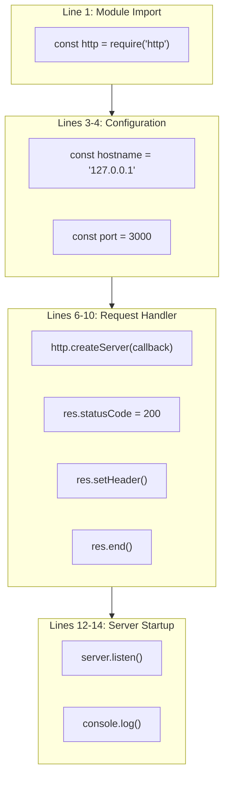
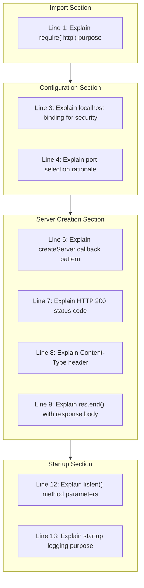
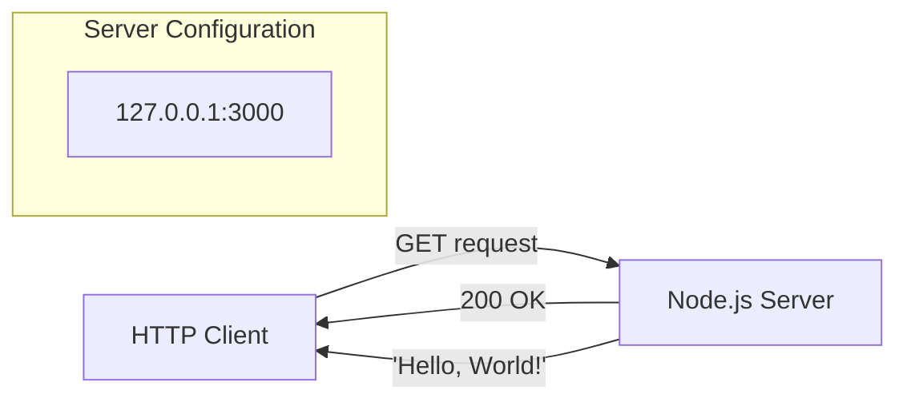
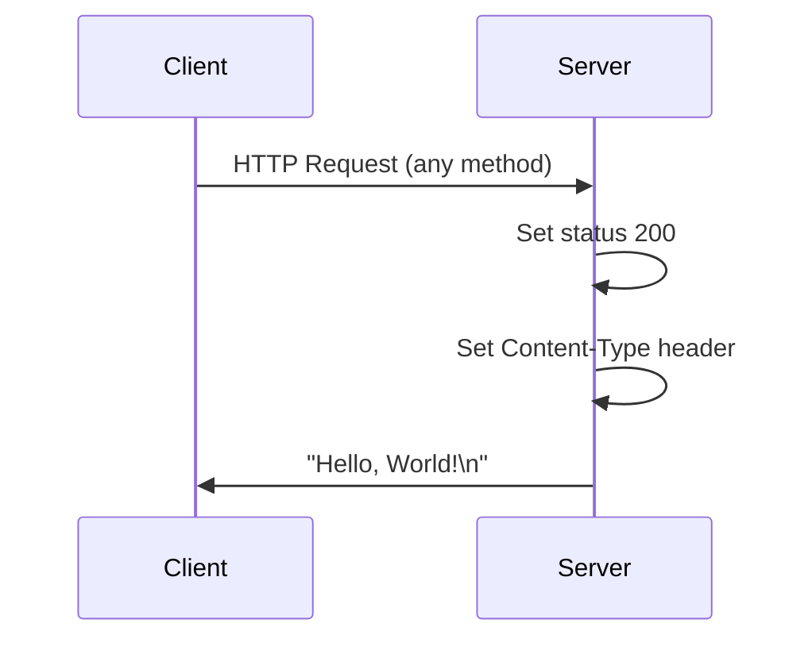
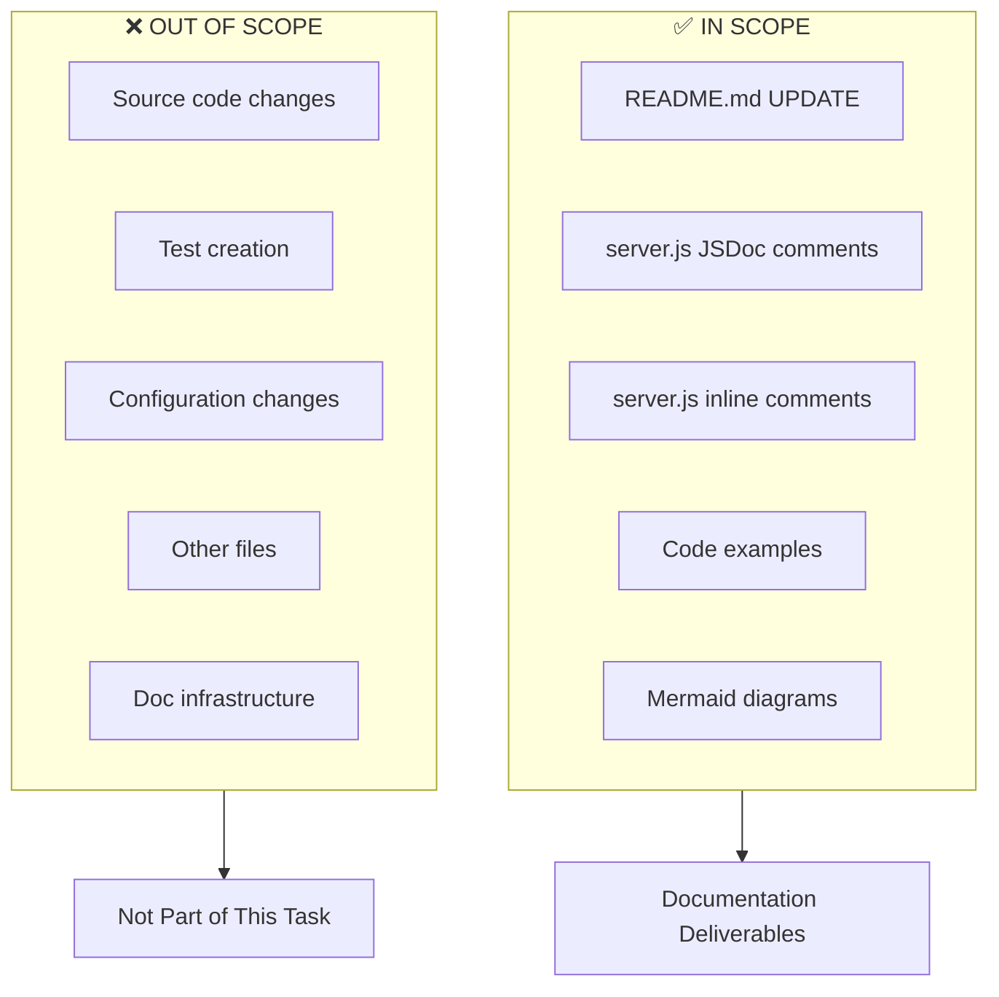

# Technical Specification

# 0. Agent Action Plan

## 0.1 Intent Clarification

Based on the provided requirements, the Blitzy platform understands that the documentation objective is to **create comprehensive documentation** for a minimal Node.js HTTP server project, encompassing both inline code documentation (JSDoc comments) and external documentation artifacts (README with multiple sections).

### 0.1.1 Core Documentation Objective

**Request Category:** Create new documentation | Update existing documentation

**Documentation Types Required:**
- JSDoc comments (inline code documentation)
- User guide (README with setup instructions)
- API documentation (endpoint and function reference)
- Deployment guide (operational documentation)
- Inline code explanations (contextual comments)

**User Requirements Restated with Enhanced Clarity:**

| # | Original Requirement | Enhanced Technical Interpretation |
|---|---------------------|-----------------------------------|
| 1 | Add JSDoc comments to server.js functions | Document all functions, constants, and the request handler callback in `server.js` using standard JSDoc annotation format with @param, @returns, @description, @module tags |
| 2 | Create a comprehensive README | Replace the existing minimal README.md (2 lines) with a complete project documentation file |
| 3 | Setup instructions | Provide prerequisites, installation steps, and environment configuration guidance |
| 4 | API documentation | Document the HTTP server endpoint, request/response format, and available operations |
| 5 | Deployment guide | Include instructions for running in development, production, and containerized environments |
| 6 | Inline code explanations | Add contextual comments within server.js explaining implementation decisions and flow |

### 0.1.2 Special Instructions and Constraints

**Captured Directives:**
- No specific template provided by user
- No style guide explicitly referenced
- Existing README contains "Do not touch!" warning - this will be **overridden** by new comprehensive content per user's explicit instructions
- Documentation must serve the project's role as a Backprop integration test harness

**Template Requirements:**
- Use standard JSDoc 3/4 format for inline documentation
- Follow conventional README structure for Node.js projects
- Include Mermaid diagrams for architecture visualization

**Web Search Requirements:**
- JSDoc best practices for Node.js HTTP servers
- Documentation structure conventions for minimal Node.js projects

### 0.1.3 Technical Interpretation

These documentation requirements translate to the following technical documentation strategy:

- **To document the HTTP server**, we will add JSDoc block comments to `server.js` describing the module purpose, configuration constants, request handler function, and server initialization
- **To provide setup instructions**, we will create a README section covering Node.js prerequisites, repository cloning, and server startup commands
- **To document the API**, we will describe the single HTTP endpoint including URL, method, headers, and response format
- **To create a deployment guide**, we will add README sections for development mode, production considerations, and optional Docker deployment
- **To add inline explanations**, we will insert single-line comments within `server.js` explaining each logical block

### 0.1.4 Inferred Documentation Needs

Based on code analysis of `server.js`:
- **Module-level documentation**: The file lacks a module description explaining its purpose
- **Configuration constants**: `hostname` and `port` are undocumented; purpose and defaults need explanation
- **Request handler**: The anonymous callback function in `createServer()` requires parameter and return documentation
- **Server lifecycle**: The `listen()` callback lacks documentation about startup behavior

Based on project structure:
- **Prerequisites documentation**: Node.js version requirements need specification
- **Quick start guide**: Users need rapid onboarding instructions
- **Testing documentation**: While no tests exist, the README should note the test placeholder
- **Contributing guidelines**: Optional but helpful for project maintainers

Based on user journey:
- New users need: Installation → Configuration → Running → Verification workflow
- Developers need: Code structure explanation → Modification guidance → Extension examples


## 0.2 Documentation Discovery and Analysis

### 0.2.1 Existing Documentation Infrastructure Assessment

**Repository Analysis Summary:** Repository analysis reveals a minimal documentation structure with critical coverage gaps. The project contains only a placeholder README with no inline code documentation.

**Search Patterns Employed:**
- Documentation files: `README*`, `docs/**`, `*.md`, `*.mdx`, `*.rst`, `wiki/**`
- Documentation generators: `mkdocs.yml`, `docusaurus.config.js`, `sphinx.conf.py`, `jsdoc.json`
- Style guides: `CONTRIBUTING.md`, `.editorconfig`, `STYLE.md`
- Templates: `docs/templates/**`, `.github/ISSUE_TEMPLATE/**`

**Documentation Discovery Results:**

| Item | Status | Path | Notes |
|------|--------|------|-------|
| README.md | Exists (minimal) | `/README.md` | 2 lines only - title and warning |
| Documentation folder | **Missing** | `docs/` | No documentation directory |
| JSDoc configuration | **Missing** | `jsdoc.json` | Not configured |
| API documentation | **Missing** | N/A | No API docs |
| Contributing guide | **Missing** | `CONTRIBUTING.md` | Not present |
| Changelog | **Missing** | `CHANGELOG.md` | Not present |

**Current Documentation Framework:**
- Framework: None configured
- Documentation generator: Not present
- API documentation tools: None (no JSDoc, Swagger, or similar)
- Diagram tools: None detected

### 0.2.2 Repository Code Analysis for Documentation

**Search Patterns Used for Code to Document:**

| Pattern | Target | Files Found |
|---------|--------|-------------|
| `*.js` | JavaScript source files | `server.js` |
| `package.json` | Project manifest | `package.json` |
| `*.java` | Secondary language | `LoginTest.java` (non-functional stub) |

**Key Directories Examined:**
- Repository root (`/`) - Contains all project files
- No `src/`, `lib/`, or `api/` directories exist

**Files Requiring Documentation:**

| File | Type | Documentation Status | Priority |
|------|------|---------------------|----------|
| `server.js` | JavaScript source | **No JSDoc comments** | High |
| `package.json` | Project manifest | Self-documenting | Low |
| `LoginTest.java` | Java stub | Out of scope (non-functional) | None |

**Related Documentation Context:**
- `package.json` provides: name, version, description, author, license
- Current README provides: project name only

### 0.2.3 Existing README Analysis

**Current Content:**
```
# hao-backprop-test
test project for backprop integration. Do not touch!
```

**Content Assessment:**

| Element | Present | Quality |
|---------|---------|---------|
| Project title | Yes | Adequate |
| Description | Yes | Minimal (1 sentence) |
| Installation instructions | **No** | Missing |
| Usage instructions | **No** | Missing |
| API documentation | **No** | Missing |
| Deployment guide | **No** | Missing |
| Contributing guidelines | **No** | Missing |
| License reference | **No** | Missing (MIT in package.json) |

### 0.2.4 Server.js Code Analysis for JSDoc

**Current Code Structure (14 lines):**



**Documentation Opportunities Identified:**

| Code Element | Line(s) | JSDoc Required | Comment Type |
|--------------|---------|---------------|--------------|
| Module declaration | Top | Yes | `@module`, `@description` |
| `http` import | 1 | Optional | Inline explanation |
| `hostname` constant | 3 | Yes | `@const`, `@type`, `@default` |
| `port` constant | 4 | Yes | `@const`, `@type`, `@default` |
| Request handler callback | 6-10 | Yes | `@param`, `@callback` |
| Response configuration | 7-9 | No | Inline explanations |
| `server.listen()` | 12-14 | Optional | Inline explanation |

### 0.2.5 Web Search Research Summary

**Best Practices Identified:**

| Topic | Finding | Source |
|-------|---------|--------|
| JSDoc function documentation | Use `@param`, `@returns`, `@description` for all functions | JSDoc.app, Google Style Guide |
| JSDoc constants | Document with `@const`, `@type`, and `@default` | JSDoc best practices |
| Module documentation | Include `@module` tag at file top | Node.js conventions |
| README structure | Include: Overview, Prerequisites, Installation, Usage, API, Deployment | Node.js community standards |
| Code comments | Add inline comments for non-obvious logic | Industry best practice |


## 0.3 Documentation Scope Analysis

### 0.3.1 Code-to-Documentation Mapping

**Modules Requiring Documentation:**

**Module: server.js (Primary Target)**

| Component | Type | Current Documentation | Documentation Needed |
|-----------|------|----------------------|---------------------|
| Module header | File-level | None | Module description, author, version, license |
| `http` require | Import | None | Brief inline comment |
| `hostname` | Constant | None | JSDoc with @const, @type, @default |
| `port` | Constant | None | JSDoc with @const, @type, @default |
| Request handler | Callback function | None | JSDoc with @callback, @param for req/res |
| `server` | Variable | None | JSDoc with @type description |
| `server.listen()` | Method call | None | Inline comment explaining startup |

**Public APIs Identified:**

| API Type | Endpoint | Method | Documentation Needed |
|----------|----------|--------|---------------------|
| HTTP Server | `http://127.0.0.1:3000/` | GET (all methods accepted) | Response format, headers, body |

**Configuration Options Requiring Documentation:**

| Config Item | Location | Current Value | Documentation Needed |
|-------------|----------|---------------|---------------------|
| Server hostname | `server.js:3` | `127.0.0.1` | Purpose, alternatives, security implications |
| Server port | `server.js:4` | `3000` | Default rationale, how to change |

### 0.3.2 Documentation Gap Analysis

Given the requirements and repository analysis, documentation gaps include:

**Critical Gaps (Must Address):**

| Gap Type | Current State | Target State | Priority |
|----------|---------------|--------------|----------|
| JSDoc comments | 0% coverage | 100% coverage | **High** |
| Setup instructions | Missing | Complete guide | **High** |
| API documentation | Missing | Endpoint reference | **High** |
| Deployment guide | Missing | Dev/Prod/Docker | **High** |

**Undocumented Code Elements:**

| Element | File:Line | Documentation Type Required |
|---------|-----------|----------------------------|
| File module description | `server.js:1` (top) | JSDoc block |
| `hostname` constant | `server.js:3` | JSDoc block |
| `port` constant | `server.js:4` | JSDoc block |
| Request handler | `server.js:6-10` | JSDoc block + inline |
| Server instantiation | `server.js:6` | Inline comment |
| Response status code | `server.js:7` | Inline comment |
| Response header | `server.js:8` | Inline comment |
| Response body | `server.js:9` | Inline comment |
| Server startup | `server.js:12-14` | Inline comment |

**Missing User Guides:**

| Guide | Purpose | Sections Required |
|-------|---------|-------------------|
| Quick Start | Rapid user onboarding | Prerequisites, Install, Run, Verify |
| API Reference | Endpoint documentation | URL, Method, Headers, Response |
| Deployment | Production operation | Development, Production, Docker |
| Troubleshooting | Issue resolution | Common errors, solutions |

### 0.3.3 README Content Gap Matrix

| Section | Status | Content Required |
|---------|--------|-----------------|
| Title | Exists | Retain with enhanced formatting |
| Badges | Missing | npm version, license, Node.js version |
| Description | Minimal | Expanded project overview |
| Table of Contents | Missing | Navigation links |
| Features | Missing | Capability summary |
| Prerequisites | Missing | Node.js version requirements |
| Installation | Missing | Clone, navigate, optional npm install |
| Usage | Missing | Start command, verification steps |
| API Reference | Missing | Endpoint documentation |
| Configuration | Missing | Environment variables, port changes |
| Deployment | Missing | Development, Production, Docker |
| Project Structure | Missing | File descriptions |
| Contributing | Missing | Basic contribution guidelines |
| License | Missing | MIT license reference |

### 0.3.4 Inline Code Explanation Requirements

**server.js Inline Documentation Strategy:**



**Comment Density Target:** Inline comments for every logical block (4-5 comment sections total)


## 0.4 Documentation Implementation Design

### 0.4.1 Documentation Structure Planning

**Target Documentation Hierarchy:**

```
/
├── README.md                    # Comprehensive project documentation
│   ├── Project Overview         # Title, badges, description
│   ├── Table of Contents        # Navigation
│   ├── Features                 # Capability summary
│   ├── Prerequisites            # Requirements
│   ├── Installation             # Setup steps
│   ├── Usage                    # Running instructions
│   ├── API Reference            # Endpoint documentation
│   ├── Configuration            # Customization options
│   ├── Deployment               # Production guide
│   ├── Project Structure        # File descriptions
│   ├── Contributing             # Contribution guidelines
│   └── License                  # MIT reference
│
└── server.js                    # Enhanced with JSDoc + inline comments
    ├── Module JSDoc block       # @module, @description, @author
    ├── Configuration JSDoc      # @const for hostname, port
    ├── Handler JSDoc            # @callback for request handler
    └── Inline comments          # Contextual explanations
```

### 0.4.2 Content Generation Strategy

**Information Extraction Approach:**

| Source | Information | Target Documentation |
|--------|-------------|---------------------|
| `package.json` | name, version, author, license | README header, JSDoc @version |
| `server.js` | Implementation details | JSDoc comments, inline explanations |
| `package.json` | scripts.test | README testing section note |
| Code analysis | API behavior | README API Reference |

**JSDoc Block Templates:**

**Module-level JSDoc (server.js top):**
```javascript
/**
 * @module server
 * @description Minimal HTTP server for Backprop integration testing
 * @version 1.0.0
 * @author hxu
 * @license MIT
 */
```

**Constant JSDoc Template:**
```javascript
/**
 * @const {string} hostname - Server binding address
 * @default '127.0.0.1'
 */
```

**Request Handler JSDoc Template:**
```javascript
/**
 * Handles incoming HTTP requests
 * @param {http.IncomingMessage} req - The request object
 * @param {http.ServerResponse} res - The response object
 */
```

### 0.4.3 README Content Strategy

**Section-by-Section Content Plan:**

| Section | Content Strategy | Word Count Target |
|---------|------------------|-------------------|
| Header + Badges | Project name with npm, license, Node badges | 20-30 |
| Description | Expanded overview explaining Backprop purpose | 50-75 |
| Features | Bullet list of key characteristics | 30-50 |
| Prerequisites | Node.js version requirement | 20-30 |
| Installation | 3-step clone/navigate/run process | 40-60 |
| Usage | Start command with verification curl | 50-75 |
| API Reference | Table with endpoint details | 75-100 |
| Configuration | Environment/code modification options | 50-75 |
| Deployment | Dev/Production/Docker subsections | 100-150 |
| Project Structure | File-by-file description table | 50-75 |
| Contributing | Basic PR workflow | 30-50 |
| License | MIT statement with link | 15-25 |

### 0.4.4 Documentation Standards

**Markdown Formatting Guidelines:**
- Headers: Use `#` through `####` for hierarchy
- Code blocks: Use triple backticks with language specifier
- Tables: Pipe-delimited format for structured data
- Lists: Dash for bullets, numbers for sequences
- Emphasis: Bold for UI elements, italics for new terms

**JSDoc Formatting Guidelines:**
- Block comments: `/** ... */` format
- Tags: Standard JSDoc 3/4 tags (@param, @returns, @const, etc.)
- Types: Use JSDoc type syntax `{type}` or `{Type}`
- Descriptions: Complete sentences with proper punctuation

**Inline Comment Guidelines:**
- Use `//` for single-line comments
- Place above the line being explained
- Keep concise but informative
- Explain "why" not just "what"

### 0.4.5 Diagram and Visual Strategy

**Mermaid Diagrams to Include in README:**

**Architecture Diagram:**


**Request-Response Flow:**


**Visual Content Requirements:**
- Mermaid flowchart for server architecture
- Mermaid sequence diagram for request flow
- ASCII directory tree for project structure (in code block)


## 0.5 Documentation File Transformation Mapping

### 0.5.1 File-by-File Documentation Plan

**Documentation Transformation Modes:**
- **CREATE** - Create a new documentation file
- **UPDATE** - Update an existing documentation file
- **DELETE** - Remove an obsolete documentation file
- **REFERENCE** - Use as an example for documentation style and structure

**Complete Transformation Map:**

| Target Documentation File | Transformation | Source Code/Docs | Content/Changes |
|---------------------------|----------------|------------------|-----------------|
| `README.md` | **UPDATE** | `README.md`, `server.js`, `package.json` | Replace minimal content with comprehensive documentation including setup, API reference, deployment guide |
| `server.js` | **UPDATE** | `server.js` | Add JSDoc block comments for module, constants, request handler; add inline code explanations throughout |

### 0.5.2 README.md Transformation Detail

**File:** `README.md`
**Transformation Mode:** UPDATE
**Source Files:** `server.js`, `package.json`

**Current Content (to be replaced):**
```
# hao-backprop-test
test project for backprop integration. Do not touch!
```

**New Sections to Add:**

| Section | Content Source | Key Elements |
|---------|---------------|--------------|
| Header with Badges | `package.json` | Project name, npm badge, license badge, Node.js badge |
| Description | `package.json`, README | Expanded project overview |
| Table of Contents | Generated | Links to all sections |
| Features | Code analysis | Zero dependencies, minimal footprint, MIT license |
| Prerequisites | Best practices | Node.js version requirement |
| Installation | Standard workflow | Clone, cd, run commands |
| Usage | `server.js` | Start command, curl verification |
| API Reference | `server.js` | Endpoint URL, method, response format |
| Configuration | `server.js` | hostname, port modification options |
| Deployment | Best practices | Development, Production, Docker modes |
| Project Structure | File listing | All repository files with descriptions |
| Contributing | Standard template | Basic contribution workflow |
| License | `package.json` | MIT license statement |

**Content Specifications:**

```
README.md Structure:
├── # hao-backprop-test (Title)
├── [Badges row]
├── ## Description (50-75 words)
├── ## Table of Contents (auto-links)
├── ## Features (bullet list)
├── ## Prerequisites (Node.js requirement)
├── ## Installation (code blocks)
├── ## Usage (code blocks + verification)
├── ## API Reference (endpoint table + example)
├── ## Configuration (options table)
├── ## Deployment
│   ├── ### Development Mode
│   ├── ### Production Considerations  
│   └── ### Docker Deployment (optional)
├── ## Project Structure (file table)
├── ## Contributing (brief guide)
└── ## License (MIT reference)
```

### 0.5.3 server.js Transformation Detail

**File:** `server.js`
**Transformation Mode:** UPDATE
**Purpose:** Add JSDoc comments and inline code explanations

**Current Code Structure (no documentation):**
```javascript
// Line 1:  const http = require('http');
// Line 2:  [empty]
// Line 3:  const hostname = '127.0.0.1';
// Line 4:  const port = 3000;
// Line 5:  [empty]
// Line 6:  const server = http.createServer((req, res) => {
// Line 7:    res.statusCode = 200;
// Line 8:    res.setHeader('Content-Type', 'text/plain');
// Line 9:    res.end('Hello, World!\n');
// Line 10: });
// Line 11: [empty]
// Line 12: server.listen(port, hostname, () => {
// Line 13:   console.log(`Server running at http://${hostname}:${port}/`);
// Line 14: });
```

**Documentation Additions by Section:**

| Location | Documentation Type | Content |
|----------|-------------------|---------|
| Top of file (before line 1) | JSDoc module block | @module, @description, @version, @author, @license |
| Before line 1 | Inline comment | Explain http module import |
| Before line 3 | JSDoc block | @const for hostname with @type, @default, @description |
| Before line 4 | JSDoc block | @const for port with @type, @default, @description |
| Before line 6 | JSDoc block | @type for server, handler @callback documentation |
| Lines 7-9 | Inline comments | Explain status code, header, response body |
| Before line 12 | Inline comment | Explain server.listen() purpose |

**Detailed JSDoc Additions:**

```
server.js Documentation Additions:
├── Module JSDoc Block (new, at top)
│   ├── @module server
│   ├── @description Minimal HTTP server...
│   ├── @version 1.0.0
│   ├── @author hxu
│   └── @license MIT
├── hostname Constant JSDoc (before line 3)
│   ├── @const {string}
│   ├── @description Server binding address
│   └── @default '127.0.0.1'
├── port Constant JSDoc (before line 4)
│   ├── @const {number}
│   ├── @description Server listening port
│   └── @default 3000
├── Request Handler JSDoc (before line 6)
│   ├── @type {http.Server}
│   └── Handler callback documentation
└── Inline Comments
    ├── Line 7: Status code explanation
    ├── Line 8: Header explanation
    ├── Line 9: Response body explanation
    └── Line 12: Server startup explanation
```

### 0.5.4 Files NOT Being Modified

| File | Reason for Exclusion |
|------|---------------------|
| `package.json` | No documentation changes required (self-documenting) |
| `package-lock.json` | Auto-generated, no documentation applicable |
| `LoginTest.java` | Out of scope (non-functional stub) |
| `industry.csv` | Data file, no documentation required |
| `test.py.txt` | Empty placeholder, out of scope |
| `test.txt.txt` | Empty placeholder, out of scope |
| `demo.jpg` | Binary asset, no documentation applicable |
| `sample.doc` | Binary asset, no documentation applicable |
| `100Pages.pdf` | Binary asset, no documentation applicable |

### 0.5.5 Documentation Configuration Updates

**No Configuration Files Required:**
- This project does not use a documentation generator framework
- No `jsdoc.json` configuration needed (JSDoc comments are inline only)
- No `mkdocs.yml` or similar required
- Documentation is contained entirely in `README.md` and `server.js` inline comments

**Optional Future Enhancements (Out of Scope):**
- `jsdoc.json` - Could be added for generated API docs
- `docs/` folder - Could house additional guides
- `.github/` templates - Could add issue/PR templates


## 0.6 Dependency Inventory

### 0.6.1 Documentation Dependencies

**Current Project Dependencies:** The project has **zero runtime or development dependencies** per `package.json`.

**Documentation Tool Requirements:**

Since the documentation approach uses:
- Inline JSDoc comments (no generation required)
- Markdown README (no build process required)
- Mermaid diagrams (rendered by GitHub/viewers automatically)

**No additional packages are required for this documentation task.**

**Optional Enhancement Packages (Not Required):**

| Registry | Package Name | Version | Purpose | Status |
|----------|--------------|---------|---------|--------|
| npm | jsdoc | 4.0.5 | Generate HTML docs from JSDoc | Optional |
| npm | docdash | 2.0.2 | JSDoc template theme | Optional |
| npm | better-docs | 2.7.3 | Enhanced JSDoc template | Optional |

### 0.6.2 Runtime Requirements for Documentation

**Node.js Runtime:**

| Attribute | Requirement | Rationale |
|-----------|-------------|-----------|
| Runtime | Node.js | Required to run server.js |
| Minimum Version | 12.0.0+ | Modern JavaScript features used |
| Recommended Version | 20.x LTS or 22.x LTS | Long-term support stability |
| Maximum Version | No limit | No deprecated APIs used |

**Package Manager:**

| Tool | Minimum Version | Required For |
|------|-----------------|--------------|
| npm | 7.x+ | lockfileVersion 3 compatibility |
| npm | 10.x+ (recommended) | Modern features |

### 0.6.3 Documentation Reference Updates

**No Link Updates Required:**

The current README contains no internal or external links that require updating. The new README will include fresh links:

| Link Type | Destination | Purpose |
|-----------|-------------|---------|
| Badge: npm | shields.io | Version badge |
| Badge: license | shields.io | License badge |
| Badge: Node.js | shields.io | Runtime badge |
| License link | LICENSE file or package.json | MIT reference |

### 0.6.4 Mermaid Diagram Compatibility

**Diagram Rendering Support:**

| Platform | Mermaid Support | Notes |
|----------|-----------------|-------|
| GitHub | Native | Renders in README automatically |
| GitLab | Native | Renders in README automatically |
| VS Code | Extension required | Markdown Preview Mermaid Support |
| npm docs | Via marked-mermaid | If publishing to npm |

**Fallback Strategy:**
- Include text descriptions alongside diagrams
- Diagrams are supplementary, not critical to understanding


## 0.7 Coverage and Quality Targets

### 0.7.1 Documentation Coverage Metrics

**Current Coverage Analysis:**

| Coverage Type | Current | Target | Gap |
|---------------|---------|--------|-----|
| JSDoc comments in server.js | 0/4 elements (0%) | 4/4 elements (100%) | 4 elements |
| README sections | 2/13 sections (15%) | 13/13 sections (100%) | 11 sections |
| Inline code comments | 0/4 blocks (0%) | 4/4 blocks (100%) | 4 blocks |
| API endpoint documentation | 0/1 (0%) | 1/1 (100%) | 1 endpoint |

**JSDoc Coverage Target:**

| Code Element | Current | Target | JSDoc Tags Required |
|--------------|---------|--------|---------------------|
| Module declaration | None | Documented | @module, @description, @version, @author, @license |
| `hostname` constant | None | Documented | @const, @type, @default, @description |
| `port` constant | None | Documented | @const, @type, @default, @description |
| Request handler | None | Documented | @callback description, @param (req, res) |

**README Section Coverage Target:**

| Section | Current Status | Target Status |
|---------|----------------|---------------|
| Title | Exists | Enhanced with badges |
| Description | Minimal | Comprehensive |
| Table of Contents | Missing | Complete |
| Features | Missing | Complete |
| Prerequisites | Missing | Complete |
| Installation | Missing | Complete |
| Usage | Missing | Complete |
| API Reference | Missing | Complete |
| Configuration | Missing | Complete |
| Deployment | Missing | Complete |
| Project Structure | Missing | Complete |
| Contributing | Missing | Complete |
| License | Missing | Complete |

### 0.7.2 Documentation Quality Criteria

**Completeness Requirements:**

| Requirement | Standard | Verification Method |
|-------------|----------|---------------------|
| All public constants documented | JSDoc with @const, @type, @default | Code review |
| All callbacks documented | JSDoc with @param for each parameter | Code review |
| README includes all sections | 13 sections minimum | Section checklist |
| API endpoint fully documented | URL, method, headers, response | Section review |
| Working code examples | Copy-paste runnable | Manual test |

**Accuracy Validation:**

| Aspect | Validation Method |
|--------|-------------------|
| JSDoc type annotations | Match actual JavaScript types |
| Default values | Match code constants |
| API response format | Verified against actual server output |
| Commands | Tested in terminal |
| Port/hostname | Match server.js values |

**Clarity Standards:**

| Standard | Implementation |
|----------|----------------|
| Technical accuracy | Use precise terminology (HTTP, callback, etc.) |
| Accessible language | Explain concepts for junior developers |
| Progressive disclosure | Simple overview → detailed reference |
| Consistent terminology | Use same terms throughout (e.g., "server" not "app") |

**Maintainability:**

| Aspect | Standard |
|--------|----------|
| Source citations | JSDoc @see references where applicable |
| Version tracking | @version tag in module JSDoc |
| Clear ownership | @author tag in module JSDoc |

### 0.7.3 Example and Diagram Requirements

**Code Example Requirements:**

| Example Type | Location | Minimum Count |
|--------------|----------|---------------|
| Server start command | README Usage | 1 |
| Verification curl command | README Usage | 1 |
| Expected response | README API Reference | 1 |
| Docker run command | README Deployment | 1 |

**Diagram Requirements:**

| Diagram Type | Location | Purpose |
|--------------|----------|---------|
| Architecture flowchart | README | Visual server overview |
| Request-Response sequence | README | API flow visualization |
| Project structure tree | README | File organization |

**Testing Documentation Examples:**

| Example | Test Method |
|---------|-------------|
| `node server.js` | Execute in terminal |
| `curl http://127.0.0.1:3000` | Execute after server starts |
| Response: `Hello, World!` | Verify against actual output |

### 0.7.4 Quality Acceptance Criteria

**Documentation Complete When:**

- [ ] Module-level JSDoc block present in server.js
- [ ] All constants have @const JSDoc annotations
- [ ] Request handler callback is documented
- [ ] Inline comments explain each logical section
- [ ] README contains all 13 required sections
- [ ] API endpoint fully documented with example
- [ ] All code examples are tested and working
- [ ] Mermaid diagrams render correctly
- [ ] No placeholder text remains
- [ ] Spelling and grammar verified


## 0.8 Scope Boundaries

### 0.8.1 Exhaustively In Scope

**Documentation Files to Create/Update:**

| File Pattern | Action | Description |
|--------------|--------|-------------|
| `README.md` | UPDATE | Replace with comprehensive documentation |
| `server.js` | UPDATE | Add JSDoc comments and inline explanations |

**Documentation Content In Scope:**

| Content Type | Specific Items |
|--------------|----------------|
| JSDoc comments | Module block, @const for hostname/port, callback documentation |
| Inline comments | Import explanation, configuration explanation, handler logic, startup |
| README sections | All 13 sections as specified |
| Code examples | Server start, curl verification, Docker commands |
| Diagrams | Architecture flowchart, request-response sequence |

**Specific Documentation Deliverables:**

- **server.js JSDoc additions:**
  - Module-level JSDoc block at file top
  - @const annotation for `hostname` variable
  - @const annotation for `port` variable  
  - Handler callback documentation with @param tags
  - Inline comments for status code, header, response, listen

- **README.md content:**
  - Project header with badges
  - Expanded description
  - Table of contents
  - Features list
  - Prerequisites section
  - Installation instructions
  - Usage guide with examples
  - API reference with endpoint details
  - Configuration options
  - Deployment guide (dev/prod/docker)
  - Project structure table
  - Contributing guidelines
  - License statement

### 0.8.2 Explicitly Out of Scope

**Source Code Modifications (Beyond Documentation):**

| Item | Reason |
|------|--------|
| Refactoring server.js logic | Not a documentation task |
| Adding new features | Beyond documentation scope |
| Changing port/hostname defaults | Functional change, not documentation |
| Adding environment variable support | Feature addition, not documentation |
| Error handling improvements | Code enhancement, not documentation |

**Test File Modifications:**

| Item | Reason |
|------|--------|
| Creating test files | Not requested |
| Documenting tests | No tests exist |
| Updating test scripts | Out of scope |

**Other Files Explicitly Excluded:**

| File | Reason |
|------|--------|
| `package.json` | No documentation changes needed |
| `package-lock.json` | Auto-generated file |
| `LoginTest.java` | Non-functional stub, unrelated |
| `industry.csv` | Data file, not code |
| `test.py.txt` | Empty placeholder |
| `test.txt.txt` | Empty placeholder |
| `demo.jpg` | Binary asset |
| `sample.doc` | Binary asset |
| `100Pages.pdf` | Binary asset |

**Documentation Infrastructure Not Required:**

| Item | Reason |
|------|--------|
| `jsdoc.json` configuration | Inline JSDoc only, no generation |
| `docs/` folder creation | Single README sufficient |
| Documentation generator setup | Not requested |
| CI/CD for docs | Beyond scope |
| GitHub Pages setup | Not requested |

### 0.8.3 Scope Clarifications

**What "Add JSDoc comments" Means:**
- Add JSDoc block comments (`/** ... */`) with appropriate tags
- Add single-line inline comments (`//`) for code explanations
- Does NOT mean changing any executable code

**What "Comprehensive README" Means:**
- Replace existing 2-line README entirely
- Include all standard README sections
- Provide working examples
- Does NOT mean creating separate documentation files

**What "Deployment Guide" Means:**
- Instructions for running the server
- Basic production considerations
- Optional containerization example
- Does NOT mean actual deployment automation or CI/CD setup

**What "Inline Code Explanations" Means:**
- Comments explaining what code does and why
- Contextual information for maintainers
- Does NOT mean verbose documentation of every single line

### 0.8.4 Boundary Summary Diagram




## 0.9 Execution Parameters

### 0.9.1 Documentation-Specific Instructions

**Documentation Build Commands:**

| Command | Purpose | Notes |
|---------|---------|-------|
| N/A | No build required | Documentation is inline and Markdown-based |

**Documentation Preview Commands:**

| Command | Purpose | Notes |
|---------|---------|-------|
| `cat README.md` | View README content | Terminal preview |
| `grip README.md` | Local GitHub-style preview | Requires `pip install grip` |
| GitHub web UI | Full rendering | Push to repository |

**Diagram Generation Commands:**

| Command | Purpose | Notes |
|---------|---------|-------|
| N/A | No generation required | Mermaid renders automatically on GitHub |

**Documentation Validation Commands:**

| Command | Purpose | Notes |
|---------|---------|-------|
| `markdownlint README.md` | Lint Markdown | Optional, requires npm install |
| `npx jsdoc server.js --explain` | Validate JSDoc syntax | Optional verification |

### 0.9.2 Default Documentation Formats

**Primary Format:** Markdown with Mermaid diagrams

**JSDoc Standards:**

| Aspect | Standard |
|--------|----------|
| Comment style | `/** ... */` block comments |
| Tag prefix | `@` symbol (e.g., @param, @returns) |
| Type syntax | `{type}` notation |
| Line length | No strict limit, but readable |

**Markdown Standards:**

| Aspect | Standard |
|--------|----------|
| Headings | ATX-style (`#`, `##`, etc.) |
| Code blocks | Fenced with triple backticks |
| Language hints | Specify language after opening backticks |
| Lists | Dash (`-`) for bullets |
| Tables | Pipe-delimited with header separator |

### 0.9.3 Citation Requirements

**Source File Citation Format:**

All documentation must reference source files where applicable:

| Documentation Element | Citation Format |
|----------------------|-----------------|
| JSDoc @see | `@see {@link ./server.js}` |
| README code examples | `Source: server.js` as comment or footnote |
| Configuration values | Reference to specific line numbers when relevant |

**Example Citation:**
```
The server binds to localhost by default. See `server.js:3` for the hostname configuration.
```

### 0.9.4 Style Guide Reference

**Documentation Style:**

| Aspect | Guideline |
|--------|-----------|
| Voice | Active voice preferred |
| Tense | Present tense for current behavior |
| Person | Second person ("you") for instructions |
| Tone | Professional but accessible |
| Terminology | Consistent (server, not app/application interchangeably) |

**Code Example Style:**

| Aspect | Guideline |
|--------|-----------|
| Shell commands | Prefix with `$` or show bare |
| Output | Show expected output when helpful |
| Comments | Include when clarifying complex examples |

### 0.9.5 Testing Documentation Validity

**Manual Verification Steps:**

| Step | Command | Expected Outcome |
|------|---------|------------------|
| 1 | `node server.js` | Server starts on port 3000 |
| 2 | `curl http://127.0.0.1:3000` | Returns "Hello, World!" |
| 3 | View README on GitHub | All sections render properly |
| 4 | Mermaid diagrams | Render correctly in viewer |

**JSDoc Verification:**

| Check | Method |
|-------|--------|
| Syntax validity | No errors when hovering in VS Code |
| Type accuracy | Types match actual JavaScript values |
| Completeness | All public elements documented |

### 0.9.6 Environment Assumptions

**Assumed Development Environment:**

| Component | Assumption |
|-----------|------------|
| Operating System | Linux, macOS, or Windows with WSL |
| Node.js | Version 12.0.0 or higher installed |
| Terminal | Bash or compatible shell |
| Editor | Any text editor (VS Code recommended) |
| Git | Installed for version control |

**No Special Environment Required:**
- No database connections
- No external API keys
- No environment variables
- No build tools
- No containerization (Docker examples are optional)


## 0.10 Special Instructions

### 0.10.1 Documentation-Specific Requirements

**User-Specified Directives (from original request):**

| Directive | Interpretation | Implementation |
|-----------|---------------|----------------|
| "Add JSDoc comments to server.js functions" | Document all code elements with standard JSDoc | Module block + constant annotations + callback docs |
| "Create a comprehensive README" | Full-featured README replacing current | All 13 sections as designed |
| "Setup instructions" | How to get started | Prerequisites + Installation + Usage sections |
| "API documentation" | Endpoint reference | API Reference section with table |
| "Deployment guide" | How to run in production | Deployment section with dev/prod/docker |
| "Inline code explanations" | Comments within server.js | Single-line comments at each logical block |

### 0.10.2 Implicit Requirements Identified

**Based on Best Practices:**

| Implicit Requirement | Rationale | Implementation |
|---------------------|-----------|----------------|
| Badges in README | Standard for npm packages | Add version, license, Node.js badges |
| Table of Contents | Navigation for comprehensive docs | Auto-linked TOC section |
| Project structure | Helps new contributors | File/folder description table |
| Contributing guide | Open source standard | Basic contribution workflow |
| License statement | Legal requirement | MIT reference with link |

### 0.10.3 Preservation Requirements

**Content to Preserve:**
- Project name: `hao-backprop-test` (from existing README)
- Package metadata from `package.json`: name, version, author, license
- Server configuration values: hostname `127.0.0.1`, port `3000`

**Content NOT to Preserve:**
- "Do not touch!" warning - Superseded by user's explicit documentation request
- Minimal README structure - Replaced with comprehensive version

### 0.10.4 Special Formatting Instructions

**JSDoc Formatting:**

```javascript
/**
 * @module server
 * @description Brief description on first line
 * 
 * Extended description if needed on subsequent lines.
 * 
 * @version 1.0.0
 * @author hxu
 * @license MIT
 */
```

**Inline Comment Formatting:**

```javascript
// Brief explanation of the following code block
const example = value;
```

**README Section Formatting:**

```
## Section Title

Brief introduction paragraph.

#### Subsection (if needed)

Detailed content with:
- Bullet points
- Code examples
- Tables where appropriate
```

### 0.10.5 Quality Assurance Checklist

**Pre-Completion Verification:**

- [ ] All JSDoc blocks use correct tag syntax
- [ ] All JSDoc types are accurate
- [ ] Inline comments are concise and informative
- [ ] README renders correctly in Markdown preview
- [ ] All code examples are tested and working
- [ ] Mermaid diagrams render properly
- [ ] No spelling or grammatical errors
- [ ] Consistent terminology throughout
- [ ] All links are valid (if any added)
- [ ] Table formatting is correct

### 0.10.6 Documentation Maintenance Notes

**For Future Maintainers:**

| Aspect | Guidance |
|--------|----------|
| JSDoc updates | Update @version when code changes |
| README updates | Keep examples in sync with code |
| New features | Add to Features section |
| API changes | Update API Reference section |
| Configuration changes | Update Configuration section |

### 0.10.7 Constraints and Limitations

**Technical Constraints:**

| Constraint | Impact |
|------------|--------|
| Minimal codebase (14 lines) | Limited documentation scope |
| No dependencies | No dependency documentation needed |
| No configuration files | No config documentation needed |
| No tests | Testing section limited to placeholder note |

**Documentation Constraints:**

| Constraint | Approach |
|------------|----------|
| Single server file | All JSDoc in one file |
| Simple API (one endpoint) | Brief API reference |
| No complex workflows | Simple sequence diagram |

### 0.10.8 Success Criteria Summary

**Documentation Complete When:**

| Criterion | Verification |
|-----------|--------------|
| server.js has module JSDoc | Check for `@module` tag at top |
| Constants are documented | Check for `@const` on hostname, port |
| Handler is documented | Check for callback documentation |
| Inline comments present | Visual inspection of 4 comment blocks |
| README has 13 sections | Section count verification |
| Examples work | Manual testing of commands |
| Diagrams render | GitHub/preview verification |
| No placeholders remain | Search for TODO/TBD/FIXME |


